# JVM-内存结构

## 一、JVM前述

### 1.1 定义:

Java Virtual Machine - java程序的运行环境(java 二进制字节码的运行环境)

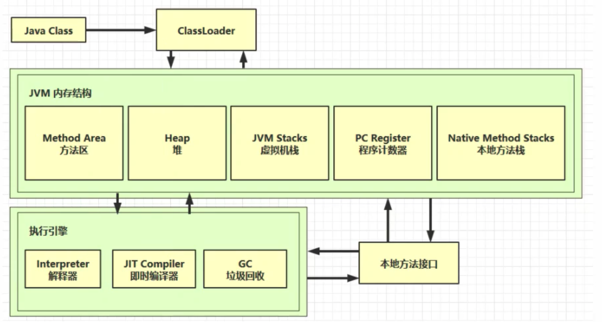

**好处:**

- 一次编写,到处运行
- 自动内存管理，垃圾回收功能
- 数组下标越界越界检查

**多态比较:**

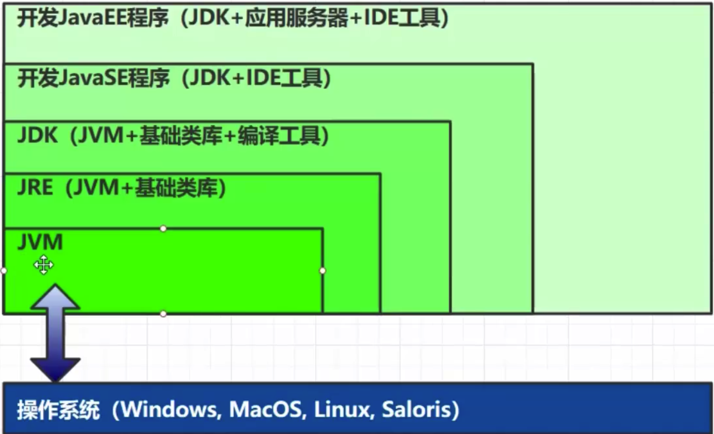


### 1.2 学习JVM有什么用?

- 面试
- 理解底层的实现原理
- 中高级程序员的必备技能

### 1.3 常见jvm

以Hotspot为准


## 二、内存结构

### 学习大纲

- 程序计数器
- 虚拟机栈
- 本地方法栈
- 堆
- 方法区

### 2.1 程序计数器

- 定义：Program Counter Register程序计数器(硬件是寄存器实现)
- 作用：是记住下一条jvm指令的执行地址
- 流程：执行顺序 jvm指令 => 解释器 => 机器码 => CPU：jvm下一条指令序号是通过程序计数器
- 特点
  - 是线程私有的
  - 不会存在内存溢出


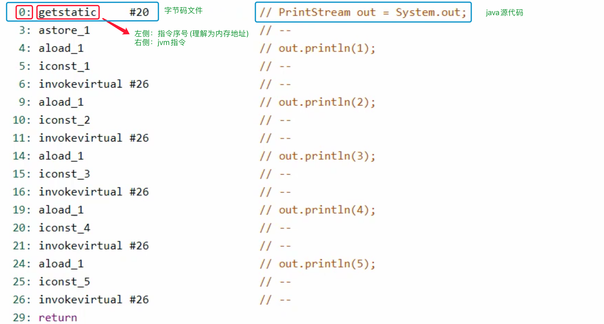

### 2.2 虚拟机栈

-  Java Virtual Machine Stacks (Java 虚拟机栈)
- 每个线程运行时所需要的内存，称为虚拟机栈
- 每个栈由多个栈帧(Frame) 组成,对应着每次方法调用时所占用的内存
- 每个线程只能有一 个活动栈帧，对应着当前正在执行的那个方法

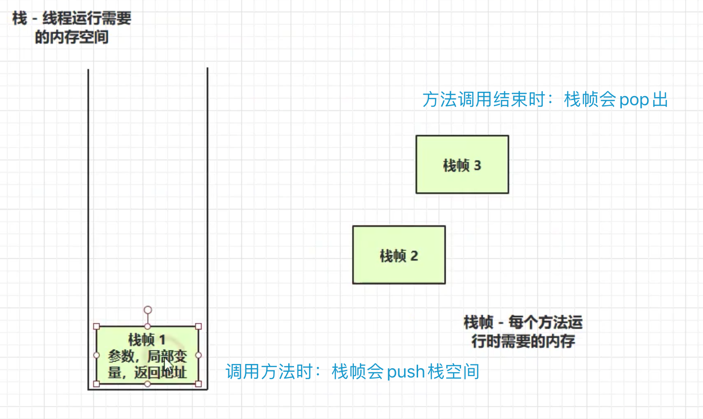

栈的演示：https://www.bilibili.com/video/BV1yE411Z7AP?p=8

每个线程分配一定的栈内存

#### 2.2.1 问题辨析

- 垃圾回收是否涉及栈内存?

  栈内存涉及的是线程，线程中包含方法调用(涉及多次栈帧内存的push以及pop) => 栈帧内存pop出去就无了，所以不涉及垃圾回收

- 栈内存分配越大越好吗?

  不是，内存是一定的，栈内存越大，线程数越少

- 方法内的局部变量是否线程安全?

  如果方法内局部变量没有逃离方法的作用访问，它是线程安全的

  如果是局部变量引用了对象，并逃离方法的作用方法,就要考虑线程安全问题

```java
//局部变量的线程安全问题
public class Demo1_ 18 {
  //多个线程同时执行此方法
  static void m1() {
    int x=0;
    for(inti=0;i<5000;i++){
      X++;
    }
    System.out.println(x);
  }
```

> Tips：方法的局部变量存储在栈中，类的static成员变量在方法区。
> 一个线程私有，一个线程共享，jdk1.8后static成员变量放在堆中了


```java
/*
	主线程main()改变sb值；从线程m2()改变sb值
*/
public static void main(String[] args) {
        StringBuilder sb = new StringBuilder();
        sb.append(4);
        sb.append(5);
        sb.append(6);
        new Thread(() -> {
            m2(sb);
        }).start();
    }

    public static void m1() {
        StringBuilder sb = new StringBuilder();
        sb.append(1);
        sb.append(2);
        sb.append(3);
        System.out.println(sb.toString());
    }

    public static void m2(StringBuilder sb) {
        sb.append(1);
        sb.append(2);
        sb.append(3);
        System.out.println(sb.toString());
    }

    public static StringBuilder m3() {
        StringBuilder sb = new StringBuilder();
        sb.append(1);
        sb.append(2);
        sb.append(3);
        return sb;
    }
```

 

#### 2.2.2 栈内存溢出

##### 1.栈帧过多导致栈内存溢出

```java
public class Test {
    private static int count;

    public static void main(String[] args) {
        try {
            method1();
        } catch (Throwable e) {
            e.printStackTrace();
            System.out.println(count);
        }
    }
		/*
		无限的递归调用 => 栈溢出(java.lang.StackOverflowError)
		*/
    private static void method1() {
        count++;
        method1();
    }
}
```

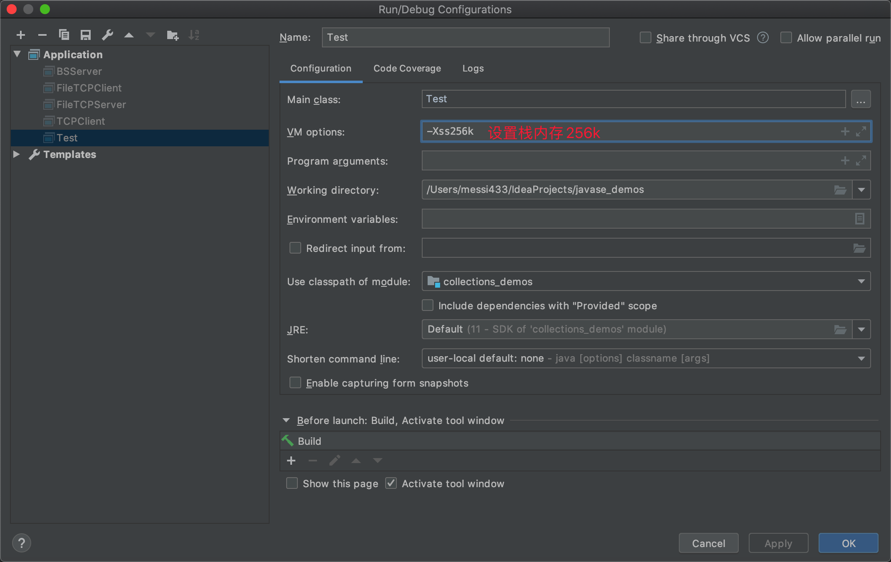

<!--调用第三方时，因为两个类循环引用，出现栈溢出-->

```java
public class Demo1 {
  public static void main(String[] args) throws JsonProcessingException {
    Dept d = new Dept();
    d.setName("Market");

    Emp e1 = new Emp();
    e1.setName("zhang");
    e1.setDept(d);

    Emp e2 = new Emp();
    e2.setName("li");
    e2.setDept(d);

    d.setEmps(Arrays.asList(e1, e2));
    // (name:'Market', emps: [{ name: 'zhang', dept:{ name:'', emps: [{}]} },] } ，
    // dept中又有emps属性...嵌套递归，两个类之间循环引用问题
    ObjectMapper mapper = new ObjectMapper();
    System.out.println(mapper.writeValueAsString(d));
  }
}
class Emp{
  private String name;
  @JsonIgnore //添加注解使取消循环引用
  private Dept dept;
}
```

##### 2.栈帧过大导致栈内存溢出

#### 2.2.3 线程运行诊断

##### 案例1: cpu 占用过多

定位bug点：

- 用`top`定位哪个进程对cpu的占用过高
- `ps H -eo pi,id,%cpu grep 进程id` (用ps命令进一步定位是哪个线程引起的cpu占用过高)
- `jstack 进程id`
- 可以根据线程id转换为16进制 =>找到有问题的线程，进一步定位到问题代码的源码行号

```java
public class Demo1 {
    public static void main(String[] args) {
        new Thread(null, () -> {
            System.out.println("1...");
            while (true) {
            }
        }, "thread1").start();
        new Thread(null, () -> {
            System.out.println("2...");
            try {
                Thread.sleep(1000000L);
            } catch (InterruptedException e) {
                e.printStackTrace();
            }
        }, "thread2").start();
        new Thread(null, () -> {
            System.out.println("3...");
            try {
                Thread.sleep(1000000L);
            } catch (InterruptedException e) {
                e.printStackTrace();
            }
        }, "thread3").start();
    }
}
```

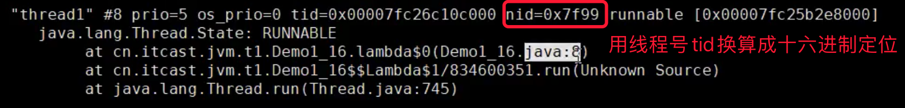

##### 案例2：线程诊断 =>迟迟得不到结果

```java
/*
	共享对象A、B互相调用发生死锁问题
*/
public class Demo1_3 {
    static A a = new A();
    static B b = new B();

    public static void main(String[] args) throws InterruptedException {
        new Thread(() -> {
            synchronized (a) {
                try {
                    Thread.sleep(2000);
                } catch (InterruptedException e) {
                    e.printStackTrace();
                }
                synchronized (b) {
                    System.out.println("我获得了a和b");
                }
            }
        }).start();
        Thread.sleep(1000);
        new Thread(() -> {
            synchronized (b) {
                synchronized (a) {
                    System.out.println("我获得了a和b");
                }
            }
        }).start();
    }
}
```

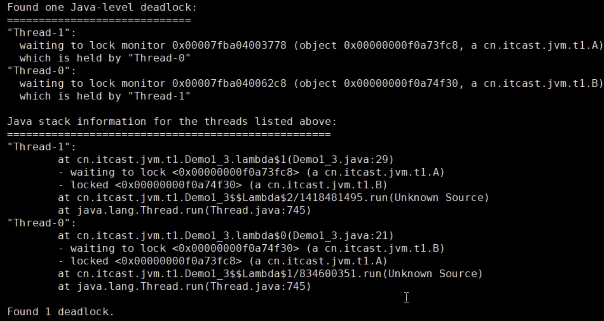


### 2.3 本地方法栈

​	本地方法栈（Native Method Stacks）与 Java 虚拟机栈所发挥的作用是非常相似的，其区别不过是虚拟机栈为虚拟机执行 Java 方法（也就是字节码）服务，而本地方法栈则是为虚拟机使用到的 Native 方法服务。虚拟机规范中对本地方法栈中的方法使用的语言、使用方式与数据结构并没有强制规定，因此具体的虚拟机可以自由实现它。

​	**Navtive 方法是 Java 通过 JNI 直接调用本地 C/C++ 库**，可以认为是 Native 方法相当于 C/C++ 暴露给 Java 的一个接口，Java 通过调用这个接口从而调用到 C/C++ 方法。当线程调用 Java 方法时，虚拟机会创建一个栈帧并压入 Java 虚拟机栈。然而当它调用的是 native 方法时，虚拟机会保持 Java 虚拟机栈不变，也不会向 Java 虚拟机栈中压入新的栈帧，虚拟机只是简单地动态连接并直接调用指定的 native 方法。

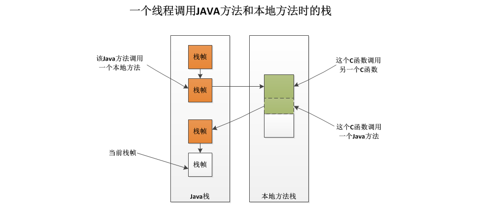


- 本地方法栈是一个后入先出（Last In First Out）栈。
- 由于是**线程私有**的，生命周期随着线程，线程启动而产生，线程结束而消亡。
- 本地方法栈会抛出 **StackOverflowError** 和 **OutOfMemoryError** 异常。

### 2.4 堆

#### 2.4.1 Heap堆

通过new关键字，创建对象都会使用堆内存

**特点：**

- 它是线程共享的，堆中对象都需要考虑线程安全的问题
- 有垃圾回收机制


#### 2.4.2 堆 => 内存溢出

```java
/**
 * Java11： java.lang.OutOfMemoryError: Overflow: String length out of range
 * Java8： java.lang.OutOfMemoryError: Java heap space
 */
public class Demo5 {
    public static void main(String[] args) {
        int i = 0;
        try {
            List<String> list = new ArrayList<>();
            String a = "hello";
            while (true) {
                list.add(a);
                a = a + a;
                i++;
            }
        } catch (Throwable e) {
            e.printStackTrace();
            System.out.println(i);
        }
    }
}
```

#### 2.4.3 堆内存诊断

- jps工具 
  
  - 查看当前系统中有哪些java进程
- jmap工具
  
  - 查看堆内存占用情况 `jmap -heap 850` (1.8)
  - 查看堆内存占用情况 `jhsdb jmap --heap --pid 850` (> 1.8)
- jconsole工具
  
  - 图形界面的，多功能的监测工具，可以连续监测
  

**Demo1：**


```java
/**
 * 演示内存创建，内存置空null时，堆内存的使用情况
 */
public class Demo6 {
    public static void main(String[] args) throws InterruptedException {
        System.out.println("1...");
        Thread.sleep(30000);
        byte[] array = new byte[1024 * 1024 * 10];//10Mb
        System.out.println("2...");
        Thread.sleep(30000);
        array = null; // array置空，没有引用 => 变为"垃圾"
        System.gc(); //垃圾回收
        System.out.println("3...");
        Thread.sleep(1000000L);
    }
}
```

- `jps`查看 java进程
- 每一次打印时：调用`jhsdb jmap --heap --pid 850`

- 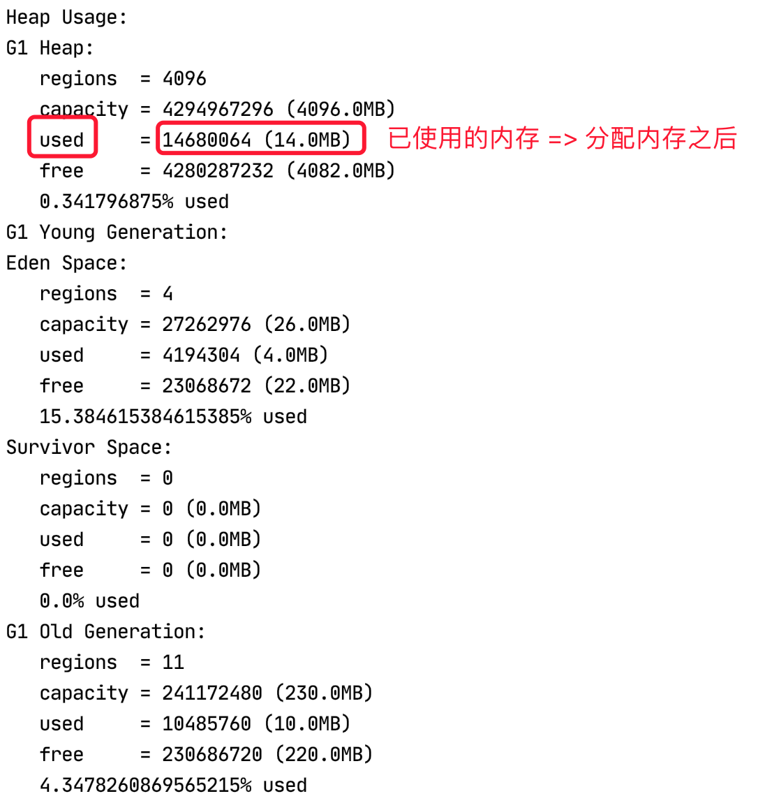

- 流程
  - 初始used =0 
  - 开辟内存 used = 10
  - gc回收 used =0

- Jvisual：https://www.bilibili.com/video/BV1yE411Z7AP?p=21

### 2.5 方法区

#### 2.5.1 定义

​	方法区与Java堆一样，是各个线程共享的内存区域，它用于存储已被虚拟机加载的类信息、常量、静态变量、即时编译器编译后的代码等数据。

　使用HotSpot虚拟机的用户，更愿意把方法区称为“永久代”，本质上两者并不等价，仅仅是因为HotSpot虚拟机的设计团队选择把GC分代收集至方法区，或者说用永久代来实现方法区而已。这样HotSpot的垃圾收集器可以像管理Java堆一样管理这部分内存，能省去专门为方法区编写内存管理代码的工作。

　移除永久代的工作从JDK1.7就开始了。JDK1.7中，存储在永久代的部分数据就已经转移到了Java Heap或者是 Native Heap。但永久代仍存在于JDK1.7中，并没完全移除，譬如符号引用(Symbols)转移到了native heap；字面量(interned strings)转移到了java heap；类的静态变量(class statics)转移到了java heap。

　元空间本质和永久代类似，都是对JVM规范中方法区的实现。不过元空间与永久代之间最大的区别在于：元空间并不在虚拟机中，而是使用本地内存。因此默认情况下元空间的大小仅受本地内存限制。

　即方法区里存放着类的版本、字段、方法、接口和常量池（存储字面量和符号引用）。

　符号引用包括：1、类的权限定名；2、字段名和属性；3、方法名和属性

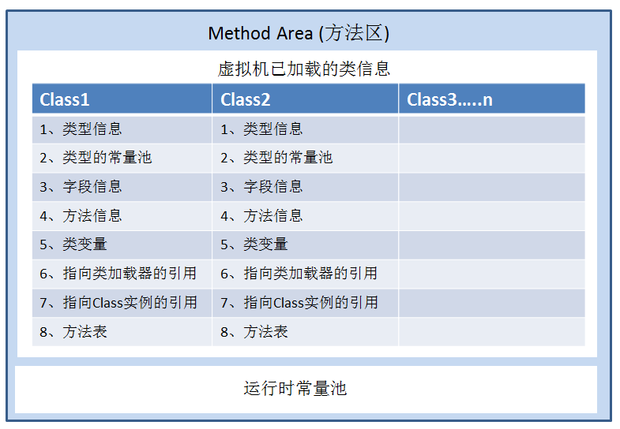

> 方法区只是jvm的一种规范，1.8之前用**永久代**去实现，jdk8方法区这个规范还是存在的，只不过用的是**元空间**去实现

#### 2.5.2 结构

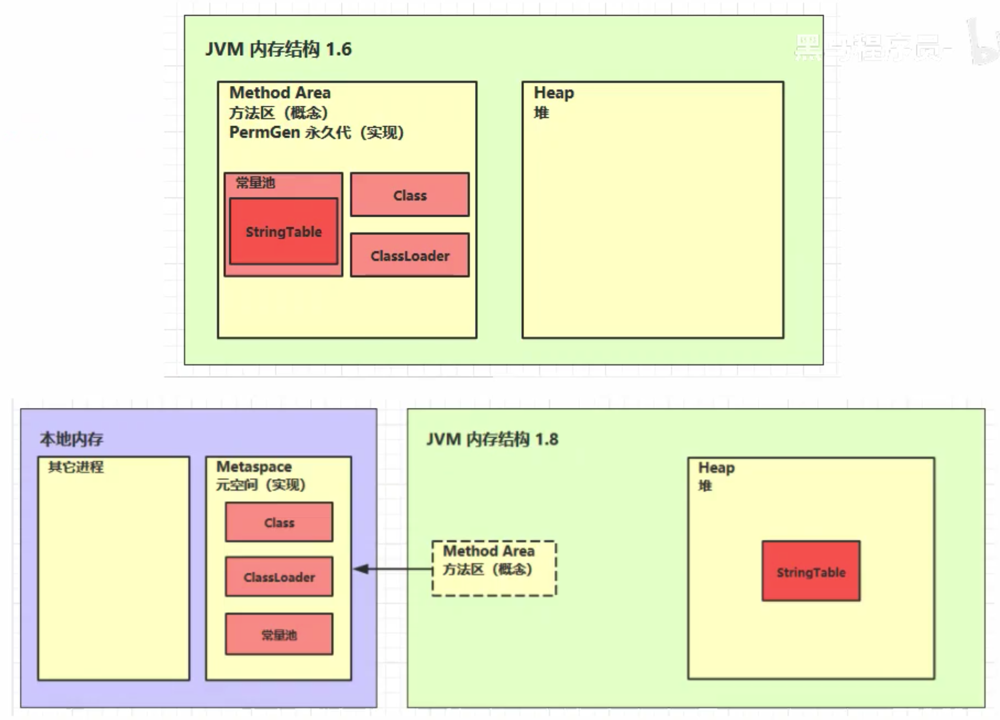

这里说的不对，StringTable一直都在本地内存，StringTable中存储的是对字符事对象的指针，对应的String对象在堆中

#### 2.5.3 方法区内存溢出

1.8以前会导致永久代内存溢出

```
演示永久代内存溢出 java.lang.OutOfMemoryError: PermGen space
-XX: MaxPermSize=8m
```

1.8之后会导致元空间内存溢出

```
演示元空间内存溢出java.lang.OutOfMemoryError: Metaspace
-XX: MaxMetaspaceSize=8m
```

```java
/**
 * 演示元空间内存溢出
 * -XX:MapxMetaspaceSize=8m
 */
public class Demo8 extends ClassLoader {
    // 可以用来加载类的二进制字节码
    public static void main(String[] args) {
        int j = 0;
        try {
            Demo8 test = new Demo8();
            for (int i = 0; i < 10000; i++, j++) {
                // ClassWriter作用是生成类的二进制字节码
                ClassWriter cw = new ClassWriter(0);
                //版本号，public, 类名，包名，父类，接口
                cw.visit(Opcodes.V1_8, Opcodes.ACC_PUBLIC, "Class" + i, null, "java/lang/object", null);
                //返回byte[]
                byte[] code = cw.toByteArray();
                //执行了类的加载
                test.defineClass("Class" + i, code, 0, code.length); // Class 对象
            }
        } finally {
            System.out.println(j);
        }
    }
}

```

场景： 

- Spring => cglib产生代理类，AOP核心
- Mybatis => cglib产生代理类 => 生成Mapper接口(实现类)

#### 2.5.4 运行时常量池

P25、P26

- 常量池，就是一-张表,虚拟机指令根据这张常量表找到要执行的类名、方法名、参数类型、字面量等信息
- 运行时常量池，常量池是*.class 文件中的，当该类被加载，它的常量池信息就会放入运行时常量池，并
  把里面的符号地址变为真实地址

#### 2.5.5 StringTable(串池)

案例1：利用反编译查看串池、常量池、以及字符串形成的调用情况

```java
// StringTable [ "a"， "b" , "ab"] hashtable 结构,不能扩容
public class Demo10 {
  //常量池中的信息,都会被加载到运行时常量池中，这时a b ab都是常量池中的符号,还没有变为java 字符串对象
  public static void main(String[] args) {
    //ldc是常量池
    // ldc #2会把a符号变为"a"字符串对象 => StringTable [ "a" ]
    String s1 = "a";
    // ldc #3会把b符号变为"b" 字符串对象 => StringTable [ "a"，"b" ]
    String s2 = "b";
    // ldc #4会把ab符号变为"ab"字符串对象 => StringTable [ "a"，"b"，"ab" ]
    String s3 = "ab";
    String s4 = s1 + s2; //new StringBuilder().append( "a ").toString() => new String("ab")
    //s3是串池中的字符串，串池存放在堆中，s4是创建了一个新的对象，存放在堆中，虽然值相同但是返回false
    System.out.println(s3 == s4);
    //拼接起来为"ab"，直接在串池中就能找到，直接引用 ldc #4 即可；这是javac在编译期间的优化,结果已经在编译期确定为ab
    String s5 = "a" + "b";

  }
}
```

反编译：

- 先build Project，或者运行代码
- 切换到out目录下的存放.class的目录下
- 执行 `javap -v Demo10.class` => 查看反编译信息

```properties
astore，存储
aload，取出
Classfile /Users/messi433/IdeaProjects/jvm_demos/out/production/jvm_demos/part1/Demo10.class
  Last modified 2020年4月21日; size 666 bytes
  MD5 checksum 01263ecbbe59215c4ee06096ec7522e3
  Compiled from "Demo10.java"
public class part1.Demo10
  minor version: 0
  major version: 52
  flags: (0x0021) ACC_PUBLIC, ACC_SUPER
  this_class: #9                          // part1/Demo10
  super_class: #10                        // java/lang/Object
  interfaces: 0, fields: 0, methods: 2, attributes: 1
Constant pool:
   #1 = Methodref          #10.#29        // java/lang/Object."<init>":()V
   #2 = String             #30            // a
   #3 = String             #31            // b
   #4 = String             #32            // ab
   #5 = Class              #33            // java/lang/StringBuilder
   #6 = Methodref          #5.#29         // java/lang/StringBuilder."<init>":()V
   #7 = Methodref          #5.#34         // java/lang/StringBuilder.append:(Ljava/lang/String;)Ljava/lang/StringBuilder;
   #8 = Methodref          #5.#35         // java/lang/StringBuilder.toString:()Ljava/lang/String;
   #9 = Class              #36            // part1/Demo10
  #10 = Class              #37            // java/lang/Object
  #11 = Utf8               <init>
  #12 = Utf8               ()V
  #13 = Utf8               Code
  #14 = Utf8               LineNumberTable
  #15 = Utf8               LocalVariableTable
  #16 = Utf8               this
  #17 = Utf8               Lpart1/Demo10;
  #18 = Utf8               main
  #19 = Utf8               ([Ljava/lang/String;)V
  #20 = Utf8               args
  #21 = Utf8               [Ljava/lang/String;
  #22 = Utf8               s1
  #23 = Utf8               Ljava/lang/String;
  #24 = Utf8               s2
  #25 = Utf8               s3
  #26 = Utf8               s4
  #27 = Utf8               SourceFile
  #28 = Utf8               Demo10.java
  #29 = NameAndType        #11:#12        // "<init>":()V
  #30 = Utf8               a
  #31 = Utf8               b
  #32 = Utf8               ab
  #33 = Utf8               java/lang/StringBuilder
  #34 = NameAndType        #38:#39        // append:(Ljava/lang/String;)Ljava/lang/StringBuilder;
  #35 = NameAndType        #40:#41        // toString:()Ljava/lang/String;
  #36 = Utf8               part1/Demo10
  #37 = Utf8               java/lang/Object
  #38 = Utf8               append
  #39 = Utf8               (Ljava/lang/String;)Ljava/lang/StringBuilder;
  #40 = Utf8               toString
  #41 = Utf8               ()Ljava/lang/String;
{
  public part1.Demo10();
    descriptor: ()V
    flags: (0x0001) ACC_PUBLIC
    Code:
      stack=1, locals=1, args_size=1
         0: aload_0
         1: invokespecial #1                  // Method java/lang/Object."<init>":()V
         4: return
      LineNumberTable:
        line 5: 0
      LocalVariableTable:
        Start  Length  Slot  Name   Signature
            0       5     0  this   Lpart1/Demo10;

  public static void main(java.lang.String[]);
    descriptor: ([Ljava/lang/String;)V
    flags: (0x0009) ACC_PUBLIC, ACC_STATIC
    Code:
      stack=2, locals=5, args_size=1
         0: ldc           #2                  // String a
         2: astore_1
         3: ldc           #3                  // String b
         5: astore_2
         6: ldc           #4                  // String ab
         8: astore_3
         9: new           #5                  // class java/lang/StringBuilder
        12: dup
        13: invokespecial #6                  // Method java/lang/StringBuilder."<init>":()V
        
        //调用Stringbuilder无参数构造方法
        
        16: aload_1
        
        //传入aload_1拿到的参数
        
        17: invokevirtual #7                  // Method java/lang/StringBuilder.append:(Ljava/lang/String;)Ljava/lang/StringBuilder;
        20: aload_2
        
        //传入aload_2拿到的参数
        
        21: invokevirtual #7                  // Method java/lang/StringBuilder.append:(Ljava/lang/String;)Ljava/lang/StringBuilder;
        
        //toSting返回拼接字符串 => 再调用new String("ab")
        
        24: invokevirtual #8                  // Method java/lang/StringBuilder.toString:()Ljava/lang/String;
        27: astore        4
        29: return
      LineNumberTable:
        line 10: 0
        line 12: 3
        line 14: 6
        line 15: 9
        line 16: 29
      LocalVariableTable:
        Start  Length  Slot  Name   Signature
            0      30     0  args   [Ljava/lang/String;
            3      27     1    s1   Ljava/lang/String;
            6      24     2    s2   Ljava/lang/String;
            9      21     3    s3   Ljava/lang/String;
           29       1     4    s4   Ljava/lang/String;
}
SourceFile: "Demo10.java"

```


案例2：字符串延迟加载

```java
/**
 * 演示字符串字面量也是[延迟]成为对象的，shift + F8 => Step out(下一个断点)
 */
public class Demo11 {
    public static void main(String[] args) {
        int x = args.length;
        System.out.println(); //字符串个数1227
        /* 1-0 字符串池初始没有 */
        System.out.print("1");
        System.out.print("2"); //1228
        System.out.print("3");
        System.out.print("4");
        System.out.print("5");
        System.out.print("6");
        System.out.print("7");
        System.out.print("8");
        System.out.print("9");
        System.out.print("0"); //1236
        /*剩下的就没有变化了*/
        System.out.print("1");
        System.out.print("2");
        System.out.print("3");
        System.out.print("4");
        System.out.print("5");
        System.out.print("6");
        System.out.print("7");
        System.out.print("8");
        System.out.print("9");
        System.out.print("0");
    }
}
```

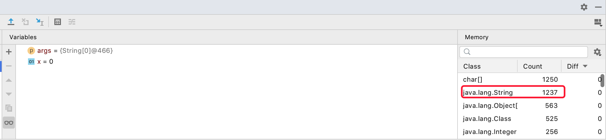


##### StringTable特性

- 常量池中的字符串仅是符号,第一-次用到时才变为对象
- 利用串池的机制，来避免重复创建字符串对象
- 字符串变量拼接的原理是StringBuilder (1.8)
- 字符串常量拼接的原理是编译期优化
- 可以使用intern方法,主动将串池中还没有的字符串对象放入串池
  - 1.8，将这个字符串对象尝试放入串池，如果有则并不会放入，如果没有则放入串池，会把串池中的对象
    返回
  - 1.6，将这个字符串对象尝试放入串池，如果有则并不会放入，如果没有会把此对象复制一份,放入串
    池，会把串池中的对象返回(调用intern返回的字符串对象和刚开始放入串池的字符串对象不同)

```java
//Demo演示1 =>最终串池：["a", "b","ab"]
public class Demo12 {
  public static void main(String[] args) {
    //堆new String("a")+new String("b") => new String( "ab ")
    String s = new String("a") + new String("b");
    //obj.intern()将这个字符串对象尝试放入串池,如果有则并不会放入,如果没有则放入串池，会把串池中的对象返回
    String s2 = s.intern(); // ["a", "b”, "ab"]
    System.out.println(s2 == "ab"); //true
    System.out.println(s == "ab"); //true
  }
}
```

```java
//Demo演示2 =>最终串池：["ab","a", "b"]
public class Demo12 {
    public static void main(String[] args) {
        String x = "ab";//["ab"]
        //堆new String("a")+new String("b") => new String( "ab ")
        String s = new String("a") + new String("b");
        //obj.intern()将这个字符串对象尝试放入串池,如果有则并不会放入,如果没有则放入串池，会把串池中的对象返回
        String s2 = s.intern(); //s("ab")是存放在堆中新的对象，但是串池中已经有"ab"，所以s2是返回的串池中的字符串
        System.out.println(s2 == x); //true
        System.out.println(s == x); //flase 
    }
}
```

```java
/**
 * jdk 1.6 => 1.8全处
 * @param args
 */
public static void main(String[] args) {
  //堆new String("a")+new String("b") => new String( "ab ") => ["a","b"]
  String s = new String("a") + new String("b");
  //obj.intern()将这个字符串对象尝试放入串池,如果有则并不会放入,如果没有则"拷贝"一份放入串池，会把串池中的对象返回
  String s2 = s.intern(); //返回串池中拷贝的字符串对象
  String x = "ab";
  System.out.println(s2 == x); //true
  System.out.println(s == x); //flase
}
```

##### StringTable的几道面试题：

```java
public class Demo9 {
   public static void main(String[] args) {
          String s1 = "a"; //["a"]
        String s2 = "b"; //["a","b"]
        String s3 = "a" + "b"; //["a","b","ab"]
        String s4 = s1 + s2; //new String("ab") => 存放到堆中
        String s5 = "ab"; //串池中已有
        String s6 = s4.intern(); //"ab"串池中已有 => 返回串池的"ab"

        //问
        System.out.println(s3 == s4);// 串池的"ab" != 堆中"ab"对象
        System.out.println(s3 == s5);// 串池的"ab" == 串池的"ab"
        System.out.println(s3 == s6);// 串池的"ab" == 串池的"ab"

//        String x2 = new String("c") + new String("d");
//        String x1 = "cd";
//        x2.intern();
//        System.out.println(x1 == x2); //串池的"cd" != 堆中"cd"对象

        //问，如果调换了[最后两行代码]的位置呢 =》jdk1.8、1.6 结果
        String x2 = new String("c") + new String("d"); //new String("cd")
        x2.intern(); //1.8 堆中对象入串池；1.6 复制一个对象副本入串池
        String x1 = "cd"; //1.8 串池中有，直接引用串池中的对象；1.6引用串池副本
        System.out.println(x1 == x2); //1.8 true；1.6 false
    }
}
```

##### StringTable的位置：

https://www.bilibili.com/video/BV1yE411Z7AP/?p=36

```java
/**
 * 演示StringTable 位置
 * 在jdk8下设置 -Xmx1Om -XX:-UseGCOverheadLimit
 * 在jdk6下设置 -XX:MaxPermSize=1Ѳm
 */
public class Demo13 {
    public static void main(String[] args) throws InterruptedException {
        List<String> list = new ArrayList();
        int i = 0;
        try {
            for (int j = 0; j < 260000; j++) {
                list.add(String.valueOf(j).intern());
                i++;
            }
        } catch (Throwable e) {
            e.printStackTrace();
        } finally {
            System.out.println(i);
        }
    }
}
```

##### StringTable垃圾回收

https://www.bilibili.com/video/BV1yE411Z7AP/?p=37

##### StringTable调优

- 调整-XX:StringTableSize=桶个数

```java
/**
 * -XX:StringTableSize=200000 -XX:+PrintStringTableStatistics
 * 不加参数是268，加参数是401，耗费时间是调整StringTableSize
 */
public class Demo15 {
    public static void main(String[] args) throws IOException {
        try (BufferedReader reader = new BufferedReader(new InputStreamReader(
                new FileInputStream("linux.words"), "utf-8"))) {
            String line = null;
            long start = System.nanoTime(); //开始时间，纳秒级
            System.nanoTime();
            while (true) {
                line = reader.readLine();
                if (line == null)
                    break;
                line.intern();
            }
            System.out.println("cost:" + (System.nanoTime() - start) / 1000000); //打印花费时间
        }
    }
}
```

**考虑将字符串对象是否入池(存在大量字符串，且有重复现象)**

```java
/**
 * -XX:StringTableSize=200000 -XX:+PrintStringTableStatistics
 * 不加参数是268，加参数是401，耗费时间是调整StringTableSize
 */
public class Demo16 {
  public static void main(String[] args) throws IOException {
    List<String> address = new ArrayList<>();
    System.in.read();
    for (int i = 0; i < 10; i++) { //循环10次 => 保证有10次重复单词读取
      try (BufferedReader reader = new BufferedReader(new InputStreamReader(
        new FileInputStream("linux.words"), "utf-8"))) {
        String line = null;
        long start = System.nanoTime(); //开始时间，纳秒级
        System.nanoTime();
        while (true) {
          line = reader.readLine();
          if (line == null)
            break;
          //address.add(line);
          // 先字符串入串池，返回串池中的str，串池外的元素会被垃圾回收 => 重复元素不会入串池，会被垃圾回收，性能优化
          address.add(line.intern());

        }
        System.out.println("cost:" + (System.nanoTime() - start) / 1000000); //打印花费时间
      }
    }
    System.in.read();
  }
}
```

### 2.6 直接内存

- 常见于NIO操作时,用于数据缓冲区
- 分配回收成本较高,但读写性能高
- 不受JVM内存回收管理

案例1：

```java
public class Demo17 {
    static final String FROM = "E:\\编程资料\\第三 方教学视频\\youtube\\Getting Started with Spring Boot-sbPSjI4tt10.mp4";
    static final String TO = "E:\\a.mp4";
    static final int _1Mb = 1024 * 1024;

    public static void main(String[] args) {
        io(); // io用时: 1535. 586957 1766. 963399 1359. 240226
        directBuffer();// directBuffer 用时: 479. 295165 702. 291454562. 56592
        
        //=> directBuffer性能高

    }

    private static void directBuffer() {
        long start = System.nanoTime();
        try (FileChannel from = new FileInputStream(FROM).getChannel();
             FileChannel to = new FileOutputStream(TO).getChannel();
        ) {
            ByteBuffer bb = ByteBuffer.allocateDirect(_1Mb);
            while (true) {
                int len = from.read(bb);
                if (len == -1) {
                    break;
                }
                bb.flip();
                to.write(bb);
                bb.clear();
            }
        } catch (IOException e) {
            e.printStackTrace();
        }
        long end = System.nanoTime();
        System.out.println("directBuffer用时:" + (end - start) / 1000_000.0);
    }

    private static void io() {
        long start = System.nanoTime();
        try (FileInputStream from = new FileInputStream(FROM);
             FileOutputStream to = new FileOutputStream(TO);
        ) {
            byte[] buf = new byte[_1Mb];
            while (true) {
                int len = from.read(buf);
                if (len == -1) {
                    break;
                }
                to.write(buf, 0, len);
            }
        } catch (IOException e) {
            e.printStackTrace();
        }
        long end = System.nanoTime();
        System.out.println("io用时:" + (end - start) / 1000_000.0);
    }
}
```

使用ByteBuffer读写大文件性能高 => 原理剖析

Java程序调用IO操作时，会调用系统调用进入内核态

磁盘文件会先复制一份进入系统内存 => Java程序不能直接读取系统内存 => 创建byte[]缓冲区，再读取


​		ByteBuffer对象调用`allocatedirect(内存大小)`创建直接内存区，Java堆内存和系统内存均可调用，这样仅复制一份		


案例2：直接内存的内存溢出

```java
/**
 * @Description 模拟直接内存的内存溢出
 */
public class Demo18 {
    static int _100Mb = 1024 * 1024 * 100;
    /***
     * @Description Exception in thread "main" java.lang.OutOfMemoryError: Direct buffer memory
     */
    public static void main(String[] args) {
        List<ByteBuffer> list = new ArrayList<>();
        int i = 0;
        try{
            while (true){
                ByteBuffer byteBuffer = ByteBuffer.allocateDirect(_100Mb);//分配100M
                list.add(byteBuffer);
            }
        }finally {
            System.out.println(i);
        }
        //方法区是jvm规范，jdk6 中对方法区的实现称为永久代
        //jdk8 对方法区的实现称为元空间
    }
}
```

案例3：模拟演示直接内存被回收(释放)

```java
/**
 * @Description 模拟演示直接内存被回收
 */
public class Demo19 {
    static int _1G = 1024 * 1024 * 1024;
    public static void main(String[] args) throws IOException {
        ByteBuffer byteBuffer = ByteBuffer.allocateDirect(_1G);//分配1G，观察任务管理器，不要用java工具，java不管直接内存
        System.out.println("分配完毕");
        System.in.read();//回车继续执行
        System.out.println("开始释放");
        byteBuffer = null;//对象置空
        System.gc();//垃圾回收(显式垃圾回收，Full GC 影响性能)
    }
}
```


#### 直接内存释放原理

- java对象无权，释放直接内存，所以gc也无权释放
- jdk通过unsafe对象访问底层，实现垃圾回收


- 分配和回收原理
  使用了Unsafe对象完成直接内存的分配回收，并且回收需要主动调用freeMemory方法，ByteBuffer的实现类内部，使用了Cleaner (虚引用) 来监测ByteBuffer 对象，一旦ByteBuffer对象被垃圾回收，那么就会由ReferenceHandler线程通过Cleaner的clean方法调用freeMemory来释放直接内存

- 禁用显式对直接内存的影响


