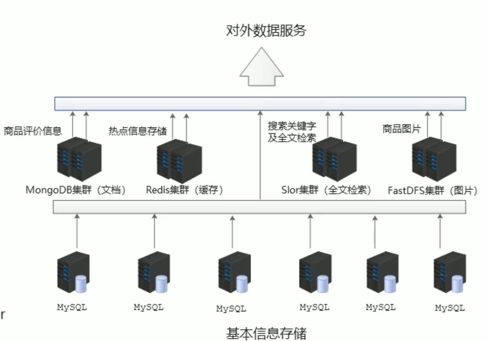
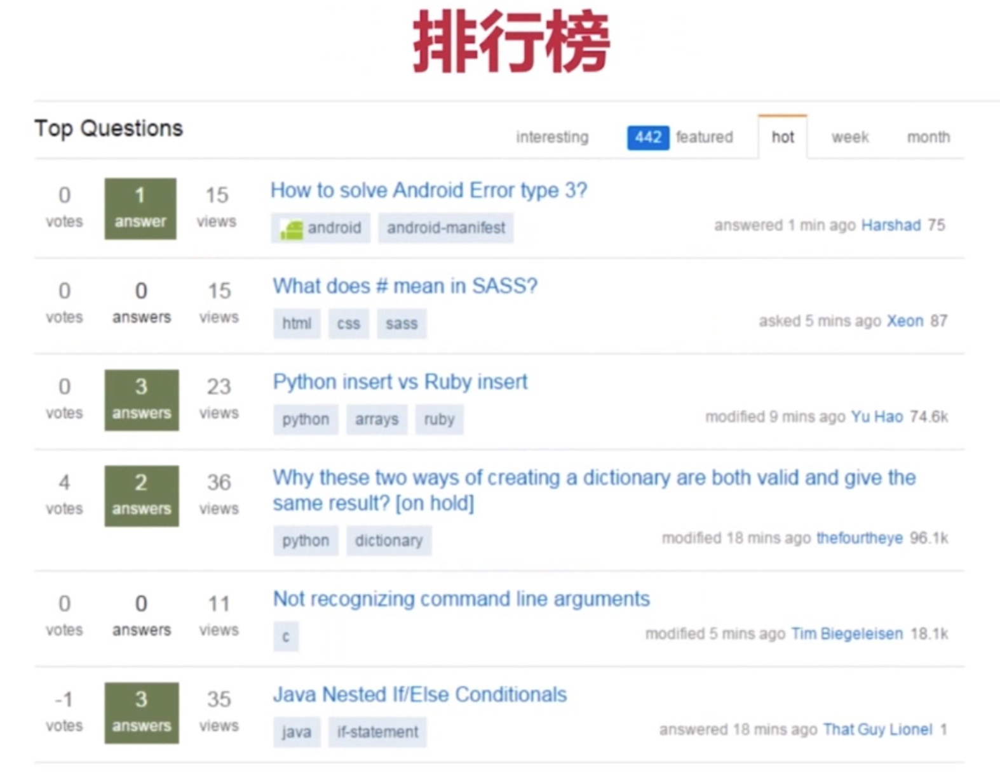
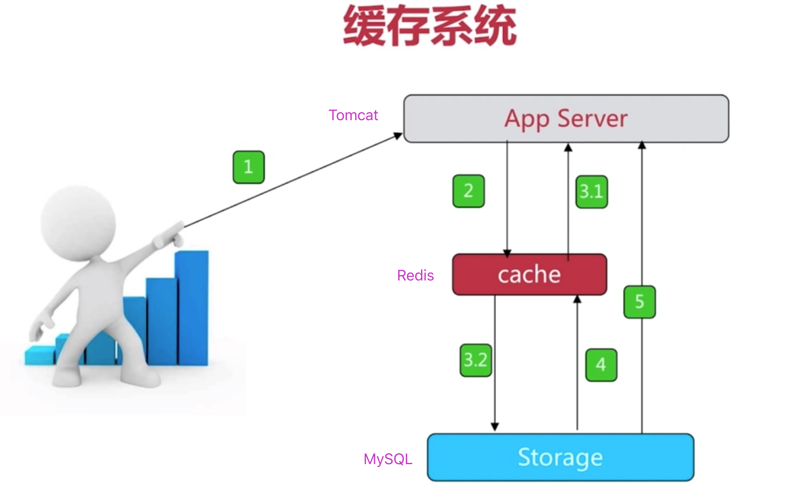
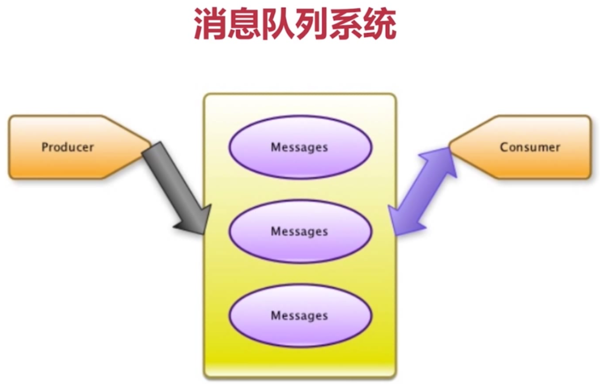
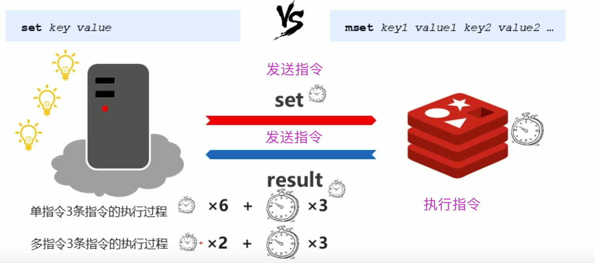
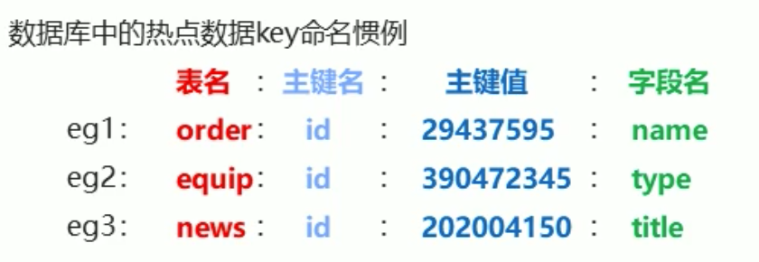
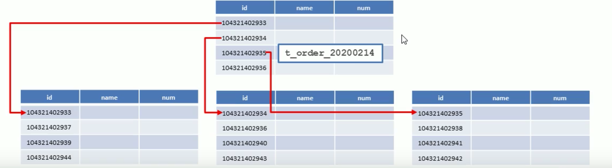
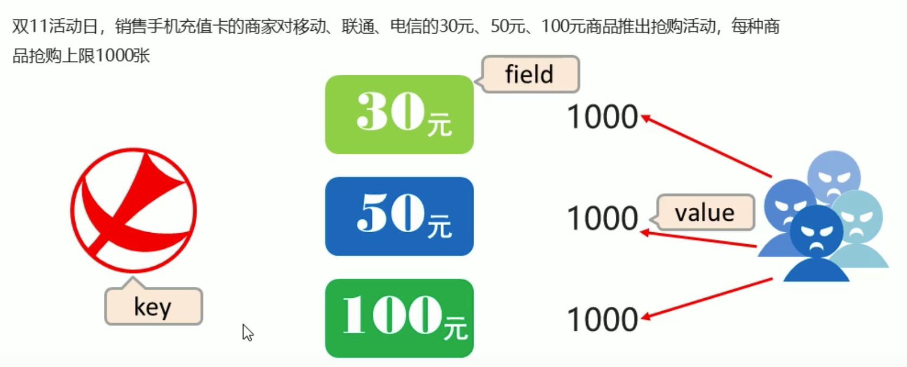
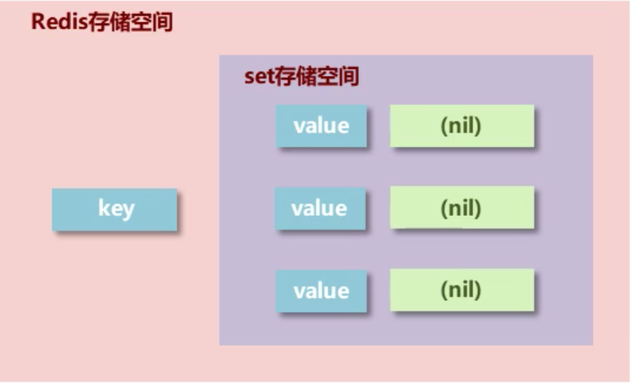
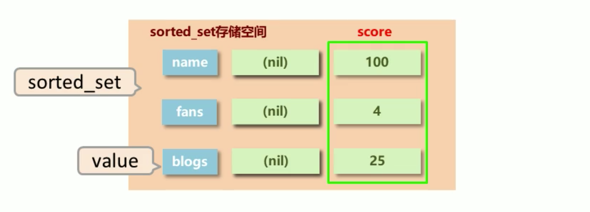

# Redis基础

## 如何学好Redis

- [ ] 掌握数据结构
- [ ] 掌握常用特性
- [ ] 玩转配置文件 *.conf
- [ ] 掌握应用场景

## 一、Redis简介

### 1.1出现问题的场景

1.12306经常崩

2.双11崩溃

3.北京奥运会订票崩溃

### 1.2 问题在哪？

#### 1.2.1 问题

- 海量用户
- 高并发

#### 1.2.2 问题源头 => 关系型数据库

问题

- io性能低下
- 数据关系复杂、扩展性能差，不便于大规模集群

解决

- 降低磁盘IO次数，越低越好 - 内存存储
- 去除数据间关系，越简单越好 - n不存储关系，仅存储数据 

### 1.3 NoSQL

Nosql(非关系型数据库)，not only sql => 关系数据库的补充

#### 1.3.1 特征(相对Sql)：

- 可扩容、可伸缩
- 大数据下的高性能
- 灵活的数据模型
- 高可用

#### 1.3.2 常见NoSQL：

- Redis
- memcache
- HBase
- MongoDB

#### 1.3.3 NoSQL应用场景=>电商



##### 商品基本信息 => MySQL:

```
名称、价格、厂商
```

##### 商品附加信息 => MongoDB：

```
描述、详情、评论
```

##### 图片信息

```
分布式文件系统
```

##### 搜索关键字

```
ES、Lucene、 solr
```

##### 热点信息（redis、meache..、tair ）

```
高频、波段性
```

### 1.4 Redis

#### 1.4.1概念: 

Redis (REmote DIctionary Server)是用C语言开发的一一个开源的高性能键值对(key-value) 数据库。

#### 1.4.2 特征:

1. 数据间没有必然的关联关系

2. 内部采用单线程机制进行工作

3. 高性能。官方提供测试数据, 50个并发执行100000个请求，读的速度是110000次/s,写的速度是81000次/s

4. 多数据类型支持

   字符串类型：string
   列表类型：list
   散列类型：hash
   集合类型：set
   有序集合类型：sorted set
   持久化支持：可以进行数据灾难恢复

#### 1.4.3 Redis的应用场景

1. 为热点数据加速查询(主要场景) ：

   如热点商品、热点新闻、热点资讯、推广类等高访问量信息等、任务队列，如秒杀、抢购、购票排队等

2. 即时信息查询(实时系统)：

   如各位排行榜、各类网站访问统计、公交到站信息、在线人数信息(聊天室、网站)、 设备信号等、

   

3. 缓存系统：

   

   


   - 原始业务功能设计
     - 秒杀
     - 618活动
     - 双11活动
     - 排队购票
   - 运营平台监控到的突发高频访问数据
   - 突发时政要闻，被强势关注围观
   - 高频、复杂的统计数据
   - 在线人数

   - 附加功能
   - 系统功能优化或升级
     - 单服务器升级集群
     - Session 管理
     - Token 管理

4. 时效性信息控制：

   如验证码控制、投票控制等

5. 分布式数据共享：

   如分布式集群架构中的session分离

6. 消息队列

   

7. 计数器

   

8. 实时系统：

   垃圾邮件处理、过滤器(布隆过滤器)

9. 社交网站：

   微博、Twitter、...

10. 分布式锁

    

## 二、Redis数据类型

1. String(String)
2. Hash(HashMap)
3. List(LinkList)
4. Set(HashSet)
5. Sort_Set(TreeSet)

### 学习目标-掌握17个解决方案：

- [x] redis用于控制数据库表主键id,为数据库表主键提供生成策略,保障数据库表的主键唯一性
- [x] redis控制数据的生命周期，通过数据是否失效控制业务行为,适用于所有具有时效性限定控制的操作
- [x] redis应用于各种结构型和非结构型高热度数据访问加速
- [x] redis应用于购物车数据存储设计
- [x] redis应用于抢购，限购类、限量发放优惠卷、激活码等业务的数据存储设计
- [x] redis应用于具有操作先后顺序的数据控制
- [x] redis应用于最新消息展示
- [x] redis应用于随机推荐类信息检索，例如热点歌单推荐,热点新闻推荐，热卖旅游线路,应用APP推荐,大V推荐等
- [x] redis应用于同类信息的关联搜索，二度关联搜索，深度关联搜索
- [x] redis应用于同类型不重复数据的合并、取交集操作
- [x] redis应用于同类型数据的快速去重
- [x] redis应用于基于黑名单与白名单设定的服务控制
- [x] redis应用于计数器组合排序功能对应的排名
- [x] redis应用于定时任务执行顺序管理或任务过期管理
- [x] redis应用于及时任务/消息队列执行管理
- [x] redis应用于按次结算的服务控制
- [x] redis应用于基于时间顺序的数据操作，而不关注具体时间

### 2.1 String类型

#### 2.1.1 String类型数据的基本操作

1. 添加/修改数据：`set key value`
2. 获取数据 ：`get key`
3. 删除数据：`del key` 
4. 添加/修改多个数据：`mset key1 value1 key2 value2 ...`
5. 获取多个数据`：mget key1 key2 ...`
6. 获取数据字符个数 (字符串长度)：`strlen key`
7. 追加信息到原始信息后部 (如果原始信息存在就追加，否则新建)：`append key va lue`

##### 如何选择`mset` or `set`？ => 从指令性能来分析



##### Key的设置规范：



#### 2.1.2 String类型业务场景1

大型企业级应用中，分表操作是基本操作，使用多张表存储同类型数据，但是对应的主键id必须保证统一性，不能重复。Orade数据库具有sequence设定，可以解决该问题，但是MySQL数据库并不具有类似的机制，那么如何解决?



##### String类型数据的扩展操作（上述解决方案）

| 设置数值数据增加指定范围的值(值可为负) | 设置数值数据减少指定范围的值 |
| -------------------------------------- | ---------------------------- |
| incr key                               | decr key                     |
| incrby key increment                   | decrby key incnement         |
| incrbyfloat key increment              |                              |

> Tips：可以通过`help 指令`查询指令用法

##### String作为数值操作

1.string在redis内部存储默认就是一个字符串， 当遇到增减类操作incr, decr时会转成数值型进行计算。
2.redis所有的操作都是原子性的， 采用单线程处理所有业务,命令是单个执行的，因此无需考虑并发带来的数据影响。

> 注意: **按数值进行操作的数据， 如果原始数据不能转成数值,或超越了redis 数值上限范围**，将报错。
> 如：9223372036854775807 (java中long型数据最大值, Long.MAX_ _VALUE)

> Tips 1:
>
> - redis用于控制数据库表 主键id,为数据库表主键提供生成策略,保障数据库表的主键唯一性
> - 此方案适用于所有数据库，支持数据库集群


#### 2.1.3 String类型业务场景2

```
"最强女生”启动海选投票，只能通过微信投票,每个微信号每4小时只能投1票。
电商商家开启热门]商品推荐,热门]商品不能一直处于热门期,每种商品热门期维持3天，3天后自动取消热:[ ]。
新闻网站会出现热点新闻，热点新闻最大的特征是时效性,如何自动控制热点新闻的时效性。
```

##### 解决方案：

设置数据具有指定的生命周期
`setex key seconds value`
`psetex key milliseconds value`

> Tips 2：redis控制数据的生命周期，通过数据是否失效控制业务行为，适用于所有具有时效性限定控制的操作

#### 2.1.4 String类型数据操作的注意事项

数据操作不成功的反馈与数据正常操作之间的差异:
1.表示运行结果是否成功：
(integer)0 →false == 失败
(integer)1 - →true == 成功
2.表示运行结果值：
(integer)3 -→3 == 3个
(integer)1 →1 ==1个
3.数据未获取到：(nil)等同于null
4.数据最大存储量：512MB
5.数值计算最大范围(java中的long的最大值)：9223372036854775807

#### 2.1.5 String类型应用场景

业务场景：主页高频访问信息显示控制，例如：新浪微博大V，主页显示、粉丝数、微博数量

解决方案1：在redis中为大V用户设定用户信息，以用户主键和属性值作为key,后台设定定时刷新策略即可

```java
例如(注意key的命名规范)：
user:id:35067 283 70:fans =>12210947
user:id:35067 283 70:blogs =>6164
user:id:35067 28370:focuss =>83
```

解决方案2：在redis中以json格式存储大V用户信息,定时刷新(也可以使用hash类型)

```java
userid:3506728370 => { id:35067 28370, name:春晚, fans:12210862, blogs:6164, focus:83 }
```

> Tips 3：Redis应用于各种结构型和非结构型高热度数据访问加速


### 2.2 hash类型

#### 2.2.1 hash引出

- 存储的困惑：
  对象类数据的存储如果具有较频繁的更新需求操作会显得笨重 
- 新的存储需求:
  对一系列存储的数据进行编组，方便管理，典型应用存储对象信息
- 需要的存储结构: 
  1个存储空间保存多个键值对数据

#### 2.2.2 hash数据结构:

底层使用哈希表结构实现数据存储

- hash存储结构优化：
  - 如果field数量较少, 存储结构优化为类数组结构
  - 如果field数量较多，存储结构使用HashMap结构

#### 2.2.3 hash类型数据基本操作

1. 添加/修改数据

   `hset key field value`

2. 获取数据

   ```
   hget key field
   hgetall key
   ```

3. 删除数据

   `hdel key field1 [ field2]`

4. 添加/修改多个数据

   `hmset key field1 valne1 field2 value2..`

5. 获取多个数据

   `hmget key field1 field2`

6. 获取哈希表中字段的数量

   `hlen key`

7. 获取哈希表中是否存在指定的字段

   `hexists key field` 

#### 2.2.4 hash类型数据扩展操作

1. 获取哈希表中所有的字段名或字段值 => 区别`hgetall key` 获取所有key&val
   - `hkeys key`
   - `hvals key` 
2. 设置指定字段的数值数据增加指定范围的值
   - `hincrby key field increment`
   - `hinarbyfloat key field increment`

3. 设置hash field的值，如果field不存在
   - `hsetnx key field value`
   - 应用于购物车访问了数量的数据，如果存在，则不改变数量.

#### 2.2.5 hash类型数据操作的注意事项

1. hash类型下的value只能存储字符串，不允许存储其他数据类型，不存在嵌套现象**(禁止套娃)**,如果数据未获取到，对应的值为(nil)
2. 每个hash可以存储232- 1个键值对
3. hash类型十分贴近对象的数据存储形式，并且可以灵活添加删除对象属性。但hash设计初衷不是为了存
   储大量对象而设计的，切记不可滥用，更不可以将hash作为对象列表使用
4. hgetall 操作可以获取全部属性，如果内部field过多 ,遍历整体数据效率就很会低，有可能成为数据访问
   瓶颈

#### 2.2.6 hash应用场景1

1.业务场景：电商网站购物车设计与实现
2.业务分析：仅分析购物车的redis存储模型

- 添加、浏览、更改数量、删除、清空
- 购物车于数据库间持久化同步(不讨论)
- 购物车于订单间关系(不讨论)
- 提交购物车:读取数据生成订单
- 商家临时价格调整:隶属于订单级别
- 未橙录用户购物车信息存储(不讨论)
- cookie存储

3.解决方案

- 以客户id作为key,每位客户创建一个hash存储结构存 储对应的购物车信息
- 将商品编号作为field,购买数量作为value进行存储
- 添加商品:追加全新的field与value
- 浏览:遍历hash
- 更改数量:自增/自减，设置value值
- 删除商品:删除field
- 清空:删除key

示例1：

```sql
//两个用户的购物车
127.0.0.1:6379> hmset u001 g01 100 g02 200
127.0.0.1:6379> hmset u002 g01 50 g02 300
```

**示例1的设计是否加速了购物车的呈现？**
	当前仅仅是将数据存储到了redis中,并没有起到加速的作用，商品信息还需要二次查询数据库
每条购物车中的商品记录保存成两条field:

- field1专用于保存购买数量
  - 命名格式:商品id:nums
  - 保存数据:数值
- field2专用于保存购物车中显示的信息，包含文字描述,图片地址，所属商家信息等
  - 命名格式:商品id:info
  - 保存数据: json

示例2：

```sql
127.0.0.1:6379>  hmset u003 g01:nums 100 g01:info xxx
127.0.0.1:6379>  hmset u004 g01:nums 200 g01:info xxx
127.0.0.1:6379> hgetall u003
1) "g01:nums"
2) "100"
3) "g01:info"
4) "xxx"
127.0.0.1:6379> hgetall u004
1) "g01:nums"
2) "200"
3) "g01:info"
4) "xxx"
```

示例2：出现问题 **g01:info** 信息重复

​	由于**field2**具有商品的公共信息，如文字描述、图片等等，每个用户购买相应产品会对应相同的商品公共信息，所以存在信息重复

​	将**field2**封装为独立的hash，格式为json

#### 2.2.7 hash应用场景2



解决方案：

1. 以商家id作为key

2. 将参与抢购的商品id作为field

3. 将参与抢购的商品数量作为对应的value

4. 抢购时使用降值的方式控制产品数量

5. 实际业务中还有超卖等实际问题，这里不做讨论

   > Tips 5：redis 应用于抢购，限购类、限量发放优惠卷、激活码等业务的数据存储设计


### 2.3 list类型

#### 2.3.1 list类型数据基本操作

- 添加/修改数据

  ```
  lpush key value1 [value2] ...... 
  rpush key value1 [value2]..... 
  ```

- 获取数据

  ```java
  lrange key start stop
  lindex key index
  llen key
  ```

- 获取并移除数据

  ```
  lpop key
  rpop key
  ```

- 代码演示

```java
127.0.0.1:6379> lpush list1 1 2 3 4
(integer) 4
127.0.0.1:6379> rpush list1 5 6 7
(integer) 7
127.0.0.1:6379> lrange list1 0 7 // 0 -1
//4321567
```

#### 2.3.2 list类型数据扩展操作

规定时间内获取并移除数据

```java
blpop key1 [key2] timeout
brpop key1 [key2] timeout
//移除指定list的第一个元素，若当时list为空则等待timeout秒，timeout秒内若list内有值则取出，否则为空
```

#### 2.3.3 应用场景1：


**解决方案**：移除指定数据(取走指定元素)
`lrem key count value`

> Tips 6:redis应用于具有操作先后顺序的数据控制

#### 2.3.4 list类型数据操作注意事项

1. list中保存的数据都是string类型的，数据总容量是有限的，最多232- 1个元素(4294967295)。
2. list具有索引的概念,但是操作数据时通常以队列的形式进行入队出队操作，或以栈的形式进行入栈出栈操作，获取全部数据操作结束索引设置为-1
3. list可以对数据进行分页操作,通常第一页的信息来自于list, 第2页及更多的信息通过数据库的形式加载

#### 2.3.5 应用场景2

​	twitter、新浪微博、腾讯微博中个人用户的关注列表需要按照用户的关注顺序进行展示,粉丝列表需要将最
近关注的粉丝列在前面
​	新闻、资讯类网站如何将最新的新闻或资讯按照发生的时间顺序展示?
​	企业运营过程中，系统将产生出大量的运营数据,如何保障多台服务器操作日志的统一顺序输出?

**解决方案：**

- 依赖list的数据具有顺序的特征对信息进行管理
- 使用队列模型解决多路信息汇 总合并的问题
- 使用栈模型解决最新消息的问题

### 2.4 Set类型

#### 2.4.1 为什么需要Set存储结构

- list是双向链表结构，增删效率高，查询慢
- 新的存储需求:存储大量的数据，在查询方面提供更高的效率
- 需要的存储结构:能够保存大量的数据，敲的内部存储机制，便于查询
- set类型:与hash存储结构完全相同，仅存储键,不存储值(nil) ，并且值是不允许重复的



#### 2.4.2 Set类型数据的基本操作

- 添加数据
  `sadd key member1 [member2]`
- 获取全部数据
  `smembers key`
- 删除数据
  `srem key member1 [member2]`
- 获取集合数据总量
  `scard key`
- 判断集合中是否包含指定数据
  `sismember key member`

#### 2.4.3 Set类型数据的扩展操作1：

##### 业务场景1-推荐

​		每位用户首次使用今日头条时会设置3项爱好的内容，但是后期为了增加用户的活跃度、兴趣点，必须让用户
对其他信息类别逐渐产生兴趣，增加客户留存度,如何实现?

**业务分析：**

- 系统分析出各个分类的最新或最热点信息条目并组织成set集合、
- 随机挑选其中部分信息
- 配合用户关注信息分类中的热点信息组织成展示的全信息集合

**解决方案：**

- 随机获取集合中指定数量的数据
  `srandmember key [ count]`
- 随机获取集合中的某 个数据并将该数据移出集合
  `spop key`

> Tips 8：redis 应用于随机推荐类信息检索，例如热点歌单推荐,热点新闻推荐,热卖旅游线路,应用APP推荐，大V推荐等


#### 2.4.4 Set类型数据的扩展操作2：

##### 业务场景2-扩展延伸

- 脉脉为了促进用户间的交流，保障业务成单率的提升,需要让每位用户拥有大量的好友，事实上职场新人不
  具有更多的职场好友，如何快速为用户积累更多的好友?
- 新浪微博为了增加用户热度，提高用户留存性,需要微博用户在关注更多的人，以此获得更多的信息或热门
  话题，如何提高用户关注他人的总量?
- QQ新用户入网年龄越来越低，这些用户的朋友圈交际圈非常小，往往集中在一所学校甚至一个 班级中，如何
  帮助用户快速积累好友用户带来更多的活跃度?
- 微信公众号是微信信息流通的渠道之一, 增加用户关注的公众号成为提高用户活跃度的一种方式，如何帮助
  用户积累更多关注的公众号?
- 美团外卖为了提升成单量，必须帮助用户挖掘美食需求，如何推荐给用户最适合自己的美食?

**解决方案**:

1.求两个集合的交、 并、差集
`sinter key1 [key2]`
`sunion key1 [key2]`
`sdiff key1 [key2]`

2.求两个集合的交、 并、集并存储到指定集合中
`sinterstore destination(目标集合) key1 [key2]`
`sunionstore destination key1 [key2]`
`sdiffstore destination key1 [key2]`

3.将指定数据从原始集合中移动到目标集合中
`smove source dest ination member`

> Tips 9：redis 应用于同类信息的关联搜索，二度关联搜索，深度关联搜索
> 显示共同关注 (一度)、显示共同好友 (一度)
> 由用户A出发， 获取到好友用户B的好友信息列表(一度)
> 由用户A出发， 获取到好友用户B的购物清单列表(二度)
> 由用户A出发, 获取到好友用户B的游戏充值列表(二度)


#### 2.4.5 set类型数据操作的注意事项

1. set类型不允许数据重复，如果添加的数据在set中已经存在，将只保留一份
2. set 虽然与hash的存储结构相同，但是无法启用hash中存储值的空间

#### 2.4.6 Set类型应用场景-权限校验

**业务场景**
	集团公司共具有12000名员工，内部OA系统中具有700多个角色，3000多 个业务操作, 23000多种数据,每
位员工具有一个或多个角色，如何快速进行业务操作的权限校验?

**解决方案**

- 依赖set集合数据不重复的特征，依赖set集合hash存储结构特征完成数据过滤与快速查询
- 根据用户id获取用户所有角色
- 根据用户所有角色获取用户所有操作权限放入set集合
- 根据用户所有角色获取用户所有数据全选放入set集合

**疑问=>校验工作，redis提供基础数据还是提供校验结果?**

> Tips 10：redis 应用于同类型不重复数据的合并操作


#### 2.4.7 set类型应用场景-网站访问量统计

**业务场景**：

​	公司对旗下新的网站做推广,统计网站的PV (访问量) ,UV (独立访客) ,IP (独立IP)：

- PV:网站被访问次数，可通过刷新页面提高访问量
- UV:网站被不同用户访问的次数，可通过cookie统计访问量， 相同用户切换IP地址, UV不变
- IP:网站被不同IP地址访问的总次数，可通过IP地址统计访问量,相同IP不同用户访问，IP不变

**解决方案**：

- 利用set集合的数据去重特征，记录各种访问数据
- 建立string类型数据，利用incr统计日访问量(PV)
- 建立set模型，记录不同cookie数量(UV)
- 建立set模型， 记录不同IP数量(IP)

> Tips 11：Redis 应用于同类型数据的快速去重

#### 2.4.8 Set类型应用场景-实现黑白名单

**业务场景：**

1.黑名单：

​	资讯类信息类网站追求高访问量,但是由于其信息的价值,往往容易被不法分子利用，通过爬虫技术,快速获取信息，个别特种行业网站信息通过爬虫获取分析后，可以转换成商业机密进行出售。例如第三方火车票、机票、酒店刷票代购软件,电商刷评论、刷好评。

​	同时爬虫带来的伪流量也会给经营者带来错觉，产生错误的决策，有效避免网站被爬虫反复爬取成为每个网站都要考虑的基本问题。在基于技术层面区分出爬虫用户后，需要将此类用户进行有效的屏蔽,这就是黑名单的典型应用。

> ps:不是说爬虫一定做摧毁性的工作, 有些小型网站需要爬虫为其带来一些流量。

2.白名单
	对于安全性更高的应用访问，仅仅靠名单是不能解决安全问题的，此时需要设定可访问的用户群体,
依赖白名单做更为苛刻的访问验证。

**解决方案：**

- 基于经营战略设定问题用户发现、鉴别规则
- 周期性更新满足规则的用户名单,加入set集合
- 用户行为信息达到后与黑名单进行比对,确认行为去向
- 黑名单过滤IP地址:应用于开放游客访问权限的信息源
- 黑名单过滤设备信息:应用于限定访问设备的信息源
- 黑名单过滤用户:应用于基于访问权限的信息源


### 2.5 Sorted_Set类型

#### 2.5.1 为什么需要sorted_set ?

- 新的存储需求:数据排序有利于数据的有效展示，需要提供1种可以根据自身特征进行排序的方式
- 需要的存储结构: 新的存储模型，可以保存可排序的数据
- sorted_ set类型:在set的存储结构基础上添加可排序字段



#### 2.5.2 sorted set类型数据的基本操作

- 添加数据
  `zadd key score1 member1 [score2 member2 ]` **//score理解为排序字段，不要理解为数据**
- 获取全部数据
  `zrange key start stop [WI THSCORES]`
  `zrevrange key start stop [WITHSCORES]`
- 删除数据
  `zrem key member [member . . . ]`
- 按条件获取数据
  `zrangebyscore key min max [WI THSCORES] [limit]`
- `zrangebyscore scores 50 99 limit 0 3 withscores`  //**limit**类似于MySQL
- `zrevrangebyscore key max min [WITHSCORES]`
- 条件删除数据
  `zremrangebyrank key start stop`
  `zremrangebyscore key min max`

> 注意:
> min与max用于限定搜索查询的条件
> start与stop用于限定查询范围,作用于索引，表示开始和结束索引
> offset与count用于限定查询范围， 作用于查询结果,表示开始位置和数据总量

- 获取集合数据总量
  `zcard key`
  `zcount key min max`
- 集合交、 并操作
  `zinterstore destination(目标集合) numkeys key [key...]` //交集的score值，会累加各集合的score值
  `zunionstore destination numkeys key [key . .. ]`

#### 2.5.3 sorted set类型数据的扩展操作

**业务场景：**

- 票选广东十大杰出青年，各类综艺选秀海选投票
- 各类资源网站TOP10 (电影,歌曲，文档,电商,游戏等)
- 聊天室活跃度统计
- 游戏好友亲密度

**业务分析：**

​	为所有参与排名的资源建立排序依据

**解决方案**：

- 获取数据对应的索引 (排名)：
  `zrank key member`
  `zrevrank key member`
- score值获取与修改
  `zscore key member`
  `zincrby key increment member`

> Tips 13：redis 应用于计数器组合排序功能对应的排名

#### 2.5.4 sorted set类型数据操作的注意事项

score保存的数据存储空间是64位，如果是整数范围是-9007199254740992~9007 199254740992
score保存的数据也可以是-一个双精度的double值,基于双精度浮点数的特征，可能会丢失精度,使用时
候要慎重
sorted set底层存储还是基于set结构的，因此数据不能重复，如果重复添加相同的数据，score值将被反
复覆盖，保留最后一-次修改的结果


#### 2.5.5 sorted set 类型应用场景 - 时效性任务管理

**业务场景:**

- 基础服务+增值服务类网站会设定各位会员的试用，让用户充分体验会员优势。
- 例如观影试用VIP、游戏VIP体验、云盘下载体验VIP、数据查看体验VIP。
- 当VIP体验到期后，如果有效管理此类信息。即便对于正式VIP用户也存在对应的管理方式。
- 网站会定期开启投票讨论,限时进行,逾期作废。如何有效管理此类过期信息。

**解决方案：**

​	对于基于时间线限定的任务处理，将处理时间记录为score值,利用排序功能区分处理的先后顺序记录下一个要处理的时间，当到期后处理对应任务,移除redis中的记录,并记录下一一个要处理的时间，当新任务加入时，判定并更新当前下一 个要处理的任务时间
​	为提升sorted set的性能,通常将任务根据特征存储成若干个sorted set。例如1小时内，天内，周内，年度等,操作时逐级提升,将即将操作的若干个任务纳入到1小时内处理的队列中

获取当前系统时间：`time`

> Tips 14：redis 应用于定时任务执行顺序管理或任务过期管理


#### 2.5.6 sorted set 类型应用场景-带有权重的任务管理 

**业务场景:**
	任务/消息权重设定应用:
	当任务或者消息待处理，形成了任务队列或消息队列时,对于高优先级的任务要保障对其优先处理，如何实现任务权重管理。

**解决方案:**
	对于带有权重的任务,优先处理权重高的任务,采用score记录权重即可

**多条件任务权重设定:**
	如果权重条件过多时，需要对排序score值进行处理，保障score值能够兼容2条件或者多条件，例如外贸订单优先于国内订单，总裁订单优先于员工订单，经理订单优先于员工订单
	因score长度受限，需要对数据进行截断处理,尤其是时间设置为小时或分钟级即可(折算后)
先设定订单类别，后设定订单发起角色类别，整体score长度必须是统一 -的, 不足位补0。第一排序规则首位不得是0

**例如：**

- 外贸101,国内102,经理004,员工008。
- 员工下的外贸单score值为101008 (优先)
- 经理下的国内单score值为102004

> Tips 15：redis 应用于即时任务/消息队列执行管理


### 2.6 数据类型实践案例1：按次结算的服务控制

**业务场景：**

​	人工智能领域的语义识别与自动对话将是未来服务业机器人应答呼叫体系中的重要技术，百度自研用户评价
语义识别服务，免费开放给企业试用，同时训练百度自己的模型。

​	现对试用用户的使用行为进行限速,限制每个用户每分钟最多发起10次调用

**解决方案：**

​	**流程：**用户调动api => 计数器++，生命周期执行，`x>=10?继续调用api:停止调用api`

1. 设计计数器，记录调用次数，用于控制业务执行次数。
2. 以用户id作为key，使用次数作为value
3. 在调用前获取次数，判断是否超过限定次数
4. 不超过次数的情况下，每次调用计数+1，业务调用失败，计数-1
5. 为计数器设置生命周期为指定周期，例如1秒/份钟，自动清空周期内使用次数

**解决方案改良：**

1. 取消最大值的判定，利用incr操作超过，最大值抛出异常的形式替代每次判断是否大于最大值，
2. 判断是否为nil，?设置为Max次数:计数+1
3. 业务调用失败，计数-1 
4. 遇到异常即++操作超过上限，视为使用达到上限

> Tips 16: redis应用于限时按次结算的服务控制

### 2.7 数据类型实践案例2：微信接收消息顺序控制

**业务场景：**

​	使用微信的过程中，当微信接收消息后，会默认将最近接收的消息置顶，当多个好友及关注的订阅号同时发
送消息时，该排序会不停的进行交替。同时还可以将重要的会话设置为置顶。一旦用户离线后，再次打开微
信时，消息该按照什么样的顺序显示?

**解决方案：**

- 依赖list的数据具有顺序的特征对消息进行管理,将list结构作为栈使用
- 对置顶与普通会话分别创建独立的list分别管理
- 当某个list中接收到用户消息后， 将消息发送方的id从list的一侧加入list (此处设定左侧)
- 多个相同id发出的消息反复入栈会出现问题，在入栈之前无论是否具有当前id对应的消息，先删除对应id
- 推送消息时先推送置顶会话list,再推送普通会话list,推送完成的list清除所有数据
- 消息的数量，也就是微信用户对话数量采用计数器的思想另行记录,伴随list操作同步更新

> Tips 17：redis 应用于基于时间顺序的数据操作，而不关注具体时间


## 三、Redis通用指令

### 3.1 key的通用指令

1.key特征

- key是一个字符串， 通过key获取redis中保存的数据

2.key应该设计哪些操作?

- 对于key自身状态的相关操作，例如:删除，判定存在，获取类型等
- 对于key有效性控制相关操作,例如:有效期设定，判定是否有效，有效状态的切换等
- 对于key快速查询操作,例如:按指定策略查询key

#### 3.1.1 key的基本操作

- 删除指定key
  del key
- 获取key是否存在
  exists key
- 获取key的类型
  type key

#### 3.1.2 key扩展操作：

1. ##### 时效性控制

- 为指定key设置有效期
  `expire key seconds`
  `pexpire key milli seconds`
  `expireat key timestamp`
  `pexpireat key milli seconds- timestamp`
- 获取key的有效时间
  `ttl key` <!--返回值：-2有效期已过，-1不是时效性的key，其他数值=有效时间-->
  `pttl key` 
- 切换key从时效性转换为永久性
  `persist key`

2. ##### 查询模式

| 查询key        | keys pattern                                         |
| -------------- | ---------------------------------------------------- |
| 查询模式规则   |                                                      |
| *              | 匹配任意数量的任意符号                               |
| ?              | 匹配一个任意符号                                     |
| []             | 匹配一个指定符号                                     |
| keys *         | 查询所有                                             |
| keys it*       | 查询所有以it开头                                     |
| keys *heima    | 查询所有以heima结尾                                  |
| keys ??heima   | 查询所有前面两个字符任意，后面以heima结尾            |
| keys user: ?   | 查询所有以user:开头，最后一个字符任意                |
| keys u[st]er:1 | 查询所有以u开头，以er:1结尾，中间包含-一个字母，s或t |

#### 3.1.3 key其他操作

- 为key改名
  `rename key newkey`
  `renamenx key newkey`
- 对所有key排序
  `sort`
- 其他key通用操作
  `help @generic`

#### 3.2 数据库(db)的通用指令

**1.为什么要有db => key的重复问题**

- key是由程序员定义的
- redis在使用过程中,伴随着操作数据量的增加，会出现大量的数据以及对应的key
- 数据不区分种类、类别混杂在一起，极易出现重复或冲突

**2.解决方案：**

- redis为每个服务提供有16个数据库,编号从0到15
- 每个数据库之间的数据相互独立

#### 3.2.1 db基本操作

- 其他操作
  `quit`
  `ping`
  `echo message`
- 数据移动
  `move key db`
- 数据清除
  `dbsize // 当前库里有多少key`
  `flushdb // 清理当前库`
  `flushall  // 清理所有库`


## 四、Jedis

### 4.1 Jedis入门

#### 4.1.1编程语言与redis

1.Java语言连接redis服务

​	Jedis(JDK8，大于8不可以)
​	SpringData Redis
​	Lettuce

2.其他

​	C、C++、C#、Erlang、 Lua、Objective-C、 Perl、 PHP、Python、 Ruby、 Scala

#### 4.1.2 环境搭建与HelloWorld

1.环境搭建

```xml
<!-- https://mvnrepository.com/artifact/redis.clients/jedis -->
<dependency>
  <groupId>redis.clients</groupId>
  <artifactId>jedis</artifactId>
  <version>3.2.0</version>
</dependency>
<!--Junit-->
<dependency>
  <groupId>junit</groupId>
  <artifactId>junit</artifactId>
  <version>4.12</version>
</dependency>
```

2.HelloWorld

```java
public class JedisDemo1 {
    public static void main(String[] args) {
        String testList = "test_list";
        String testString = "test_String";
        String testHash = "test_hash";
        //建立连接
        Jedis jedis = new Jedis("127.0.0.1",6379);
//        jedis.del("test","test_list1");
        //关闭连接
        jedis.close();
    }
    public static void hashAdd(Jedis jedis,String test){
        jedis.hset(test,"f1","v1");
        jedis.hset(test,"f2","v2");
        jedis.hset(test,"f3","v3");
        Map<String, String> stringMaps = jedis.hgetAll(test);
        System.out.println(stringMaps);
    }
    public static void stringAdd(Jedis jedis,String test){
        jedis.set(test,"HelloWorld");
        System.out.println(jedis.get(test));
    }
    public static void listAdd(Jedis jedis,String test){
        jedis.lpush(test,"a","b","c");
        jedis.rpush(test,"d");
        List<String> strs = jedis.lrange(test,0,-1);
        System.out.println(strs);
    }
}
```

### 4.2 案例-服务调用次数控制

​	人工智能领域的语义识别与自动对话将是未来服务业机器人应答呼叫体系中的重要技术，百度自研用户评价语义识别服务，免费开放给企业试用，同时训练百度自己的模型。现对试用用户的使用行为进行限速，限制每个用户每分钟最多发起10次调用
**1.案例要求：**

- 设定A、B、C三个用户
- A用户限制10次/分调用，B用户限制30次/分调用，C用户不限制

**2.需求分析**：

- 设定一个服务方法，用于模拟实际业务调用的服务，内部采用打印模拟调用
- 在业务调用前服务调用控制单元，内部使用redis进行控制，参照之Z前的方案
- 对调用超限使用异常进行控制，异常处理设定为打印提示信息
- 主程序启动3个线程，分别表示3种不同用户的调用

**3.代码演示：**

```java
/**
 * 模拟业务：限制用户调用API次数
 */
public class JedisDemo2 {
    public static void main(String[] args) {
        //多线程模拟多用户
        Mythread mt1 = new Mythread("初级用户", 10);
        Mythread mt2 = new Mythread("高级用户", 30);
        mt1.start();
        mt2.start();
    }
}
/**
 * 业务类
 */
class MyService {
    private String id;
    private int num;

    //构造函数，不同用户传入 => 不同的id、不同的调用次数
    public MyService(String id, int num) {
        this.id = id;
        this.num = num;
    }

    //控制单元
    public void service() {
        Jedis jedis = new Jedis("127.0.0.1", 6379);
        String value = jedis.get("compid:" + id);
        try {
            if (value == null) {
                //不存在，创建该值,初始值为最大整形-10，自增10次后数据溢出
                jedis.setex("compid:" + id, 30, Long.MAX_VALUE - num + "");
            } else {
                //执行业务
                Long val = num - (Long.MAX_VALUE - jedis.incr("compid:" + id));
                business(id, val);
            }
        } catch (Exception e) {
            System.out.println(id + "  调用次数达到上限，请升级会员级别");
            return;
        } finally {
            jedis.close();
        }
    }
    //业务执行
    public void business(String id, Long val) {
        System.out.println("用户 " + id + " MyService......执行" + val + "次");
    }
}
/**
 * 线程类
 */
class Mythread extends Thread {
    MyService ms;
    //构造函数，new一个线程对象 =>对应其用户性质、调用次数
    public Mythread(String id, int num) {
        this.ms = new MyService(id, num);
    }

    @Override
    public void run() {
        while (true) {
            ms.service();
            try {
                Thread.sleep(300L);
            } catch (InterruptedException e) {
                e.printStackTrace();
            }
        }
    }
}
```

### 4.3 Jedis工具类制作

```java
public class JedisPoolUtil {
    private static JedisPool jp;
    private static String host;
    private static int port;
    private static int maxTotal;
    private static int maxIdle;

    //静态代码块,初始化信息静态加载 => 改为配置文件方式加载连接信息
    static {
        JedisPoolConfig jpc = new JedisPoolConfig();
        ResourceBundle rb = ResourceBundle.getBundle("redis");
        host = rb.getString("redis.host");
        port = Integer.parseInt(rb.getString("redis.port"));
        maxTotal = Integer.parseInt(rb.getString("redis.maxTotal"));
        maxIdle = Integer.parseInt(rb.getString("redis.maxIdle"));
        //最大连接数
        jpc.setMaxTotal(maxTotal);
        //最大活动连接数
        jpc.setMaxIdle(maxIdle);
        jp = new JedisPool(jpc, host, port);
    }

    //设置静态方法，方法在类加载时候初始化，且唯一
    public static Jedis getJedis() {
        return jp.getResource();
    }
}
```

```properties
redis.host = 127.0.0.1
redis.port = 6379
redis.maxTotal = 30
redis.maxIdle = 10
```

## 五、Linux安装Redis

### 5.1 redis.conf配置

#### 基本配置

```
port 1111 # 配置端口号
daemonize yes  # 是否后台运行 daemonize yes/no
logfile /var/log/redis.log  # 日志文件位置
dbfilename dump.rbd  # RDB持久化数据文件
dir /data/redis  #持久化文件的位置
```

#### 1.服务器端设定

- 设置服务器以守护进程的方式运行：`daemonize yes|no`
- 绑定主机地址：`bind 127.0.0.1`
- 设置服务器端口号：`port 6379`
- 设置数据库数量：`databases 16`

#### 2.日志配置

设置服务器以指定日志记录级别：`loglevel debug|verbose|notice|warning`

日志记录文件名：`logfile 端口号. log`

> 注意:日志级别开发期设置为verbose即可，生产环境中配置为notice,简化日志输出量,降低写日志IO的频度

#### 3.客户端配置

- 设置同一时间最大客户端连接数，默认无限制；当客户端连接到达上限，Redis会关闭新的连接
- `maxclients 0`：客户端闲置等待最大时长，达到最大值后关闭连接。如需关闭该功能，设置为0
- `timeout 300`

#### 4.多服务器快捷配置

导入并加载指定配置文件信息，用于快速创建redis公共配置较多的redis实例配置文件,便于维护
`include /path/server- 端口号. conf`


### 5.2 其他见course：46-50

