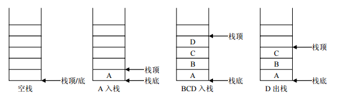

# 第九章-集合框架

## 内容框架

- Part1
  - Collection集合
  - 迭代器
  - 增强for
  - 泛型
- Part2
  - 数据结构
  - List集合
  - Set集合
  - Collections
- Part3
  - Map集合

# Part1：Collection、泛型

- [ ] 能够说出集合与数组的区别
- [ ] 说出Collection集合的常用功能
- [ ] 能够使用迭代器对集合进行取元素
- [ ] 能够说出集合的使用细节
- [ ] 能够使用集合存储自定义类型
- [ ] 能够使用foreach循环遍历集合
- [ ] 能够使用泛型定义集合对象
- [ ] 能够理解泛型上下限
- [ ] 能够阐述泛型通配符的作用


## 9.1 Collection集合

### 9.1.1 集合概述

**集合**：集合是java中提供的一种容器，可以用来存储多个数据。

集合和数组既然都是容器，它们有啥区别呢？

* 数组的长度是固定的。集合的长度是可变的。
* 数组中存储的是同一类型的元素，可以存储基本数据类型值。集合存储的都是对象。而且对象的类型可以不一致。在开发中一般当对象多的时候，使用集合进行存储。

### 9.1.2  集合框架

​	JavaSE提供了满足各种需求的API，在使用这些API前，先了解其继承与接口操作架构，才能了解何时采用哪个类，以及类之间如何彼此合作，从而达到灵活应用。

1.集合按照其存储结构可以分为两大类：

​	**单列集合** `java.util.Collection`

​	**双列集合** `java.util.Map`

2.整个集合类的继承体系。


### 9.1.3 Collection 常用功能

Collection 单列集合类的根接口，用于存储一系列符合某种规则的元素，它有两个重要的子接口，分别是`java.util.List`和`java.util.Set`。其中，`List`的特点是元素有序、元素可重复。`Set`的特点是元素无序，而且不可重复。`List`接口的主要实现类有`java.util.ArrayList`和`java.util.LinkedList`，`Set`接口的主要实现类有`java.util.HashSet`和`java.util.TreeSet`。

Collection中定义了单列集合(List和Set)通用的一些方法，这些方法可用于操作所有的单列集合。方法如下：

| public boolean add(E e)：         | **把给定的对象添加到当前集合中**     |
| --------------------------------- | ------------------------------------ |
| **public void clear() :**         | **清空集合中所有的元素**             |
| **public boolean remove(E e):**   | **把给定的对象在当前集合中删除**     |
| **public boolean contains(E e):** | **判断当前集合中是否包含给定的对象** |
| **public boolean isEmpty():**     | **判断当前集合是否为空**             |
| **public int size():**            | **返回集合中元素的个数**             |
| **public Object[] toArray():**    | **把集合中的元素，存储到数组中**     |

方法演示：

~~~java
import java.util.ArrayList;
import java.util.Collection;

public class Demo1Collection {
    public static void main(String[] args) {
		// 创建集合对象 
    	// 使用多态形式
    	Collection<String> coll = new ArrayList<String>();
    	// 使用方法
    	// 添加功能  boolean  add(String s)
    	coll.add("小李广");
    	coll.add("扫地僧");
    	coll.add("石破天");
    	System.out.println(coll);

    	// boolean contains(E e) 判断o是否在集合中存在
    	System.out.println("判断  扫地僧 是否在集合中"+coll.contains("扫地僧"));

    	//boolean remove(E e) 删除在集合中的o元素
    	System.out.println("删除石破天："+coll.remove("石破天"));
    	System.out.println("操作之后集合中元素:"+coll);
    	
    	// size() 集合中有几个元素
		System.out.println("集合中有"+coll.size()+"个元素");

		// Object[] toArray()转换成一个Object数组
    	Object[] objects = coll.toArray();
    	// 遍历数组
    	for (int i = 0; i < objects.length; i++) {
			System.out.println(objects[i]);
		}

		// void  clear() 清空集合
		coll.clear();
		System.out.println("集合中内容为："+coll);
		// boolean  isEmpty()  判断是否为空
		System.out.println(coll.isEmpty());  	
	}
}
~~~

> tips: 有关Collection中的方法可不止上面这些，其他方法可以自行查看API学习。

## 9.2 Iterator迭代器

### 9.2.1 Iterator接口

​		在程序开发中，经常需要遍历集合中的所有元素，针对这种需求，JDK专门提供了一个接口`java.util.Iterator`。`Iterator`接口也是Java集合中的一员，但它与`Collection`、`Map`接口有所不同，`Collection`接口与`Map`接口主要用于存储元素，而`Iterator`主要用于迭代访问（即遍历）`Collection`中的元素，因此`Iterator`对象也被称为迭代器。

​		想要遍历Collection集合，那么就要获取该集合迭代器完成迭代操作，下面介绍一下获取迭代器的方法：

- `		public Iterator iterator()`: 获取集合对应的迭代器，用来遍历集合中的元素的。

- **迭代**：

  ​	即Collection集合元素的通用获取方式，在取元素之前先要判断集合中有没有元素，如果有，就把这个元素取出来，继续在判断，如果还有就再取出出来，一直把集合中的所有元素全部取出，这种取出方式专业术语称为迭代。

Iterator接口的常用方法如下：

* `public E next()`:返回迭代的下一个元素。
* `public boolean hasNext()`:如果仍有元素可以迭代，则返回 true。

接下来我们通过案例学习如何使用Iterator迭代集合中元素：

~~~java
public class IteratorDemo {
  	public static void main(String[] args) {
        // 使用多态方式 创建对象
        Collection<String> coll = new ArrayList<String>();

        // 添加元素到集合
        coll.add("串串星人");
        coll.add("吐槽星人");
        coll.add("汪星人");
        //遍历
        //使用迭代器 遍历   每个集合对象都有自己的迭代器
        Iterator<String> it = coll.iterator();
        //  泛型指的是 迭代出 元素的数据类型
        while(it.hasNext()){ //判断是否有迭代元素
            String s = it.next();//获取迭代出的元素
            System.out.println(s);
        }
  	}
}
~~~

> tips:：在进行集合元素取出时，如果集合中已经没有元素了，还继续使用迭代器的next方法，将会发生java.util.NoSuchElementException没有集合元素的错误。

### 9.2.2 迭代器的实现原理

​		Iterator迭代器对象在遍历集合时，内部采用指针的方式来跟踪集合中的元素，为了让初学者能更好地理解迭代器的工作原理，接下来通过一个图例来演示Iterator对象迭代元素的过程：


​	在调用Iterator的next方法之前，迭代器的索引位于第一个元素之前，不指向任何元素

​	当第一次调用迭代器的next方法后，迭代器的索引会向后移动一位，指向第一个元素并将该元素返回

​	当再次调用next方法时，迭代器的索引会指向第二个元素并将该元素返回

​	依此类推，直到hasNext方法返回false，表示到达了集合的末尾，终止对元素的遍历。

### 9.2.3 增强for

​	增强for循环(也称for each循环)是**JDK1.5**以后出来的一个高级for循环，专门用来遍历数组和集合的。它的内部原理其实是个Iterator迭代器，所以在遍历的过程中，不能对集合中的元素进行增删操作。

~~~java
for(元素的数据类型  变量 : Collection集合or数组){ 
  	//写操作代码
}
~~~

它用于遍历Collection和数组。通常只进行遍历元素，不要在遍历的过程中对集合元素进行增删操作。

> tips: 新for循环必须有被遍历的目标。目标只能是Collection或者是数组。新式for仅仅作为遍历操作出现。

## 9.3 泛型

### 9.3.1  泛型概述

在前面学习集合时，我们都知道集合中是可以存放任意对象的，只要把对象存储集合后，那么这时他们都会被提升成Object类型。当我们在取出每一个对象，并且进行相应的操作，这时必须采用类型转换。

大家观察下面代码：

~~~java
public class GenericDemo {
	public static void main(String[] args) {
		Collection coll = new ArrayList();
		coll.add("abc");
		coll.add("itcast");
		coll.add(5);//由于集合没有做任何限定，任何类型都可以给其中存放
		Iterator it = coll.iterator();
		while(it.hasNext()){
			//需要打印每个字符串的长度,就要把迭代出来的对象转成String类型
			String str = (String) it.next();
			System.out.println(str.length());
		}
	}
}
~~~

程序在运行时发生了问题**java.lang.ClassCastException**。                                                                                             为什么会发生类型转换异常呢？                                                                                                                                       我们来分析下：由于集合中什么类型的元素都可以存储。导致取出时强转引发运行时 ClassCastException。                                                                                                                                                       怎么来解决这个问题呢？                                                                                                                                                           Collection虽然可以存储各种对象，但实际上通常Collection只存储同一类型对象。例如都是存储字符串对象。因此在JDK5之后，新增了**泛型**(**Generic**)语法，让你在设计API时可以指定类或方法支持泛型，这样我们使用API的时候也变得更为简洁，并得到了编译时期的语法检查。

* **泛型**：可以在类或方法中预支地使用未知的类型。

> tips:一般在创建对象时，将未知的类型确定具体的类型。当没有指定泛型时，默认类型为Object类型。

### 9.3.2  使用泛型的好处

上一节只是讲解了泛型的引入，那么泛型带来了哪些好处呢？

* 将运行时期的ClassCastException，转移到了编译时期变成了编译失败。
* 避免了类型强转的麻烦。

通过我们如下代码体验一下：

~~~java
public class GenericDemo2 {
	public static void main(String[] args) {
        Collection<String> list = new ArrayList<String>();
        list.add("abc");
        list.add("itcast");
        // list.add(5);//当集合明确类型后，存放类型不一致就会编译报错
        // 集合已经明确具体存放的元素类型，那么在使用迭代器的时候，迭代器也同样会知道具体遍历元素类型
        Iterator<String> it = list.iterator();
        while(it.hasNext()){
            String str = it.next();
            //当使用Iterator<String>控制元素类型后，就不需要强转了。获取到的元素直接就是String类型
            System.out.println(str.length());
        }
	}
}
~~~

> tips:泛型是数据类型的一部分，我们将类名与泛型合并一起看做数据类型。

### 9.3.3  泛型的定义与使用

我们在集合中会大量使用到泛型，这里来完整地学习泛型知识。

泛型，用来灵活地将数据类型应用到不同的类、方法、接口当中。将数据类型作为参数进行传递。

#### 1.定义和使用含有泛型的类

定义格式：

~~~
修饰符 class 类名<代表泛型的变量> {  }
~~~

例如，API中的ArrayList集合：

~~~java
class ArrayList<E>{ 
    public boolean add(E e){ }

    public E get(int index){ }
   	....
}
~~~

使用泛型： 即什么时候确定泛型。

##### 在创建对象的时候确定泛型

 例如，`ArrayList<String> list = new ArrayList<String>();`

此时，变量E的值就是String类型,那么我们的类型就可以理解为：

~~~java 
class ArrayList<String>{ 
     public boolean add(String e){ }

     public String get(int index){  }
     ...
}
~~~

再例如，`ArrayList<Integer> list = new ArrayList<Integer>();`

此时，变量E的值就是Integer类型,那么我们的类型就可以理解为：

~~~java
class ArrayList<Integer> { 
     public boolean add(Integer e) { }

     public Integer get(int index) {  }
     ...
}
~~~

举例自定义泛型类

~~~java
public class MyGenericClass<MVP> {
	//没有MVP类型，在这里代表 未知的一种数据类型 未来传递什么就是什么类型
	private MVP mvp;
     
    public void setMVP(MVP mvp) {
        this.mvp = mvp;
    }
     
    public MVP getMVP() {
        return mvp;
    }
}
~~~

使用:

~~~java
public class GenericClassDemo {
  	public static void main(String[] args) {		 
         // 创建一个泛型为String的类
         MyGenericClass<String> my = new MyGenericClass<String>();    	
         // 调用setMVP
         my.setMVP("大胡子登登");
         // 调用getMVP
         String mvp = my.getMVP();
         System.out.println(mvp);
         //创建一个泛型为Integer的类
         MyGenericClass<Integer> my2 = new MyGenericClass<Integer>(); 
         my2.setMVP(123);   	  
         Integer mvp2 = my2.getMVP();
    }
}
~~~

####  2.含有泛型的方法

定义格式：

~~~
修饰符 <代表泛型的变量> 返回值类型 方法名(参数){  }
~~~

例如，

~~~java
public class MyGenericMethod {	  
    public <MVP> void show(MVP mvp) {
    	System.out.println(mvp.getClass());
    }
    
    public <MVP> MVP show2(MVP mvp) {	
    	return mvp;
    }
}
~~~

使用格式：**调用方法时，确定泛型的类型**

~~~java
public class GenericMethodDemo {
    public static void main(String[] args) {
        // 创建对象
        MyGenericMethod mm = new MyGenericMethod();
        // 演示看方法提示
        mm.show("aaa");
        mm.show(123);
        mm.show(12.45);
    }
}
~~~

#### 3.含有泛型的接口

定义格式：

~~~
修饰符 interface接口名<代表泛型的变量> {  }
~~~

例如，

~~~java
public interface MyGenericInterface<E>{
	public abstract void add(E e);
	
	public abstract E getE();  
}
~~~

使用格式：

##### **1、定义类时确定泛型的类型**

例如

~~~java
public class MyImp1 implements MyGenericInterface<String> {
	@Override
    public void add(String e) {
        // 省略...
    }

	@Override
	public String getE() {
		return null;
	}
}
~~~

此时，泛型E的值就是String类型。

#####  **2、始终不确定泛型的类型，直到创建对象时，确定泛型的类型**

 例如

~~~java
public class MyImp2<E> implements MyGenericInterface<E> {
	@Override
	public void add(E e) {
       	 // 省略...
	}

	@Override
	public E getE() {
		return null;
	}
}
~~~

确定泛型：

~~~java
/*
 * 使用
 */
public class GenericInterface {
    public static void main(String[] args) {
        MyImp2<String>  my = new MyImp2<String>();  
        my.add("aa");
    }
}
~~~

### 9.3.4  泛型通配符

当使用泛型类或者接口时，传递的数据中，泛型类型不确定，可以通过通配符<?>表示。但是一旦使用泛型的通配符后，只能使用Object类中的共性方法，集合中元素自身方法无法使用。

#### 1.通配符基本使用

泛型的通配符:**不知道使用什么类型来接收的时候,此时可以使用?,?表示未知通配符。**

此时只能接受数据,不能往该集合中存储数据。

举个例子大家理解使用即可：

~~~java
public static void main(String[] args) {
    Collection<Intger> list1 = new ArrayList<Integer>();
    getElement(list1);
    Collection<String> list2 = new ArrayList<String>();
    getElement(list2);
}
public static void getElement(Collection<?> coll){}
//？代表可以接收任意类型
~~~

> tips:泛型不存在继承关系 Collection<Object> list = new ArrayList<String>();这种是错误的。

#### 2.通配符高级使用----受限泛型

之前设置泛型的时候，实际上是可以任意设置的，只要是类就可以设置。但是在JAVA的泛型中可以指定一个泛型的**上限**和**下限**。

**泛型的上限**：

* **格式**： `类型名称 <? extends 类 > 对象名称`
* **意义**： `只能接收该类型及其子类`

**泛型的下限**：

- **格式**： `类型名称 <? super 类 > 对象名称`
- **意义**： `只能接收该类型及其父类型`

比如：现已知Object类，String 类，Number类，Integer类，其中Number是Integer的父类

~~~java
public static void main(String[] args) {
    Collection<Integer> list1 = new ArrayList<Integer>();
    Collection<String> list2 = new ArrayList<String>();
    Collection<Number> list3 = new ArrayList<Number>();
    Collection<Object> list4 = new ArrayList<Object>();
    
    getElement(list1);
    getElement(list2);//报错
    getElement(list3);
    getElement(list4);//报错
  
    getElement2(list1);//报错
    getElement2(list2);//报错
    getElement2(list3);
    getElement2(list4);
  
}
// 泛型的上限：此时的泛型?，必须是Number类型或者Number类型的子类
public static void getElement1(Collection<? extends Number> coll){}
// 泛型的下限：此时的泛型?，必须是Number类型或者Number类型的父类
public static void getElement2(Collection<? super Number> coll){}
~~~

## 9.4 集合综合案例-斗地主

### 9.4.1 案例介绍

按照斗地主的规则，完成洗牌发牌的动作。
具体规则：

使用54张牌打乱顺序,三个玩家参与游戏，三人交替摸牌，每人17张牌，最后三张留作底牌。

### 9.4.2 案例分析

* 准备牌：

  牌可以设计为一个ArrayList<String>,每个字符串为一张牌。
  每张牌由花色数字两部分组成，我们可以使用花色集合与数字集合嵌套迭代完成每张牌的组装。
  牌由Collections类的shuffle方法进行随机排序。

* 发牌

  将每个人以及底牌设计为ArrayList<String>,将最后3张牌直接存放于底牌，剩余牌通过对3取模依次发牌。


* 看牌

  直接打印每个集合。

### 9.4.3 代码实现

~~~java
import java.util.ArrayList;
import java.util.Collections;

public class Poker {
    public static void main(String[] args) {
        /*
        * 1: 准备牌操作
        */
        //1.1 创建牌盒 将来存储牌面的 
        ArrayList<String> pokerBox = new ArrayList<String>();
        //1.2 创建花色集合
        ArrayList<String> colors = new ArrayList<String>();

        //1.3 创建数字集合
        ArrayList<String> numbers = new ArrayList<String>();

        //1.4 分别给花色 以及 数字集合添加元素
        colors.add("♥");
        colors.add("♦");
        colors.add("♠");
        colors.add("♣");

        for(int i = 2;i<=10;i++){
            numbers.add(i+"");
        }
        numbers.add("J");
        numbers.add("Q");
        numbers.add("K");
        numbers.add("A");
        //1.5 创造牌  拼接牌操作
        // 拿出每一个花色  然后跟每一个数字 进行结合  存储到牌盒中
        for (String color : colors) {
            //color每一个花色 
            //遍历数字集合
            for(String number : numbers){
                //结合
                String card = color+number;
                //存储到牌盒中
                pokerBox.add(card);
            }
        }
        //1.6大王小王
        pokerBox.add("小☺");
        pokerBox.add("大☠");	  
        // System.out.println(pokerBox);
        //洗牌 是不是就是将  牌盒中 牌的索引打乱 
        // Collections类  工具类  都是 静态方法
        // shuffer方法   
        /*
         * static void shuffle(List<?> list) 
         *     使用默认随机源对指定列表进行置换。 
         */
        //2:洗牌
        Collections.shuffle(pokerBox);
        //3 发牌
        //3.1 创建 三个 玩家集合  创建一个底牌集合
        ArrayList<String> player1 = new ArrayList<String>();
        ArrayList<String> player2 = new ArrayList<String>();
        ArrayList<String> player3 = new ArrayList<String>();
        ArrayList<String> dipai = new ArrayList<String>();	  

        //遍历 牌盒  必须知道索引   
        for(int i = 0;i<pokerBox.size();i++){
            //获取 牌面
            String card = pokerBox.get(i);
            //留出三张底牌 存到 底牌集合中
            if(i>=51){//存到底牌集合中
                dipai.add(card);
            } else {
                //玩家1   %3  ==0
                if(i%3==0){
                  	player1.add(card);
                }else if(i%3==1){//玩家2
                  	player2.add(card);
                }else{//玩家3
                  	player3.add(card);
                }
            }
        }
        //看看
        System.out.println("令狐冲："+player1);
        System.out.println("田伯光："+player2);
        System.out.println("绿竹翁："+player3);
        System.out.println("底牌："+dipai);  
	}
}
~~~


# Part2：List、Set、数据结构、Collections

- [ ] 能够说出List集合特点
- [ ] 能够说出常见的数据结构
- [ ] 能够说出数组结构特点
- [ ] 能够说出栈结构特点
- [ ] 能够说出队列结构特点
- [ ] 能够说出单向链表结构特点
- [ ] 能够说出Set集合的特点
- [ ] 能够说出哈希表的特点
- [ ] 使用HashSet集合存储自定义元素
- [ ] 能够说出可变参数的格式
- [ ] 能够使用集合工具类
- [ ] 能够使用Comparator比较器进行排序

## 9.5 数据结构

### 9.5.1 数据结构有什么用？

​		当你用着java里面的容器类很爽的时候，你有没有想过，怎么ArrayList就像一个无限扩充的数组，也好像链表之类的。好用吗？好用，这就是数据结构的用处，只不过你在不知不觉中使用了。

​		现实世界的存储，我们使用的工具和建模。每种数据结构有自己的优点和缺点，想想如果Google的数据用的是数组的存储，我们还能方便地查询到所需要的数据吗？而算法，在这么多的数据中如何做到最快的插入，查找，删除，也是在追求更快。

​		我们java是面向对象的语言，就好似自动档轿车，C语言好似手动档吉普。数据结构呢？是变速箱的工作原理。你完全可以不知道变速箱怎样工作，就把自动档的车子从 A点 开到 B点，而且未必就比懂得的人慢。写程序这件事，和开车一样，经验可以起到很大作用，但如果你不知道底层是怎么工作的，就永远只能开车，既不会修车，也不能造车。当然了，数据结构内容比较多，细细的学起来也是相对费功夫的，不可能达到一蹴而就。我们将常见的数据结构：堆栈、队列、数组、链表和红黑树 这几种给大家介绍一下，作为数据结构的入门，了解一下它们的特点即可。


### 9.5.2 常见的数据结构

数据存储的常用结构有：栈、队列、数组、链表和红黑树。我们分别来了解一下：

#### 栈

* **栈**：**stack**,又称堆栈，它是运算受限的线性表，其限制是仅允许在标的一端进行插入和删除操作，不允许在其他任何位置进行添加、查找、删除等操作。

简单的说：采用该结构的集合，对元素的存取有如下的特点

* 先进后出（即，存进去的元素，要在后它后面的元素依次取出后，才能取出该元素）。例如，子弹压进弹夹，先压进去的子弹在下面，后压进去的子弹在上面，当开枪时，先弹出上面的子弹，然后才能弹出下面的子弹。

* 栈的入口、出口的都是栈的顶端位置。

  

这里两个名词需要注意：

* **压栈**：就是存元素。即，把元素存储到栈的顶端位置，栈中已有元素依次向栈底方向移动一个位置。
* **弹栈**：就是取元素。即，把栈的顶端位置元素取出，栈中已有元素依次向栈顶方向移动一个位置。


#### 队列

* **队列**：**queue**,简称队，它同堆栈一样，也是一种运算受限的线性表，其限制是仅允许在表的一端进行插入，而在表的另一端进行删除。

简单的说，采用该结构的集合，对元素的存取有如下的特点：

* 先进先出（即，存进去的元素，要在后它前面的元素依次取出后，才能取出该元素）。例如，小火车过山洞，车头先进去，车尾后进去；车头先出来，车尾后出来。
* 队列的入口、出口各占一侧。例如，下图中的左侧为入口，右侧为出口。


#### 数组

* **数组**:**Array**,是有序的元素序列，数组是在内存中开辟一段连续的空间，并在此空间存放元素。就像是一排出租屋，有100个房间，从001到100每个房间都有固定编号，通过编号就可以快速找到租房子的人。

简单的说,采用该结构的集合，对元素的存取有如下的特点：

* 查找元素快：通过索引，可以快速访问指定位置的元素

  

* 增删元素慢

  * **指定索引位置增加元素**：需要创建一个新数组，将指定新元素存储在指定索引位置，再把原数组元素根据索引，复制到新数组对应索引的位置。如下图
  * **指定索引位置删除元素：**需要创建一个新数组，把原数组元素根据索引，复制到新数组对应索引的位置，原数组中指定索引位置元素不复制到新数组中。如下图


####  链表

* **链表**:**linked list**,由一系列结点node（链表中每一个元素称为结点）组成，结点可以在运行时i动态生成。每个结点包括两个部分：一个是存储数据元素的数据域，另一个是存储下一个结点地址的指针域。我们常说的链表结构有单向链表与双向链表，那么这里给大家介绍的是**单向链表**。

  

简单的说，采用该结构的集合，对元素的存取有如下的特点：

* 多个结点之间，通过地址进行连接。例如，多个人手拉手，每个人使用自己的右手拉住下个人的左手，依次类推，这样多个人就连在一起了。

  

* 查找元素慢：想查找某个元素，需要通过连接的节点，依次向后查找指定元素

* 增删元素快：

  * 增加元素：只需要修改连接下个元素的地址即可。

    

  * 删除元素：只需要修改连接下个元素的地址即可。

    

#### 红黑树

* **二叉树**：**binary tree** ,是每个结点不超过2的有序**树（tree）** 。

简单的理解，就是一种类似于我们生活中树的结构，只不过每个结点上都最多只能有两个子结点。

二叉树是每个节点最多有两个子树的树结构。顶上的叫根结点，两边被称作“左子树”和“右子树”。

如图：


我们要说的是二叉树的一种比较有意思的叫做**红黑树**，红黑树本身就是一颗二叉查找树，将节点插入后，该树仍然是一颗二叉查找树。也就意味着，树的键值仍然是有序的。

红黑树的约束:

1. 节点可以是红色的或者黑色的


2. 根节点是黑色的


3. 叶子节点(特指空节点)是黑色的
4. 每个红色节点的子节点都是黑色的
5. 任何一个节点到其每一个叶子节点的所有路径上黑色节点数相同

**红黑树的特点**:

​	速度特别快,趋近平衡树,查找叶子元素最少和最多次数不多于二倍


## 9.6 List

​		我们掌握了Collection接口的使用后，再来看看Collection接口中的子类，他们都具备那些特性呢？

接下来，我们一起学习Collection中的常用几个子类（`java.util.List`集合、`java.util.Set`集合）

### 9.6.1 List接口介绍

`		java.util.List`接口继承自`Collection`接口，是单列集合的一个重要分支，习惯性地会将实现了`List`接口的对象称为List集合。在List集合中允许出现重复的元素，所有的元素是以一种线性方式进行存储的，在程序中可以通过索引来访问集合中的指定元素。另外，List集合还有一个特点就是元素有序，即元素的存入顺序和取出顺序一致。

看完API，我们总结一下：

List接口特点：

1. 它是一个元素存取有序的集合
2. 它是一个带有索引的集合，通过索引就可以精确的操作集合中的元素（与数组的索引是一个道理）。
3. 集合中可以有重复的元素，通过元素的equals方法，来比较是否为重复的元素。

> tips:我们在基础班的时候已经学习过List接口的子类java.util.ArrayList类，该类中的方法都是来自List中定义。

### 9.6.2 List接口中常用方法

​		List作为Collection集合的子接口，不但继承了Collection接口中的全部方法，而且还增加了一些根据元素索引来操作集合的特有方法，如下：

- `public void add(int index, E element)`: 将指定的元素，添加到该集合中的指定位置上。
- `public E get(int index)`:返回集合中指定位置的元素。
- `public E remove(int index)`: 移除列表中指定位置的元素, 返回的是被移除的元素。
- `public E set(int index, E element)`:用指定元素替换集合中指定位置的元素,返回值的更新前的元素。


List集合特有的方法都是跟索引相关，我们在基础班都学习过，那么我们再来复习一遍吧：

```java
public class ListDemo {
    public static void main(String[] args) {
		// 创建List集合对象
    	List<String> list = new ArrayList<String>();
    	
    	// 往 尾部添加 指定元素
    	list.add("图图");
    	list.add("小美");
    	list.add("不高兴");
    	
    	System.out.println(list);
    	// add(int index,String s) 往指定位置添加
    	list.add(1,"没头脑");
    	
    	System.out.println(list);
    	// String remove(int index) 删除指定位置元素  返回被删除元素
    	// 删除索引位置为2的元素 
    	System.out.println("删除索引位置为2的元素");
    	System.out.println(list.remove(2));
    	
    	System.out.println(list);
    	
    	// String set(int index,String s)
    	// 在指定位置 进行 元素替代（改） 
    	// 修改指定位置元素
    	list.set(0, "三毛");
    	System.out.println(list);
    	
    	// String get(int index)  获取指定位置元素
    	
    	// 跟size() 方法一起用  来 遍历的 
    	for(int i = 0;i<list.size();i++){
    		System.out.println(list.get(i));
    	}
    	//还可以使用增强for
    	for (String string : list) {
			System.out.println(string);
		}  	
	}
}
```

### 9.6.3 List的子类

#### 9.6.3.1 ArrayList集合

​	`java.util.ArrayList`集合数据存储的结构是数组结构。**元素增删慢（消耗cpu性能），查找快，比较浪费内存**，由于日常开发中使用最多的功能为查询数据、遍历数据，所以`ArrayList`是**最常用的集合**。

​	许多程序员开发时非常**随意地使用ArrayList完成任何需求，并不严谨**，这种用法是不提倡的。

#### 9.6.3.2 LinkedList集合

`java.util.LinkedList`集合数据存储的结构是链表结构。**方便元素添加、删除**的集合。

> LinkedList是一个双向链表，那么双向链表是什么样子的呢，我们用个图了解下


实际开发中对一个集合元素的添加与删除经常**涉及到首尾**操作，而LinkedList提供了大量首尾操作的方法。

这些方法我们作为了解即可：

* `public void addFirst(E e)`:将指定元素插入此列表的开头。
* `public void addLast(E e)`:将指定元素添加到此列表的结尾。
* `public E getFirst()`:返回此列表的第一个元素。
* `public E getLast()`:返回此列表的最后一个元素。
* `public E removeFirst()`:移除并返回此列表的第一个元素。
* `public E removeLast()`:移除并返回此列表的最后一个元素。
* `public E pop()`:从此列表所表示的堆栈处弹出一个元素。
* `public void push(E e)`:将元素推入此列表所表示的堆栈。
* `public boolean isEmpty()`：如果列表不包含元素，则返回true。

LinkedList是List的子类，List中的方法LinkedList都是可以使用，这里就不做详细介绍，我们只需要了解LinkedList的特有方法即可。在开发时，LinkedList集合也可以作为堆栈，队列的结构使用。（了解即可）

方法演示：

~~~java
public class LinkedListDemo {
    public static void main(String[] args) {
        LinkedList<String> link = new LinkedList<String>();
        //添加元素
        link.addFirst("abc1");
        link.addFirst("abc2");
        link.addFirst("abc3");
        System.out.println(link);
        // 获取元素
        System.out.println(link.getFirst());
        System.out.println(link.getLast());
        // 删除元素
        System.out.println(link.removeFirst());
        System.out.println(link.removeLast());

        while (!link.isEmpty()) { //判断集合是否为空
            System.out.println(link.pop()); //弹出集合中的栈顶元素
        }

        System.out.println(link);
    }
}
~~~

## 9.7 Set

### 9.7.1 HashSet集合介绍

`java.util.HashSet`是`Set`接口的一个实现类，它所存储的元素是不可重复的，并且元素都是无序的(即存取顺序不一致)。`java.util.HashSet`底层的实现其实是一个`java.util.HashMap`支持，由于我们暂时还未学习，先做了解。

**1.`HashSet`是根据对象的哈希值来确定元素在集合中的存储位置，因此具有良好的存取和查找性能。**

**2.保证元素唯一性的方式依赖于：`hashCode`与`equals`方法。**

3.集合中不能存储重复元素：

### 9.7.2  HashSet底层实现HashMap-- 及其重要

#### HashMap的结构，JDK7与JDK8有哪些区别：

- 浅显理解：https://blog.csdn.net/changhangshi/article/details/82114727
- 深入理解(高级工程师)：https://blog.csdn.net/qq_36520235/article/details/82417949

在**JDK1.8**之前，哈希表底层采用数组+链表实现，即使用链表处理冲突，同一hash值的链表都存储在一个链表里。但是当位于一个桶中的元素较多，即hash值相等的元素较多时，通过key值依次查找的效率较低。

而JDK1.8中，哈希表存储采用数组+链表+红黑树实现，当链表长度超过阈值（默认8）时，将链表转换为红黑树，这样大大减少了查找时间。

#### 1.重要概念：

哈希表：查询速度快

哈希值 hashcode：逻辑地址，系统随机给

#### 2.原理剖析：

- Java中的HashSet去重操作
  
  - 添加值add()通过hashcode、equals()字符串比较，确定存储对象的桶位置(hash表位置)→**先比较hashcode->冲突再比较字符串equals()**，若字符串同则认定重复
- HashMap实现原理：
  
- 不同对象相同hashcode处理方法：由于不同对象可能有相同hash值(数据结构中的hash冲突)、把相同hashcode的对象通过拉链法拉到一起，(1.8之前是链表+数组、1.8之后是链表+数组+红黑树(拉链长度超过8，则用红黑树))->从而确定对象的桶的唯一位置。
  
- 数据结构剖析：	

  ​	简单的来说，哈希表是由数组+链表+红黑树（JDK1.8增加了红黑树部分）实现的，如下图所示。

​		

​				结合一个存储流程图来说明一下：		

​		**JDK1.8**引入红黑树大程度优化了HashMap的性能，那么对于我们来讲保证HashSet集合元素的唯一，其实就是根据对象的hashCode和equals方法来决定的。如果我们往集合中存放自定义的对象，那么保证其唯一，就必须复写hashCode和equals方法建立属于当前对象的比较方式。

### 9.7.3  HashSet存储自定义类型元素

给HashSet中存放自定义类型元素时，需要重写对象中的hashCode和equals方法，建立自己的比较方式，才能保证HashSet集合中的对象唯一

创建自定义Student类

~~~java
public class Student {
    private String name;
    private int age;

    public Student() {
    }

    public Student(String name, int age) {
        this.name = name;
        this.age = age;
    }

    public String getName() {
        return name;
    }

    public void setName(String name) {
        this.name = name;
    }

    public int getAge() {
        return age;
    }

    public void setAge(int age) {
        this.age = age;
    }

    @Override
    public boolean equals(Object o) {
        if (this == o)
            return true;
        if (o == null || getClass() != o.getClass())
            return false;
        Student student = (Student) o;
        return age == student.age &&
               Objects.equals(name, student.name);
    }

    @Override
    public int hashCode() {
        return Objects.hash(name, age);
    }
}
~~~

~~~java
public class HashSetDemo2 {
    public static void main(String[] args) {
        //创建集合对象   该集合中存储 Student类型对象
        HashSet<Student> stuSet = new HashSet<Student>();
        //存储 
        Student stu = new Student("于谦", 43);
        stuSet.add(stu);
        stuSet.add(new Student("郭德纲", 44));
        stuSet.add(new Student("于谦", 43));
        stuSet.add(new Student("郭麒麟", 23));
        stuSet.add(stu);

        for (Student stu2 : stuSet) {
            System.out.println(stu2);
        }
    }
}
执行结果：
Student [name=郭德纲, age=44]
Student [name=于谦, age=43]
Student [name=郭麒麟, age=23]
~~~

### 9.7.3 LinkedHashSet

我们知道HashSet保证元素唯一，可是元素存放进去是没有顺序的，那么我们要**保证有序**，怎么办呢？

在HashSet下面有一个子类`java.util.LinkedHashSet`，它是链表和哈希表组合的一个数据存储结构。

演示代码如下:

~~~java
public class LinkedHashSetDemo {
	public static void main(String[] args) {
		Set<String> set = new LinkedHashSet<String>();
		set.add("bbb");
		set.add("aaa");
		set.add("abc");
		set.add("bbc");
        Iterator<String> it = set.iterator();
		while (it.hasNext()) {
			System.out.println(it.next());
		}
	}
}
结果：
  bbb
  aaa
  abc
  bbc
~~~

### 9.7.4 TreeSet

**TreeSet特性**

- TreeSet是一个有序的集合，它的作用是提供有序的Set集合。
- 它继承了AbstractSet抽象类，实现了NavigableSet<E>，Cloneable，Serializable接口。
- TreeSet是基于TreeMap实现的，TreeSet的元素支持2种排序方式：自然排序或者根据提供的Comparator进行排序。
- TreeSet中含有一个"NavigableMap类型的成员变量"m，而m实际上是"TreeMap的实例"。

**TreeSet代码实现**

```java
public static void demoOne() {
        TreeSet<Person> ts = new TreeSet<>();
        ts.add(new Person("张三", 11));
        ts.add(new Person("李四", 12));
        ts.add(new Person("王五", 15));
        ts.add(new Person("赵六", 21));
        
        System.out.println(ts);
    }

```

执行结果：会抛出一个异常：`java.lang.ClassCastException`
显然是出现了类型转换异常。原因在于我们需要告诉TreeSet如何来进行比较元素，如果不指定，就会抛出这个异常

如何解决：
如何指定比较的规则，需要在自定义类(Person)中实现`Comparable`接口，并重写接口中的compareTo方法

```java
public class Person implements Comparable<Person> {
    private String name;
    private int age;
    ...
    public int compareTo(Person o) {
        return 0;                //当compareTo方法返回0的时候集合中只有一个元素
        return 1;                //当compareTo方法返回正数的时候集合会怎么存就怎么取
        return -1;                //当compareTo方法返回负数的时候集合会倒序存储
    }
}
/*
如果将`compareTo()`返回值写死为0，元素值每次比较，都认为是相同的元素，这时就不再向TreeSet中插入除第一个外的新元素。所以TreeSet中就只存在插入的第一个元素。

如果将`compareTo()`返回值写死为1，元素值每次比较，都认为新插入的元素比上一个元素大，于是二叉树存储时，会存在根的右侧，读取时就是正序排列的。

如果将`compareTo()`返回值写死为-1，元素值每次比较，都认为新插入的元素比上一个元素小，于是二叉树存储时，会存在根的左侧，读取时就是倒序序排列的。
*/
```

需求：现在要制定TreeSet中按照String长度比较String

```java
//定义一个类，实现Comparator接口，并重写compare()方法，
class CompareByLength implements Comparator<String> {

    @Override
    public int compare(String s1, String s2) {        //按照字符串的长度比较
        int num = s1.length() - s2.length();        //长度为主要条件
        return num == 0 ? s1.compareTo(s2) : num;    //内容为次要条件
    }
}
 public static void demoTwo() {

        //需求:将字符串按照长度排序
        TreeSet<String> ts = new TreeSet<>(new CompareByLen());        
   			//Comparator c = new CompareByLen();
        ts.add("aaaaaaaa");
        ts.add("z");
        ts.add("wc");
        ts.add("nba");
        ts.add("cba");
        
        System.out.println(ts);
    }

```

源码分析及其他见：https://www.jianshu.com/p/12f4dbdbc652

### 9.7.5 HashSet、LinkedHashSet、TreeSet比较

**HashSet**

- 不能保证元素的排列顺序，顺序有可能发生变化

- 不是同步的

- 集合元素可以是null,但只能放入一个null

- 说明：

  ​	当向HashSet结合中存入一个元素时，HashSet会调用该对象的hashCode()方法来得到该对象的hashCode值，然后根据 hashCode值来决定该对象在HashSet中存储位置。
  ​	简单的说，HashSet集合判断两个元素相等的标准是两个对象通过equals方法比较相等，并且两个对象的hashCode()方法返回值相等

  > 注意，如果要把一个对象放入HashSet中，重写该对象对应类的equals方法，也应该重写其hashCode()方法。其规则是如果两个对象通过equals方法比较返回true时，其hashCode也应该相同。另外，对象中用作equals比较标准的属性，都应该用来计算 hashCode的值。

**LinkedHashSet**

- LinkedHashSet集合同样是根据元素的hashCode值来决定元素的存储位置，但是它同时使用链表维护元素的次序。
- 这样使得元素看起来像是以插入顺序保存的，也就是说，当遍历该集合时候，LinkedHashSet将会以元素的添加顺序访问集合的元素。
- LinkedHashSet在**迭代访问**Set中的全部元素时，性能比HashSet好，但是**插入时性能稍微逊色**于HashSet。

**TreeSet类**

- TreeSet是SortedSet接口的唯一实现类，TreeSet可以确保集合元素处于排序状态。
- TreeSet支持两种排序方式，自然排序 和定制排序，其中自然排序为默认的排序方式。
- 向TreeSet中加入的应该是同一个类的对象。
- TreeSet判断两个对象不相等的方式是两个对象通过equals方法返回false，或者通过CompareTo方法比较没有返回0

## 9.8 Collections

### 9.8.1 常用功能

* `java.utils.Collections`是集合工具类，用来对集合进行操作。部分方法如下：

- `public static <T> boolean addAll(Collection<T> c, T... elements)  `:往集合中添加一些元素。
- `public static void shuffle(List<?> list) 打乱顺序`:打乱集合顺序。
- `public static <T> void sort(List<T> list)`:将集合中元素按照默认规则排序。
- `public static <T> void sort(List<T> list，Comparator<? super T> )`:将集合中元素按照指定规则排序。

代码演示：

```java
public class CollectionsDemo {
    public static void main(String[] args) {
        ArrayList<Integer> list = new ArrayList<Integer>();
        //原来写法
        //list.add(12);
        //list.add(14);
        //list.add(15);
        //list.add(1000);
        //采用工具类 完成 往集合中添加元素  
        Collections.addAll(list, 5, 222, 1，2);
        System.out.println(list);
        //排序方法 
        Collections.sort(list);
        System.out.println(list);
    }
}
结果：
[5, 222, 1, 2]
[1, 2, 5, 222]
```

代码演示之后 ，发现我们的集合按照顺序进行了排列，可是这样的顺序是采用默认的顺序，如果想要指定顺序那该怎么办呢？

我们发现还有个方法没有讲，`public static <T> void sort(List<T> list，Comparator<? super T> )`:将集合中元素按照指定规则排序。接下来讲解一下指定规则的排列。

### 9.8.2 Comparator比较器

我们还是先研究这个方法

`public static <T> void sort(List<T> list)`:将集合中元素按照默认规则排序。

不过这次存储的是字符串类型。

```java
public class CollectionsDemo2 {
    public static void main(String[] args) {
        ArrayList<String>  list = new ArrayList<String>();
        list.add("cba");
        list.add("aba");
        list.add("sba");
        list.add("nba");
        //排序方法
        Collections.sort(list);
        System.out.println(list);
    }
}
```

结果：

```
[aba, cba, nba, sba]
```

我们使用的是默认的规则完成字符串的排序，那么默认规则是怎么定义出来的呢？

说到排序了，简单的说就是两个对象之间比较大小，那么在JAVA中提供了两种比较实现的方式，一种是比较死板的采用`java.lang.Comparable`接口去实现，一种是灵活的当我需要做排序的时候在去选择的`java.util.Comparator`接口完成。

那么我们采用的`public static <T> void sort(List<T> list)`这个方法完成的排序，实际上要求了被排序的类型需要实现Comparable接口完成比较的功能，在String类型上如下：

```java
public final class String implements java.io.Serializable, Comparable<String>, CharSequence {
```

String类实现了这个接口，并完成了比较规则的定义，但是这样就把这种规则写死了，那比如我想要字符串按照第一个字符降序排列，那么这样就要修改String的源代码，这是不可能的了，那么这个时候我们可以使用

`public static <T> void sort(List<T> list，Comparator<? super T> )`方法灵活的完成，这个里面就涉及到了Comparator这个接口，位于位于java.util包下，排序是comparator能实现的功能之一,该接口代表一个比较器，比较器具有可比性！顾名思义就是做排序的，通俗地讲需要比较两个对象谁排在前谁排在后，那么比较的方法就是：

* ` public int compare(String o1, String o2)`：比较其两个参数的顺序。

  > 两个对象比较的结果有三种：大于，等于，小于。
  >
  > 如果要按照升序排序，
  > 则o1 小于o2，返回（负数），相等返回0，01大于02返回（正数）
  > 如果要按照降序排序
  > 则o1 小于o2，返回（正数），相等返回0，01大于02返回（负数）

操作如下:

```java
public class CollectionsDemo3 {
    public static void main(String[] args) {
        ArrayList<String> list = new ArrayList<String>();
        list.add("cba");
        list.add("aba");
        list.add("sba");
        list.add("nba");
        //排序方法  按照第一个单词的降序
        Collections.sort(list, new Comparator<String>() {
            @Override
            public int compare(String o1, String o2) {
                return o2.charAt(0) - o1.charAt(0);
            }
        });
        System.out.println(list);
    }
}
```

结果如下：

```
[sba, nba, cba, aba]
```

### **9.8.3** 简述Comparable和Comparator两个接口的区别。

**Comparable**：强行对实现它的每个类的对象进行整体排序。这种排序被称为类的自然排序，类的compareTo方法被称为它的自然比较方法。只能在类中实现compareTo()一次，不能经常修改类的代码实现自己想要的排序。实现此接口的对象列表（和数组）可以通过Collections.sort（和Arrays.sort）进行自动排序，对象可以用作有序映射中的键或有序集合中的元素，无需指定比较器。

**Comparator**强行对某个对象进行整体排序。可以将Comparator 传递给sort方法（如Collections.sort或 Arrays.sort），从而允许在排序顺序上实现精确控制。还可以使用Comparator来控制某些数据结构（如有序set或有序映射）的顺序，或者为那些没有自然顺序的对象collection提供排序。

### 9.8.4  练习

创建一个学生类，存储到ArrayList集合中完成指定排序操作。

Student 初始类

~~~java
public class Student{
    private String name;
    private int age;

    public Student() {
    }

    public Student(String name, int age) {
        this.name = name;
        this.age = age;
    }

    public String getName() {
        return name;
    }

    public void setName(String name) {
        this.name = name;
    }

    public int getAge() {
        return age;
    }

    public void setAge(int age) {
        this.age = age;
    }

    @Override
    public String toString() {
        return "Student{" +
               "name='" + name + '\'' +
               ", age=" + age +
               '}';
    }
}
~~~

测试类：

~~~java
public class Demo {

    public static void main(String[] args) {
        // 创建四个学生对象 存储到集合中
        ArrayList<Student> list = new ArrayList<Student>();

        list.add(new Student("rose",18));
        list.add(new Student("jack",16));
        list.add(new Student("abc",16));
        list.add(new Student("ace",17));
        list.add(new Student("mark",16));


        /*
          让学生 按照年龄排序 升序
         */
//        Collections.sort(list);//要求 该list中元素类型  必须实现比较器Comparable接口


        for (Student student : list) {
            System.out.println(student);
        }


    }
}
~~~

发现，当我们调用Collections.sort()方法的时候 程序报错了。

原因：如果想要集合中的元素完成排序，那么必须要实现比较器Comparable接口。

于是我们就完成了Student类的一个实现，如下：

~~~java
public class Student implements Comparable<Student>{
    ....
    @Override
    public int compareTo(Student o) {
        return this.age-o.age;//升序
    }
}
~~~

再次测试，代码就OK 了效果如下：

~~~java
Student{name='jack', age=16}
Student{name='abc', age=16}
Student{name='mark', age=16}
Student{name='ace', age=17}
Student{name='rose', age=18}
~~~

### 9.8.5 扩展

如果在使用的时候，想要独立的定义规则去使用 可以采用Collections.sort(List list,Comparetor<T> c)方式，自己定义规则：

~~~java
Collections.sort(list, new Comparator<Student>() {
    @Override
    public int compare(Student o1, Student o2) {
        return o2.getAge()-o1.getAge();//以学生的年龄降序
    }
});
~~~

效果：

~~~
Student{name='rose', age=18}
Student{name='ace', age=17}
Student{name='jack', age=16}
Student{name='abc', age=16}
Student{name='mark', age=16}
~~~

如果想要规则更多一些，可以参考下面代码：

~~~java
Collections.sort(list, new Comparator<Student>() {
            @Override
            public int compare(Student o1, Student o2) {
                // 年龄降序
                int result = o2.getAge()-o1.getAge();//年龄降序

                if(result==0){//第一个规则判断完了 下一个规则 姓名的首字母 升序
                    result = o1.getName().charAt(0)-o2.getName().charAt(0);
                }

                return result;
            }
        });
~~~

效果如下：

```
Student{name='rose', age=18}
Student{name='ace', age=17}
Student{name='abc', age=16}
Student{name='jack', age=16}
Student{name='mark', age=16}
```


# Part3：Map

- [ ] 能够说出Map集合特点
- [ ] 使用Map集合添加方法保存数据
- [ ] 使用”键找值”的方式遍历Map集合
- [ ] 使用”键值对”的方式遍历Map集合
- [ ] 能够使用HashMap存储自定义键值对的数据
- [ ] 能够使用HashMap编写斗地主洗牌发牌案例

## 9.9 Map集合

### 9.9.1 概述

**一一对应的关系，就叫做映射**。

Java提供了专门的集合类用来存放这种对象关系的对象，即`java.util.Map`接口。

我们通过查看`Map`接口描述，发现`Map`接口下的集合与`Collection`接口下的集合，它们存储数据的形式不同，如下图。


* `Collection`中的集合，元素是**孤立**存在的（理解为单身），向集合中存储元素采用一个个元素的方式存储。
* `Map`中的集合，元素是**成对**存在的(理解为夫妻)。每个元素由键与值两部分组成，通过键可以找对所对应的值。
* `Collection`中的集合称为**单列集合**，`Map`中的集合称为**双列集合**。
* 需要注意的是，`Map`中的集合不能包含重复的键，值可以重复；每个键只能对应一个值。

### 9.9.2  Map常用子类

​		通过查看Map接口描述，看到Map有多个子类，这里我们主要讲解常用的HashMap集合、LinkedHashMap集合。

* **HashMap<K,V>**：存储数据采用的哈希表结构，元素的存取**顺序不能保证一致**。由于要**保证键的唯一、不重复**，需要重写键的hashCode()方法、equals()方法。
* **LinkedHashMap<K,V>**：HashMap下有个子类LinkedHashMap，存储数据采用的哈希表结构+链表结构。通过链表结构可以保证元素的**存取顺序一致**；通过哈希表结构可以保证的键的唯一、不重复，需要重写键的hashCode()方法、equals()方法。

> tips：Map接口中的集合都有两个泛型变量<K,V>,在使用时，要为两个泛型变量赋予数据类型。两个泛型变量<K,V>的数据类型可以相同，也可以不同。

#### Map面试

##### HashMap 和 Hashtable 的区别

- 线程是否安全
  - HashMap 是⾮线程安全的
  - HashTable 是线程安全的，因为 HashTable 内部的⽅法
    基本都经过 synchronized 修饰
  - ConcurrentHashMap线程安全
- 效率问题：
  - HashMap 要⽐ HashTable 效率⾼⼀点。另外， HashTable 基本被淘
    汰，不要在代码中使⽤它  
- 对 Null key 和 Null value 的⽀持：
- HashMap 可以存储 null 的 key 和 value，但 null 作为键只能有
  ⼀个， null 作为值可以有多个； HashTable 不允许有 null 键和 null 值，否则会抛出
  NullPointerException

### 9.9.3  Map接口中的常用方法

Map接口中定义了很多方法，常用的如下：

* `public V put(K key, V value)`:  把指定的键与指定的值添加到Map集合中。
* `public V remove(Object key)`: 把指定的键 所对应的键值对元素 在Map集合中删除，返回被删除元素的值。
* `public V get(Object key)` 根据指定的键，在Map集合中获取对应的值。
* `boolean containsKey(Object key)  ` 判断集合中是否包含指定的键。
* `public Set<K> keySet()`: 获取Map集合中所有的键，存储到Set集合中。
* `public Set<Map.Entry<K,V>> entrySet()`: 获取到Map集合中所有的键值对对象的集合(Set集合)。

Map接口的方法演示

~~~java
public class MapDemo {
    public static void main(String[] args) {
        //创建 map对象
        HashMap<String, String>  map = new HashMap<String, String>();

        //添加元素到集合
        map.put("黄晓明", "杨颖");
        map.put("文章", "马伊琍");
        map.put("邓超", "孙俪");
        System.out.println(map);

        //String remove(String key)
        System.out.println(map.remove("邓超"));
        System.out.println(map);

        // 想要查看 黄晓明的媳妇 是谁
        System.out.println(map.get("黄晓明"));
        System.out.println(map.get("邓超"));    
    }
}
~~~

> tips:
>
> 使用put方法时，若指定的键(key)在集合中没有，则没有这个键对应的值，返回null，并把指定的键值添加到集合中； 
>
> 若指定的键(key)在集合中存在，则返回值为集合中键对应的值（该值为替换前的值），并把指定键所对应的值，替换成指定的新值。 

### 9.9.4   Map集合遍历键找值方式

键找值方式：即通过元素中的键，获取键所对应的值

分析步骤：

1. 获取Map中所有的键，由于键是唯一的，所以返回一个Set集合存储所有的键。方法提示:`keyset()`
2. 遍历键的Set集合，得到每一个键。
3. 根据键，获取键所对应的值。方法提示:`get(K key)`

代码演示：

~~~java
public class MapDemo01 {
    public static void main(String[] args) {
        //创建Map集合对象 
        HashMap<String, String> map = new HashMap<String,String>();
        //添加元素到集合 
        map.put("胡歌", "霍建华");
        map.put("郭德纲", "于谦");
        map.put("薛之谦", "大张伟");

        //获取所有的键  获取键集
        Set<String> keys = map.keySet();
        // 遍历键集 得到 每一个键
        for (String key : keys) {
          	//key  就是键
            //获取对应值
            String value = map.get(key);
            System.out.println(key+"的CP是："+value);
        }  
    }
}
~~~

遍历图解：


### 9.9.5  Entry键值对对象

我们已经知道，`Map`中存放的是两种对象，一种称为**key**(键)，一种称为**value**(值)，它们在在`Map`中是一一对应关系，这一对对象又称做`Map`中的一个`Entry(项)`。`Entry`将键值对的对应关系封装成了对象。即键值对对象，这样我们在遍历`Map`集合时，就可以从每一个键值对（`Entry`）对象中获取对应的键与对应的值。

 既然Entry表示了一对键和值，那么也同样提供了获取对应键和对应值得方法：

* `public K getKey()`：获取Entry对象中的键。
* `public V getValue()`：获取Entry对象中的值。

在Map集合中也提供了获取所有Entry对象的方法：

* `public Set<Map.Entry<K,V>> entrySet()`: 获取到Map集合中所有的键值对对象的集合(Set集合)。

### 9.9.6 Map集合遍历键值对方式

键值对方式：即通过集合中每个键值对(Entry)对象，获取键值对(Entry)对象中的键与值。

操作步骤与图解：

1.  获取Map集合中，所有的键值对(Entry)对象，以Set集合形式返回。方法提示:`entrySet()`。

2.  遍历包含键值对(Entry)对象的Set集合，得到每一个键值对(Entry)对象。
3.  通过键值对(Entry)对象，获取Entry对象中的键与值。  方法提示:`getkey() getValue()`     

~~~java
public class MapDemo02 {
    public static void main(String[] args) {
        // 创建Map集合对象 
        HashMap<String, String> map = new HashMap<String,String>();
        // 添加元素到集合 
        map.put("胡歌", "霍建华");
        map.put("郭德纲", "于谦");
        map.put("薛之谦", "大张伟");

        // 获取 所有的 entry对象  entrySet
        Set<Entry<String,String>> entrySet = map.entrySet();

        // 遍历得到每一个entry对象
        for (Entry<String, String> entry : entrySet) {
           	// 解析 
            String key = entry.getKey();
            String value = entry.getValue();  
            System.out.println(key+"的CP是:"+value);
        }
    }
}
~~~

遍历图解：


> tips：Map集合不能直接使用迭代器或者foreach进行遍历。但是转成Set之后就可以使用了。

### 9.9.7  HashMap存储自定义类型键值

练习：每位学生（姓名，年龄）都有自己的家庭住址。那么，既然有对应关系，则将学生对象和家庭住址存储到map集合中。学生作为键, 家庭住址作为值。

> 注意，学生姓名相同并且年龄相同视为同一名学生。

编写学生类：

~~~java
public class Student {
    private String name;
    private int age;

    public Student() {
    }

    public Student(String name, int age) {
        this.name = name;
        this.age = age;
    }

    public String getName() {
        return name;
    }

    public void setName(String name) {
        this.name = name;
    }

    public int getAge() {
        return age;
    }

    public void setAge(int age) {
        this.age = age;
    }

    @Override
    public boolean equals(Object o) {
        if (this == o)
            return true;
        if (o == null || getClass() != o.getClass())
            return false;
        Student student = (Student) o;
        return age == student.age && Objects.equals(name, student.name);
    }

    @Override
    public int hashCode() {
        return Objects.hash(name, age);
    }
}
~~~

编写测试类：

~~~java 
public class HashMapTest {
    public static void main(String[] args) {
        //1,创建Hashmap集合对象。
        Map<Student,String>map = new HashMap<Student,String>();
        //2,添加元素。
        map.put(newStudent("lisi",28), "上海");
        map.put(newStudent("wangwu",22), "北京");
        map.put(newStudent("zhaoliu",24), "成都");
        map.put(newStudent("zhouqi",25), "广州");
        map.put(newStudent("wangwu",22), "南京");
        
        //3,取出元素。键找值方式
        Set<Student>keySet = map.keySet();
        for(Student key: keySet){
            Stringvalue = map.get(key);
            System.out.println(key.toString()+"....."+value);
        }
    }
}
~~~

* 当给HashMap中存放自定义对象时，如果自定义对象作为key存在，这时要保证对象唯一，必须复写对象的hashCode和equals方法(如果忘记，请回顾HashSet存放自定义对象)。
* 如果要保证map中存放的key和取出的顺序一致，可以使用`java.util.LinkedHashMap`集合来存放。

### 9.9.8   LinkedHashMap

我们知道HashMap保证成对元素唯一，并且查询速度很快，可是成对元素存放进去是没有顺序的，那么我们要保证有序，还要速度快怎么办呢？

在HashMap下面有一个子类LinkedHashMap，它是链表和哈希表组合的一个数据存储结构。

~~~java
public class LinkedHashMapDemo {
    public static void main(String[] args) {
        LinkedHashMap<String, String> map = new LinkedHashMap<String, String>();
        map.put("邓超", "孙俪");
        map.put("李晨", "范冰冰");
        map.put("刘德华", "朱丽倩");
        Set<Entry<String, String>> entrySet = map.entrySet();
        for (Entry<String, String> entry : entrySet) {
            System.out.println(entry.getKey() + "  " + entry.getValue());
        }
    }
}
~~~

结果:

~~~
邓超  孙俪
李晨  范冰冰
刘德华  朱丽倩
~~~

### 9.9.9 TreeMap

```java
/*
TreeMap中的元素默认按照keys的自然排序排列。
(对Integer来说，其自然排序就是数字的升序；对String来说，其自然排序就是按照字母表排序)
*/
public class TreeMap<K,V> extends AbstractMap<K,V> implements NavigableMap<K,V>, Cloneable, Serializable
```

#### 构造函数

- `TreeMap()`：创建一个空TreeMap，keys按照自然排序

  

  ```java
  TreeMap<Integer, String> treeMap = new TreeMap<>();
  ```

- `TreeMap(Comparator comparator)`：创建一个空TreeMap，按照指定的comparator排序

  

  ```go
  TreeMap<Integer, String> map = new TreeMap<>(Comparator.reverseOrder());
  map.put(3, "val");
  map.put(2, "val");
  map.put(1, "val");
  map.put(5, "val");
  map.put(4, "val");
  System.out.println(map); // {5=val, 4=val, 3=val, 2=val, 1=val}
  ```

- `TreeMap(Map m)`：由给定的map创建一个TreeMap，keys按照自然排序

  

  ```java
  Map<Integer, String> map = new HashMap<>();
  map.put(1, "val");
  ...
  TreeMap<Integer, String> treeMap = new TreeMap<>(map);
  ```

- `TreeMap(SortedMap m)`：由给定的有序map创建TreeMap，keys按照原顺序排序

#### 常用方法

##### 增添元素

- `V put(K key, V value)`：将指定映射放入该TreeMap中
- `V putAll(Map map)`：将指定map放入该TreeMap中

##### 删除元素

- `void clear()`：清空TreeMap中的所有元素
- `V remove(Object key)`：从TreeMap中移除指定key对应的映射

##### 修改元素

- `V replace(K key, V value)`：替换指定key对应的value值
- `boolean replace(K key, V oldValue, V newValue)`：当指定key的对应的value为指定值时，替换该值为新值

##### 查找元素

- `boolean containsKey(Object key)`：判断该TreeMap中是否包含指定key的映射
- `boolean containsValue(Object value)`：判断该TreeMap中是否包含有关指定value的映射
- `Map.Entry firstEntry()`：返回该TreeMap的第一个（最小的）映射
- `K firstKey()`：返回该TreeMap的第一个（最小的）映射的key
- `Map.Entry lastEntry()`：返回该TreeMap的最后一个（最大的）映射
- `K lastKey()`：返回该TreeMap的最后一个（最大的）映射的key
- `v get(K key)`：返回指定key对应的value
- `SortedMap headMap(K toKey)`：返回该TreeMap中严格小于指定key的映射集合
- `SortedMap subMap(K fromKey, K toKey)`：返回该TreeMap中指定范围的映射集合（大于等于fromKey，小于toKey）

##### 遍历接口

- `Set> entrySet()`：返回由该TreeMap中的所有映射组成的Set对象
- `void forEach(BiConsumer action)`：对该TreeMap中的每一个映射执行指定操作
- `Collection values()`：返回由该TreeMap中所有的values构成的集合

##### 其他方法

- `Object clone()`：返回TreeMap实例的浅拷贝
- `Comparator comparator()`：返回给该TreeMap的keys排序的comparator，若为自然排序则返回null
- `int size()`：返回该TreepMap中包含的映射的数量

```java
TreeMap<Integer, String> treeMap = new TreeMap<>();
treeMap.put(1, "a");
treeMap.put(2, "b");
treeMap.put(3, "c");
treeMap.put(4, "d"); // treeMap: {1=a, 2=b, 3=c, 4=d}

treeMap.remove(4); // treeMap: {1=a, 2=b, 3=c}
int sizeOfTreeMap = treeMap.size(); // sizeOfTreeMap: 3

treeMap.replace(2, "e"); // treeMap: {1=a, 2=e, 3=c}

Map.Entry entry = treeMap.firstEntry(); // entry: 1 -> a
Integer key = treeMap.firstKey(); // key: 1
entry = treeMap.lastEntry(); // entry: 3 -> c
key = treeMap.lastKey(); // key: 3
String value = treeMap.get(3); // value: c
SortedMap sortedMap = treeMap.headMap(2); // sortedMap: {1=a}
sortedMap = treeMap.subMap(1, 3); // sortedMap: {1=a, 2=e}

Set setOfEntry = treeMap.entrySet(); // setOfEntry: [1=a, 2=e, 3=c]
Collection<String> values = treeMap.values(); // values: [a, e, c]
treeMap.forEach((integer, s) -> System.out.println(integer + "->" + s)); 
// output：
// 1 -> a
// 2 -> e
// 3 -> c
```

#### 遍历方式

- for循环

  

  ```java
  for (Map.Entry entry : treeMap.entrySet()) {
        System.out.println(entry);
  }
  ```

- 迭代器循环

  

  ```java
  Iterator iterator = treeMap.entrySet().iterator();
  while (iterator.hasNext()) {
        System.out.println(iterator.next());
  }
  ```

  
> HashMap、LinkHashMap、TreeMap比较

**共同点：**

- HashMap,LinkedHashMap,TreeMap都属于Map；
- Map 主要用于存储键(key)值(value)对，根据键得到值，因此键不允许键重复,但允许值重复。

**不同点:**

- HashMap里面存入的键值对在取出的时候是随机的,也是我们最常用的一个Map.它根据键的HashCode值存储数据,根据键可以直接获取它的值，具有**很快的访问速度。在Map 中插入、删除和定位元素**，HashMap 是最好的选择。
- TreeMap取出来的是排序后的键值对。但如果您要按**自然顺序**（字典顺序），那么TreeMap会更好。
- LinkedHashMap 是HashMap的一个子类，如果需要输出的**顺序和输入的相同**,那么用LinkedHashMap可以实现。

> 补充：如何选择合适的Map

- HashMap可实现快速存储和检索，但其缺点是其包含的元素是**无序的**，这导致它在存在大量**迭代的情况下表现不佳**。
- LinkedHashMap保留了HashMap的优势，且其包含的元素是**有序的**。它在有大量**迭代的情况下表现更好**。
- TreeMap能便捷的实现对其内部元素的**各种排序(实现comparable接口的定制排序)**，但其一般**性能比前两种map差**。
- **LinkedHashMap映射减少了HashMap排序中的混乱，且不会导致TreeMap的性能损失**

### 9.9.10 Map集合练习

**需求：**

计算一个字符串中每个字符出现次数。

**分析：**

1.  获取一个字符串对象
2.  创建一个Map集合，键代表字符，值代表次数。
3.  遍历字符串得到每个字符。
4.  判断Map中是否有该键。
5.  如果没有，第一次出现，存储次数为1；如果有，则说明已经出现过，获取到对应的值进行++，再次存储。     
6.  打印最终结果

**代码：**

~~~java
public class MapTest {
public static void main(String[] args) {
        //友情提示
        System.out.println("请录入一个字符串:");
        String line = new Scanner(System.in).nextLine();
        // 定义 每个字符出现次数的方法
        findChar(line);
    }
    private static void findChar(String line) {
        //1:创建一个集合 存储  字符 以及其出现的次数
        HashMap<Character, Integer> map = new HashMap<Character, Integer>();
        //2:遍历字符串
        for (int i = 0; i < line.length(); i++) {
            char c = line.charAt(i);
            //判断 该字符 是否在键集中
            if (!map.containsKey(c)) {//说明这个字符没有出现过
                //那就是第一次
                map.put(c, 1);
            } else {
                //先获取之前的次数
                Integer count = map.get(c);
                //count++;
                //再次存入  更新
                map.put(c, ++count);
            }
        }
        System.out.println(map);
    }
}
~~~

## 9.10 集合类重要知识点（面试）

### 9.10.1 集合框架底层数据结构总结

先来看⼀下 Collection 接⼝下⾯的集合。

#### List

- Arraylist ： Object[] 数组
  - 动态数组机制实现ArrayList
- Vector ： Object[] 数组
- LinkedList ： **双向链表**(JDK1.6 之前为循环链表， JDK1.7 取消了循环)

#### Set

- HashSet （⽆序，唯⼀） : 基于 HashMap 实现的，底层采⽤ HashMap 来保存元素
- LinkedHashSet ： LinkedHashSet 是 HashSet 的⼦类，并且其内部是通过 LinkedHashMap 来
  实现的。有点类似于我们之前说的 LinkedHashMap 其内部是基于 HashMap 实现⼀样，不过还是
  有⼀点点区别的
- TreeSet （有序，唯⼀）： 红⿊树(⾃平衡的排序⼆叉树)
  再来看看 Map 接⼝下⾯的集合。

#### Map

- HashMap ： 
  - JDK1.8 之前 HashMap 由数组+链表组成的，数组是 HashMap 的主体，链表则是主要为了解决哈希冲突⽽存在的（“拉链法”解决冲突）。 
  - JDK1.8 以后在解决哈希冲突时有了较⼤的变化，当链表⻓度⼤于阈值（默认为 8）（将链表转换成红⿊树前会判断，如果当前数组的⻓度⼩于64，那么会选择先进⾏数组扩容，⽽不是转换为红⿊树）时，将链表转化为红⿊树，以减少搜索时间）
    - **为什么阈值是8？**
- LinkedHashMap ： 
  - LinkedHashMap 继承⾃ HashMap ，所以它的底层仍然是基于拉链式散列结构即由数组和链表或红⿊树组成。
  - LinkedHashMap 在上⾯结构的基础上，增加了⼀条双向链表，使得上⾯的结构可以保持键值对的插⼊顺序。同时通过对链表进⾏相应的操作，实现了访问顺
    序相关逻辑。详细可以查看： 《LinkedHashMap 源码详细分析（JDK1.8）》
- Hashtable ： 数组+链表组成的，数组是 HashMap 的主体，链表则是主要为了解决哈希冲突⽽存
  在的
- TreeMap ： 红⿊树（⾃平衡的排序⼆叉树）
### 9.10.2 集合框架扩容机制**
https://www.cnblogs.com/whu-2017/p/9677212.html

https://blog.csdn.net/wwwtotoro/article/details/79543308

1.动态数组机制：

​	新添加一个元素：

（1）若当前数组容量够，就把元素排到最后一位

（2）若容量不够，首先开辟一个新的数组，新数组容量会进行**扩容**，然后将原有数组元素复制到新数组，同时将新元素拍到最后一位

2.这里要讨论这些常用的默认初始容量和扩容的原因是：

​	当底层实现涉及到扩容时，容器或重新分配一段更大的连续内存（如果是离散分配则不需要重新分配，离散分配都是插入新元素时动态分配内存），要将容器原来的数据全部复制到新的内存上，

​	这无疑使效率大大降低。**加载因子（loadFactor）的系数小于等于1，意指即当元素个数超过容量长度*加载因子的系数时，进行扩容**。另外，扩容也是有默认的倍数的，不同的容器扩容情况不同。

- List 元素是有序的、可重复
  - **ArrayList、Vector默认初始容量为10**
  - Vector：线程安全，但速度慢
    - 底层数据结构是数组结构

    - 加载因子为1：即当 元素个数 超过 容量长度 时，进行扩容

    - 扩容增量：原容量的 1倍

      > 如 Vector的容量为10，一次扩容后是容量为20

  - ArrayList：线程不安全，查询速度快

    - 底层数据结构是数组结构

    - 扩容增量：原容量的 0.5倍+1

    > 如 ArrayList的容量为10，一次扩容后是容量为16


- Set(集) 元素无序的、不可重复。

  - HashSet：线程不安全，存取速度快

    - 底层实现是一个HashMap（保存数据），实现Set接口
    - 默认初始容量为16（**为何是16，见下方对HashMap的描述**）
    - 加载因子为0.75：即当元素个数 超过 容量长度的0.75倍时，进行扩容
    - 扩容增量：原容量的1倍

      - 如 HashSet的容量为16，一次扩容后是容量为32

- Map是一个双列集合

  - **HashMap：默认初始容量为16**

    - 示例（Java7）

    - ```java
      public static void main(String[] args) {
          //指定数组初始容量13，因为必须要2的指数次幂，因此2^4=16
          HashMap<String,String> hm = new HashMap<>(13);
          hm.put("杨过","1997");
      }
      ```

    - 容量判断源码

      - ```java
        /*
        构造函数：
        1.若值不合法，抛异常
        2.合法，将值转化为2的指数次幂
        */
        public HashMap(int initialCapacity, float loadFactor) {
            if (initialCapacity < 0)
                throw new IllegalArgumentException("Illegal initial capacity: " +
                        initialCapacity);
            if (initialCapacity > MAXIMUM_CAPACITY)
                initialCapacity = MAXIMUM_CAPACITY;
            if (loadFactor <= 0 || Float.isNaN(loadFactor))
                throw new IllegalArgumentException("Illegal load factor: " +
                        loadFactor);
            this.loadFactor = loadFactor;
            this.threshold = tableSizeFor(initialCapacity);//转换为2的指数次幂
        }
        ```

    - **hashMap的数组长度为什么保持2的次幂？（比较深入，见链接1）**
  
      - hashMap的数组长度一定保持2的次幂，比如16的二进制表示为 10000，那么length-1就是15，二进制为01111，同理扩容后的数组长度为32，二进制表示为100000，length-1为31，二进制表示为011111
  
      - 这样会保证低位全为1，而扩容后只有一位差异，也就是多出了最左位的1，这样在通过 h&(length-1)的时候，只要h对应的最左边的那一个差异位为0，就能保证得到的新的数组索引和老数组索引一致(大大减少了之前已经散列良好的老数组的数据位置重新调换)，还有，数组长度保持2的次幂，length-1的低位都为1，会使得获得的数组索引index更加均匀
  
      - ```java
        //计算数组的索引下标
        static int indexFor(int h, int length) {  
            return h & (length-1);  
        }
        ```

    - 通常我们需要hashcode取模，从而定位该对象的索引下标

      - 传统的hashcode取模法效率太低

        - `hashcode % length < length`

      - 分析hash源码

        - ```java
          /*计算hash的代码逻辑*/
          final int hash(Object k) {
              int h = hashSeed;
              if (0 != h && k instanceof String) {
                  return sun.misc.Hashing.stringHash32((String) k);
              }
              h ^= k.hashCode();//取得k对象的hashcode
              
              // This function ensures that hashCodes that differ only by
              // constant multiples at each bit position have a bounded
              // number of collisions (approximately 8 at default load factor) .
              //核心代码：对h进行位干扰（异或干扰），即对当前元素再散列，使之均匀的分布到散列表（数组）中去，避免因hashcode冲突形成链表、红黑树
              h ^= (h >>> 20) ^ (h >>> 12); 
              return h ^ (h >>> 7) ^ (h >>> 4);
          }
          ```

      - 计算索引下标

        - ```java
          //计算数组的索引下标
          static int indexFor(int h, int length) {  
              return h & (length-1);//不是取模，而是位运算  
          }
          ```

      - 为什么要位运算、而不是取模运算
      
        - https://www.bilibili.com/video/BV1SJ411K7Le?p=2&t=558，16min
      
        - 位运算：2640ms，取模运算23157ms
      
        - 数组扩容产生大量rehash，位运算和取模运算性能差距太大
      
        - > Java8不需要rehash


- 加载因子为0.75：即当 元素个数 超过 容量长度的0.75倍 时，进行扩容
    - **为什么是0.75**？

    - 扩容增量：原容量的 1 倍

      > 如 HashSet的容量为16，一次扩容后是容量为32


### 9.10.3 哪些集合是线程不安全的？怎么解决呢？  


我们常⽤的 Arraylist , LinkedList , Hashmap , HashSet , TreeSet , TreeMap ， PriorityQueue 都
不是线程安全的。解决办法很简单，可以使⽤线程安全的集合来代替

#### 线程安全的并发容器

如果你要使⽤线程安全的集合的话， java.util.concurrent 包中提供了很多并发容器供你使⽤：

- ConcurrentHashMap : 可以看作是线程安全的 HashMap
  - https://www.jianshu.com/p/d0b37b927c48

- CopyOnWriteArrayList :可以看作是线程安全的 ArrayList ，在读多写少的场合性能⾮常好，远
  远好于 Vector .
- ConcurrentLinkedQueue :⾼效的并发队列，使⽤链表实现。可以看做⼀个线程安全的 LinkedList ，这是⼀个非阻塞队列。
- BlockingQueue : 这是⼀个接口， JDK 内部通过链表、数组等⽅式实现了这个接⼝。表示阻塞队
  列，⾮常适合⽤于作为数据共享的通道。
- ConcurrentSkipListMap :跳表的实现。这是⼀个 Map ，使⽤跳表的数据结构进⾏快速查找。  

#### ConcurrentHashMap 和 Hashtable 的区别

ConcurrentHashMap 和 Hashtable 的区别主要体现在实现线程安全的⽅式上不同

- **底层数据结构**： JDK1.7 的 ConcurrentHashMap 底层采⽤ **分段的数组+链表** 实现， JDK1.8 采⽤的
  数据结构跟 HashMap1.8 的结构⼀样，数组+链表/红⿊⼆叉树。 Hashtable 和 JDK1.8 之前的
  HashMap 的底层数据结构类似都是采⽤ **数组+链表** 的形式，数组是 HashMap 的主体，链表则是
  主要为了解决哈希冲突⽽存在的；
- **实现线程安全的⽅式（重要）**： ① 在 **JDK1.7 的时候， ConcurrentHashMap（分段锁）** 对整个
  桶数组进⾏了分割分段(`Segment`)，每⼀把锁只锁容器其中⼀部分数据，多线程访问容器⾥不同数
  据段的数据，就不会存在锁竞争，提⾼并发访问率。 **到了 JDK1.8 的时候已经摒弃了 Segment 的**
  **概念，⽽是直接⽤ Node 数组+链表+红⿊树的数据结构来实现，并发控制使⽤ synchronized 和**
  **CAS 来操作。（JDK1.6 以后 对 synchronized 锁做了很多优化）** 整个看起来就像是优化过且线程
  安全的 HashMap，虽然在 JDK1.8 中还能看到 Segment 的数据结构，但是已经简化了属性，只是
  为了兼容旧版本；② **Hashtable(同⼀把锁)** :使⽤ synchronized 来保证线程安全，效率⾮常低下。
  当⼀个线程访问同步⽅法时，其他线程也访问同步⽅法，可能会进⼊阻塞或轮询状态，如使⽤ put
  添加元素，另⼀个线程不能使⽤ put 添加元素，也不能使⽤ get，竞争会越来越激烈效率越低。  

#####   


## 9.11 补充知识点

### 9.11.1  JDK9对集合添加的优化

通常，我们在代码中创建一个集合（例如，List 或 Set ），并直接用一些元素填充它。 实例化集合，几个 add方法 调用，使得代码重复。

~~~java
public class Demo01 {
    public static void main(String[] args) {
        List<String> list = new ArrayList<>();
        list.add("abc");
        list.add("def");
        list.add("ghi");
        System.out.println(list);
    }
}
~~~

 Java 9，添加了几种集合工厂方法,更方便创建少量元素的集合、map实例。新的List、Set、Map的静态工厂方法可以更方便地创建集合的**不可变实例**。

例子：

~~~java
public class HelloJDK9 {  
    public static void main(String[] args) {  
        Set<String> str1=Set.of("a","b","c");  
        //str1.add("c");这里编译的时候不会错，但是执行的时候会报错，因为是不可变的集合  
        System.out.println(str1);  
        Map<String,Integer> str2=Map.of("a",1,"b",2);  
        System.out.println(str2);  
        List<String> str3=List.of("a","b");  
        System.out.println(str3);  
    }  
} 
~~~

需要注意以下两点：

> 1:of()方法只是Map，List，Set这三个接口的静态方法，其父类接口和子类实现并没有这类方法，比如    HashSet，ArrayList等等；
>
> 2:返回的集合是不可变的；

### 9.11.2 Debug追踪
**使用IDEA的断点调试功能，查看程序的运行过程**

1. 在有效代码行，点击行号右边的空白区域，设置断点，程序执行到断点将停止，我们可以手动来运行程序 	

   

2. 点击Debug运行模式                                                                                                                                                                             

3. 程序停止在断点上不再执行，而IDEA最下方打开了Debug调试窗口  

    

4. Debug调试窗口介绍

   

5. 快捷键F8，代码向下执行一行,第九行执行完毕，执行到第10行（第10行还未执行）

   

6. 切换到控制台面板，控制台显示 请录入一个字符串： 并且等待键盘录入

   

7. 快捷键F8，程序继续向后执行，执行键盘录入操作，在控制台录入数据 ababcea

   

   回车之后效果：

   调试界面效果：

8. 此时到达findChar方法，快捷键F7，进入方法findChar

   

9. 快捷键F8 接续执行，创建了map对象，变量区域显示

   

10. 快捷键F8 接续执行，进入到循环中，循环变量i为 0,F8再继续执行，就获取到变量c赋值为字符‘a’ 字节值97

    

11. 快捷键F8 接续执行，进入到判断语句中，因为该字符 不在Map集合键集中，再按F8执行，进入该判断中

    

12. 快捷键F8 接续执行，循环结束，进入下次循环，此时map中已经添加一对儿元素

    

13. 快捷键F8 接续执行，进入下次循环，再继续上面的操作，我们就可以看到代码每次是如何执行的了

    

14. 如果不想继续debug,那么可以使用快捷键F9,程序正常执行到结束，程序结果在控制台显示

    


## 9.12 模拟斗地主洗牌发牌

### 9.12.1 案例介绍

按照斗地主的规则，完成洗牌发牌的动作。


具体规则：

1. 组装54张扑克牌将
2. 54张牌顺序打乱
3. 三个玩家参与游戏，三人交替摸牌，每人17张牌，最后三张留作底牌。
4. 查看三人各自手中的牌（按照牌的大小排序）、底牌

> 规则：手中扑克牌从大到小的摆放顺序：大王,小王,2,A,K,Q,J,10,9,8,7,6,5,4,3

### 9.12.2 案例需求分析

1.  准备牌：


完成数字与纸牌的映射关系：

使用双列Map(HashMap)集合，完成一个数字与字符串纸牌的对应关系(相当于一个字典)。

2.  洗牌：

通过数字完成洗牌发牌

3.  发牌：

将每个人以及底牌设计为ArrayList<String>,将最后3张牌直接存放于底牌，剩余牌通过对3取模依次发牌。

存放的过程中要求数字大小与斗地主规则的大小对应。

将代表不同纸牌的数字分配给不同的玩家与底牌。

4.  看牌：

通过Map集合找到对应字符展示。

通过查询纸牌与数字的对应关系，由数字转成纸牌字符串再进行展示。


### 9.12.3  实现代码步骤

~~~java
public class Poker {
    public static void main(String[] args) {
        /*
         * 1组装54张扑克牌
         */
        // 1.1 创建Map集合存储
        HashMap<Integer, String> pokerMap = new HashMap<Integer, String>();
        // 1.2 创建 花色集合 与 数字集合
        ArrayList<String> colors = new ArrayList<String>();
        ArrayList<String> numbers = new ArrayList<String>();

        // 1.3 存储 花色 与数字
        Collections.addAll(colors, "♦", "♣", "♥", "♠");
        Collections.addAll(numbers, "2", "A", "K", "Q", "J", "10", "9", "8", "7", "6", "5", "4", "3");
        // 设置 存储编号变量
        int count = 1;
        pokerMap.put(count++, "大王");
        pokerMap.put(count++, "小王");
        // 1.4 创建牌 存储到map集合中
        for (String number : numbers) {
            for (String color : colors) {
                String card = color + number;
                pokerMap.put(count++, card);
            }
        }
        /*
         * 2 将54张牌顺序打乱
         */
        // 取出编号 集合
        Set<Integer> numberSet = pokerMap.keySet();
        // 因为要将编号打乱顺序 所以 应该先进行转换到 list集合中
        ArrayList<Integer> numberList = new ArrayList<Integer>();
        numberList.addAll(numberSet);

        // 打乱顺序
        Collections.shuffle(numberList);

        // 3 完成三个玩家交替摸牌，每人17张牌，最后三张留作底牌
        // 3.1 发牌的编号
        // 创建三个玩家编号集合 和一个 底牌编号集合
        ArrayList<Integer> noP1 = new ArrayList<Integer>();
        ArrayList<Integer> noP2 = new ArrayList<Integer>();
        ArrayList<Integer> noP3 = new ArrayList<Integer>();
        ArrayList<Integer> dipaiNo = new ArrayList<Integer>();

        // 3.2发牌的编号
        for (int i = 0; i < numberList.size(); i++) {
            // 获取该编号
            Integer no = numberList.get(i);
            // 发牌
            // 留出底牌
            if (i >= 51) {
                dipaiNo.add(no);
            } else {
                if (i % 3 == 0) {
                    noP1.add(no);
                } else if (i % 3 == 1) {
                    noP2.add(no);
                } else {
                    noP3.add(no);
                }
            }
        }

        // 4 查看三人各自手中的牌（按照牌的大小排序）、底牌
        // 4.1 对手中编号进行排序
        Collections.sort(noP1);
        Collections.sort(noP2);
        Collections.sort(noP3);
        Collections.sort(dipaiNo);

        // 4.2 进行牌面的转换
        // 创建三个玩家牌面集合 以及底牌牌面集合
        ArrayList<String> player1 = new ArrayList<String>();
        ArrayList<String> player2 = new ArrayList<String>();
        ArrayList<String> player3 = new ArrayList<String>();
        ArrayList<String> dipai = new ArrayList<String>();

        // 4.3转换
        for (Integer i : noP1) {
            // 4.4 根据编号找到 牌面 pokerMap
            String card = pokerMap.get(i);
            // 添加到对应的 牌面集合中
            player1.add(card);
        }

        for (Integer i : noP2) {
            String card = pokerMap.get(i);
            player2.add(card);
        }
        for (Integer i : noP3) {
            String card = pokerMap.get(i);
            player3.add(card);
        }
        for (Integer i : dipaiNo) {
            String card = pokerMap.get(i);
            dipai.add(card);
        }

        //4.5 查看
        System.out.println("令狐冲："+player1);
        System.out.println("石破天："+player2);
        System.out.println("鸠摩智："+player3);
        System.out.println("底牌："+dipai);
    }
}
~~~


 

 

 