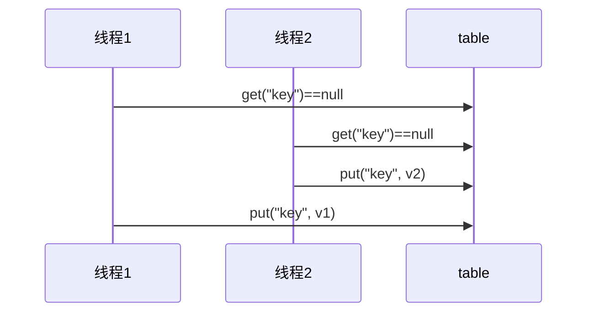
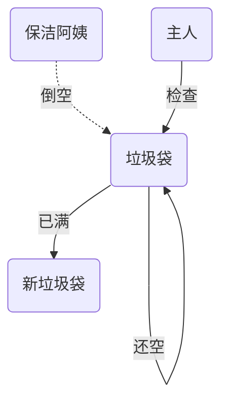

#   Java并发编程

## 1. 概览

### 1.1 这门课讲什么

这门课中的【并发】一词涵盖了在 Java 平台上的

- 进程
- 线程
- 并发
- 并行

以及 Java 并发工具、并发问题以及解决方案，同时我也会讲解一些其它领域的并发

### 1.2 为什么学这么课

- 我工作中用不到并发啊？  
  - 如果只是CURD，那用不到
  - 如果需要深层次理解，为之后阅读框架源码、拔高等打下基础，那用得到。

### 1.3 课程特色

- 本门课程以并发、并行为主线，穿插讲解
  - 应用 - 结合实际
  - 原理 - 了然于胸
  - 模式 - 正确姿势  


### 1.4 预备知识

- 希望你不是一个初学者
- 线程安全问题，需要你接触过 Java Web 开发、Jdbc 开发、Web 服务器、分布式框架时才会遇到
- 基于 JDK 8，最好对函数式编程、lambda 有一定了解
- 采用了 slf4j 打印日志，这是好的实践
- 采用了 lombok 简化 java bean 编写
- 给每个线程好名字，这也是一项好的实践  

### 1.5 相关配置文件

pom.xml

```xml
<properties>
    <maven.compiler.source>1.8</maven.compiler.source>
    <maven.compiler.target>1.8</maven.compiler.target>
</properties>
<dependencies>
    <dependency>
        <groupId>org.projectlombok</groupId>
        <artifactId>lombok</artifactId>
        <version>1.18.10</version>
    </dependency>
    <dependency>
        <groupId>ch.qos.logback</groupId>
        <artifactId>logback-classic</artifactId>
        <version>1.2.3</version>
    </dependency>
</dependencies>
```

logback.xml

```xml
<?xml version="1.0" encoding="UTF-8"?>
<configuration xmlns="http://ch.qos.logback/xml/ns/logback"
               xmlns:xsi="http://www.w3.org/2001/XMLSchema-instance"
               xsi:schemaLocation="http://ch.qos.logback/xml/ns/logback logback.xsd">
    <appender name="STDOUT" class="ch.qos.logback.core.ConsoleAppender">
        <encoder>
            <pattern>%date{HH:mm:ss} [%t] %logger - %m%n</pattern>
        </encoder>
    </appender>
    <logger name="c" level="debug" additivity="false">
        <appender-ref ref="STDOUT"/>
    </logger>
    <root level="ERROR">
        <appender-ref ref="STDOUT"/>
    </root>
</configuration>
```

## 2.进程与线程

- [ ] 进程和线程的概念
- [ ] 并行和并发的概念
- [ ] 线程基本应用  

### 2.1 进程与线程

**进程**

- 程序由指令和数据组成，但这些指令要运行，数据要读写，就必须将指令加载至 CPU，数据加载至内存。在
  指令运行过程中还需要用到磁盘、网络等设备。进程就是用来加载指令、管理内存、管理 IO 的
- 当一个程序被运行，从磁盘加载这个程序的代码至内存，这时就开启了一个进程。
- 进程就可以视为程序的一个实例。大部分程序可以同时运行多个实例进程（例如记事本、画图、浏览器
  等），也有的程序只能启动一个实例进程（例如网易云音乐、360 安全卫士等）

**线程**

- 一个进程之内可以分为一到多个线程。
- 一个线程就是一个指令流，将指令流中的一条条指令以一定的顺序交给 CPU 执行
- Java 中，线程作为最小调度单位，进程作为资源分配的最小单位。 在 windows 中进程是不活动的，只是作
  为线程的容器  

**二者对比**

- 进程基本上相互独立的，而线程存在于进程内，是进程的一个子集

- 进程拥有共享的资源，如内存空间等，供其内部的线程共享

- 进程间通信较为复杂

  - 同一台计算机的进程通信称为 IPC（Inter-process communication）
  - 不同计算机之间的进程通信，需要通过网络，并遵守共同的协议，例如 HTTP

- 线程通信相对简单，因为它们共享进程内的内存，一个例子是多个线程可以访问同一个共享变量

- 线程更轻量，线程上下文切换成本一般上要比进程上下文切换低

  > 上下文切换：指的是内核在CPU上对进程或者线程进行切换；内存总是有限的，当资源紧张时，优先切换给需要资源的进程或者线程

- 引入线程前，进程是资源调度和分配的基本单位，引入线程后，进程是操作系统资源分配的基本单位，而线程是任务调度和执行的基本单位

### 2.2 并行与并发  

单核 cpu 下，线程实际还是**串行执行** 。操作系统中有一个组件叫做任务调度器，将 cpu 的时间片（windows
下时间片最小约为 15 毫秒）分给不同的程序使用，只是由于 cpu 在线程间（时间片很短）的切换非常快，人类感
觉是 同时运行的 。总结为一句话就是**微观串行，宏观并行** ，

一般会将这种 线程轮流使用 CPU 的做法称为**并发**（**concurrent**）

1.单核cpu调度

| CPU  | 时间片 1 | 时间片 2 | 时间片 3 | 时间片 4 |
| ---- | -------- | -------- | -------- | -------- |
| core | 线程 1   | 线程 2   | 线程 3   | 线程 4   |


2.多核cpu调度

多核 cpu下，每个 核（core） 都可以调度运行线程，这时候线程可以是并行的  

| CPU    | 时间片 1 | 时间片 2 | 时间片 3 | 时间片 4 |
| ------ | -------- | -------- | -------- | -------- |
| core 1 | 线程 1   | 线程 1   | 线程 3   | 线程 3   |
| core 2 | 线程 2   | 线程 4   | 线程 2   | 线程 4   |


引用 Rob Pike 的一段描述：

- 并发（concurrent）是同一时间应对（dealing with）多件事情的能力

- 并行（parallel）是同一时间动手做（doing）多件事情的能力

例子

- 家庭主妇做饭、打扫卫生、给孩子喂奶，她一个人轮流交替做这多件事，这时就是并发
- 家庭主妇雇了个保姆，她们一起这些事，这时既有并发，也有并行（这时会产生竞争，例如锅只有一口，一个人用锅时，另一个人就得等待） 
- 雇了3个保姆，一个专做饭、一个专打扫卫生、一个专喂奶，互不干扰，这时是并行   

### 2.3  应用

#### 应用之异步调用（案例1）

以调用方角度来讲，如果：

- 需要等待结果返回，才能继续运行就是同步
- 不需要等待结果返回，就能继续运行就是异步

（1）设计

多线程可以让方法执行变为异步的（即不要巴巴干等着）比如说读取磁盘文件时，假设读取操作花费了 5 秒钟，如果没有线程调度机制，这 5 秒 cpu 什么都做不了，其它代码都得暂停...

（2）结论

- 比如在项目中，视频文件需要转换格式等操作比较费时，这时开一个新线程处理视频转换，避免阻塞主线程
- tomcat 的异步 servlet 也是类似的目的，让用户线程处理耗时较长的操作，避免阻塞 tomcat 的工作线程
- ui 程序中，开线程进行其他操作，避免阻塞 ui 线程  

#### 应用之提高效率（案例1）

充分利用多核 cpu 的优势，提高运行效率。想象下面的场景，执行 3 个计算，最后将计算结果汇总  

```
计算 1 花费 10 ms
计算 2 花费 11 ms
计算 3 花费 9 ms
汇总需要 1 ms
```

- 如果是串行执行，那么总共花费的时间是 `10 + 11 + 9 + 1 = 31ms`
- 但如果是四核 cpu，各个核心分别使用线程 1 执行计算 1，线程 2 执行计算 2，线程 3 执行计算 3，那么 3 个线程是并行的，花费时间只取决于最长的那个线程运行的时间，即 `11ms` 最后加上汇总时间只会花费 `12ms`  

> 需要在多核 cpu 才能提高效率，单核仍然时是轮流执行  

（1）设计

> 代码见【应用之效率-案例1】

（2）结论

- 单核 cpu 下，多线程不能实际提高程序运行效率，只是为了能够在不同的任务之间切换，不同线程轮流使用cpu ，不至于一个线程总占用 cpu，别的线程没法干活
- 多核 cpu 可以并行跑多个线程，但能否提高程序运行效率还是要分情况的
  - 有些任务，经过精心设计，将任务拆分，并行执行，当然可以提高程序的运行效率。但不是所有计算任务都能拆分（参考后文的【阿姆达尔定律】）
  - 也不是所有任务都需要拆分，任务的目的如果不同，谈拆分和效率没啥意义
- IO 操作不占用 cpu，只是我们一般拷贝文件使用的是【阻塞 IO】，这时相当于线程虽然不用 cpu，但需要一
  直等待 IO 结束，没能充分利用线程。所以才有后面的【非阻塞 IO】和【异步 IO】优化  

## 3.Java线程

- 创建和运行线程
- 查看线程
- 线程 API
- 线程状态  

### 3.1 创建和运行线程

#### 方法一，直接使用 Thread  

```java
// 创建线程对象
Thread t = new Thread() {
    public void run() {
        // 要执行的任务
    }
};
// 启动线程
t.start();
```

例如：  

```java
// 构造方法的参数是给线程指定名字，推荐
Thread t1 = new Thread("t1") {
    @Override
    // run 方法内实现了要执行的任务
    public void run() {
        log.debug("hello");
    }
};
t1.start();
```

输出 

`19:19:00 [t1] c.ThreadStarter - hello  ` 

#### 方法二，使用 Runnable 配合 Thread

把【线程】和【任务】（要执行的代码）分开

- Thread 代表线程
- Runnable 可运行的任务（线程要执行的代码）

```java
Runnable runnable = new Runnable() {
    public void run(){
        // 要执行的任务
    }
};
// 创建线程对象
Thread t = new Thread( runnable );
// 启动线程
t.start();
```

例如：  

```java
// 创建任务对象
Runnable task2 = new Runnable() {
    @Override
    public void run() {
        log.debug("hello");
    }
};
// 参数1 是任务对象; 参数2 是线程名字，推荐
Thread t2 = new Thread(task2, "t2");
t2.start();
```

输出：

`19:19:00 [t2] c.ThreadStarter - hello`

##### Java 8 以后可以使用 lambda 精简代码

```java
// 创建任务对象
Runnable task2 = () -> log.debug("hello");
// 参数1 是任务对象; 参数2 是线程名字，推荐
Thread t2 = new Thread(task2, "t2");
t2.start();
```

Runable接口源码

```java
@FunctionalInterface
public interface Runnable {
    /**
     * When an object implementing interface <code>Runnable</code> is used
     * to create a thread, starting the thread causes the object's
     * <code>run</code> method to be called in that separately executing
     * thread.
     * <p>
     * The general contract of the method <code>run</code> is that it may
     * take any action whatsoever.
     *
     * @see java.lang.Thread#run()
     */
    public abstract void run();
}
```

> 只有一个抽象方法的接口，会有`@FunctionalInterface`注解，`lambda`表达式只能简化这种注解的接口

```java
@Slf4j(topic = "test1")
public class Demo2 {
    public static void main(String[] args) {
        /*Runnable r = new Runnable() {//idea alter+enter 提示
            @Override
            public void run() {
                System.out.println("run1");
            }
        };*/

        //lambda表达式简化
        Runnable r = () ->{
            //里面的抽象方法run也省略了(因为只有一个run)
            System.out.println("lambda run");
        };
        Thread t = new Thread(r,"t1");
        t.start();
    }
}
```

#### *原理之 Thread 与 Runnable 的关系

分析 Thread 的源码，理清它与 Runnable 的关系

- 方法1 是把线程和任务合并在了一起，方法2 是把线程和任务分开了
- 用 Runnable 更容易与线程池等高级 API 配合
- 用 Runnable 让任务类脱离了 Thread 继承体系，更灵活  

#### 方法三，FutureTask 配合 Thread

FutureTask 能够接收 Callable 类型的参数，用来处理有返回结果的情况

```java
public class Demo3 {
    public static void main(String[] args) {
        FutureTask<Integer> task = new FutureTask<>(new Callable<Integer>() {
            @Override
            public Integer call() throws Exception {
                System.out.println("thread running");
                Thread.sleep(2000);//休眠2s
                return 100;
            }
        });
        //FutureTask实现了runnable接口，自然可以作为参数传入
        Thread t1 = new Thread(task,"t1");
        t1.start();
        try {
            System.out.println(task.get());//获得task返回值，在休眠两秒后获得
        } catch (InterruptedException e) {
            e.printStackTrace();
        } catch (ExecutionException e) {
            e.printStackTrace();
        }
    }
}
```

```java
/*lambda简化*/
public static void main(String[] args) {
    // 创建任务对象
    FutureTask<Integer> task3 = new FutureTask<>(() -> {
        log.debug("hello");
        return 100;
    });
    // 参数1 是任务对象; 参数2 是线程名字，推荐
    new Thread(task3, "t3").start();
    // 主线程阻塞，同步等待 task 执行完毕的结果
    Integer result = task3.get();
    log.debug("结果是:{}", result);
}
```

输出  

`19:22:27 [t3] c.ThreadStarter - hello`
`19:22:27 [main] c.ThreadStarter - 结果是:100  `

### 3.2 多个线程同时运行  

主要是理解

- 交替执行
- 谁先谁后，不由我们控制  

### 3.3 查看进程线程的方法  

#### windows

- 任务管理器可以查看进程和线程数，也可以用来杀死进程
- `tasklist` 查看进程
- `taskkill` 杀死进程    

#### linux  

- `ps -fe` 查看所有进程
- `ps -fT -p <PID>` 查看某个进程（PID）的所有线程
- `kill` 杀死进程
- `top` 按大写 H 切换是否显示线程
- `top -H -p <PID>` 查看某个进程（PID）的所有线程  

#### Java  

- `jps` 命令查看所有 Java 进程
- `jstack <PID>` 查看某个 Java 进程（PID）的所有线程状态
- `jconsole` 来查看某个 Java 进程中线程的运行情况（图形界面）  

**jconsole 远程监控配置**  

- 需要以如下方式运行你的 java 类  

```
java -Djava.rmi.server.hostname=`ip地址` -Dcom.sun.management.jmxremote -
Dcom.sun.management.jmxremote.port=`连接端口` -Dcom.sun.management.jmxremote.ssl=是否安全连接 -
Dcom.sun.management.jmxremote.authenticate=是否认证 java类
```

- 修改 /etc/hosts 文件将 127.0.0.1 映射至主机名  

如果要认证访问，还需要做如下步骤

- 复制 jmxremote.password 文件
- 修改 jmxremote.password 和 jmxremote.access 文件的权限为 600 即文件所有者可读写
- 连接时填入 controlRole（用户名），R&D（密码）  


### 3.4 原理之线程运行 

#### 栈与栈帧   

Java Virtual Machine Stacks （Java 虚拟机栈）

我们都知道 JVM 中由堆、栈、方法区所组成，其中栈内存是给谁用的呢？其实就是线程，每个线程启动后，虚拟
机就会为其分配一块栈内存。

- 每个栈由多个栈帧（Frame）组成，对应着每次方法调用时所占用的内存
- 每个线程只能有一个活动栈帧，对应着当前正在执行的那个方法  

**栈帧Demo**

```java
public class Demo5 {
    public static void main(String[] args) {
        method1(10);
    }

    public static void method1(int x) {
        int y = x + 1;
        Object m = method2();
        System.out.println(m);
    }
    public static Object method2(){
        Object n = new Object();
        return n;
    }
}
```

**栈帧图解**

 

#### 线程上下文切换（Thread Context Switch）  

因为以下一些原因导致 cpu 不再执行当前的线程，转而执行另一个线程的代码

- 线程的 cpu 时间片用完
- 垃圾回收
- 有更高优先级的线程需要运行
- 线程自己调用了 sleep、yield、wait、join、park、synchronized、lock 等方法

当 Context Switch 发生时，需要由操作系统保存当前线程的状态，并恢复另一个线程的状态，Java 中对应的概念
就是程序计数器（Program Counter Register），它的作用是记住下一条 jvm 指令的执行地址，是线程私有的

- 状态包括程序计数器、虚拟机栈中每个栈帧的信息，如局部变量、操作数栈、返回地址等
- Context Switch 频繁发生会影响性能  

### 3.5 线程常见方法


### 3.6 start 与 run（面试**）  

不调用`start()`而是`run()`会发生啥

```java
public static void main(String[] args) {
    Thread t1 = new Thread("t1") {
        @Override
        public void run() {
            System.out.println(Thread.currentThread().getName());
        }
    };
    t1.run();//main线程执行run代码，而t1线程不执行，非异步状态
}
```

- 直接调用 run 是在主线程中执行了 run，没有启动新的线程
- 使用 start 是启动新的线程，通过新的线程间接执行 run 中的代码

### 3.7 sleep 与 yield  

#### 3.7.1 sleep

- 调用 sleep 会让当前线程从 *Running* 进入 *Timed Waiting* 状态（阻塞）
- 其它线程可以使用 interrupt 方法打断正在睡眠的线程，这时 sleep 方法会抛出 `InterruptedException`
- 睡眠结束后的线程未必会立刻得到执行
  - 没有进入运行态，而是进入了就绪态
- 建议用 TimeUnit 的 sleep 代替 Thread 的 sleep 来获得更好的可读性
  - `TimeUnit.SECONDS.sleep(1);`//休眠一秒

#### 3.7.2 yield

- 字面上理解，yield是让出之意

- 调用 yield 会让当前线程从 *Running* 进入 *Runnable* 就绪状态，然后调度执行其它线程
- 具体的实现依赖于操作系统的任务调度器

#### 3.7.3 线程优先级

- 线程优先级会提示（hint）调度器优先调度该线程，但它仅仅是一个提示，调度器可以忽略它
- 如果 cpu 比较忙，那么优先级高的线程会获得更多的时间片，但 cpu 闲时，优先级几乎没作用  

```java
//Thread类源代码
//设置线程优先级
public final void setPriority(int newPriority) {
    ThreadGroup g;
    checkAccess();
    if (newPriority > MAX_PRIORITY || newPriority < MIN_PRIORITY) {
        throw new IllegalArgumentException();
    }
    if((g = getThreadGroup()) != null) {
        if (newPriority > g.getMaxPriority()) {
            newPriority = g.getMaxPriority();
        }
        setPriority0(priority = newPriority);
    }
}
```

##### 优先级案例

```java
Runnable task1 = () -> {
    int count = 0;
    for (;;) {
        System.out.println("---->1 " + count++);
    }
};
Runnable task2 = () -> {
    int count = 0;
    for (;;) {
        // Thread.yield();
        System.out.println(" ---->2 " + count++);
    }
};
Thread t1 = new Thread(task1, "t1");
Thread t2 = new Thread(task2, "t2");
// t1.setPriority(Thread.MIN_PRIORITY);
// t2.setPriority(Thread.MAX_PRIORITY);
t1.start();
t2.start();
```

### 3.8 join 方法详解(**)  

#### 3.8.1 为什么需要 join？

下面的代码执行，打印 r 是什么？  

```java
static int r = 0;
public static void main(String[] args) throws InterruptedException {
    test1();
}
private static void test1() throws InterruptedException {
    log.debug("开始");
    Thread t1 = new Thread(() -> {
        log.debug("开始");
        sleep(1);//休眠1秒
        log.debug("结束");
        r = 10;
    });
    t1.start();
    
    t1.join();//main等待t1运行结束后继续执行
    
    log.debug("结果为:{}", r);
    log.debug("结束");
}
```

分析

- 因为主线程和线程 t1 是并行执行的，t1 线程需要 1 秒之后才能算出 r=10
- 而主线程一开始就要打印 r 的结果，所以只能打印出 r=0

解决方法

- 用 `sleep` 行不行？为什么？
  - 可以，但是不推荐。
  - 因为不知道t1线程从开始到结束花费了多长时间，也许是1s，也许是100s，那么主线程要等待多久？
- 用 join，加在 `t1.start()` 之后即可（如上代码）  
- 体现了同步思想

#### 3.8.2 <font color=#0072bc>多线程应用之同步（案例1）   </font>

以调用方角度来讲，如果  

- 需要等待结果返回，才能继续运行就是同步
- 不需要等待结果返回，就能继续运行就是异步  


##### 等待多个结果demo  

问，下面代码 cost 大约多少秒？  

```java
static int r1 = 0;
static int r2 = 0;
public static void main(String[] args) throws InterruptedException {
    test2();
}
private static void test2() throws InterruptedException {
    Thread t1 = new Thread(() -> {
        sleep(1);
        r1 = 10;
    });
    Thread t2 = new Thread(() -> {
        sleep(2);
        r2 = 20;
    });
    long start = System.currentTimeMillis();
    t1.start();
    t2.start();
    t1.join();
    t2.join();
    long end = System.currentTimeMillis();
    log.debug("r1: {} r2: {} cost: {}", r1, r2, end - start);
}
```

分析如下

- 第一个 join：等待 t1 时, t2 并没有停止, 而在运行
- 第二个 join：1s 后, 执行到此, t2 也运行了 1s, 因此也只需再等待 1s

如果颠倒两个 join 呢？

最终都是输出：`0:45:43.239 [main] c.TestJoin - r1: 10 r2: 20 cost: 2005  `  

##### 有时效的 join

**1.案例：等够时间**

```java
static int r1 = 0;
static int r2 = 0;
public static void main(String[] args) throws InterruptedException {
    test3();
}
public static void test3() throws InterruptedException {
    Thread t1 = new Thread(() -> {
        sleep(1);
        r1 = 10;
    });
    long start = System.currentTimeMillis();
    t1.start();
    // 线程执行结束会导致 join 结束
    t1.join(1500);//等待线程结束，最多15s
    long end = System.currentTimeMillis();
    log.debug("r1: {} r2: {} cost: {}", r1, r2, end - start);
}
```

输出：`20:48:01.320 [main] c.TestJoin - r1: 10 r2: 0 cost: 1010  `  

**2.案例：没等够时间**  

```java
static int r1 = 0;
static int r2 = 0;
public static void main(String[] args) throws InterruptedException {
    test3();
}
public static void test3() throws InterruptedException {
    Thread t1 = new Thread(() -> {
        sleep(2);
        r1 = 10;
    });
    long start = System.currentTimeMillis();
    t1.start();
    //达到join最大等待时间
    t1.join(1500);
    long end = System.currentTimeMillis();
    log.debug("r1: {} r2: {} cost: {}", r1, r2, end - start);
}
```

输出：`20:52:15.623 [main] c.TestJoin - r1: 0 r2: 0 cost: 1502  `  

### 3.9 interrupt 方法详解(**)

作用：打断线程

#### 3.9.1 打断  sleep，wait，join 的线程

- 这几个方法都会让线程进入阻塞状态

打断 sleep 的线程, 会清空打断状态（false），以 sleep 为例  

```java
//睡眠状态中，执行线程interrupt会返回false，抛出异常，之后会设置打断标记
private static void test1() throws InterruptedException {
    Thread t1 = new Thread(()->{
        sleep(1);
    }, "t1");
    t1.start();
    sleep(0.5);
    t1.interrupt();
    log.debug(" 打断状态: {}", t1.isInterrupted());
}
```

输出

```
java.lang.InterruptedException: sleep interrupted
    at java.lang.Thread.sleep(Native Method)
    at java.lang.Thread.sleep(Thread.java:340)
    at java.util.concurrent.TimeUnit.sleep(TimeUnit.java:386)
    at cn.itcast.n2.util.Sleeper.sleep(Sleeper.java:8)
    at cn.itcast.n4.TestInterrupt.lambda$test1$3(TestInterrupt.java:59)
    at java.lang.Thread.run(Thread.java:745)
21:18:10.374 [main] c.TestInterrupt - 打断状态: false
```

#### 3.9.2 打断正常运行的线程

打断正常运行的线程, 不会清空打断状态

```java
private static void test2() throws InterruptedException {
    Thread t2 = new Thread(()->{
        while(true) {
            Thread current = Thread.currentThread();
            boolean interrupted = current.isInterrupted();
            //被打断了，终止循环
            if(interrupted) {
                log.debug(" 打断状态: {}", interrupted);
                break;
            }
        }
    }, "t2");
    t2.start();
    sleep(0.5);
    t2.interrupt();
}
```

输出 `20:57:37.964 [t2] c.TestInterrupt - 打断状态: true
  `  

#### 3.9.3 <font color=#0072bc>多线程设计模式：两阶段终止  </font>

在一个线程T1中如何“优雅终止线程T2？这里的**优雅**指的是给T2一个料理后事的机会

错误思路

- 使用线程对象的stop()方法停止线程
  - stop方法会真正杀死线程，如果这时线程锁住了共享资源，那么当它被杀死后就再也没有机会释放锁，其它线程将永远无法获取锁
- 使用System.exit(int)方法停止线程
  - 目的仅是停止一个线程,但这种做法会让整个程序都停止


```java
public class Demo7 {
    private Thread monitor;

    //启动监控线程
    public void start() {
        monitor = new Thread(() -> {
            while (true) {
                Thread current = Thread.currentThread();
                //是否被打断
                if (current.isInterrupted()) {
                    Log.debug("料理后事");
                    break;
                }
                try {
                    Thread.sleep(1000); //情况1
                    log.debug("执行监控记录"); //情况2
                } catch (InterruptedException e) {
                    e.printStackTrace();
                    //重新设置打断标记(因为sleep状态下打断会重置标记状态)
                    current.interrupt();
                }
            }
        });
        monitor.start();
    }
    //停止监控线程
    public void stop(){
        monitor.interrupt();
    }
}
```

#### 3.9.4 打断 park 线程

打断 park 线程, 不会清空打断状态  

```java
private static void test3() throws InterruptedException {
    Thread t1 = new Thread(() -> {
        log.debug("park...");
        LockSupport.park();
        log.debug("unpark...");
        log.debug("打断状态：{}", Thread.currentThread().isInterrupted());
    }, "t1");
    t1.start();
    sleep(0.5);
    t1.interrupt();
}
```

输出

```
21:11:52.795 [t1] c.TestInterrupt - park...
21:11:53.295 [t1] c.TestInterrupt - unpark...
21:11:53.295 [t1] c.TestInterrupt - 打断状态：true
```

如果打断标记已经是 true, 则 park 会失效  

```java
private static void test4() {
    Thread t1 = new Thread(() -> {
        for (int i = 0; i < 5; i++) {
            log.debug("park...");
            LockSupport.park();
            log.debug("打断状态：{}", Thread.currentThread().isInterrupted());
        }
    });
    t1.start();
    sleep(1);
    t1.interrupt();
}
```

输出

```
21:13:48.783 [Thread-0] c.TestInterrupt - park...
21:13:49.809 [Thread-0] c.TestInterrupt - 打断状态：true
21:13:49.812 [Thread-0] c.TestInterrupt - park...
21:13:49.813 [Thread-0] c.TestInterrupt - 打断状态：true
21:13:49.813 [Thread-0] c.TestInterrupt - park...
21:13:49.813 [Thread-0] c.TestInterrupt - 打断状态：true
21:13:49.813 [Thread-0] c.TestInterrupt - park...
21:13:49.813 [Thread-0] c.TestInterrupt - 打断状态：true
21:13:49.813 [Thread-0] c.TestInterrupt - park...
21:13:49.813 [Thread-0] c.TestInterrupt - 打断状态：true
```

> 可以使用 `Thread.interrupted()` 清除打断状态  

### 3.10 不推荐的方法  

还有一些不推荐使用的方法，这些方法已过时，**容易破坏同步代码块，造成线程死锁**  

| 方法名    | static | 功能说明             |
| --------- | ------ | -------------------- |
| stop()    |        | 停止线程运行         |
| suspend() |        | 挂起（暂停）线程运行 |
| resume()  |        | 恢复线程运行         |

### 3.11 主线程与守护线程(**)

为什么需要守护线程？如下死循环只有得到true的打断标记时，才可终止线程

```java
public class Demo8 {
    public static void main(String[] args) throws InterruptedException {
        Thread t1 = new Thread(()->{
            while (true){
                //当打断标记true时，才会break
                if (Thread.currentThread().isInterrupted()){
                    break;
                }
                //代码逻辑
                System.out.println("t1结束");
            }
        },"t1");
        t1.start();

        Thread.sleep(1000);
        System.out.println("程序结束");
    }
}
```

默认情况下，Java 进程需要等待所有线程都运行结束，才会结束。

有一种特殊的线程叫做守护线程，只要**其它非守护线程运行结束了，即使守护线程的代码没有执行完，也会强制结束**  

例子：

```java
log.debug("开始运行...");
Thread t1 = new Thread(() -> {
    log.debug("开始运行...");
    sleep(2);
    log.debug("运行结束...");
}, "daemon");
// 设置该线程为守护线程
t1.setDaemon(true);
t1.start();
sleep(1);
log.debug("运行结束...");
```

输出  

```
08:26:38.123 [main] c.TestDaemon - 开始运行...
08:26:38.213 [daemon] c.TestDaemon - 开始运行...
08:26:39.215 [main] c.TestDaemon - 运行结束...
```

> 垃圾回收器线程就是一种守护线程
> Tomcat 中的 Acceptor 和 Poller 线程都是守护线程，所以 Tomcat 接收到 shutdown 命令后，不会等
> 待它们处理完当前请求  

### 3.12 五种状态  

这是从**操作系统**层面来描述的  


- 【初始状态】仅是在语言层面创建了线程对象，还未与操作系统线程关联
- 【可运行状态】（就绪状态）指该线程已经被创建（与操作系统线程关联），可以由 CPU 调度执行
- 【运行状态】指获取了 CPU 时间片运行中的状态
  - 当 CPU 时间片用完，会从【运行状态】转换至【可运行状态】，会导致线程的上下文切换
- 【阻塞状态】
  - 如果调用了阻塞 API，如 BIO 读写文件，这时该线程实际不会用到 CPU，会导致线程上下文切换，进入
    【阻塞状态】
  - 等 BIO 操作完毕，会由操作系统唤醒阻塞的线程，转换至【可运行状态】
  - 与【可运行状态】的区别是，对【阻塞状态】的线程来说只要它们一直不唤醒，调度器就一直不会考虑
    调度它们
- 【终止状态】表示线程已经执行完毕，生命周期已经结束，不会再转换为其它状态  

### 3.13 六种状态  

https://www.bilibili.com/video/BV16J411h7Rd?p=46

这是从 **Java API** 层面来描述的
根据 `Thread.State` 枚举，分为六种状态  


- `NEW` 线程刚被创建，但是还没有调用 start() 方法
- `RUNNABLE` 当调用了 `start()` 方法之后，注意，**Java API** 层面的 `RUNNABLE` 状态涵盖了 **操作系统** 层面的
  【可运行状态】、【运行状态】和【阻塞状态】（由于 BIO 导致的线程阻塞，在 Java 里无法区分，仍然认为
  是可运行）
- `BLOCKED ， WAITING ， TIMED_WAITING` 都是 **Java API** 层面对【阻塞状态】的细分，后面会在状态转换一节详述
- `TERMINATED` 当线程代码运行结束  

### 3.14 习题

阅读华罗庚《统筹方法》，给出烧水泡茶的多线程解决方案，提示

- 参考图二，用两个线程（两个人协作）模拟烧水泡茶过程
  - 文中办法乙、丙都相当于任务串行
- 而图一相当于启动了 4 个线程，有点浪费
- 用 sleep(n) 模拟洗茶壶、洗水壶等耗费的时间

附：华罗庚《统筹方法》  

> 统筹方法，是一种安排工作进程的数学方法。它的实用范围极广泛，在企业管理和基本建设中，以及关系复
> 杂的科研项目的组织与管理中，都可以应用。
>
> 怎样应用呢？主要是把工序安排好  
>
> 比如，想泡壶茶喝。当时的情况是：开水没有；水壶要洗，茶壶、茶杯要洗；火已生了，茶叶也有了。怎么
> 办？  
>
> - 办法甲：洗好水壶，灌上凉水，放在火上；在等待水开的时间里，洗茶壶、洗茶杯、拿茶叶；等水开
>   了，泡茶喝。
> - 办法乙：先做好一些准备工作，洗水壶，洗茶壶茶杯，拿茶叶；一切就绪，灌水烧水；坐待水开了，泡
>   茶喝。
> - 办法丙：洗净水壶，灌上凉水，放在火上，坐待水开；水开了之后，急急忙忙找茶叶，洗茶壶茶杯，泡
>   茶喝。
>
> 哪一种办法省时间？我们能一眼看出，第一种办法好，后两种办法都窝了工。
>
> 这是小事，但这是引子，可以引出生产管理等方面有用的方法来。
>
> 水壶不洗，不能烧开水，因而洗水壶是烧开水的前提。没开水、没茶叶、不洗茶壶茶杯，就不能泡茶，因而这些又是泡茶的前提。它们的相互关系，可以用下边的箭头图来表示：  
>
> 
>
> 从这个图上可以一眼看出，办法甲总共要16分钟（而办法乙、丙需要20分钟）。如果要缩短工时、提高工作
> 效率，应当主要抓烧开水这个环节，而不是抓拿茶叶等环节。同时，洗茶壶茶杯、拿茶叶总共不过4分钟，大
> 可利用“等水开”的时间来做。
>
> 是的，这好像是废话，卑之无甚高论。有如走路要用两条腿走，吃饭要一口一口吃，这些道理谁都懂得。但
> 稍有变化，临事而迷的情况，常常是存在的。在近代工业的错综复杂的工艺过程中，往往就不是像泡茶喝这
> 么简单了。任务多了，几百几千，甚至有好几万个任务。关系多了，错综复杂，千头万绪，往往出现“万事俱
> 备，只欠东风”的情况。由于一两个零件没完成，耽误了一台复杂机器的出厂时间。或往往因为抓的不是关
> 键，连夜三班，急急忙忙，完成这一环节之后，还得等待旁的环节才能装配。
>
> 洗茶壶，洗茶杯，拿茶叶，或先或后，关系不大，而且同是一个人的活儿，因而可以合并成为：  
>
> 
>
> 看来这是“小题大做”，但在工作环节太多的时候，这样做就非常必要了。
>
> 这里讲的主要是时间方面的事，但在具体生产实践中，还有其他方面的许多事。这种方法虽然不一定能直接
> 解决所有问题，但是，我们利用这种方法来考虑问题，也是不无裨益的  

```java
public class Demo9 {
    public static void main(String[] args) {
        Thread t1 = new Thread(()->{
            System.out.println("洗水壶");
            //调用sleep(1)，模拟洗水壶1分钟

            /*-------穿行操作---------*/

            System.out.println("烧水");
            //调用sleep(15)，模拟烧水15分钟
        },"t1");
        Thread t2 = new Thread(()->{
            System.out.println("洗茶壶、洗茶杯、拿茶叶 4分钟");
            //调用sleep(4)，模拟洗茶壶、洗茶杯、拿茶叶 4分钟
            try {
                t1.join();//t2先执行完，所以等待t1完事，再继续执行
            } catch (InterruptedException e) {
                e.printStackTrace();
            }
        },"t2");
    }
}
```

- 上面模拟的是小王等老王的水烧开了，小王泡茶，如果反过来要实现老王等小王的茶叶拿来了，老王泡茶
  呢？代码最好能适应两种情况
- 上面的两个线程其实是各执行各的，如果要模拟老王把水壶交给小王泡茶，或模拟小王把茶叶交给老王泡
  茶呢

### 3.15 本章小结

本章的重点在于掌握

- 线程创建
- 线程重要 api，如 `start，run，sleep，join，interrupt` 等
- 线程状态
- 应用方面
  - 异步调用：主线程执行期间，其它线程异步执行耗时操作
  - 提高效率：并行计算，缩短运算时间
  - 同步等待：`join`
  - 统筹规划：合理使用线程，得到最优效果

- 原理方面
  - 线程运行流程：栈、栈帧、上下文切换、程序计数器
  - Thread 两种创建方式 的源码

- 模式方面
  - 终止模式之两阶段终止  

## 4.共享模型之管程(monitor)

- 共享问题
- synchronized
- 线程安全分析
- Monitor
- wait/notify
- 线程状态转换
- 活跃性
- Lock  

### 4.1 前言

#### 4.1.1 小故事

老王（操作系统）有一个功能强大的算盘（CPU），现在想把它租出去，赚一点外快  


小南、小女（线程）来使用这个算盘来进行一些计算，并按照时间给老王支付费用

但小南不能一天24小时使用算盘，他经常要小憩一会（sleep），又或是去吃饭上厕所（阻塞 io 操作），有
时还需要一根烟，没烟时思路全无（wait）这些情况统称为（阻塞）  


在这些时候，算盘没利用起来（不能收钱了），老王觉得有点不划算

另外，小女也想用用算盘，如果总是小南占着算盘，让小女觉得不公平

于是，老王灵机一动，想了个办法 [ 让他们每人用一会，轮流使用算盘 ]

这样，当小南阻塞的时候，算盘可以分给小女使用，不会浪费，反之亦然

最近执行的计算比较复杂，需要存储一些中间结果，而学生们的脑容量（工作内存）不够，所以老王申请了
一个笔记本（主存），把一些中间结果先记在本上

计算流程是这样的  


但是由于分时系统，有一天还是发生了事故

小南刚读取了初始值 0 做了个 +1 运算，还没来得及写回结果

老王说 [ 小南，你的时间到了，该别人了，记住结果走吧 ]，于是小南念叨着 [ 结果是1，结果是1...] 不甘心地
到一边待着去了（上下文切换）

老王说 [ 小女，该你了 ]，小女看到了笔记本上还写着 0 做了一个 -1 运算，将结果 -1 写入笔记本

这时小女的时间也用完了，老王又叫醒了小南：[小南，把你上次的题目算完吧]，小南将他脑海中的结果 1 写
入了笔记本

  

小南和小女都觉得自己没做错，但笔记本里的结果是 1 而不是 0  

#### 4.1.2 Java 的体现

两个线程对初始值为 0 的静态变量一个做自增，一个做自减，各做 5000 次，结果是 0 吗？  

```java
static int counter = 0;

public static void main(String[] args) throws InterruptedException {
    Thread t1 = new Thread(() -> {
        for (int i = 0; i < 5000; i++) {
            counter++;
        }
    }, "t1");
    
    Thread t2 = new Thread(() -> {
        for (int i = 0; i < 5000; i++) {
            counter--;
        }
    }, "t2");
    
    t1.start();
    t2.start();
    t1.join();
    t2.join();
    log.debug("{}",counter);
}
```

问题分析

以上的结果可能是正数、负数、零。为什么呢？因为 Java 中对静态变量的自增，自减并不是原子操作，要彻底理
解，必须从字节码来进行分析

例如对于 `i++` 而言（i 为静态变量），实际会产生如下的 JVM 字节码指令  

```java
getstatic i //获取静态变量i的值
iconst_1 //准备常量1
iadd //自增
putstatic i //将修改后的值存入静态变量i
```

而对应 `i--` 也是类似  

```java
getstatic i //获取静态变量i的值
iconst_1 //java准备常量1
isub //自减
putstatic i //将修改后的值存入静态变量i
```

而 Java 的内存模型如下，完成静态变量的自增，自减需要在主存和工作内存中进行数据交换  


如果是单线程以上 8 行代码是顺序执行（不会交错）没有问题：  


但多线程下这 8 行代码可能交错运行：

出现负数的情况：  


出现正数的情况：  


#### 4.1.3 临界区 Critical Section  

- 一个程序运行多个线程本身是没有问题的
- 问题出在多个线程访问**共享资源**
  - 多个线程读**共享资源**其实也没有问题
  - 在多个线程对**共享资源**读写操作时发生指令交错，就会出现问题
- 一段代码块内如果存在对**共享资源**的多线程读写操作，称这段代码块为**临界区**  

例如，下面代码中的临界区  

```java
static int counter = 0;
static void increment()
//临界区
{
    counter++;
}
static void decrement()
//临界区
{
    counter--;
}
```

#### 4.1.4 竞态条件 Race Condition

多个线程在临界区内执行，由于代码的**执行序列不同**而导致结果无法预测，称之为发生了**竞态条件**  

### 4.2 synchronized 解决方案  

为了避免临界区的竞态条件发生，有多种手段可以达到目的。

- 阻塞式的解决方案：`synchronized`，`Lock`
- 非阻塞式的解决方案：原子变量

本次课使用阻塞式的解决方案：synchronized，来解决上述问题，即俗称的【对象锁】，它采用互斥的方式让同一时刻至多只有一个线程能持有【对象锁】，其它线程再想获取这个【对象锁】时就会阻塞住。这样就能保证拥有锁的线程可以安全的执行临界区内的代码，不用担心线程上下文切换  

> 虽然 java中互斥和同步都可以采用 synchronized 关键字来完成，但它们还是有区别的：
>
> - 互斥是保证临界区的竞态条件发生，同一时刻只能有一个线程执行临界区代码
> - 同步是由于线程执行的先后、顺序不同、需要一个线程等待其它线程运行到某个点  

#### 4.2.1 synchronized

##### 语法

```java
synchronized(对象) // 线程1， 线程2(blocked)
{
    //临界区
}
```

##### 案例


- `synchronized(对象)` 中的对象，可以想象为一个房间（room），有唯一入口（门）房间只能一次进入一人
  进行计算，线程 t1，t2 想象成两个人
- 当线程 t1 执行到 `synchronized(room)` 时就好比 t1 进入了这个房间，并锁住了门拿走了钥匙，在门内执行
  `count++` 代码
- 这时候如果 t2 也运行到了 `synchronized(room)` 时，它发现门被锁住了，只能在门外等待，发生了上下文切
  换，阻塞住了
- 这中间即使 t1 的 cpu 时间片不幸用完，被踢出了门外（不要错误理解为锁住了对象就能一直执行下去哦），
  这时门还是锁住的，t1 仍拿着钥匙，t2 线程还在阻塞状态进不来，只有下次轮到 t1 自己再次获得时间片时才
  能开门进入
- 当 t1 执行完 `synchronized{}` 块内的代码，这时候才会从 obj 房间出来并解开门上的锁，唤醒 t2 线程把钥
  匙给他。t2 线程这时才可以进入 obj 房间，锁住了门拿上钥匙，执行它的 `count--` 代码  

```java
static int counter = 0;
static final Object room = new Object();
public static void main(String[] args) throws InterruptedException {
    Thread t1 = new Thread(() -> {
        for (int i = 0; i < 5000; i++) {
            synchronized (room) {
                counter++;
            }
        }
    }, "t1");
    Thread t2 = new Thread(() -> {
        for (int i = 0; i < 5000; i++) {
            synchronized (room) {
                counter--;
            }
        }
    }, "t2");
    t1.start();
    t2.start();
    t1.join();
    t2.join();
    log.debug("{}",counter);
}
```

##### 时序图


##### 思考

synchronized 实际是用**对象锁**保证了**临界区内代码的原子性**，临界区内的代码对外是不可分割的，不会被线程切
换所打断  

为了加深理解，请思考下面的问题  

- 如果把 `synchronized(obj)` 放在 for 循环的外面，如何理解？-- 原子性
  - 整个for循环体作为整个原子体
- 如果 t1 `synchronized(obj1)` 而 t2 `synchronized(obj2)` 会怎样运作？-- 锁对象
  - 不会保护临界区代码，因为拿的不是同一个锁对象
  - 保护共享资源，多个线程要保证锁住的是同一个对象
- 如果 t1 `synchronized(obj)` 而 t2 没有加会怎么样？如何理解？-- 锁对象  

##### 面向对象改进

把需要保护的共享变量放入一个类  

```Java
class Room {
    int value = 0;
    public void increment() {
        synchronized (this) {
            value++;
        }
    }
    public void decrement() {
        synchronized (this) {
            value--;
        }
    }
    public int get() {
        synchronized (this) {
            return value;
        }
    }
}

@Slf4j
public class Test1 {
    public static void main(String[] args) throws InterruptedException {
        Room room = new Room();
        Thread t1 = new Thread(() -> {
            for (int j = 0; j < 5000; j++) {
                room.increment();
            }
        }, "t1");
        Thread t2 = new Thread(() -> {
            for (int j = 0; j < 5000; j++) {
                room.decrement();
            }
        }, "t2");
        t1.start();
        t2.start();
        t1.join();
        t2.join();
        log.debug("count: {}" , room.get());
    }
}
```

#### 4.2.2 方法上的 synchronized (**) 

synchronized不能锁方法，本质上是锁的对象

1.加在成员方法上，锁的是this对象

```java
class Test{
    public synchronized void test() {
    }
}
//等价于
class Test{
    public void test() {
        synchronized(this) {
        }
    }
}
```

2.加在静态方法上，锁的是类对象

```java
class Test{
    public synchronized static void test() {
    }
}
//等价于
class Test{
    public static void test() {
        synchronized(Test.class) {
        }
    }
}
```

不加 synchronized 的方法

不加 synchronzied 的方法就好比不遵守规则的人，不去老实排队（好比翻窗户进去的）  

##### 线程八锁(**)

其实就是考察 synchronized 锁住的是哪个对象  

> 注意：sleep()会释放cpu资源，但是不会释放锁；wait()会释放锁

情况1：**1->2** or **2->1**

```java
//a()、b()都加锁了，因为在同一个类下，所以都是给this加的锁
@Slf4j(topic = "c.Number")
class Number{
    public synchronized void a() {
        log.debug("1");
    }
    public synchronized void b() {
        log.debug("2");
    }
}
public static void main(String[] args) {
    Number n1 = new Number();
    new Thread(()->{ n1.a(); }).start();
    new Thread(()->{ n1.b(); }).start();
}
```

情况2：**1s后1->2** or **2->1s后1**

```java
@Slf4j(topic = "c.Number")
class Number{
    public synchronized void a() {
        sleep(1);
        log.debug("1");
    }
    public synchronized void b() {
        log.debug("2");
    }
}
public static void main(String[] args) {
    Number n1 = new Number();
    new Thread(()->{ n1.a(); }).start();
    new Thread(()->{ n1.b(); }).start();
}
```

情况3：**3 -> 1s后1->2** or **2->3 -> 1s后1** or **3->2 -> 1s后1** 

`c()`未加锁，与`a()、b()`不会有互斥的效果，并行执行；而`a()、b()`会有互斥效果

```java
@Slf4j(topic = "c.Number")
class Number{
    public synchronized void a() {
        sleep(1);
        log.debug("1");
    }
    public synchronized void b() {
        log.debug("2");
    }
    public void c() {
        log.debug("3");
    }
}
public static void main(String[] args) {
    Number n1 = new Number();
    new Thread(()->{ n1.a(); }).start();
    new Thread(()->{ n1.b(); }).start();
    new Thread(()->{ n1.c(); }).start();
}
```

情况4：**2 -> 1s 后 1**  

因为锁的不是同一对象，因此两者不互斥，加上t1休眠1s

```java
@Slf4j(topic = "c.Number")
class Number{
    public synchronized void a() {
        sleep(1);
        log.debug("1");
    }
    public synchronized void b() {
        log.debug("2");
    }
}
public static void main(String[] args) {
    //两个锁对象
    Number n1 = new Number();
    Number n2 = new Number();
    new Thread(()->{ n1.a(); }).start();
    new Thread(()->{ n2.b(); }).start();
}
```

情况5：**2 -> 1s 后 1**  

```java
@Slf4j(topic = "c.Number")
class Number{
    public static synchronized void a() {
        sleep(1);
        log.debug("1");
    }
    public synchronized void b() {
        log.debug("2");
    }
}
public static void main(String[] args) {
    Number n1 = new Number();
    new Thread(()->{ n1.a(); }).start();
    new Thread(()->{ n1.b(); }).start();
}
```

情况6：**1s后1 -> 2** or **2 -> 1s后1**  

`a()`、`b()` 都是静态，锁住的是Number类对象，因此`n1.a()`且`n1.b()`是互斥的

```java
@Slf4j(topic = "c.Number")
class Number{
    public static synchronized void a() {
        sleep(1);
        log.debug("1");
    }
    public static synchronized void b() {
        log.debug("2");
    }
}
public static void main(String[] args) {
    Number n1 = new Number();
    new Thread(()->{ n1.a(); }).start();
    new Thread(()->{ n1.b(); }).start();
}
```

情况7：**2 -> 1s后1** 

```java
@Slf4j(topic = "c.Number")
class Number{
    public static synchronized void a() {
        sleep(1);
        log.debug("1");
    }
    public synchronized void b() {
        log.debug("2");
    }
}
public static void main(String[] args) {
    Number n1 = new Number();
    Number n2 = new Number();
    new Thread(()->{ n1.a(); }).start();
    new Thread(()->{ n2.b(); }).start();
}
```

情况8：**1s后1 -> 2** or **2 -> 1s后1**  

`a()`、`b()` 都是静态，锁住的是Number类对象，因此`n1.a()`且`n2.b()`是互斥的，虽然是不同对象，但是是一个类的

```java
@Slf4j(topic = "c.Number")
class Number{
    public static synchronized void a() {
        sleep(1);
        log.debug("1");
    }
    public static synchronized void b() {
        log.debug("2");
    }
}
public static void main(String[] args) {
    Number n1 = new Number();
    Number n2 = new Number();
    new Thread(()->{ n1.a(); }).start();
    new Thread(()->{ n2.b(); }).start();
}
```

### 4.3 变量的线程安全分析

#### 4.3.1 成员变量和静态变量是否线程安全？

- 如果它们没有共享，则线程安全
- 如果它们被共享了，根据它们的状态是否能够改变，又分两种情况
  - 如果只有读操作，则线程安全
  - 如果有读写操作，则这段代码是临界区，需要考虑线程安全

#### 4.3.2 局部变量是否线程安全？

- 局部变量是线程安全的
- 但局部变量引用的对象则未必
  - 如果该对象没有逃离方法的作用访问，它是线程安全的
  - 如果该对象逃离方法的作用范围，需要考虑线程安全

#### 4.3.3 局部变量线程安全分析  

```java
public static void test1() {
    int i = 10;
    i++;
}
```

每个线程调用 `test1()` 方法时局部变量 i，**会在每个线程的栈帧内存中被创建多份**，因此不存在共享  

```java
public static void test1();
	descriptor: ()V
	flags: ACC_PUBLIC, ACC_STATIC
	Code:
		stack=1, locals=1, args_size=0
			0: bipush 10
			2: istore_0
			3: iinc 0, 1
			6: return
		LineNumberTable:
			line 10: 0
			line 11: 3
			line 12: 6
		LocalVariableTable:
			Start Length Slot Name Signature
			  3     4     0    i     I
```

如图，局部变量的引用稍有不同  


局部变量的引用稍有不同  

##### 成员变量的例子  

```java
class ThreadUnsafe {
    ArrayList<String> list = new ArrayList<>();
    public void method1(int loopNumber) {
        for (int i = 0; i < loopNumber; i++) {
            // { 临界区, 会产生竞态条件
            method2();
            method3();
            // } 临界区
        }
    }
    private void method2() {
        list.add("1");
    }
    private void method3() {
        list.remove(0);
    }
}
```

执行

```java
static final int THREAD_NUMBER = 2;
static final int LOOP_NUMBER = 200;
public static void main(String[] args) {
    ThreadUnsafe test = new ThreadUnsafe();
    for (int i = 0; i < THREAD_NUMBER; i++) {
        new Thread(() -> {
            test.method1(LOOP_NUMBER);
        }, "Thread" + i).start();
    }
}
```

因为是临界区，会产生竞态条件，所以出现一种情况：线程2 还未 add，线程1 remove 就会报错  

```
Exception in thread "Thread1" java.lang.IndexOutOfBoundsException: Index: 0, Size: 0
    at java.util.ArrayList.rangeCheck(ArrayList.java:657)
    at java.util.ArrayList.remove(ArrayList.java:496)
    at cn.itcast.n6.ThreadUnsafe.method3(TestThreadSafe.java:35)
    at cn.itcast.n6.ThreadUnsafe.method1(TestThreadSafe.java:26)
    at cn.itcast.n6.TestThreadSafe.lambda$main$0(TestThreadSafe.java:14)
    at java.lang.Thread.run(Thread.java:748)
```

分析：

- 无论哪个线程中的 method2 ，引用的都是同一个对象中的 list 成员变量
- method3 与 method2 分析相同  


##### list 修改为局部变量  

```java
class ThreadSafe {
    public final void method1(int loopNumber) {
        ArrayList<String> list = new ArrayList<>();
        for (int i = 0; i < loopNumber; i++) {
            method2(list);
            method3(list);
        }
    }
    private void method2(ArrayList<String> list) {
        list.add("1");
    }
    private void method3(ArrayList<String> list) {
        list.remove(0);
    }
}
```

那么就不会有上述问题了  

分析：

- list 是局部变量，每个线程调用时会创建其不同实例，没有共享
- 而 method2 的参数是从 method1 中传递过来的，与 method1 中引用同一个对象
- method3 的参数分析与 method2 相同  


方法访问修饰符带来的思考，如果把 method2 和 method3 的方法修改为 public 会不会代理线程安全问题？

- 情况1：有其它线程调用 method2 和 method3
  - 其他线程直接调用method2 和 method3传过来的 list 与method1传进去的不是同一个，因此不会有问题
- 情况2：在 情况1 的基础上，为 ThreadSafe 类添加子类，子类覆盖 method2 或 method3 方法，即  

```java
class ThreadSafe {
    public final void method1(int loopNumber) {
        ArrayList<String> list = new ArrayList<>();
        for (int i = 0; i < loopNumber; i++) {
            method2(list);
            method3(list);
        }
    }
    private void method2(ArrayList<String> list) {
        list.add("1");
    }
    private void method3(ArrayList<String> list) {
        list.remove(0);
    }
}
class ThreadSafeSubClass extends ThreadSafe{
    @Override
    public void method3(ArrayList<String> list) {
        new Thread(() -> {
            list.remove(0);
        }).start();
    }
}
```

`ThreadSafeSubClass extends ThreadSafe`，重写了父类method3，开辟了新线程，共享list，即出现了子类与父类共享资源，因此出现问题。

> 从这个例子可以看出 private 或 final 提供【安全】的意义所在，请体会开闭原则中的【闭】  
>
> 访问修饰符在一定程度上，保护了线程安全

#### 4.3.3 常见线程安全类(**)  

- String
- Integer
- StringBuffer
- Random
- Vector
- Hashtable
- java.util.concurrent 包下的类  

这里说它们是线程安全的是指，多个线程调用它们同一个实例的某个方法时，是线程安全的。也可以理解为  

```java
Hashtable table = new Hashtable();

new Thread(()->{
    table.put("key", "value1");
}).start();

new Thread(()->{
    table.put("key", "value2");
}).start();
```

时序图

线程1的`put`覆盖了 线程2的`put`



- 它们的每个方法是原子的
- 但**注意**它们多个方法的组合不是原子的，见后面分析  

##### 不可变类线程安全性

`String、Integer` 等都是不可变类（final类），因为其内部的状态不可以改变，因此它们的方法都是线程安全的

有同学或许有疑问，`String` 有 `replace`，`substring` 等方法可以改变值啊，那么这些方法又是如何保证线程安
全的呢？  

###### 1.`subString()`源码

```java
public String substring(int beginIndex) {
    if (beginIndex < 0) {
        throw new StringIndexOutOfBoundsException(beginIndex);
    }
    int subLen = value.length - beginIndex;//截取长度 = 总长度 - 索引下标
    if (subLen < 0) {
        throw new StringIndexOutOfBoundsException(subLen);
    }
    //若索引为0？返回本身：创建新的字符串对象
    return (beginIndex == 0) ? this : new String(value, beginIndex, subLen);
}
```

###### 2.`String`构造器源码

```java
//value为char数组
public String(char value[], int offset, int count) {
    if (offset < 0) {
        throw new StringIndexOutOfBoundsException(offset);
    }
    if (count <= 0) {
        if (count < 0) {
            throw new StringIndexOutOfBoundsException(count);
        }
        if (offset <= value.length) {
            this.value = "".value;
            return;
        }
    }
    // Note: offset or count might be near -1>>>1.
    if (offset > value.length - count) {
        throw new StringIndexOutOfBoundsException(offset + count);
    }
    //创建value字符串时，在原有字符串的基础上进行复制，赋值给新字符串（没有改动原有对象属性，直接创建新的）
    this.value = Arrays.copyOfRange(value, offset, offset+count);
}
```

```java
public class Immutable{
    private int value = 0;
    public Immutable(int value){
        this.value = value;
    }
    public int getValue(){
        return this.value;
    }
}
```

如果想增加一个增加的方法呢？  

```java
public class Immutable{
    private int value = 0;
    public Immutable(int value){
        this.value = value;
    }
    public int getValue(){
        return this.value;
    }
    public Immutable add(int v){
        return new Immutable(this.value + v);
    }
}
```

#### 4.3.4 线程安全实例分析(**)

例1

> Servlet运行在tomcat环境下，只有一个实例，可以被多个线程共享使用

```java
public class MyServlet extends HttpServlet {
    // 是否安全？否
    Map<String,Object> map = new HashMap<>();
    // 是否安全？是（final）
    String S1 = "...";
    // 是否安全？是
    final String S2 = "...";
    // 是否安全？否（Date类不是）
    Date D1 = new Date();
    // 是否安全？否（日期对象D2引用值是final，但是new Date()可变，即引用属性是可变的，因此不安全）
    final Date D2 = new Date();
    public void doGet(HttpServletRequest request, HttpServletResponse response) {
        // 使用上述变量
    }
}
```

例2

```java
public class MyServlet extends HttpServlet {
    // 是否安全？否（userService成员变量在Servlet是唯一的，多个线程共享）
    private UserService userService = new UserServiceImpl();
    public void doGet(HttpServletRequest request, HttpServletResponse response) {
        userService.update(...);
    }
}
public class UserServiceImpl implements UserService {
    // 记录调用次数
    private int count = 0;
    public void update() {
        // ...
        count++;
    }
}
```

例3

> Spring没有加@Scope(...)说明多例，则会默认为单例，即默认被共享，其成员变量默认被共享

```java
@Aspect
@Component
public class MyAspect {
    // 是否安全？否（成员变量，默认被共享）
    private long start = 0L;
    @Before("execution(* *(..))")
    public void before() {
        start = System.nanoTime();
    }
    @After("execution(* *(..))")
    public void after() {
        long end = System.nanoTime();
        System.out.println("cost time:" + (end-start));
    }
}
//解决方案：做成环绕通知，将原有成员变量内嵌为局部变量
```

例4

三层结构的典型调用

```java
/*----------自顶向下分析-----------*/
public class MyServlet extends HttpServlet {
    // 是否安全 是（userDao私有，而且自身也是安全的，如下分析）
    private UserService userService = new UserServiceImpl();
    public void doGet(HttpServletRequest request, HttpServletResponse response) {
        userService.update(...);
    }
}
public class UserServiceImpl implements UserService {
    // 是否安全 是(虽然userdao是成员变量，但是内部无成员变量，如下分析)
    private UserDao userDao = new UserDaoImpl();
    public void update() {
        userDao.update();
    }
}
public class UserDaoImpl implements UserDao {
    //无成员变量，因此update()线程安全
    public void update() {
        String sql = "update user set password = ? where username = ?";
        // 是否安全 是（conn是方法内的局部变量）
        try (Connection conn = DriverManager.getConnection("","","")){
            // ...
        } catch (Exception e) {
            // ...
        }
    }
}
```

例5

```java
public class MyServlet extends HttpServlet {
    // 是否安全
    private UserService userService = new UserServiceImpl();
    public void doGet(HttpServletRequest request, HttpServletResponse response) {
        userService.update(...);
    }
}
public class UserServiceImpl implements UserService {
    // 是否安全 否（成员变量，且内部方法不安全）
    private UserDao userDao = new UserDaoImpl();
    public void update() {
        userDao.update();
    }
}
public class UserDaoImpl implements UserDao {
    // 是否安全 否(成员变量被共享，对比例4)
    private Connection conn = null;
    public void update() throws SQLException {
        String sql = "update user set password = ? where username = ?";
        conn = DriverManager.getConnection("","","");
        // ...
        conn.close();
    }
}
```

> 例4、例5分析可知，实际编程中，要避免conn定义为成员变量
>
> 如：线程1实例化conn，线程2释放conn，那完犊子了

例6

```java
public class MyServlet extends HttpServlet {
    // 是否安全
    private UserService userService = new UserServiceImpl();
    public void doGet(HttpServletRequest request, HttpServletResponse response) {
        userService.update(...);
    }
}
public class UserServiceImpl implements UserService {
    public void update() {
        //是否安全 是（局部变量）
        UserDao userDao = new UserDaoImpl();
        userDao.update();
    }
}
public class UserDaoImpl implements UserDao {
    //是否安全 是（引用它的是成员变量形式，实例化就创建一次，因此不存在安全问题，如上）
    private Connection = null;
    public void update() throws SQLException {
        String sql = "update user set password = ? where username = ?";
        conn = DriverManager.getConnection("","","");
        // ...
        conn.close();
    }
}
```

例7

```java
public abstract class Test {
    public void bar() {
        // 是否安全 否（虽为局部变量，但是要看是否暴露给其他线程，如下描述）
        SimpleDateFormat sdf = new SimpleDateFormat("yyyy-MM-dd HH:mm:ss");
        foo(sdf);
    }
    public abstract foo(SimpleDateFormat sdf);
    public static void main(String[] args) {
        new Test().bar();
    }
}
```
其中 foo 的行为是不确定的，可能导致不安全的发生，被称之为**外星方法**
```java
public void foo(SimpleDateFormat sdf) {
    String dateStr = "1999-10-11 00:00:00";
    for (int i = 0; i < 20; i++) {
        new Thread(() -> {
            try {
                sdf.parse(dateStr);
            } catch (ParseException e) {
                e.printStackTrace();
            }
        }).start();
    }
}
```

请比较 JDK 中 String 类的实现  

源码如下：

```java
private static Integer i = 0;
public static void main(String[] args) throws InterruptedException {
    List<Thread> list = new ArrayList<>();
    for (int j = 0; j < 2; j++) {
        Thread thread = new Thread(() -> {
            for (int k = 0; k < 5000; k++) {
                synchronized (i) {
                    i++;
                }
            }
        }, "" + j);
        list.add(thread);
    }
    list.stream().forEach(t -> t.start());
    list.stream().forEach(t -> {
        try {
            t.join();
        } catch (InterruptedException e) {
            e.printStackTrace();
        }
    });
    log.debug("{}", i);
}
```

> 如果不设计成final，则继承String类的子类可能会覆盖掉父类的行为，造成线程不安全
>
> String类的设计完美体现了Java的闭合原则

### 4.4  习题（暂时略）

https://www.bilibili.com/video/BV16J411h7Rd?p=71

#### 4.4.1 卖票

测试下面代码是否存在线程安全问题，并尝试改正  

```java
public class ExerciseSell {
    public static void main(String[] args) {
        TicketWindow ticketWindow = new TicketWindow(2000);
        List<Thread> list = new ArrayList<>();
        // 用来存储买出去多少张票
        List<Integer> sellCount = new Vector<>();
        for (int i = 0; i < 2000; i++) {
            Thread t = new Thread(() -> {
                // 分析这里的竞态条件
                int count = ticketWindow.sell(randomAmount());
                sellCount.add(count);
            });
            list.add(t);
            t.start();
        }
        list.forEach((t) -> {
            try {
                t.join();
            } catch (InterruptedException e) {
                e.printStackTrace();
            }
        });
        // 买出去的票求和
        log.debug("selled count:{}",sellCount.stream().mapToInt(c -> c).sum());
        // 剩余票数
        log.debug("remainder count:{}", ticketWindow.getCount());
    }
    // Random 为线程安全
    static Random random = new Random();
    // 随机 1~5
    public static int randomAmount() {
        return random.nextInt(5) + 1;
    }
}
class TicketWindow {
    private int count;
    public TicketWindow(int count) {
        this.count = count;
    }
    public int getCount() {
        return count;
    }
    public int sell(int amount) {
        if (this.count >= amount) {
            this.count -= amount;
            return amount;
        } else {
            return 0;
        }
    }
}
```

另外，用下面的代码行不行，为什么？  

```java
List<Integer> sellCount = new ArrayList<>();
```

测试脚本

```java
for /L %n in (1,1,10) do java -cp ".;C:\Users\manyh\.m2\repository\ch\qos\logback\logbackclassic\1.2.3\logback-classic-1.2.3.jar;C:\Users\manyh\.m2\repository\ch\qos\logback\logbackcore\1.2.3\logback-core-1.2.3.jar;C:\Users\manyh\.m2\repository\org\slf4j\slf4japi\1.7.25\slf4j-api-1.7.25.jar" cn.itcast.n4.exercise.ExerciseSell
```

#### 4.4.2 转账

测试下面代码是否存在线程安全问题，并尝试改正  

```java
public class ExerciseTransfer {
    public static void main(String[] args) throws InterruptedException {
        Account a = new Account(1000);
        Account b = new Account(1000);
        Thread t1 = new Thread(() -> {
            for (int i = 0; i < 1000; i++) {
                a.transfer(b, randomAmount());
            }
        }, "t1");
        Thread t2 = new Thread(() -> {
            for (int i = 0; i < 1000; i++) {
                b.transfer(a, randomAmount());
            }
        }, "t2");
        t1.start();
        t2.start();
        t1.join();
        t2.join();
        // 查看转账2000次后的总金额
        log.debug("total:{}",(a.getMoney() + b.getMoney()));
    }
    // Random 为线程安全
    static Random random = new Random();
    // 随机 1~100
    public static int randomAmount() {
        return random.nextInt(100) +1;
    }
}
class Account {
    private int money;
    public Account(int money) {
        this.money = money;
    }
    public int getMoney() {
        return money;
    }
    public void setMoney(int money) {
        this.money = money;
    }
    public void transfer(Account target, int amount) {
        if (this.money > amount) {
            this.setMoney(this.getMoney() - amount);
            target.setMoney(target.getMoney() + amount);
        }
    }
}
```

这样改正行不行，为什么？

```java
public synchronized void transfer(Account target, int amount) {
    if (this.money > amount) {
        this.setMoney(this.getMoney() - amount);
        target.setMoney(target.getMoney() + amount);
    }
}
```

### 4.6  Monitor 

#### 4.6.1 Java 对象头

通常我们写的Java对象，在内存中由两部分组成，首先是其对象头，其次是它的成员变量

以 32 位虚拟机为例

普通对象

> Klass Word：指向对象的类型（一个指针找到它的类对象）

```ruby
|--------------------------------------------------------------|
| Object Header (64 bits) |
|------------------------------------|-------------------------|
| Mark Word (32 bits) | Klass Word (32 bits) |
|------------------------------------|-------------------------|
```

数组对象

```ruby
|---------------------------------------------------------------------------------|
| Object Header (96 bits) |
|--------------------------------|-----------------------|------------------------|
| Mark Word(32bits) | Klass Word(32bits) | array length(32bits) |
|--------------------------------|-----------------------|------------------------|
```

其中 Mark Word 结构为

> age：垃圾回收时的分代年龄
>
> biased_lock：是否为偏向锁
>
> 01/00（biased_lock后一位）：加锁状态
>
> Normal：对象正常状态
>
> 当对对象进行相应改变，如施加轻量级锁、重量级锁，GC时，相应的Mark Word Structure会发生改变

```ruby
|-------------------------------------------------------|--------------------|
| Mark Word (32 bits) | State |
|-------------------------------------------------------|--------------------|
| hashcode:25 | age:4 | biased_lock:0 | 01 | Normal |
|-------------------------------------------------------|--------------------|
| thread:23 | epoch:2 | age:4 | biased_lock:1 | 01 | Biased |
|-------------------------------------------------------|--------------------|
| ptr_to_lock_record:30 | 00 | Lightweight Locked |
|-------------------------------------------------------|--------------------|
| ptr_to_heavyweight_monitor:30 | 10 | Heavyweight Locked |
|-------------------------------------------------------|--------------------|
| | 11 | Marked for GC |
|-------------------------------------------------------|--------------------|
```

64 位虚拟机 Mark Word

```ruby
|--------------------------------------------------------------------|--------------------|
| Mark Word (64 bits)                                                |       State        |
|--------------------------------------------------------------------|--------------------|
| unused:25 | hashcode:31 | unused:1 | age:4 | biased_lock:0 | 01    |       Normal       |
|--------------------------------------------------------------------|--------------------|
| thread:54 | epoch:2 | unused:1 | age:4 | biased_lock:1 | 01        |       Biased       |
|--------------------------------------------------------------------|--------------------|
| ptr_to_lock_record:62 | 00 | Lightweight                           |       Locked       |
|--------------------------------------------------------------------|--------------------|
| ptr_to_heavyweight_monitor:62 | 10 |                               | Heavyweight Locked |
|--------------------------------------------------------------------|--------------------|
|                                                            | 11    |    Marked for GC   |
|--------------------------------------------------------------------|--------------------|
```

> 参考资料：https://stackoverflow.com/questions/26357186/what-is-in-java-object-header

#### 4.6.2 Monitor概念

Monitor被翻译为监视器或管程（通常称为“锁”）

每个Java对象都可以关联一个Monitor对象，如果使用synchronized给对象上锁(重量级)之后,该对象头的Mark Word中就被设置指向Monitor对象的指针

##### Monitor结构

> Owner：锁的拥有者，唯一性，当线程尝试获得锁时若有其他线程引用，则无法获得
>
> EntryList：阻塞（等待）队列，其他线程无法获得锁时，则一起进入阻塞队列，但是一旦线程释放锁，它们是竞争获得锁（而不是先来后到）
>
> WaitSet：

**如图1**

obj对象的`MarkWord`结构指向`Monitor`对象，当t2执行到`synchronized`方法时，首先判断临界区代码是否加锁。

如图t2首先判断Monitor Owner是否有线程引用，无则获得锁，执行临界区代码，其他线程t1，t3则进入阻塞队列，等待t2释放锁。


**如图2**

- 刚开始`Monitor`中`Owner`为`null`
- 当`Thread-2` 执行`synchronized(obj)`就会将Monitor的所有者Owner置为`Thread-2`, `Monitor`中只能有一个`Owner`
- 在`Thread-2`上锁的过程中，如果`Thread-3，Thread-4， Thread-5` 也来执行`synchronized(obj)`, 就会进入`EntryList BLOCKED`
- `Thread-2`执行完同步代码块的内容，然后唤醒EntryList中等待的线程来竞争锁，竞争的时是非公平的
- 图中`WaitSet`中的`Thread-0`，`Thread-1` 是之前获得过锁，但条件不满足进入WAITING状态的线程，后面讲`wait-notify`时会分析


> - synchronized必须是进入**同一个对象**的monitor才有上述的效果
> - 不加synchronized的对象不会关联监视器，不遵从以上规则

##### sychronized原理

代码：

```java
static final object lock = new object();
static int counter = 0;

public static void main(String[] args) {
    synchronized (1ock) {
        counter++ ;
    }
}
```

对应字节码

```java
public static void main(java.lang.String[]);
	descriptor: ([Ljava/lang/String;)V
	flags: ACC_ PUBLIC, ACC_ STATIC
	Code:
		stack=2，1ocals=3, args_ size=1 .
            0: getstatic       #2         // <- lock引用 (synchronized开始)
            3:dup
            4: astore_1                   // 1ock引用 -> slot 1
            5: monitorenter               // 将lock对象MarkWord 置为Monitor 指针
            6: getstatic                  // <-i
            9: iconst_1                   // 准备常数 1
            10: iadd                      // +1
            11: putstatic      #3         // ->i
            14: aload_1                   // <- lock引用
            15: monitorexit               //将lock对象MarkWord 重置，唤醌EntryList
            16: goto           24
                  
            //----------------下面是异常处理时，释放锁的字节码-----------------//
                  
            19: astore_2                  // e->slot2
            20: aload_1                   // <- lock引用
            21: monitorexit               // 将lock对象MarkWord 重置，唤醒EntryList
            22: aload_2                   // <-slot 2 (e)
            23: athrow                    // throw e
            24: return
            Exception table:
            from      to    target type
               6      16    19     any
              19      22    19     any
            LineNumberTable:
```

##### 小故事**

前言：

- synchronized加锁是关联monitor，monitor是由操作系统提供的，成本昂贵，对程序的性能有影响。

- 从 Java6 开始对synchronized获取锁的方式进行了改进

故事角色

- 老王 - JVM
- 小南 - 线程
- 小女 - 线程
- 房间 - 对象
- 房间门上 - 防盗锁 - Monitor
- 房间门上 - 小南书包 - 轻量级锁
- 房间门上 - 刻上小南大名 - 偏向锁
- 批量重刻名 - 一个类的偏向锁撤销到达 20 阈值
- 不能刻名字 - 批量撤销该类对象的偏向锁，设置该类不可偏向

**重量级锁：**小南要使用房间保证计算不被其它人干扰（原子性），最初，他用的是防盗锁，当上下文切换时，锁住门。这样，即使他离开了，别人进不了门，他的工作就是安全的。

但是，很多情况下没人跟他来竞争房间的使用权。小女是要用房间，但使用的时间上是错开的，小南白天用，小女晚上用。每次上锁太麻烦了，有没有更简单的办法呢？

**轻量级锁：**小南和小女商量了一下，约定不锁门了，而是谁用房间，谁把自己的书包挂在门口，但他们的书包样式都一样，因此每次进门前得**翻翻书包（CAS操作）**，看课本是谁的，如果是自己的，那么就可以进门，这样省的上锁解锁了。万一书包不是自己的，那么就在门外等，并通知对方下次用锁门的方式。

后来，小女回老家了，很长一段时间都不会用这个房间。小南每次还是挂书包，翻书包，虽然比锁门省事了，但仍然觉得麻烦。

**偏向锁：**于是，小南干脆在门上刻上了自己的名字：【小南专属房间，其它人勿用】，下次来用房间时，只要名字还在，那么说明没人打扰，还是可以安全地使用房间。如果这期间有其它人要用这个房间，那么由使用者将小南刻的名字擦掉，升级为挂书包的方式。

**批量重刻名：**同学们都放假回老家了，小南就膨胀了，在 20 个房间刻上了自己的名字，想进哪个进哪个。后来他自己放假回老家了，这时小女回来了（她也要用这些房间），结果就是得一个个地擦掉小南刻的名字，升级为挂书包的方式。老王觉得这成本有点高，提出了一种批量重刻名的方法，他让小女不用挂书包了，可以直接在门上刻上自己的名字

后来，刻名的现象越来越频繁，老王受不了了：算了，这些房间都不能刻名了，只能挂书包 。 

##### sychronized进阶原理

synchronized默认是使用轻量级锁，轻量级锁发生抢占时会升级为重锁。然后阻塞队列可以通过自旋优化来尽可能减少阻塞

###### 1.轻量级锁

轻量级锁的使用场景:如果一个对象虽然有多线程访问，但多线程访问的时间是错开的(也就是没有竞争)，那么可以使用轻量级锁来优化。

轻量级锁对使用者是透明的，即语法仍然是synchronized

假设有两个方法同步块，利用同一个对象加锁

```java
static final object obj = new object();
public static void method1() {
    synchronized( obj ) {
        //同步块A
        method2();
    }
}

public static void method2() {
    synchronized( obj ) {
        //同步块B
    }
}
```

- 创建锁记录(Lock Record)对象,每个线程都的栈帧都会包含一个锁记录的结构，内部可以存储锁定对象的`Mark Word`

- 让锁记录中Object reference指向锁对象，并尝试用cas替换Object的Mark Word,将Mark Word的值存入锁记录

- 如果`cas`(compare and swap)替换成功，对象头中存储了`锁记录地址和状态00`的，表示由该线程给对象加锁，这时图示如下

- 如果cas失败,有两种情况

  - 如果是其它线程已经持有了该Object的轻量级锁，这时表明有竞争，进入锁膨胀过程

  - 如果是自己执行了synchronized 锁重入（自己又给自己对象加锁了，见下），那么再添加一条Lock Record作为重入的计数

    - 见轻量级锁示例代码：t0执行`syn method1(obj)`，获得锁之后继续调用`syn method2(obj)`（多出来一个栈帧，见下图），两个加锁的`obj`是同一个对象，因此`CAS`失败

    - 在图中的体现：对象头`lock record 地址 00`在调用`method1(obj)`改变了，指向的是第一个栈帧的锁记录，因此第二个栈帧会CAS失败

    - `Lock Record`的null记录锁重入的计数，如上为1，再调用一次++、

      

    - 当退出synchronized代码块(解锁时)如果有取值为null的锁记录，表示有重入，这时重置锁记录，表示重入计数减1

      

    - 当退出synchronized代码块(解锁时) 锁记录的值不为null,这时使用cas将Mark Word的值恢复给对象头

      - 成功，则解锁成功
      - 失败，说明轻量级锁进行了锁膨胀或已经升级为重量级锁，进入重量级锁解锁流程

###### 2.锁膨胀

如果在尝试加轻量级锁的过程中，CAS操作无法成功，这时一种情况就是有其它线程为此对象加上了轻量级锁(有竞争)，这时需要进行锁膨胀，将轻量级锁变为重量级锁。

```java
static Object obj = new Object();
public static void method1() {
    synchronized( obj ) {
        //同步块
    }
}
```

- 当Thread-1进行轻量级加锁时，Thread-0 已经对该对象加了轻量级锁


- 这时Thread-1加轻量级锁失败，进入锁膨胀流程
  - 即为Object 对象申请Monitor锁,让Object指向重量级锁地址
  - 然后自己进入Monitor的EntryList BLOCKED


- 当Thread-0退出同步块解锁时，使用cas将Mark Word的值恢复给对象头，失败（此时锁膨胀了）。这时会进入重量级解锁流程，即按照Monitor地址找到Monitor对象，设置Owner为null，唤醒EntryList中BLOCKED线程

###### 3.自旋优化

重量级锁竞争的时候，还可以使用自旋来进行优化，如果当前线程自旋成功（即这时候持锁线程已经退出了同步块，释放了锁），这时当前线程就可以避免阻塞

**自旋重试成功的情况**

> 自旋需要cpu资源，所以适合多核cpu

| 线程1 (cpu1上)          | 对象Mark               | 线程2 (cpu2上)          |
| ----------------------- | ---------------------- | ----------------------- |
| -                       | 10 (重量锁)            | -                       |
| 访问同步块，获取monitor | 10 (重量锁) 重量锁指针 | -                       |
| 成功（加锁）            | 10 (重量锁) 重量锁指针 | -                       |
| 执行同步块              | 10 (重量锁) 重量锁指针 | -                       |
| 执行同步块              | 10 (重量锁) 重量锁指针 | 访问同步块，获取monitor |
| 执行同步块              | 10 (重量锁) 重量锁指针 | 自旋重试                |
| 执行完毕                | 10 (重量锁) 重量锁指针 | 自旋重试                |
| 成功（解锁）            | 无锁                   | 自旋重试                |
| -                       | 10 (重量锁) 重量锁指针 | 成功（加锁）            |
| -                       | 10 (重量锁) 重量锁指针 | 执行同步块              |
| -                       | ...                    | ...                     |

**自旋重试失败的情况**

| 线程1 (cpu1上)          | 对象Mark               | 线程2 (cpu2上)          |
| ----------------------- | ---------------------- | ----------------------- |
| -                       | 10 (重量锁)            | -                       |
| 访问同步块，获取monitor | 10 (重量锁) 重量锁指针 | -                       |
| 成功（加锁）            | 10 (重量锁) 重量锁指针 | -                       |
| 执行同步块              | 10 (重量锁) 重量锁指针 | -                       |
| 执行同步块              | 10 (重量锁) 重量锁指针 | 访问同步块，获取monitor |
| 执行同步块              | 10 (重量锁) 重量锁指针 | 自旋重试                |
| 执行同步块              | 10 (重量锁) 重量锁指针 | 自旋重试                |
| 执行同步块              | 10 (重量锁) 重量锁指针 | 自旋重试                |
| 执行同步块              | 10 (重量锁) 重量锁指针 | 阻塞                    |
| -                       | ...                    | ...                     |

- 在Java 6之后自旋锁是自适应的，比如对象刚刚的- -次自旋操作成功过，那么认为这次自旋成功的可能性会高，就多自旋几次;反之，就少自旋甚至不自旋，总之，比较智能。
- 自旋会占用CPU时间，单核CPU自旋就是浪费，多核CPU自旋才能发挥优势。
- Java 7之后不能控制是否开启自旋功能

###### 4.偏向锁

轻量级锁在没有竞争时(就自己这个线程)，每次重入仍然需要执行 CAS操作。

Java 6中引入了偏向锁来做进一步优化：只有第一次使用CAS将线程ID设置到对象的Mark Word头，之后发现这个线程ID是自己的就表示没有竞争，不用重新CAS。以后只要不发生竞争，这个对象就归该线程所有

例：

```java
static final object obj = new object();
public static void m1() {
    synchronized( obj ) {
        //同步块A
        m2();
    }
}
public static void m2() {
    synchronized( obj ) {
        //同步块B
        m3();
    }
}
public static void m3() {
    synchronized( obj ) {
        //同步块C
    }
}
```


**偏向状态**

https://www.bilibili.com/video/BV16J411h7Rd?t=14&p=83

回忆一下对象头格式

```ruby
|--------------------------------------------------------------------|--------------------|
| Mark Word (64 bits)                                                |       State        |
|--------------------------------------------------------------------|--------------------|
| unused:25 | hashcode:31 | unused:1 | age:4 | biased_lock:0 | 01    |       Normal       |
|--------------------------------------------------------------------|--------------------|
| thread:54 | epoch:2 | unused:1 | age:4 | biased_lock:1 | 01        |       Biased       |
|--------------------------------------------------------------------|--------------------|
| ptr_to_lock_record:62 | 00 | Lightweight                           |       Locked       |
|--------------------------------------------------------------------|--------------------|
| ptr_to_heavyweight_monitor:62 | 10 |                               | Heavyweight Locked |
|--------------------------------------------------------------------|--------------------|
|                                                            | 11    |    Marked for GC   |
|--------------------------------------------------------------------|--------------------|
```

一个对象创建时:

- 如果开启了偏向锁(默认开启)，那么对象创建后，`markword` 值为`0x05`即最后3位为101,这时它的
  `thread、epoch、 age` 都为0
- 偏向锁是默认是延迟的，不会在程序启动时立即生效，如果想避免延迟，可以加VM参数`-XX:BiasedLockingStartupDelay=0` 来禁用延迟
- 如果没有开启偏向锁，那么对象创建后，`markword` 值为`0x01`即最后3位为001,这时它的`hashcode、age`
  都为0，第一次用到`hashcode`时才会赋值

1) 测试延迟特性
2) 测试偏向锁

- 利用jol第三方工具来查看对象头信息(注意这里我扩展了jol让它输出更为简洁)

```java
//添如虚拟机参数-XX:BiasedLockingStartupDelay=0
    public static void main(String[] args) throws IOException {
        Dog d = new Dog();
        ClassLayout classLayout = ClassLayout.lparseInstance(d);
        new Thread(() -> {
            log.debug("synchronized前");
            System.out.println(classLayout.toPrintableSimple(true));
            synchronized (d) {
                log.debug("synchronized中");
                System.out.println(classlayout.toPrintableSimple(true));
            }
            log.debug(" synchraoized后");
            System.out.println(classLayout.toPrintablesimple(true));
        }, "t1").start();
    }
```

输出

```
11:08:58.117 c. TestBiased [t1] - synchronized 前
00000000 00000000 00000000 00000000 00000000 00000000 00000000 00000101
11:08:58.121 C. TestBiased [t1] - synchronized 中
00000000 00000000 00000000 00000000 00011111 11101011 11010000 00000101
11:08:58.121 C. TestBiased [t1] - synchronized 后
00000000 00000000 00000000 00000000 00011111 11101011 11010000 00000101

```

> 处于偏向锁的对象解锁后,线程 id仍存储于对象头中

3) 测试禁用

在上面测试代码运行时在添加VM参数 `-XX: -UseBiasedLocking` 禁用偏向锁

输出

```
11:13:10.018 c.TestBiased [t1] - synchronized 前
00000000 00000000 00000000 00000000 00000000 00000000 00000000 00000001
11:13:10.021 C. TestBiased [t1] - synchronized 中
00000000 00000000 00000000 00000000 00100000 00010100 11110011 10001000
11:13:10.021 C. TestBiased [t1] - synchronized 后
```

4)测试hashcode

```java
public static void main(String[] args) throws IOException {
    Dog d = new Dog();
    d.hashcode();//调用对象hashcode，使得偏向锁禁用
    ClassLayout classLayout = ClassLayout.lparseInstance(d);
    new Thread(() -> {
        log.debug("synchronized前");
        System.out.println(classLayout.toPrintableSimple(true));
        synchronized (d) {
            log.debug("synchronized中");
            System.out.println(classlayout.toPrintableSimple(true));
        }
        log.debug(" synchraoized后");
        System.out.println(classLayout.toPrintablesimple(true));
    }, "t1").start();
}
```

> 观察如上的MarkWord格式，Normal下的hashcode占31位，Biased下的thread:54位，装不下hashcode。所以，可偏向对象调了hashcode()后撤销偏向状态
>
> 轻量级锁：hashcode会存到线程栈帧的锁记录(lock Record)中
>
> 重量级锁：hashcode会存到monitor对象中

**撤销偏锁1-调用对象hashCode**

调用了对象的hashCode，但偏向锁的对象MarkWord中存储的是线程id,如果调用hashCode会导致偏向锁被撤销

- 轻量级锁会在锁记录中记录hashCode
- 重量级锁会在Monitor中记录hashCode

在调用hashCode后使用偏向锁，记得去掉`-XX: -UseBiasedLocking`

输出：

```
11:22:10.386 c.TestBiased [main] - 调用hashCode: 1778535015
11:22:10.391 c.TestBiased [t1] - synchronized 前
00000000 00000000 00000000 01101010 00000010 01001010 01100111 00000001
11:22:10.393 C. TestBiased [t1] - synchronized 中
00000000 00000000 00000000 00000000 00100000 11000011 11110011 01101000
11:22:10.393 c.TestBiased [t1] - synchronized 后
00000000 00000000 00000000 01101010 00000010 01001010 01100111 00000001
```

**撤销偏锁2-其它线程使用对象**

当有其它线程使用偏向锁对象时，会将偏向锁升级为轻量级锁

```java
public class Demo10 {
    private static void test2() throws InterruptedException {
        Dog d = new Dog();
        Thread t1 = new Thread(() -> {
            synchronized (d) {
                log.debug(ClassLayout.parseInstance(d).toPrintableSimple(true));
            }
            synchronized (TestBiased.class) {
                TestBiased.class.notify();
            }
            //如果不用wait/notify 使用join必须打开下面的注释
            //因为: t1线程不能结束，否则底层线程可能被jvm重用作为t2线程，底层线程id是一样的
            /*try {
            System. in.read(); .
            } catch (IOException e) {
            e. printStackTrace();
            }*/
        }, "t1");
        t1.start();

        Thread t2 = new Thread(() -> {
            synchronized (TestBiased.class) {
                try {
                    TestBiased.class.wait();
                } catch (InterruptedException e) {
                    e.printStackTrace();
                }
            }
            log.debug(ClassLayout.parseInstance(d).toPrintableSimple(true));
            synchronized (d) {
                log.debug(Classlayout.parseInstance(d).toPrintableSimple(true));
            }
            log.debug(Class Layout.parseInstance(d).toPrintableSimple(true));
        }, "t2");
        t2.start();
    }
}
```

输出：

```
[t1] - 0000000 00000000 00000000 0000000 00011111 .01000001 00010000  00000101
[t2] - 00000000 00000000 0000000 0000000 00011111 01000001  00010000  00000101
[t2] - 00000000 0000000 00000000 0000000 00011111 10110101  11110000  01000000 //撤销偏向锁，改为轻量级锁，保留线程id
[t2] - 00000000 00000000 00000000 00000000 00000000 00000000 00000000 00000001 //恢复正常
```

**撤销偏锁3-调用wait/notify**

wait/notify只有重锁才有，任何线程对象调用其时，会升级位重锁

**批量重偏向**

如果对象虽然被多个线程访问，但没有竞争，这时偏向了线程T1的对象仍有机会重新偏向T2,重偏向会重置对象的Thread ID

当撤销偏向锁阈值超过20次后, jvm会这样觉得，我是不是偏向错了呢，于是会在给这些对象加锁时重新偏向至加锁线程

状态转化：

偏向锁t1 -> t2加入竞争 ->有了竞争，不符合偏向t1了 -> 对于t2，先撤销t1偏锁，再升级轻锁，然后解锁变为不可偏向状态 ->t2连续上步，达到阈值20后 -> jvm默认只有t2了，偏向t2

代码演示

```java
public class Demo10 {
    public static void test() {
        Vector<Dog> list = new Vector<>();
        Thread t1 = new Thread(() -> {
            for (int i = 0; i < 30; i++) {
                Dog d = new Dog();
                list.add(d);
                synchronized (d) {
                    log.debug(i + "\t" + ClassLayout.parseInstance(d).toPrintableSimple(true));
                }
            }
            synchronized (list) {
                list.notify();//唤醒list
            }
        }, "t1");
        t1.start();
        Thread t2 = new Thread(() -> {
            synchronized (list) {
                try {
                    list.wait();//阻塞list，释放锁
                } catch (InterruptedException e) {
                    e.printStackTrace();
                }
            }
            log.debug("===========> ");
            for (int i = 0; i < 30; i++) {
                Dog d = list.get(i);
                log.debug(i + "\t" + ClassLayout.parseInstance(d).toPrintablesimple(true));
                synchronized (d) {
                    log.debug(i + "\t" + ClassLayout.parseInstance(d).toPrintablesimple(true));
                    log.debug(i + "\t" + ClassLayout.parseInstance(d).toPrintableSimple(true));
                }
            }
        }, "t2");
        t2.start();
    }
}
```

输出

```java
xxxxxxxx xxxxxxxx xxxxxxxx xxxxxxxx 线程id    线程id   线程id    加锁状态
[t1] - 0
00000000 00000000 00000000 00000000 00011111 11101011 01000000 00000101
[t1] - 1
00000000 00000000 00000000 00000000 00011111 11101011 01000000 00000101
[t1] - 2
00000000 00000000 00000000 00000000 00011111 11101011 01000000 00000101
[t1] - 3
00000000 00000000 00000000 00000000 00011111 11101011 01000000 00000101
[t1] - 4
00000000 00000000 00000000 00000000 00011111 11101011 01000000 00000101
[t1] - 5
00000000 00000000 00000000 00000000 00011111 11101011 01000000 00000101

...t1 从1到29都是加的线程id（00011111 11101011）偏向锁，状态看最后101

[t2] - ============>
[t2] - 0
00000000 00000000 00000000 00000000 00011111 11101011 01000000 00000101 //原始t1的偏向锁状态
[t2] - 0
00000000 00000000 00000000 00000000 00100000 01111010 11110110 01110000 //撤销偏向锁，升级轻量级锁
[t2] - 0
00000000 00000000 00000000 00000000 00000000 00000000 00000000 00000001//解锁后，变为不可偏向状态
[t2] - 1
00000000 00000000 00000000 00000000 00011111 11101011 01000000 00000101
[t2] - 1
00000000 00000000 00000000 00000000 00100000 01111010 11110110 01110000
[t2] - 1
00000000 00000000 00000000 00000000 00000000 00000000 00000000 00000001
...
//我们发现，到了第20个的时候（从0算第1个），又变成了偏向锁状态，但是偏向的id变成了t2了
//之后所有的对象都是直接偏向的状态，而不是先撤销t1偏锁，再升级轻锁 => 批量重偏向
[t2] - 19
00000000 00000000 00000000 00000000 00011111 11101011 01000000 00000101
[t2] - 19
00000000 00000000 00000000 00000000 00011111 11101011 01010001 00000101
[t2] - 19
00000000 00000000 00000000 00000000 00011111 11101011 01010001 00000101
```

**批量撤销**

当撤销偏向锁阈值超过40次后，jvm 会这样觉得，自己确实偏向错了, 根本就不该偏向。于是整个类的所有对象都会变为不可偏向的，新建的对象也是不可偏向的

```java
public class Demo11 {
    static Thread t1, t2, t3;

    public static void test() {
        Vector<Dog> list = new Vector<>();
        int loopNumber = 39;
        t1 = new Thread(() -> {
            for (int i = 0; i < loopNumber; i++) {
                Dog d = new Dog();
                list.add(d);
                //39个对象加上偏向锁，偏向t1线程
                synchronized (d) {
                    log.debug(i + "\t" + ClassLayout.parseInstance(d).toPrintableSimple(true));
                }
                //39个对象加完锁唤醒t2(park，unpark方式)
                LockSupport.unpark(t2);
            }
        }, "t1");
        t1.start();
        t2 = new Thread(() -> {
            LockSupport.park();//先阻塞自己
            log.debug("============> ");
            for (int i = 0; i < loopNumber; i++) {
                Dog d = list.get(i);//拿出list对象
                Log.debug(i + "\t" + ClassLayout.parseInstance(d).toPrintableSimple(true));
                //对象加上偏向锁，偏向t2线程
                //前19个对象是撤销t1偏向锁，之后对象是批量重偏向
                synchronized (d) {
                    Log.debug(i + "\t" + ClassLayout.parseInstance(d).toPrintablesimple(true));
                }
                Log.debug(i + "\t" + ClassLayout.parseInstance(d).toPrintableSimple(true));
            }
            //此时已经重偏向了20次
            LockSupport.unpark(t3);//唤醒t3

        }, "t2");
        t2.start();
        t3 = new Thread(() -> {
            LockSupport.park();//先阻塞自己
            log.debug("============> ");
            for (int i = 0; i < loopNumber; i++) {
                Dog d = list.get(i);//拿出list对象
                Log.debug(i + "\t" + ClassLayout.parseInstance(d).toPrintableSimple(true));
                //对象加上偏向锁，偏向t3线程
                //前19个对象是撤销t2偏向锁，注意：之后对象也是撤销t2偏锁，没那么多机会重偏向锁了
                synchronized (d) {
                    Log.debug(i + "\t" + ClassLayout.parseInstance(d).toPrintablesimple(true));
                }
                Log.debug(i + "\t" + ClassLayout.parseInstance(d).toPrintableSimple(true));
            }
            //最后撤销偏向锁达到39次
        }, "t3");
        t3.start();

        t3.join();
        /*
         当撤销偏向锁阈值超过40次后，jvm会这样觉得，自己确实偏向错了，根本就不该偏向。
         于是整个类的所有对象都会变为不可偏向的，新建的对象也是不可偏向的，所以new Dog()是不可偏向的
        */
        Log.debug(ClassLayout.parseInstance(new Dog()).toPrintableSimple(true));
    }
}
```

> 批量重偏向与撤销是针对类的优化与对象无关

###### 5.锁消除

案例：

```java
@Fork(1)
@BenchmarkMode(Mode.AverageTime)
@Warmup(iterations = 3)
@Measurement(iterations = 5)
@OutputTimeUnit(TimeUnit.NANOSECONDS)
public class Demo12 {
    static int x = 0;

    @Benchmark
    public void a() throws Exception {
        x++;
    }
    @Benchmark
    //JIT 即时编译器
    //对热点代码(如循环)，超过一定阈值，对代码进行优化
    public void b () throws Exception {
        object o = new object();//o对象是b()的局部变量，没有竞争
        //加锁和不加锁都一样，所以实际执行时JIT就把锁消除了
        synchronized (o) {
            x++;
        }
    }
}
```

`java -jar benchmarks.jar`（打包执行）

```java
Benchmark          Mode      Samples   Score     Score error  Units
c.i. MyBenchmark.  a avgt       5      1.542     0.056        ns/op
c.i. MyBenchmark.  b avgt       5      1.518     0.091        ns/op
//score值，方法执行时间，越小性能越高，可以看出差不多的
```

`java -XX:-EliminateLocks -jar benchmarks.jar` 关闭锁消除

```
Benchmark          Mode      Samples   Score     Score error  Units
c.i. MyBenchmark.  a avgt       5      1.542     0.018        ns/op
c.i. MyBenchmark.  b avgt       5      16.976    1.572        ns/op
```

### 4.7 `wait`& `notify`

#### 4.7.1 小故事 - 为什么需要 wait

- 由于条件不满足，小南不能继续进行计算
- 但小南如果一直占用着锁，其它人就得一直阻塞，效率太低
- 
- 于是老王单开了一间休息室（调用 wait 方法），让小南到休息室（WaitSet）等着去了，但这时锁释放开，其它人可以由老王随机安排进屋，直到小M将烟送来，大叫一声 [ 你的烟到了 ] （调用 notify 方法）  
- 
- 小南于是可以离开休息室，重新进入竞争锁的队列  
- 

#### 4.7.2  `wait`& `notify`原理


- Owner 线程发现条件不满足，调用 wait 方法，即可进入 WaitSet 变为 WAITING 状态
- BLOCKED 和 WAITING 的线程都处于阻塞状态，不占用 CPU 时间片
- BLOCKED 线程会在 Owner 线程释放锁时唤醒
- WAITING 线程会在 Owner 线程调用 notify 或 notifyAll 时唤醒，但唤醒后并不意味者立刻获得锁，仍需进入EntryList 重新竞争  

**join 原理（不详细）**

是调用者轮询检查线程 alive 状态  

```java
t1.join();
```

等价于下面的代码

```java
synchronized (t1) {
    // 调用者线程进入 t1 的 waitSet 等待, 直到 t1 运行结束
    while (t1.isAlive()) {
        t1.wait(0);
    }
}
```

> join 体现的是【保护性暂停】模式，请参考之  

#### 4.7.3 `wait`& `notify` API

| API             | 功能描述                                        |
| --------------- | ----------------------------------------------- |
| obj.wait()      | 让进入 object 监视器的线程到 waitSet 等待       |
| obj.notify()    | 在 object 上正在 waitSet 等待的线程中挑一个唤醒 |
| obj.notifyAll() | 让 object 上正在 waitSet 等待的线程全部唤醒     |

> 它们都是线程之间进行协作的手段，**都属于 Object 对象的方法**
>
> **必须获得此对象的锁**，才能调用这几个方法  

```java
final static Object obj = new Object();
public static void main(String[] args) {
    new Thread(() -> {
        synchronized (obj) {
            log.debug("执行....");
            try {
                obj.wait(); // 让线程在obj上一直等待下去
            } catch (InterruptedException e) {
                e.printStackTrace();
            }
            log.debug("其它代码....");
        }
    }).start();
    new Thread(() -> {
        synchronized (obj) {
            log.debug("执行....");
            try {
                obj.wait(); // 让线程在obj上一直等待下去
            } catch (InterruptedException e) {
                e.printStackTrace();
            }
            log.debug("其它代码....");
        }
    }).start();
    // 主线程两秒后执行
    sleep(2);
    log.debug("唤醒 obj 上其它线程");
    synchronized (obj) {
        obj.notify(); // 随机唤醒obj上一个线程
        // obj.notifyAll(); // 唤醒obj上所有等待线程
    }
}
```

notify 的一种结果

```
20:00:53.096 [Thread-0] c.TestWaitNotify - 执行....
20:00:53.099 [Thread-1] c.TestWaitNotify - 执行....
20:00:55.096 [main] c.TestWaitNotify - 唤醒 obj 上其它线程
20:00:55.096 [Thread-0] c.TestWaitNotify - 其它代码....
```

notifyAll 的结果  

```
19:58:15.457 [Thread-0] c.TestWaitNotify - 执行....
19:58:15.460 [Thread-1] c.TestWaitNotify - 执行....
19:58:17.456 [main] c.TestWaitNotify - 唤醒 obj 上其它线程
19:58:17.456 [Thread-1] c.TestWaitNotify - 其它代码....
19:58:17.456 [Thread-0] c.TestWaitNotify - 其它代码....
```

- `wait()` 方法会释放对象的锁，进入 WaitSet 等待区，从而让其他线程就机会获取对象的锁。无限制等待，直到notify为止

- `wait(long n)` 有时限的等待, 到 n 毫秒后结束等待，或是被 notify

#### 4.7.4 wait notify 的正确姿势

`sleep(long n)` **和** `wait(long n)` **的区别

- sleep 是 Thread 方法，而 wait 是 Object 的方法 
- sleep 不需要强制和 synchronized 配合使用，但 wait 需要和 synchronized 一起用
- sleep 在睡眠的同时，不会释放对象锁的，但 wait 在等待的时候会释放对象锁
- 它们状态 TIMED_WAITING    

##### step1

```java
static final Object room = new Object();
static boolean hasCigarette = false;
static boolean hasTakeout = false;  
```

思考下面的解决方案好不好，为什么？  

```java
new Thread(() -> {
    synchronized (room) {
        log.debug("有烟没？[{}]", hasCigarette);
        if (!hasCigarette) {
            log.debug("没烟，先歇会！");
            sleep(2);
        }
        log.debug("有烟没？[{}]", hasCigarette);
        if (hasCigarette) {
            log.debug("可以开始干活了");
        }
    }
}, "小南").start();
for (int i = 0; i < 5; i++) {
    new Thread(() -> {
        synchronized (room) {
            log.debug("可以开始干活了");
        }
    }, "其它人").start();
}
sleep(1);
new Thread(() -> {
    // 这里能不能加 synchronized (room)？
    hasCigarette = true;
    log.debug("烟到了噢！");
}, "送烟的").start();
```

输出

```
20:49:49.883 [小南] c.TestCorrectPosture - 有烟没？[false]
20:49:49.887 [小南] c.TestCorrectPosture - 没烟，先歇会！
20:49:50.882 [送烟的] c.TestCorrectPosture - 烟到了噢！
20:49:51.887 [小南] c.TestCorrectPosture - 有烟没？[true]
20:49:51.887 [小南] c.TestCorrectPosture - 可以开始干活了
20:49:51.887 [其它人] c.TestCorrectPosture - 可以开始干活了
20:49:51.887 [其它人] c.TestCorrectPosture - 可以开始干活了
20:49:51.888 [其它人] c.TestCorrectPosture - 可以开始干活了
20:49:51.888 [其它人] c.TestCorrectPosture - 可以开始干活了
20:49:51.888 [其它人] c.TestCorrectPosture - 可以开始干活了
```

- 其它干活的线程，都要一直阻塞，效率太低
- 小南线程必须睡足 2s 后才能醒来，就算烟提前送到，也无法立刻醒来
- 加了 synchronized (room) 后，就好比小南在里面反锁了门睡觉，烟根本没法送进门，main 没加synchronized 就好像 main 线程是翻窗户进来的
- 解决方法，使用 wait - notify 机制 

##### step2

思考下面的实现行吗，为什么？  

```java
new Thread(() -> {
    synchronized (room) {
        log.debug("有烟没？[{}]", hasCigarette);
        if (!hasCigarette) {
            log.debug("没烟，先歇会！");
            try {
                room.wait(2000);
            } catch (InterruptedException e) {
                e.printStackTrace();
            }
        }
        log.debug("有烟没？[{}]", hasCigarette);
        if (hasCigarette) {
            log.debug("可以开始干活了");
        }
    }
}, "小南").start();

for (int i = 0; i < 5; i++) {
    new Thread(() -> {
        synchronized (room) {
            log.debug("可以开始干活了");
        }
    }, "其它人").start();
}

sleep(1);

new Thread(() -> {
    synchronized (room) {
        hasCigarette = true;
        log.debug("烟到了噢！");
        room.notify();
    }
}, "送烟的").start();
```

输出

```
20:51:42.489 [小南] c.TestCorrectPosture - 有烟没？[false]
20:51:42.493 [小南] c.TestCorrectPosture - 没烟，先歇会！
20:51:42.493 [其它人] c.TestCorrectPosture - 可以开始干活了
20:51:42.493 [其它人] c.TestCorrectPosture - 可以开始干活了
20:51:42.494 [其它人] c.TestCorrectPosture - 可以开始干活了
20:51:42.494 [其它人] c.TestCorrectPosture - 可以开始干活了
20:51:42.494 [其它人] c.TestCorrectPosture - 可以开始干活了
20:51:43.490 [送烟的] c.TestCorrectPosture - 烟到了噢！
20:51:43.490 [小南] c.TestCorrectPosture - 有烟没？[true]
20:51:43.490 [小南] c.TestCorrectPosture - 可以开始干活了
```

- 解决了其它干活的线程阻塞的问题
- 但如果有其它线程也在等待条件呢  

##### step3

```java
new Thread(() -> {
    synchronized (room) {
        log.debug("有烟没？[{}]", hasCigarette);
        if (!hasCigarette) {
            log.debug("没烟，先歇会！");
            try {
                room.wait();
            } catch (InterruptedException e) {
                e.printStackTrace();
            }
        }
        log.debug("有烟没？[{}]", hasCigarette);
        if (hasCigarette) {
            log.debug("可以开始干活了");
        } else {
            log.debug("没干成活...");
        }
    }
}, "小南").start();
new Thread(() -> {
    synchronized (room) {
        Thread thread = Thread.currentThread();
        log.debug("外卖送到没？[{}]", hasTakeout);
        if (!hasTakeout) {
            log.debug("没外卖，先歇会！");
            try {
                room.wait();
            } catch (InterruptedException e) {
                e.printStackTrace();
            }
        }
        log.debug("外卖送到没？[{}]", hasTakeout);
        if (hasTakeout) {
            log.debug("可以开始干活了");
        } else {
            log.debug("没干成活...");
        }
    }
}, "小女").start();
sleep(1);
new Thread(() -> {
    synchronized (room) {
        hasTakeout = true;
        log.debug("外卖到了噢！");
        room.notify();
        //room.notifyAll();
    }
}, "送外卖的").start()
```

输出

```
20:53:12.173 [小南] c.TestCorrectPosture - 有烟没？[false]
20:53:12.176 [小南] c.TestCorrectPosture - 没烟，先歇会！
20:53:12.176 [小女] c.TestCorrectPosture - 外卖送到没？[false]
20:53:12.176 [小女] c.TestCorrectPosture - 没外卖，先歇会！
20:53:13.174 [送外卖的] c.TestCorrectPosture - 外卖到了噢！
20:53:13.174 [小南] c.TestCorrectPosture - 有烟没？[false]
20:53:13.174 [小南] c.TestCorrectPosture - 没干成活...
```

- notify 只能随机唤醒一个 WaitSet 中的线程，这时如果有其它线程也在等待，那么就可能唤醒不了正确的线程，称之为【虚假唤醒】
- 解决方法，改为 notifyAll  

##### step4

解开上步notifyAll

##### step5**

将 if 改为 while  

```java
if (!hasCigarette) {
    log.debug("没烟，先歇会！");
    try {
        room.wait();
    } catch (InterruptedException e) {
        e.printStackTrace();
    }
}
```

改动后  

```java
//if只能判断一次，判断完后结束程序，所以换成while
while (!hasCigarette) {
    log.debug("没烟，先歇会！");
    try {
        room.wait();
    } catch (InterruptedException e) {
        e.printStackTrace();
    }
}
```

输出  

```
20:58:34.322 [小南] c.TestCorrectPosture - 有烟没？[false]
20:58:34.326 [小南] c.TestCorrectPosture - 没烟，先歇会！
20:58:34.326 [小女] c.TestCorrectPosture - 外卖送到没？[false]
20:58:34.326 [小女] c.TestCorrectPosture - 没外卖，先歇会！
20:58:35.323 [送外卖的] c.TestCorrectPosture - 外卖到了噢！
20:58:35.324 [小女] c.TestCorrectPosture - 外卖送到没？[true]
20:58:35.324 [小女] c.TestCorrectPosture - 可以开始干活了
20:58:35.324 [小南] c.TestCorrectPosture - 没烟，先歇会！
```

wait & notify 模板代码

```java
synchronized(lock) {
    while(条件不成立) {
        lock.wait();
    }
    // 干活
}
//另一个线程
synchronized(lock) {
    lock.notifyAll();
}
```

#### 同步模式之保护性暂停<font color="#0099ff">设计模式</font>(97-104)

- t1 等待 t2 线程的结果

##### join<font color="#0099ff">原理</font>（保护性暂停）

- t1 等待 t2 线程的结束

##### 保护性暂停<font color="#0099ff">模式</font>扩展

- 见模式篇案例

#### 异步模式之生产者/消费者<font color="#0099ff">设计模式</font>(105-107)

### 4.8 `Park` & `Unpark`  

### 4.9 重新理解线程状态转换  

### 4.10 多把锁

#### 4.10.1 多把不相干的锁  

一间大屋子有两个功能:睡觉、学习，互不相干。

现在小南要学习，小女要睡觉，但如果只用一间屋子(一个对象锁)的话，那么并发度很低

解决方法是准备多个房间(多个对象锁)

例子(粗粒度锁)：

> 粗粒度锁：负责不同性质的线程，用的是同一性质的锁对象。期间可能会并发性能差

```java
class BigRoom {
    public void sleep() {
        synchronized (this) {
            log.debug("sleeping 2 小时");
            Sleeper.sleep(2);
        }
    }
    public void study() {
        synchronized (this) {
            log.debug("study 1 小时");
            Sleeper.sleep(1);
        }
    }
}
```

执行  

```java
BigRoom bigRoom = new BigRoom();
new Thread(() -> {
    bigRoom.compute();
},"小南").start();
new Thread(() -> {
    bigRoom.sleep();
},"小女").start();
```

某次结果 

```
12:13:54.471 [小南] c.BigRoom - study 1 小时
12:13:55.476 [小女] c.BigRoom - sleeping 2 小时
```

改进(细粒度锁)：

> 细粒度锁：不同性质的线程，分配多个相应性质的锁对象与之对应。期间可能会造成死锁问题

```java
class BigRoom {
    private final Object studyRoom = new Object();
    private final Object bedRoom = new Object();
    public void sleep() {
        synchronized (bedRoom) {
            log.debug("sleeping 2 小时");
            Sleeper.sleep(2);
        }
    }
    public void study() {
        synchronized (studyRoom) {
            log.debug("study 1 小时");
            Sleeper.sleep(1);
        }
    }
}
```

某次执行结果

```
12:15:35.069 [小南] c.BigRoom - study 1 小时
12:15:35.069 [小女] c.BigRoom - sleeping 2 小时
```

将锁的粒度细分

- 好处，是可以增强并发度
- 坏处，如果一个线程需要同时获得多把锁，就容易发生死锁

### 4.11 活跃性

**活跃性**

线程内的代码是有限的，由于某种原因，线程内的代码一直执行不完。

活跃性分为以下几种情况

#### 4.11.1 死锁

有这样的情况：一个线程需要同时获取多把锁，这时就容易发生死锁

`t1 线程` 获得 `A对象`锁，接下来想获取`B对象`的锁`t2线程`获得`B对象`锁，接下来想获取`A对象`的锁 

例：    

```java
Object A = new Object();
Object B = new Object();
Thread t1 = new Thread(() -> {
    synchronized (A) {
        log.debug("lock A");
        sleep(1);
        synchronized (B) {
            log.debug("lock B");
            log.debug("操作...");
        }
    }
}, "t1");
Thread t2 = new Thread(() -> {
    synchronized (B) {
        log.debug("lock B");
        sleep(0.5);
        synchronized (A) {
            log.debug("lock A");
            log.debug("操作...");
        }
    }
}, "t2");
t1.start();
t2.start();
```

结果  

```
12:22:06.962 [t2] c.TestDeadLock - lock B
12:22:06.962 [t1] c.TestDeadLock - lock A
```

#### 4.11.2 定位死锁(实操)  

- 检测死锁可以使用 `jconsole`工具，或者使用 `jps` 定位进程 id，再用 `jstack` 定位死锁：  

```java
cmd > jps
Picked up JAVA_TOOL_OPTIONS: -Dfile.encoding=UTF-8
12320 Jps
22816 KotlinCompileDaemon
33200 TestDeadLock // JVM 进程
11508 Main
28468 Launcher
```

```java
Full thread dump Java HotSpot(TM) 64-Bit Server VM (25.191-b12 mixed mode):

"DestroyJavaVM" #14 prio=5 os_prio=0 tid=0x0000000002d8e800 nid=0x1a14 waiting on condition [0x0000000000000000]
   java.lang.Thread.State: RUNNABLE

"t2" #13 prio=5 os_prio=0 tid=0x000000001fb08800 nid=0x3ef8 waiting for monitor entry [0x000000002049f000]
   java.lang.Thread.State: BLOCKED (on object monitor)
        at demo.part1.Demo13.lambda$main$1(Demo13.java:38)
        - waiting to lock <0x000000076bb6ae88> (a java.lang.Object)
        - locked <0x000000076bb6ae98> (a java.lang.Object)
        at demo.part1.Demo13$$Lambda$2/2093631819.run(Unknown Source)
        at java.lang.Thread.run(Thread.java:748)

"t1" #12 prio=5 os_prio=0 tid=0x000000001fb05800 nid=0x3f54 waiting for monitor entry [0x000000002039e000]
   java.lang.Thread.State: BLOCKED (on object monitor)
        at demo.part1.Demo13.lambda$main$0(Demo13.java:24)
        - waiting to lock <0x000000076bb6ae98> (a java.lang.Object)
        - locked <0x000000076bb6ae88> (a java.lang.Object)
        at demo.part1.Demo13$$Lambda$1/558638686.run(Unknown Source)
        at java.lang.Thread.run(Thread.java:748)

//略去部分输出

//发现死锁
Found one Java-level deadlock:
=============================
"t2":
  waiting to lock monitor 0x000000001cd50a98 (object 0x000000076bb6ae88, a java.lang.Object),
  which is held by "t1"
"t1":
  waiting to lock monitor 0x000000001cd533d8 (object 0x000000076bb6ae98, a java.lang.Object),
  which is held by "t2"

Java stack information for the threads listed above:
===================================================
"t2":
        at demo.part1.Demo13.lambda$main$1(Demo13.java:38)
        - waiting to lock <0x000000076bb6ae88> (a java.lang.Object)
        - locked <0x000000076bb6ae98> (a java.lang.Object)
        at demo.part1.Demo13$$Lambda$2/2093631819.run(Unknown Source)
        at java.lang.Thread.run(Thread.java:748)
"t1":
        at demo.part1.Demo13.lambda$main$0(Demo13.java:24)
        - waiting to lock <0x000000076bb6ae98> (a java.lang.Object)
        - locked <0x000000076bb6ae88> (a java.lang.Object)
        at demo.part1.Demo13$$Lambda$1/558638686.run(Unknown Source)
        at java.lang.Thread.run(Thread.java:748)

Found 1 deadlock.

```

#### 4.11.3 哲学家就餐


有五位哲学家，围坐在圆桌旁

- 他们只做两件事，思考和吃饭，思考一会吃口饭，吃完饭后接着思考
- 吃饭时要用两根筷子吃，桌上共有 5 根筷子，每位哲学家左右手边各有一根筷子
- 如果筷子被身边的人拿着，自己就得等待  

筷子类

```java
class Chopstick {
    String name;
    public Chopstick(String name) {
        this.name = name;
    }
    @Override
    public String toString() {
        return "筷子{" + name + '}';
    }
}
```

哲学家类

```java
class Philosopher extends Thread {
    Chopstick left;
    Chopstick right;
    public Philosopher(String name, Chopstick left, Chopstick right) {
        super(name);
        this.left = left;
        this.right = right;
    }
    private void eat() {
        log.debug("eating...");
        Sleeper.sleep(1);
    }
    @Override
    public void run() {
        while (true) {
            // 获得左手筷子
            synchronized (left) {
                // 获得右手筷子
                synchronized (right) {
                    // 吃饭
                    eat();
                }
                // 放下右手筷子
            }
            // 放下左手筷子
        }
    }
}
```

  就餐

```java
Chopstick c1 = new Chopstick("1");
Chopstick c2 = new Chopstick("2");
Chopstick c3 = new Chopstick("3");
Chopstick c4 = new Chopstick("4");
Chopstick c5 = new Chopstick("5");
new Philosopher("苏格拉底", c1, c2).start();
new Philosopher("柏拉图", c2, c3).start();
new Philosopher("亚里士多德", c3, c4).start();
new Philosopher("赫拉克利特", c4, c5).start();
new Philosopher("阿基米德", c5, c1).start();
```

执行不多会，就执行不下去了  

```
12:33:15.575 [苏格拉底] c.Philosopher - eating...
12:33:15.575 [亚里士多德] c.Philosopher - eating...
12:33:16.580 [阿基米德] c.Philosopher - eating...
12:33:17.580 [阿基米德] c.Philosopher - eating...
// 卡在这里, 不向下运行
```

使用 jconsole 检测死锁，发现  

```properties
-------------------------------------------------------------------------
名称: 阿基米德
状态: cn.itcast.Chopstick@1540e19d (筷子1) 上的BLOCKED, 拥有者: 苏格拉底
总阻止数: 2, 总等待数: 1
堆栈跟踪:
cn.itcast.Philosopher.run(TestDinner.java:48)
- 已锁定 cn.itcast.Chopstick@6d6f6e28 (筷子5)
-------------------------------------------------------------------------
名称: 苏格拉底
状态: cn.itcast.Chopstick@677327b6 (筷子2) 上的BLOCKED, 拥有者: 柏拉图
总阻止数: 2, 总等待数: 1
堆栈跟踪:
cn.itcast.Philosopher.run(TestDinner.java:48)
- 已锁定 cn.itcast.Chopstick@1540e19d (筷子1)
-------------------------------------------------------------------------
名称: 柏拉图
状态: cn.itcast.Chopstick@14ae5a5 (筷子3) 上的BLOCKED, 拥有者: 亚里士多德
总阻止数: 2, 总等待数: 0
堆栈跟踪:
cn.itcast.Philosopher.run(TestDinner.java:48)
- 已锁定 cn.itcast.Chopstick@677327b6 (筷子2)
-------------------------------------------------------------------------
名称: 亚里士多德
状态: cn.itcast.Chopstick@7f31245a (筷子4) 上的BLOCKED, 拥有者: 赫拉克利特
总阻止数: 1, 总等待数: 1
堆栈跟踪:
cn.itcast.Philosopher.run(TestDinner.java:48)
- 已锁定 cn.itcast.Chopstick@14ae5a5 (筷子3)
-------------------------------------------------------------------------
名称: 赫拉克利特
状态: cn.itcast.Chopstick@6d6f6e28 (筷子5) 上的BLOCKED, 拥有者: 阿基米德
总阻止数: 2, 总等待数: 0
堆栈跟踪:
cn.itcast.Philosopher.run(TestDinner.java:48)
- 已锁定 cn.itcast.Chopstick@7f31245a (筷子4)
```

这种线程没有按预期结束，执行不下去的情况，归类为【活跃性】问题，除了死锁以外，还有活锁和饥饿者两种情
况  

#### 4.11.4 活锁

活锁出现在两个线程互相改变对方的结束条件，最后谁也无法结束，例如

```java
public class TestLiveLock {
    static volatile int count = 10;
    static final Object lock = new Object();
    public static void main(String[] args) {
        new Thread(() -> {
            // 期望减到 0 退出循环
            while (count > 0) {
                sleep(0.2);
                count--;
                log.debug("count: {}", count);
            }
        }, "t1").start();
        new Thread(() -> {
            // 期望超过 20 退出循环
            while (count < 20) {
                sleep(0.2);
                count++;
                log.debug("count: {}", count);
            }
        }, "t2").start();
    }
}
```

  解决方法：执行时间有一定交错、睡眠的时间是一个随机数

#### 4.11.5 饥饿

很多教程中把饥饿定义为，一个线程由于优先级太低，始终得不到 CPU 调度执行，也不能够结束，饥饿的情况不易演示，讲读写锁时会涉及饥饿问题

下面我讲一下我遇到的一个线程饥饿的例子，先来看看使用顺序加锁的方式解决之前的死锁问题
 

 顺序加锁的解决方案  
 

### 4.12 ReentrantLock（可重入锁）  

> 可以结合原理篇，看reentrantLock以及writeLock源码

- 相对于 synchronized 它具备如下特点
  - 可中断
  - 可以设置超时时间
    - synchronized：线程A拥有锁，那么线程B只能进入等待队列，而ReentrantLock可以设置等待超时时间，规定时间获取不到锁，那么就放弃执行其他逻辑
  - 可以设置为公平锁
    - 公平锁是一种防止线程饥饿的情况，比如先进先出的规则
  - 支持多个条件变量
    - 比如waitset，可以设置多个waitset条件变量

- 与 synchronized 一样，都支持可重入

- synchronized是在关键字级别保护临界区，reentrantLock是在对象级别保护临界区

基本语法

```java
// 获取锁
reentrantLock.lock();
try {
    // 临界区
} finally {
    // 释放锁
    reentrantLock.unlock();
}
```

#### 4.12.1 可重入

可重入是指同一个线程如果首次获得了这把锁，那么因为它是这把锁的拥有者，因此有权利再次获取这把锁，如果是不可重入锁，那么第二次获得锁时，自己也会被锁挡住

> 通俗的说就是同个线程先后多次获得同一把锁  

```java
static ReentrantLock lock = new ReentrantLock();
public static void main(String[] args) {
    // method1()调method2()， method2()调method3()， method()内均有锁，当调用到method2、3()时，能够加锁成功，就称为可重入成功
    method1();
}
public static void method1() {
    //之前syn的方式，我们把synchronized(锁对象)中的锁对象当成锁，锁对象其实就是一个普通对象，锁实际是这个普通obj关联的monitor
    lock.lock();//锁对象：线程执行到这一步代码时，若可以获得锁对象，则成为锁的主人，否则进入等待队列
    try {
        log.debug("execute method1");
        method2();
    } finally {
        lock.unlock();
    }
}
public static void method2() {
    lock.lock();
    try {
        log.debug("execute method2");
        method3();
    } finally {
        lock.unlock();
    }
}
public static void method3() {
    lock.lock();
    try {
        log.debug("execute method3");
    } finally {
        lock.unlock();
    }
}
```

输出

```
17:59:11.862 [main] c.TestReentrant - execute method1
17:59:11.865 [main] c.TestReentrant - execute method2
17:59:11.865 [main] c.TestReentrant - execute method3
```

#### 4.12.2 可打断

示例

```java
ReentrantLock lock = new ReentrantLock();
public static void main(String args[]){
    Thread t1 = new Thread(() -> {
        log.debug("启动...");
        try {
            // lock.lock()方法是不可打断的
            // 如果没有竞争那么此方法就会获取 lock 对象锁
            // 如果有竞争就进入阻塞队列，不同于 lock 的阻塞队列，可以由其他线程用interrupt()打断，在阻塞队列唤醒线程，终止等待
            lock.lockInterruptibly();//可打断方法
        } catch (InterruptedException e) {
            e.printStackTrace();
            log.debug("等锁的过程中被打断");
            return;
        }
        try {
            log.debug("获得了锁");
        } finally {
            lock.unlock();
        }
    }, "t1");
    lock.lock();
    log.debug("获得了锁");
    t1.start();
    try {
        sleep(1);
        t1.interrupt();
        log.debug("执行打断");
    } finally {
        lock.unlock();
    }
}
```

输出

```
18:02:40.520 [main] c.TestInterrupt - 获得了锁
18:02:40.524 [t1] c.TestInterrupt - 启动...
18:02:41.530 [main] c.TestInterrupt - 执行打断
java.lang.InterruptedException
	at
java.util.concurrent.locks.AbstractQueuedSynchronizer.doAcquireInterruptibly(AbstractQueuedSynchronizer.java:898)
	at
java.util.concurrent.locks.AbstractQueuedSynchronizer.acquireInterruptibly(AbstractQueuedSynchronizer.java:1222)
	at java.util.concurrent.locks.ReentrantLock.lockInterruptibly(ReentrantLock.java:335)
	at cn.itcast.n4.reentrant.TestInterrupt.lambda$main$0(TestInterrupt.java:17)
	at java.lang.Thread.run(Thread.java:748)
18:02:41.532 [t1] c.TestInterrupt - 等锁的过程中被打断
```

> 注意如果是不可中断模式，那么即使使用了 interrupt 也不会让等待中断  

```java
ReentrantLock lock = new ReentrantLock();
Thread t1 = new Thread(() -> {
    log.debug("启动...");
    lock.lock();
    try {
        log.debug("获得了锁");
    } finally {
        lock.unlock();
    }
}, "t1");
lock.lock();
log.debug("获得了锁");
t1.start();
try {
    sleep(1);
    t1.interrupt();
    log.debug("执行打断");
    sleep(1);
} finally {
    log.debug("释放了锁");
    lock.unlock();
}
```

输出

```
18:06:56.261 [main] c.TestInterrupt - 获得了锁
18:06:56.265 [t1] c.TestInterrupt - 启动...
18:06:57.266 [main] c.TestInterrupt - 执行打断 // 这时 t1 并没有被真正打断, 而是仍继续等待锁
18:06:58.267 [main] c.TestInterrupt - 释放了锁
18:06:58.267 [t1] c.TestInterrupt - 获得了锁
```

#### 4.12.3 锁超时

立刻失败  

```java
ReentrantLock lock = new ReentrantLock();
Thread t1 = new Thread(() -> {
    log.debug("启动...");
    //lock.tryLock()尝试获得锁
    if (!lock.tryLock()) {
        log.debug("获取立刻失败，返回");
        return;
    }
    try {
        log.debug("获得了锁");
    } finally {
        lock.unlock();
    }
}, "t1");
lock.lock();
log.debug("获得了锁");
t1.start();
try {
    sleep(2);
} finally {
    lock.unlock();
}
```

输出

```
18:15:02.918 [main] c.TestTimeout - 获得了锁
18:15:02.921 [t1] c.TestTimeout - 启动...
18:15:02.921 [t1] c.TestTimeout - 获取立刻失败，返回
```

超时失败

```java
ReentrantLock lock = new ReentrantLock();
Thread t1 = new Thread(() -> {
    log.debug("启动...");
    try {
        if (!lock.tryLock(1, TimeUnit.SECONDS)) {
            log.debug("获取等待 1s 后失败，返回");
            return;
        }
    } catch (InterruptedException e) {
        e.printStackTrace();
    }
    try {
        log.debug("获得了锁");
    } finally {
        lock.unlock();
    }
}, "t1");
lock.lock();
log.debug("获得了锁");
t1.start();
try {
    sleep(2);
} finally {
    lock.unlock();
}
```

输出

```
18:19:40.537 [main] c.TestTimeout - 获得了锁
18:19:40.544 [t1] c.TestTimeout - 启动...
18:19:41.547 [t1] c.TestTimeout - 获取等待 1s 后失败，返回
```

##### 使用tryLock解决哲学家就餐问题  

```java
class Chopstick extends ReentrantLock {
    String name;
    public Chopstick(String name) {
        this.name = name;
    }
    @Override
    public String toString() {
        return "筷子{" + name + '}';
    }
}
```

```java
class Philosopher extends Thread {
    Chopstick left;
    Chopstick right;
    public Philosopher(String name, Chopstick left, Chopstick right) {
        super(name);
        this.left = left;
        this.right = right;
    }
    @Override
    public void run() {
        while (true) {
            // 尝试获得左手筷子
            if (left.tryLock()) {
                try {
                    // 尝试获得右手筷子
                    if (right.tryLock()) {
                        try {
                            eat();
                        } finally {
                            right.unlock();
                        }
                    }
                } finally {
                    left.unlock();
                }
            }
        }
    }
    private void eat() {
        log.debug("eating...");
        Sleeper.sleep(1);
    }
}
```

#### 4.12.4 公平锁

`ReentrantLock` 默认是不公平的  

```java
ReentrantLock lock = new ReentrantLock(false);
lock.lock();
for (int i = 0; i < 500; i++) {
    new Thread(() -> {
        lock.lock();
        try {
            System.out.println(Thread.currentThread().getName() + " running...");
        } finally {
            lock.unlock();
        }
    }, "t" + i).start();
}
// 1s 之后去争抢锁
Thread.sleep(1000);
new Thread(() -> {
    System.out.println(Thread.currentThread().getName() + " start...");
    lock.lock();
    try {
        System.out.println(Thread.currentThread().getName() + " running...");
    } finally {
        lock.unlock();
    }
}, "强行插入").start();
lock.unlock();
```

强行插入，有机会在中间输出

> **注意**：该实验不一定总能复现

```
t39 running...
t40 running...
t41 running...
t42 running...
t43 running...
强行插入 start...
强行插入 running...
t44 running...
t45 running...
t46 running...
t47 running...
t49 running
```

改为公平锁后  

`ReentrantLock lock = new ReentrantLock(true); //设为公平锁 `

强行插入，总是在最后输出

```
t465 running...
t464 running...
t477 running...
t442 running...
t468 running...
t493 running...
t482 running...
t485 running...
t481 running...
强行插入 running...
```

> 公平锁一般没有必要，会**降低并发度**，后面分析原理时会讲解  

#### 4.12.5 条件变量  

synchronized 中也有条件变量，就是我们讲原理时那个 waitSet 休息室，当条件不满足时进入 waitSet 等待

ReentrantLock 的条件变量比 synchronized 强大之处在于，它是支持多个条件变量的，这就好比

- synchronized 是那些不满足条件的线程都在一间休息室等消息
- 而 ReentrantLock 支持多间休息室，有专门等烟的休息室、专门等早餐的休息室、唤醒时也是按休息室来唤
  醒  

使用流程：

- await 前需要获得锁
- await 执行后，会释放锁，进入 conditionObject 等待
- await 的线程被唤醒（或打断、或超时）取重新竞争 lock 锁
- 竞争 lock 锁成功后，从 await 后继续执行  

示例:

> 基于synchronized 送烟例子改造

```java
static ReentrantLock lock = new ReentrantLock();
static Condition waitCigaretteQueue = lock.newCondition();
static Condition waitbreakfastQueue = lock.newCondition();
static volatile boolean hasCigrette = false;
static volatile boolean hasBreakfast = false;
public static void main(String[] args) {
  new Thread(() -> {
    try {
      lock.lock();
      while (!hasCigrette) {
        try {
          waitCigaretteQueue.await();
        } catch (InterruptedException e) {
          e.printStackTrace();
        }
      }
      log.debug("等到了它的烟");
    } finally {
      lock.unlock();
    }
  }).start();
  new Thread(() -> {
    try {
      lock.lock();
      while (!hasBreakfast) {
        try {
          waitbreakfastQueue.await();
        } catch (InterruptedException e) {
          e.printStackTrace();
        }
      }
      log.debug("等到了它的早餐");
    } finally {
      lock.unlock();
    }
  }).start();
  sleep(1);
  sendBreakfast();
  sleep(1);
  sendCigarette();
}
private static void sendCigarette() {
  lock.lock();
  try {
    log.debug("送烟来了");
    hasCigrette = true;
    waitCigaretteQueue.signal();
  } finally {
    lock.unlock();
  }
}
private static void sendBreakfast() {
  lock.lock();
  try {
    log.debug("送早餐来了");
    hasBreakfast = true;
    waitbreakfastQueue.signal();
  } finally {
    lock.unlock();
  }
}
```

输出

```
18:52:27.680 [main] c.TestCondition - 送早餐来了
18:52:27.682 [Thread-1] c.TestCondition - 等到了它的早餐
18:52:28.683 [main] c.TestCondition - 送烟来了
18:52:28.683 [Thread-0] c.TestCondition - 等到了它的烟
```

#### 4.12.6 同步<font color="#0099ff">模式</font>之顺序控制  

- 方法1：wait——notify
- 方法2：await——signal
- 方法3：park——unpark
- 经典的并发面试题：https://www.bilibili.com/video/BV16J411h7Rd?p=130

### 本章小结

本章我们需要重点掌握的是

- 分析多线程访问共享资源时，哪些代码片段属于临界区
- 使用 synchronized 互斥解决临界区的线程安全问题
  - 掌握 synchronized 锁对象语法
  - 掌握 synchronzied 加载成员方法和静态方法语法
  - 掌握 wait/notify 同步方法
- 使用 lock 互斥解决临界区的线程安全问题
  - 掌握 lock 的使用细节：可打断、锁超时、公平锁、条件变量
- 学会分析变量的线程安全性、掌握常见线程安全类的使用
- 了解线程活跃性问题：死锁、活锁、饥饿
- 应用方面
  - 互斥：使用 synchronized 或 Lock 达到共享资源互斥效果
  - 同步：使用 wait/notify 或 Lock 的条件变量来达到线程间通信效果
- 原理方面
  - monitor、synchronized 、wait/notify 原理
  - synchronized 进阶原理
  - park & unpark 原理
- 模式方面
  - 同步模式之保护性暂停
  - 异步模式之生产者消费者
  - 同步模式之顺序控制  


##  5.共享模型之内存  

本章内容

上一章讲解的 Monitor 主要关注的是访问共享变量时，保证临界区代码的原子性  

这一章我们进一步深入学习共享变量在多线程间的【可见性】问题与多条指令执行时的【有序性】问题  

### 5.1 Java 内存模型  

JMM 即 Java Memory Model，它定义了主存、工作内存抽象概念，底层对应着 CPU 寄存器、缓存、硬件内存、CPU 指令优化等  

JMM 体现在以下几个方面  

- 原子性 - 保证指令不会受到线程上下文切换的影响
- 可见性 - 保证指令不会受 cpu 缓存的影响
- 有序性 - 保证指令不会受 cpu 指令并行优化的影响  

### 5.2 可见性

#### 5.2.1 退不出的循环(变量不可见)

先来看一个现象，main 线程对 run 变量的修改对于 t 线程不可见，导致了 t 线程无法停止：  

```java
static boolean run = true;
public static void main(String[] args) throws InterruptedException {
    Thread t = new Thread(()->{
        while(run){
            // ....
        }
    });
    t.start();
    sleep(1);
    run = false; // 线程t不会如预想的停下来
}
```

为什么呢？分析一下：

1.初始状态， t 线程刚开始从主内存读取了 run 的值到工作内存

  

2.因为 t 线程要频繁从主内存中读取 run 的值，JIT 编译器会将 run 的值缓存至自己工作内存中的高速缓存中，减少对主存中 run 的访问，提高效率


3.1 秒之后，main 线程修改了 run 的值，并同步至主存，而 t 是从自己工作内存中的高速缓存中读取这个变量
的值，结果永远是旧值

  

#### 5.2.2 解决方法

##### volatile（易变关键字）

```java
//易变关键字，volatile修饰的变量就不可以去缓存中读取了，只能去主内存读取
volatile static boolean run = true;
```

- 编写Java程序中，JVM为了提高程序的执行效率，会对我们的程序进行优化，把经常需要被访问的变量存储在我们的缓存当中（即存到CPU寄存器中），而避免直接去内存里读，cpu访问内存的数据，需要通过总线发送指令给内存，这个速度远比不让我们的cpu在我们的寄存器里直接读取数据，可以大大的提高我们程序的运行效率，但是当遇到多线程的情况，变量的值可能已经被别的线程改变了，而该缓存却无法察觉内存中的变化，从而造成我们的线程读取的数据跟内存里的数据是不一致的（脏数据）
- 它可以用来修饰成员变量和静态成员变量，他可以避免线程从自己的工作缓存中查找变量的值，必须到主存中获取它的值，线程操作 volatile 变量都是直接操作主存
- 但是volatile并不能保证我们操作的一个原子性，所以，他是不能取代我们的synchronized的，而且会阻止编译器对我们的程序进行优化，除非很有必要，不然就要避免使用volatile这个关键字
- 在多线程操作中，保证变量得可见性，避免多线程操作下读取到脏数据  

##### 同步代码块

```java
static boolean run = true;

final static Object lock = new Object();

public static void main(String[] args) throws InterruptedException {
    Thread t = new Thread(()->{
        while(true){
            // ....
            synchronized(lock){
                if(!run){
                    break;
                }
            }
        }
    });
    t.start();
    sleep(1);
    synchronized(lock){
        run = false; // 线程t不会如预想的停下来
    }
}
```

#### 5.2.3 可见性 vs 原子性  

前面例子体现的实际就是可见性，它保证的是在多个线程之间，一个线程对 volatile 变量的修改对另一个线程可见， 不能保证原子性，仅用在一个写线程，多个读线程的情况： 上例从字节码理解是这样的：  

```java
getstatic run // 线程 t 获取 run true
getstatic run // 线程 t 获取 run true
getstatic run // 线程 t 获取 run true
getstatic run // 线程 t 获取 run true
putstatic run // 线程 main 修改 run 为 false， 仅此一次
getstatic run // 线程 t 获取 run false
```

比较一下之前我们讲线程安全时举的例子(原子性)：两个线程一个 `i++` 一个 `i--` ，只能保证看到最新值，不能解决指令交错，所以volatile只能保证可见性、有序性，原子性就用synchronized、reentrantlock 

```java
// 假设i的初始值为0
getstatic 		i 	// 线程2-获取静态变量i的值 线程内i=0
getstatic 		i 	// 线程1-获取静态变量i的值 线程内i=0
iconst_1 			// 线程1-准备常量1
iadd 				// 线程1-自增 线程内i=1
putstatic 		i 	// 线程1-将修改后的值存入静态变量i 静态变量i=1
iconst_1 			// 线程2-准备常量1
isub 				// 线程2-自减 线程内i=-1
putstatic 		i 	// 线程2-将修改后的值存入静态变量i 静态变量i=-1
```

> synchronized 语句块既可以保证代码块的原子性，也同时保证代码块内变量的可见性。但缺点是synchronized 是属于重量级操作，性能相对更低
>
> 如果在前面示例的死循环中加入 System.out.println() 会发现即使不加 volatile 修饰符，线程 t 也能正确看到
> 对 run 变量的修改了，想一想为什么？  => 查阅 System.out.println()源代码

#### 5.2.4 volatile优化3.9.3案例（多线程设计模式：两阶段终止）

```java
/*
设置了一个共享变量作为，打断标记
因为多个线程操作共享变量，需要明确变量的可见性，所以加volatile
*/
public class Demo7 {
    private Thread monitor; //监控线程
    private volatile boolean stop = false; //停止标记
    
    //启动监控线程
    public void start() {
        monitor = new Thread(() -> {
            while (true) {
                Thread current = Thread.currentThread();
                //是否被打断
                if (stop) {
                    Log.debug("料理后事");
                    break;
                }
                try {
                    Thread.sleep(1000); //情况1
                    log.debug("执行监控记录"); //情况2
                } catch (InterruptedException e) {
                    e.printStackTrace();
                    //重新设置打断标记(因为sleep状态下打断会重置标记状态)
                    current.interrupt();
                }
            }
        });
        monitor.start();
    }
    //停止监控线程
    public void stop(){
        stop = true;
    }
}
```

#### 5.2.5 模式之Balking  

（1）前言：对比上边代码，若一个线程对象，执行了两次start（`t1.start();t1.start();`），那么它执行的流程自然也是双倍且重复的

Balking （犹豫）模式，用在一个线程发现另一个线程或本线程已经做了某一件相同的事，那么本线程就无需再做了，直接结束返回  

（2）案例：实现监控

```java
public class MonitorService {
    private Thread monitorThread;
    // 用来表示是否已经有线程已经在执行启动了
    private volatile boolean starting;
    public void start() {
        log.info("尝试启动监控线程...");
        //syn代码块中，代码越多，上锁时间越长 => 只包括需要保护的变量
        synchronized (this) {
            if (starting) {
                return;
            }
            starting = true;
        }
        // 真正启动监控线程...
        monitorThread = new Thread(()->{...},"monitor");
        monitorThread.start();
        
    }
}
```

当前端页面多次点击按钮调用 start 时  

输出

```
[http-nio-8080-exec-1] cn.itcast.monitor.service.MonitorService - 该监控线程已启动?(false)
[http-nio-8080-exec-1] cn.itcast.monitor.service.MonitorService - 监控线程已启动...
[http-nio-8080-exec-2] cn.itcast.monitor.service.MonitorService - 该监控线程已启动?(true)
[http-nio-8080-exec-3] cn.itcast.monitor.service.MonitorService - 该监控线程已启动?(true)
[http-nio-8080-exec-4] cn.itcast.monitor.service.MonitorService - 该监控线程已启动?(true)
```

案例2：它还经常用来实现线程安全的单例  

```java
public final class Singleton {
    private Singleton() {
    }
    private static Singleton INSTANCE = null;
    public static synchronized Singleton getInstance() {
        if (INSTANCE != null) {
            return INSTANCE;
        }
        INSTANCE = new Singleton();
        return INSTANCE;
    }
}
```

对比一下保护性暂停模式：保护性暂停模式用在一个线程等待另一个线程的执行结果，当条件不满足时线程等待

### 5.3 有序性  

`JVM`会在不影响正确性的前提下，可以调整语句的执行顺序，思考下面一段代码  

```java
static int i;
static int j;
// 在某个线程内执行如下赋值操作
i = ...;
j = ...;
```

可以看到，至于是先执行 i 还是 先执行 j ，对最终的结果不会产生影响。所以，上面代码真正执行时，既可以是  

```
i = ...;
j = ...;
```

也可以是  

```
j = ...;
i = ...;
```

这种特性称之为『指令重排』，多线程下『指令重排』会影响正确性。为什么要有重排指令这项优化呢？从 CPU执行指令的原理来理解一下吧  

#### 5.3.1 指令级并行原理

目的：掌握 指令级并行 是分阶段，分工是提升效率的思想

##### （1）术语

###### Clock Cycle Time  

主频的概念大家接触的比较多，而 CPU 的 Clock Cycle Time（时钟周期时间），等于主频的倒数，意思是 CPU 能够识别的最小时间单位，比如说 4G 主频的 CPU 的 Clock Cycle Time 就是 0.25 ns，作为对比，我们墙上挂钟的 Cycle Time 是 1s

例如，运行一条加法指令一般需要一个时钟周期时间  

###### CPI  

有的指令需要更多的时钟周期时间，所以引出了 CPI （Cycles Per Instruction）指令平均时钟周期数  

###### IPC  

IPC（Instruction Per Clock Cycle） 即 CPI 的倒数，表示每个时钟周期能够运行的指令数  

###### CPU 执行时间  

程序的 CPU 执行时间，即我们前面提到的 user + system 时间，可以用下面的公式来表示  

```
程序 CPU 执行时间 = 指令数 * CPI * Clock Cycle Time  
```

##### （2）鱼罐头的故事

加工一条鱼需要 50 分钟，只能一条鱼、一条鱼顺序加工...  


可以将每个鱼罐头的加工流程细分为 5 个步骤：  

- 去鳞清洗 10分钟
- 蒸煮沥水 10分钟
- 加注汤料 10分钟
- 杀菌出锅 10分钟
- 真空封罐 10分钟  

即使只有一个工人，最理想的情况是：他能够在 10 分钟内同时做好这 5 件事，因为对第一条鱼的真空装罐，不会影响对第二条鱼的杀菌出锅...  

##### （3）指令重排序优化  

事实上，现代处理器会设计为一个时钟周期完成一条执行时间最长的 CPU 指令。为什么这么做呢？可以想到指令还可以再划分成一个个更小的阶段，例如，每条指令都可以分为： `取指令 - 指令译码 - 执行指令 - 内存访问 - 数据写回` 这5个阶段  

> 术语参考：
> instruction fetch (IF)
> instruction decode (ID)
> execute (EX)
> memory access (MEM)
> register write back (WB)  

在不改变程序结果的前提下，这些指令的各个阶段可以通过**重排序**和**组合**来实现**指令级并行**，这一技术在 80's 中叶到 90's 中叶占据了计算架构的重要地位

> 提示：分阶段，分工是提升效率的关键！  

指令重排的前提是，**重排指令不能影响结果**，例如  

```java
// 可以重排的例子
int a = 10; // 指令1
int b = 20; // 指令2
System.out.println( a + b );
// 不能重排的例子
int a = 10; // 指令1
int b = a - 5; // 指令2
```

> 参考： Scoreboarding and the Tomasulo algorithm (which is similar to scoreboarding but makes use of register renaming) are two of the most common techniques for implementing out-of-order execution and instruction-level parallelism  

##### （4）支持流水线的处理器  

现代 CPU 支持**多级指令流水线**，例如支持同时执行 `取指令 - 指令译码 - 执行指令 - 内存访问 - 数据写回` 的处理器，就可以称之为**五级指令流水线**。这时 CPU 可以在一个时钟周期内，同时运行五条指令的不同阶段（相当于一条执行时间最长的复杂指令），IPC = 1，本质上，流水线技术并不能缩短单条指令的执行时间，但它变相地提高了指令地吞吐率  

> 提示：奔腾四（Pentium 4）支持高达 35 级流水线，但由于功耗太高被废弃


##### （5）SuperScalar 处理器  

大多数处理器包含多个执行单元，并不是所有计算功能都集中在一起，可以再细分为整数运算单元、浮点数运算单元等，这样可以把多条指令也可以做到并行获取、译码等，CPU 可以在一个时钟周期内，执行多于一条指令，IPC>1  


#### 5.3.2 指令重排示例

##### （1）诡异的结果  

```java
int num = 0;
boolean ready = false;

// 线程1 执行此方法
public void actor1(I_Result r) {
    if(ready) {
        r.r1 = num + num;
    } else {
        r.r1 = 1;
    }
}

// 线程2 执行此方法
public void actor2(I_Result r) {
    num = 2;
    ready = true;
}
```

`I_Result` 是一个对象，有一个属性 r1 用来保存结果；问，可能的结果有几种？

有同学这么分析

- 情况1：线程1 先执行，这时 ready = false，所以进入 else 分支结果为 1
- 情况2：线程2 先执行 num = 2，但没来得及执行 ready = true，线程1 执行，还是进入 else 分支，结果为1
- 情况3：线程2 执行到 ready = true，线程1 执行，这回进入 if 分支，结果为 4（因为 num 已经执行过了）  

但我告诉你，结果还有可能是 0  

这种情况下是：线程2执行 ready = true，切换到线程1，进入 if 分支，相加为 0，再切回线程2 执行 num = 2  

这种现象叫做指令重排，是 JIT 编译器在运行时的一些优化，这个现象需要通过大量测试才能复现：  

```
mvn archetype:generate -DinteractiveMode=false -DarchetypeGroupId=org.openjdk.jcstress -
DarchetypeArtifactId=jcstress-java-test-archetype -DarchetypeVersion=0.5 -DgroupId=cn.itcast -
DartifactId=ordering -Dversion=1.0
```

##### （2）实操测试

创建 maven 项目，提供如下测试类  

```java
@JCStressTest
@Outcome(id = {"1", "4"}, expect = Expect.ACCEPTABLE, desc = "ok")
@Outcome(id = "0", expect = Expect.ACCEPTABLE_INTERESTING, desc = "!!!!")//感兴趣的输出
@State
public class ConcurrencyTest {
    int num = 0;
    boolean ready = false;
    @Actor
    public void actor1(I_Result r) {
        if(ready) {
            r.r1 = num + num;
        } else {
            r.r1 = 1;
        }
    }
    @Actor
    public void actor2(I_Result r) {
        num = 2;
        ready = true;
    }
}
```

执行

```
mvn clean install
java -jar target/jcstress.jar
```

会输出我们感兴趣的结果，摘录其中一次结果：  

```
*** INTERESTING tests
	Some interesting behaviors observed. This is for the plain curiosity.
	
	2 matching test results.
		[OK] test.ConcurrencyTest
	   (JVM args: [-XX:-TieredCompilation])
	Observed state Occurrences Expectation Interpretation
			0 1,729 ACCEPTABLE_INTERESTING !!!!
			1 42,617,915 ACCEPTABLE ok
			4 5,146,627 ACCEPTABLE ok
		[OK] test.ConcurrencyTest
	   (JVM args: [])
	Observed state Occurrences Expectation Interpretation
			0 1,652 ACCEPTABLE_INTERESTING !!!!
			1 46,460,657 ACCEPTABLE ok
			4 4,571,072 ACCEPTABLE ok
```

可以看到，出现结果为 0 的情况有 638 次，虽然次数相对很少，但毕竟是出现了

##### （3）解决方法

volatile 修饰的变量，可以禁用指令重排  

```java
@JCStressTest
@Outcome(id = {"1", "4"}, expect = Expect.ACCEPTABLE, desc = "ok")
@Outcome(id = "0", expect = Expect.ACCEPTABLE_INTERESTING, desc = "!!!!")//感兴趣的输出
@State
public class ConcurrencyTest {
    int num = 0;
    volatile boolean ready = false;//加上 volatile 防止 ready 之前的代码指令重排
    @Actor
    public void actor1(I_Result r) {
        if(ready) {
            r.r1 = num + num;
        } else {
            r.r1 = 1;
        }
    }
    @Actor
    public void actor2(I_Result r) {
        num = 2;
        ready = true;
    }
}
```

结果为

```
*** INTERESTING tests
	Some interesting behaviors observed. This is for the plain curiosity.
	0 matching test results
```

#### 5.3.2 原理之 volatile  

volatile 的底层实现原理是内存屏障，Memory Barrier（Memory Fence）

- 对 volatile 变量的写指令后会加入写屏障
- 对 volatile 变量的读指令前会加入读屏障  

##### （1）如何保证可见性  

- 写屏障（sfence）保证在该屏障之前的，对共享变量的改动，都同步到主存当中  

```java
public void actor2(I_Result r) {
    num = 2;
    ready = true; // ready 是 volatile 赋值带写屏障（ready及之前都被写屏障了）
    // 写屏障
}
```

- 而读屏障（lfence）保证在该屏障之后，对共享变量的读取，加载的是主存中最新数据  

```java
public void actor1(I_Result r) {
    // 读屏障
    // ready 是 volatile 读取值带读屏障
    if(ready) {
        r.r1 = num + num;
    } else {
        r.r1 = 1;
    }
}
```


##### （2）如何保证有序性  

写屏障会确保指令重排序时，不会将写屏障之前的代码排在写屏障之后  

```java
public void actor2(I_Result r) {
    num = 2;
    ready = true; // ready 是 volatile 赋值带写屏障
    // 写屏障
}
```

读屏障会确保指令重排序时，不会将读屏障之后的代码排在读屏障之前  

```java
public void actor1(I_Result r) {
    // 读屏障
    // ready 是 volatile 读取值带读屏障
    if(ready) {
        r.r1 = num + num;
    } else {
        r.r1 = 1;
    }
}
```


还是那句话，不能解决指令交错：

- 写屏障仅仅是保证之后的读能够读到最新的结果，但不能保证读跑到它前面去
- 而有序性的保证也只是保证了本线程内相关代码不被重排序  


##### （3）double-checked locking 问题  

以著名的 double-checked locking 单例模式为例  

```java
public final class Singleton {
    private Singleton() { }
    private static volatile Singleton INSTANCE = null;
    public static Singleton getInstance() {
        // 实例没创建，才会进入内部的 synchronized代码块
        if (INSTANCE == null) {//INSTANCE没有完全交给syn代码块管理
            synchronized (Singleton.class) { // t2
                // 也许有其它线程已经创建实例，所以再判断一次
                if (INSTANCE == null) { // t1
                    INSTANCE = new Singleton();
                }
            }
        }
        return INSTANCE;
    }
}
```

以上的实现特点是  

- 懒惰实例化
- 首次使用 getInstance() 才使用 synchronized 加锁，后续使用时无需加锁
- 有隐含的，但很关键的一点：第一个 if 使用了 INSTANCE 变量，是在同步块之外  

但在多线程环境下，上面的代码是有问题的，`getInstance` 方法对应的字节码为：  

```properties
0: getstatic #2 // Field INSTANCE:Lcn/itcast/n5/Singleton;
3: ifnonnull 37
6: ldc       #3 // class cn/itcast/n5/Singleton
8: dup
9: astore_0
10: monitorenter
11: getstatic #2 // Field INSTANCE:Lcn/itcast/n5/Singleton;
14: ifnonnull 27
17: new       #3 // class cn/itcast/n5/Singleton
20: dup
21: invokespecial #4 // Method "<init>":()V
24: putstatic     #2 // Field INSTANCE:Lcn/itcast/n5/Singleton;
27: aload_0
28: monitorexit
29: goto 37
32: astore_1
33: aload_0
34: monitorexit
35: aload_1
36: athrow
37: getstatic      #2 // Field INSTANCE:Lcn/itcast/n5/Singleton;
40: areturn
```

其中

- 17 表示创建对象，将对象引用入栈 // new Singleton

- 20 表示复制一份对象引用 // 引用地址

- 21 表示利用一个对象引用，调用构造方法

- 24 表示利用一个对象引用，赋值给 static INSTANCE

也许 jvm 会优化为：先执行 24，再执行 21。如果两个线程 t1，t2 按如下时间序列执行：  


关键在于 0: getstatic 这行代码在 monitor 控制之外，它就像之前举例中不守规则的人，可以越过 monitor 读取
INSTANCE 变量的值

这时 t1 还未完全将构造方法执行完毕，如果在构造方法中要执行很多初始化操作，那么 t2 拿到的是将是一个未初
始化完毕的单例

对 INSTANCE 使用 volatile 修饰即可，可以禁用指令重排，但要注意在 JDK 5 以上的版本的 volatile 才会真正有效

> synchronized关键字可以保证 原子性、可见性、**有序性**，但是前提是共享变量都交给synchronized去管理，不能如上例子将共享变量留在外部，synchronized保证有序性是通过monitor锁机制，而**不是禁用指令重排**

##### （4）double-checked locking 解决  

```java
public final class Singleton {
    private Singleton() { }
    private static volatile Singleton INSTANCE = null;
    public static Singleton getInstance() {
        // 实例没创建，才会进入内部的 synchronized代码块
        if (INSTANCE == null) {
            synchronized (Singleton.class) { // t2
                // 也许有其它线程已经创建实例，所以再判断一次
                if (INSTANCE == null) { // t1
                    INSTANCE = new Singleton();
                }
            }
        }
        return INSTANCE;
    }
}
```

字节码上看不出来 volatile 指令的效果  

```properties
// -------------------------------------> 加入对 INSTANCE 变量的读屏障
0: getstatic              #2           // Field INSTANCE:Lcn/itcast/n5/Singleton;
3: ifnonnull              37
6: ldc                    #3           // class cn/itcast/n5/Singleton
8: dup								   //复制了指针引用放入栈中
9: astore_0
10: monitorenter -----------------------> 保证原子性、可见性
11: getstatic             #2          // Field INSTANCE:Lcn/itcast/n5/Singleton;
14: ifnonnull 27
17: new                   #3          // class cn/itcast/n5/Singleton
20: dup
21: invokespecial         #4          // Method "<init>":()V
24: putstatic             #2          // Field INSTANCE:Lcn/itcast/n5/Singleton;
// -------------------------------------> 加入对 INSTANCE 变量的写屏障
27: aload_0
28: monitorexit ------------------------> 保证原子性、可见性
29: goto 37
32: astore_1
33: aload_0
34: monitorexit
35: aload_1
36: athrow
37: getstatic             #2           // Field INSTANCE:Lcn/itcast/n5/Singleton;
40: areturn
```

如上面的注释内容所示，读写 volatile 变量时会加入内存屏障（Memory Barrier（Memory Fence）），保证下面两点：

- 可见性
  - 写屏障（sfence）保证在该屏障之前的 t1 对共享变量的改动，都同步到主存当中
  - 而读屏障（lfence）保证在该屏障之后 t2 对共享变量的读取，加载的是主存中最新数据
- 有序性
  - 写屏障会确保指令重排序时，不会将写屏障之前的代码排在写屏障之后
  - 读屏障会确保指令重排序时，不会将读屏障之后的代码排在读屏障之前
- 更底层是读写变量时使用 lock 指令来多核 CPU 之间的可见性与有序性  


#### 5.3.3 happens-before  

happens-before 规定了对共享变量的写操作对其它线程的读操作可见，它是可见性与有序性的一套规则总结，抛开以下 happens-before 规则，JMM 并不能保证一个线程对共享变量的写，对于其它线程对该共享变量的读可见

# 习题（course 153-156暂略）

### 5.4 本章小结

本章重点讲解了 JMM 中的

- 可见性 - 由 JVM 缓存优化引起
- 有序性 - 由 JVM 指令重排序优化引起
- happens-before 规则
- **原理方面**
  - CPU 指令并行
  - volatile
- **模式方面**
  - 两阶段终止模式的 volatile 改进
  - 同步模式之 balking  


## 6.共享模型之无锁(无锁并发)

- [ ] CAS 与 volatile
- [ ] 原子整数
- [ ] 原子引用
- [ ] 原子累加器
- [ ] Unsafe  

### 6.1 问题提出

有如下需求，保证 `account.withdraw` 取款方法的线程安全  

```java
package cn.itcast;
import java.util.ArrayList;
import java.util.List;
interface Account {
    // 获取余额
    Integer getBalance();
    // 取款
    void withdraw(Integer amount);
    /**
	 * 方法内会启动 1000 个线程，每个线程做-10元的操作
	 * 如果初始余额为 10000 那么正确的结果应当是0
	 */
    static void demo(Account account) {
        List<Thread> ts = new ArrayList<>();
        long start = System.nanoTime();
        for (int i = 0; i < 1000; i++) {
            ts.add(new Thread(() -> {
                account.withdraw(10);
            }));
        }
        ts.forEach(Thread::start);
        ts.forEach(t -> {
            try {
                t.join();
            } catch (InterruptedException e) {
                e.printStackTrace();
            }
        });
        long end = System.nanoTime();
        System.out.println(account.getBalance() + " cost: " + (end-start)/1000_000 + " ms");
    }
}
```

原有实现并不是线程安全的  

```java
class AccountUnsafe implements Account {
    private Integer balance;
    public AccountUnsafe(Integer balance) {
        this.balance = balance;
    }
    @Override
    public Integer getBalance() {
        return balance;
    }
    @Override
    public void withdraw(Integer amount) {
        balance -= amount;
    }
}
```

执行测试代码  

```java
public static void main(String[] args) {
    Account.demo(new AccountUnsafe(10000));
}
```

某次的执行结果

```
330 cost: 306 ms
```

#### 6.1.1 为什么不安全

看 `withdraw()` 方法  

```java
public void withdraw(Integer amount) {
    balance -= amount;
}  
```

对应的字节码

```java
ALOAD 0 															// <- this
ALOAD 0
GETFIELD cn/itcast/AccountUnsafe.balance : Ljava/lang/Integer; 		// <- this.balance
INVOKEVIRTUAL java/lang/Integer.intValue ()I 						// 拆箱
ALOAD 1 															// <- amount
INVOKEVIRTUAL java/lang/Integer.intValue ()I 						// 拆箱
ISUB 																// 减法
INVOKESTATIC java/lang/Integer.valueOf (I)Ljava/lang/Integer; 		// 结果装箱
PUTFIELD cn/itcast/AccountUnsafe.balance : Ljava/lang/Integer; 		// -> this.balance
```

多线程执行流程  

```java
ISUB 										// thread-0 减法
INVOKESTATIC java/lang/Integer.valueOf 		// thread-0 结果装箱
PUTFIELD cn/itcast/AccountUnsafe.balance 	// thread-0 -> this.balance
ALOAD 0 									// thread-1 <- this
ALOAD 0
GETFIELD cn/itcast/AccountUnsafe.balance 	// thread-1 <- this.balance
INVOKEVIRTUAL java/lang/Integer.intValue 	// thread-1 拆箱
ALOAD 1 									// thread-1 <- amount
INVOKEVIRTUAL java/lang/Integer.intValue 	// thread-1 拆箱
ISUB 										// thread-1 减法
INVOKESTATIC java/lang/Integer.valueOf 		// thread-1 结果装箱
PUTFIELD cn/itcast/AccountUnsafe.balance 	// thread-1 -> this.balance
```

- 单核的指令交错
- 多核的指令交错  

#### 6.1.2 解决思路-锁  

首先想到的是给 Account 对象加锁

```java
class AccountUnsafe implements Account {
    private Integer balance;
    public AccountUnsafe(Integer balance) {
        this.balance = balance;
    }
    @Override
    public synchronized Integer getBalance() {
        return balance;
    }
    @Override
    public synchronized void withdraw(Integer amount) {
        balance -= amount;
    }
}
```

结果为

```
0 cost: 399 ms
```

#### 6.1.3 解决思路-无锁  

```java
class AccountSafe implements Account {
    private AtomicInteger balance;
    public AccountSafe(Integer balance) {
        this.balance = new AtomicInteger(balance);
    }
    @Override
    public Integer getBalance() {
        return balance.get();
    }
    @Override
    public void withdraw(Integer amount) {
        while (true) {
   			//局部变量放到工作内存中，并没有同步到主存中         
            int prev = balance.get(); //获取余额的最新值
            int next = prev - amount; //要修改的余额
            //真正修改的逻辑：如果修改成功，退出循环
            if (balance.compareAndSet(prev, next)) {
                break;
            }
        }
        // 可以简化为下面的方法
        // balance.addAndGet(-1 * amount);
    }
}
```

执行测试代码 

```java
public static void main(String[] args) {
    Account.demo(new AccountSafe(10000));
}
```

某次的执行结果

```
0 cost: 302 ms
```

### 6.2 CAS 与 volatile

#### 6.2.1 CAS执行过程

前面看到的 `AtomicInteger` 的解决方法，内部并没有用锁来保护共享变量的线程安全。那么它是如何实现的呢？  

```java
public void withdraw(Integer amount) {
    while(true) {
        // 需要不断尝试，直到成功为止
        while (true) {
            // 比如拿到了旧值 1000
            int prev = balance.get();
            // 在这个基础上 1000-10 = 990
            int next = prev - amount;
            
            /*
                compareAndSet 正是做这个检查，在 set 前，先比较 prev 与当前值
                - 不一致了，next 作废，返回 false 表示失败
                	比如，别的线程已经做了减法，当前值已经被减成了 990
                	那么本线程的这次 990 就作废了，进入 while 下次循环重试
                - 一致，以 next 设置为新值，返回 true 表示成功
            */
            
            //比较并设置值
            if (balance.compareAndSet(prev, next)) {
                break;
            }
        }
    }
}
```

其中的关键是 compareAndSet，它的简称就是 CAS （也有 Compare And Swap 的说法），它必须是原子操作。  


CAS思想是不断尝试，直至成功

>**注意**
>
>- 其实 CAS 的底层是 lock cmpxchg 指令（X86 架构），在单核 CPU 和多核 CPU 下都能够保证【比较-交换】的原子性  
>- 在多核状态下，某个核执行到带 lock 的指令时，CPU 会让总线锁住，当这个核把此指令执行完毕，再开启总线。这个过程中不会被线程的调度机制所打断，保证了多个线程对内存操作的准确性，是原子的。  

#### 6.2.2 慢动作分析

> p162，有一个debug技巧

```java
@Slf4j
public class SlowMotion {
    public static void main(String[] args) {
        AtomicInteger balance = new AtomicInteger(10000);
        int mainPrev = balance.get();
        log.debug("try get {}", mainPrev);
        new Thread(() -> {
            sleep(1000);
            int prev = balance.get();
            balance.compareAndSet(prev, 9000);
            log.debug(balance.toString());
        }, "t1").start();
        sleep(2000);
        log.debug("try set 8000...");
        boolean isSuccess = balance.compareAndSet(mainPrev, 8000);
        log.debug("is success ? {}", isSuccess);
        if(!isSuccess){
            mainPrev = balance.get();
            log.debug("try set 8000...");
            isSuccess = balance.compareAndSet(mainPrev, 8000);
            log.debug("is success ? {}", isSuccess);
        }
    }
    private static void sleep(int millis) {
        try {
            Thread.sleep(millis);
        } catch (InterruptedException e) {
            e.printStackTrace();
        }
    }
}
```

输出结果

```
2019-10-13 11:28:37.134 [main] try get 10000
2019-10-13 11:28:38.154 [t1] 9000
2019-10-13 11:28:39.154 [main] try set 8000...
2019-10-13 11:28:39.154 [main] is success ? false
2019-10-13 11:28:39.154 [main] try set 8000...
2019-10-13 11:28:39.154 [main] is success ? true
```

#### 6.2.3 volatile

##### （1）前言

前面我们说到了，当共享变量 banlance 被另一个线程改变时，CAS操作会失败，因为 prev 不是期待的那个 banlance 值，而是另一个线程改变的，这就涉及到变量可见性的问题，需要借助 volatile 关键字

##### （2）描述

获取共享变量时，为了保证该变量的可见性，需要使用 volatile 修饰。

它可以用来修饰成员变量和静态成员变量，他可以避免线程从自己的工作缓存中查找变量的值，必须到主存中获取它的值，线程操作 volatile 变量都是直接操作主存。即一个线程对 volatile 变量的修改，对另一个线程可见。

> volatile 仅仅保证了共享变量的可见性，让其它线程能够看到最新值，但不能解决指令交错问题（不能保证原子性）

分析上述案例用到的 AtomicInteger 类源码

```java
public class AtomicInteger extends Number implements java.io.Serializable {
    private static final long serialVersionUID = 6214790243416807050L;

    // setup to use Unsafe.compareAndSwapInt for updates
    private static final Unsafe unsafe = Unsafe.getUnsafe();
    private static final long valueOffset;

    static {
        try {
            valueOffset = unsafe.objectFieldOffset
                (AtomicInteger.class.getDeclaredField("value"));
        } catch (Exception ex) { throw new Error(ex); }
    }
	
    // AtomicInteger返回值value，用volatile关键字修饰，保证该变量可见性，AtomicInteger类的变量保证了可见性
    private volatile int value;

    public AtomicInteger(int initialValue) {
        value = initialValue;
    }

    public AtomicInteger() {
    }

    public final int get() {
        return value;
    }

    public final void set(int newValue) {
        value = newValue;
    }
    //...
}
```

**所以 CAS 必须借助 volatile 才能读取到共享变量的最新值来实现【比较并交换】的效果**  

#### 6.2.4 为什么无锁效率高  

- 无锁情况下，即使重试失败，线程始终在高速运行，没有停歇，而 synchronized 会让线程在没有获得锁的时候，发生上下文切换，进入阻塞。
- 线程就好像高速跑道上的赛车，高速运行时，速度超快，一旦发生上下文切换，就好比赛车要减速、熄火，等被唤醒又得重新打火、启动、加速... 恢复到高速运行，代价比较大（**发动机预热**）
- 但无锁情况下，因为线程要保持运行，需要额外 CPU 的支持，CPU 在这里就好比高速跑道，没有额外的跑道，线程想高速运行也无从谈起，虽然不会进入阻塞，但由于没有分到时间片，仍然会进入可运行状态，还是会导致上下文切换。  

> **发动机预热**：如前几节的课堂案例，第一次案例明明没有加锁，反而比第二次加锁的案例花费的时间长，这是因为存在**线程预热**
>
> 线程数 < CPU核心数的时候，用CAS比较合适，否则会有线程得不到核心，会使上下文切换


#### 6.2.5 CAS 的特点  

结合 CAS 和 volatile 可以实现无锁并发，适用于线程数少、多核 CPU 的场景下

- CAS 是基于乐观锁的思想：最乐观的估计，不怕别的线程来修改共享变量，就算改了也没关系，我吃亏点再重试呗。

- synchronized 是基于悲观锁的思想：最悲观的估计，得防着其它线程来修改共享变量，我上了锁你们都别想改，我改完了解开锁，你们才有机会。
- CAS 体现的是无锁并发、无阻塞并发，请仔细体会这两句话的意思
  - 因为没有使用 synchronized，所以线程不会陷入阻塞，这是效率提升的因素之一
  - 但如果竞争激烈，可以想到重试必然频繁发生，反而效率会受影响  

### 6.3 原子整数  

J.U.C 并发包提供了：

- AtomicBoolean
- AtomicInteger
- AtomicLong  

以 AtomicInteger 为例  

```java
AtomicInteger i = new AtomicInteger(0);
// 获取并自增（i = 0, 结果 i = 1, 返回 0），类似于 i++
System.out.println(i.getAndIncrement());
// 自增并获取（i = 1, 结果 i = 2, 返回 2），类似于 ++i
System.out.println(i.incrementAndGet());
// 自减并获取（i = 2, 结果 i = 1, 返回 1），类似于 --i
System.out.println(i.decrementAndGet());
// 获取并自减（i = 1, 结果 i = 0, 返回 1），类似于 i--
System.out.println(i.getAndDecrement());
// 获取并加值（i = 0, 结果 i = 5, 返回 0）
System.out.println(i.getAndAdd(5));
// 加值并获取（i = 5, 结果 i = 0, 返回 0）
System.out.println(i.addAndGet(-5));
// 获取并更新（i = 0, p 为 i 的当前值, 结果 i = -2, 返回 0）
// 其中函数中的操作能保证原子，但函数需要无副作用
System.out.println(i.getAndUpdate(p -> p - 2));
// 更新并获取（i = -2, p 为 i 的当前值, 结果 i = 0, 返回 0）
// 其中函数中的操作能保证原子，但函数需要无副作用
System.out.println(i.updateAndGet(p -> p + 2));
// 获取并计算（i = 0, p 为 i 的当前值, x 为参数1, 结果 i = 10, 返回 0）
// 其中函数中的操作能保证原子，但函数需要无副作用
// getAndUpdate 如果在 lambda 中引用了外部的局部变量，要保证该局部变量是 final 的
// getAndAccumulate 可以通过 参数1 来引用外部的局部变量，但因为其不在 lambda 中因此不必是 final
System.out.println(i.getAndAccumulate(10, (p, x) -> p + x));
// 计算并获取（i = 10, p 为 i 的当前值, x 为参数1, 结果 i = 0, 返回 0）
// 其中函数中的操作能保证原子，但函数需要无副作用
System.out.println(i.accumulateAndGet(-10, (p, x) -> p + x));
```


```java
AtomicInteger i = new AtomicInteger(5);

//i.updateAndGet(value -> value*10);

updateAndGet(i,p->p/2); //p->p/2 不会被打断，改变，是原子操作，因为实现了函数式编程 
    
//模拟updateAndGet()
public static void updateAndGet(AtomaticInteger i,IntUnaryOperator operator){//第二个参数：接收一个一元整数，原子性操作
    while(true){
        int prev = i.get();
        //int next = prev * 10; 不能写死，故引出了接口的思想
        int next = operator.applyAsInt(prev); //将prev传入并返回
        //如果没有线程改变i，则next是预期效果值，退出循环
        if(i.compareAndSet(prev,next)){
            break;
        }
    }
}
```

IntUnaryOperator 源代码

```java
@FunctionalInterface
public interface IntUnaryOperator {
    int applyAsInt(int operand);//接收一个整数并返回，原子操作
    //...
}
```

模拟完`updateAndGet()`之后，我们再来看模拟`updateAndGet()`的源码

```java
//和如上模拟的方法逻辑相同
public final int updateAndGet(IntUnaryOperator updateFunction) {
    int prev, next;
    do {
        prev = get();
        next = updateFunction.applyAsInt(prev); 
    } while (!compareAndSet(prev, next));//如果没有线程改变i，则next是预期效果值，退出循环
    return next;
}
```

### 6.4 原子引用

为什么需要原子引用类型？

我们要保护的共享数据并不一定都是**基本数据类型**，如小数类型，所以需要原子引用类型保证线程安全

- AtomicReference
- AtomicMarkableReference
- AtomicStampedReference  

#### 6.4.1 CAS下的转账案例

```java
class DecimalAccountCas implements DecimalAccount {
    private AtomicReference<BigDecimal> balance;

    public DecimalAccountCas(BigDecimal banlance) {
        this.balance = new AtomicReference<>(banlance);
    }

    @Override
    public BigDecimal getBalance() {
        return balance.get();
    }

    @Override
    public void withdraw(BigDecimal amount) {
        while(true){
            BigDecimal prev = balance.get(); //获得原始余额
            BigDecimal next = prev.subtract(amount); //获得转账后的余额
            if (balance.compareAndSet(prev,next)){ //cas成功，退出循环
                break;
            }
        }
    }
}
```

```java
public interface DecimalAccount {
    // 获取余额
    BigDecimal getBalance();
    // 取款
    void withdraw(BigDecimal amount);
    /**
     * 方法内会启动 4 个线程(CAS下开启的线程数 <= cpu核数)，每个线程做 -10 元 的操作
     * 如果初始余额为 40 那么正确的结果应当是 0
     */
    static void demo(DecimalAccount account) {
        List<Thread> ts = new ArrayList<>();
        for (int i = 0; i < 4; i++) {
            ts.add(new Thread(() -> {
                account.withdraw(BigDecimal.TEN);
            }));
        }
        ts.forEach(Thread::start);
        ts.forEach(t -> {
            try {
                t.join();
            } catch (InterruptedException e) {
                e.printStackTrace();
            }
        });		
        System.out.println(account.getBalance());
    }
}
```


#### 6.4.2 ABA 问题及解决

##### （1）ABA 问题 

Q：原子引用 or 原子整数，判断的依据是**某个线程获得的值是否和共享变量的最新值是否一致**，那么可否判断共享变量的值是否被其他线程修改过？

A1：可以啊，因为**线程获得的值与共享变量的最新值保持一致** => 错误

ABA问题是指在CAS操作中带来的潜在问题，如果CAS操作是基于CPU内核的原子操作，那基本是不会出现 ABA 问题的，但是如果CAS本身操作不满足原子性，则会带来ABA问题

```properties
比如两个线程

- 线程1 查询A的值为a，与旧值a比较，
- 线程2 查询A的值为a，与旧值a比较，相等，更新为b值
- 线程2 查询A的值为b，与旧值b比较，相等，更新为a值
- 线程1 相等，更新B的值为c

可以看到这样的情况下，线程1 可以正常 进行CAS操作，将值从a变为c 但是在这之间，实际A值已经发了a->b b->a的转换

通俗的说：线程1需要将 a->c，CAS操作时需要共享变量的值是a，而线程2在线程1执行到CAS那行代码之前，共享变量发生了a->b->a的值的变化，虽然可以cas，但是此a非彼a
```

如下示例：

```java
public class DemoX{
    static AtomicReference<String> ref = new AtomicReference<>("A");
    public static void main(String[] args) throws InterruptedException {
        log.debug("main start...");
        // 获取值 A
        // 这个共享变量被它线程修改过？
        String prev = ref.get();
        other();
        sleep(1);
        // 尝试改为 C
        log.debug("change A->C {}", ref.compareAndSet(prev, "C"));
    }
    private static void other() {
        new Thread(() -> {
            log.debug("change A->B {}", ref.compareAndSet(ref.get(), "B"));
        }, "t1").start();
        sleep(0.5)
            new Thread(() -> {
                log.debug("change B->A {}", ref.compareAndSet(ref.get(), "A"));
            }, "t2").start();
    }
}
```

输出

```
11:29:52.325 c.Test36 [main] - main start...
11:29:52.379 c.Test36 [t1] - change A->B true
11:29:52.879 c.Test36 [t2] - change B->A true
11:29:53.880 c.Test36 [main] - change A->C true
```

**结论**

主线程仅能判断出共享变量的值与最初值 A 是否相同，不能感知到这种 `从A改为B又改回A` 的情况，如果主线程希望：只要有其它线程【动过了】共享变量，那么自己的 `cas` 就算失败，这时，仅比较值是不够的，需要再加一个版本号  

##### （2）AtomicStampedReference  

```java
static AtomicStampedReference<String> ref = new AtomicStampedReference<>("A", 0);
public static void main(String[] args) throws InterruptedException {
    log.debug("main start...");
    // 获取值 A
    String prev = ref.getReference();
    // 获取版本号
    int stamp = ref.getStamp();
    log.debug("版本 {}", stamp);
    // 如果中间有其它线程干扰，发生了 ABA 现象
    other();
    sleep(1);
    // 尝试改为 C，后两个参数：版本号,(修改时)版本号+1
    log.debug("change A->C {}", ref.compareAndSet(prev, "C", stamp, stamp + 1));
}
private static void other() {
    new Thread(() -> {
        log.debug("change A->B {}", ref.compareAndSet(ref.getReference(), "B",
                                                      ref.getStamp(), ref.getStamp() + 1));
        log.debug("更新版本为 {}", ref.getStamp());
    }, "t1").start();
    sleep(0.5);
    new Thread(() -> {
        log.debug("change B->A {}", ref.compareAndSet(ref.getReference(), "A",
                                                      ref.getStamp(), ref.getStamp() + 1));
        log.debug("更新版本为 {}", ref.getStamp());
    }, "t2").start();
}
```

输出为  

```
15:41:34.891 c.Test36 [main] - main start...
15:41:34.894 c.Test36 [main] - 版本 0
15:41:34.956 c.Test36 [t1] - change A->B true
15:41:34.956 c.Test36 [t1] - 更新版本为 1
15:41:35.457 c.Test36 [t2] - change B->A true
15:41:35.457 c.Test36 [t2] - 更新版本为 2
15:41:36.457 c.Test36 [main] - change A->C false
```

##### （3）AtomicMarkableReference  

`AtomicStampedReference` 可以给原子引用加上版本号，追踪原子引用整个的变化过程，如： `A -> B -> A ->C` ，通过`AtomicStampedReference`，我们可以知道，引用变量中途被更改了几次。

但是有时候，并不关心引用变量更改了几次，只是单纯的关心**是否更改过**，所以就有了`AtomicMarkableReference`  




时序图示例代码：

```java
class GarbageBag {
    String desc;
    public GarbageBag(String desc) {
        this.desc = desc;
    }
    public void setDesc(String desc) {
        this.desc = desc;
    }
    @Override
    public String toString() {
        return super.toString() + " " + desc;
    }
}
```

```java
@Slf4j
public class TestABAAtomicMarkableReference {
    public static void main(String[] args) throws InterruptedException {
        GarbageBag bag = new GarbageBag("装满了垃圾");
        // 参数2 mark 可以看作一个标记，表示垃圾袋满了
        AtomicMarkableReference<GarbageBag> ref = new AtomicMarkableReference<>(bag, true);
        log.debug("主线程 start...");
        GarbageBag prev = ref.getReference();
        log.debug(prev.toString());
        new Thread(() -> {
            log.debug("打扫卫生的线程 start...");
            bag.setDesc("空垃圾袋");
            while (!ref.compareAndSet(bag, bag, true, false)) {}
            log.debug(bag.toString());
        }).start();
        Thread.sleep(1000);
        log.debug("主线程想换一只新垃圾袋？");
        boolean success = ref.compareAndSet(prev, new GarbageBag("空垃圾袋"), true, false);
        log.debug("换了么？" + success);
        log.debug(ref.getReference().toString());
    }
}
```

输出

```
2019-10-13 15:30:09.264 [main] 主线程 start...
2019-10-13 15:30:09.270 [main] cn.itcast.GarbageBag@5f0fd5a0 装满了垃圾
2019-10-13 15:30:09.293 [Thread-1] 打扫卫生的线程 start...
2019-10-13 15:30:09.294 [Thread-1] cn.itcast.GarbageBag@5f0fd5a0 空垃圾袋
2019-10-13 15:30:10.294 [main] 主线程想换一只新垃圾袋？
2019-10-13 15:30:10.294 [main] 换了么？false
2019-10-13 15:30:10.294 [main] cn.itcast.GarbageBag@5f0fd5a0 空垃圾袋
```

可以注释掉打扫卫生线程代码，再观察输出  

### 6.5  原子数组

有时我们修改的不是引用本身，而是引用里面的对象

例：多线程下，可能不是修改数组的地址，而是修改数组内的元素，但是数组内的元素也是需要保护的

原子数组常用：

- AtomicIntegerArray
- AtomicLongArray
- AtomicReferenceArray
  - 元素是引用类型的  

**通用测试类(函数式编程)**

```java
/**
    参数1，提供数组、可以是线程不安全数组或线程安全数组
    参数2，获取数组长度的方法
    参数3，自增方法，回传 array, index
    参数4，打印数组的方法
*/
// 函数式接口
// supplier 提供者 无中生有 ()->结果
// function 函数 一个参数一个结果 (参数)->结果 , BiFunction (参数1,参数2)->结果
// consumer 消费者 一个参数没结果 (参数)->void, BiConsumer (参数1,参数2)->
private static <T> void demo(
    Supplier<T> arraySupplier,
    Function<T, Integer> lengthFun,
    BiConsumer<T, Integer> putConsumer,
    Consumer<T> printConsumer  {
    List<Thread> ts = new ArrayList<>();
    T array = arraySupplier.get();
    int length = lengthFun.apply(array);
    for (int i = 0; i < length; i++) {
        // 每个线程对数组作 10000 次操作
        ts.add(new Thread(() -> {
            for (int j = 0; j < 10000; j++) {
                putConsumer.accept(array, j%length);
            }
        }));
    }
    ts.forEach(t -> t.start()); // 启动所有线程
    ts.forEach(t -> {
        try {
            t.join();
        } catch (InterruptedException e) {
            e.printStackTrace();
        }
    }); // 等所有线程结束
    printConsumer.accept(array);
}
    
```

#### 6.5.1 不安全的数组  

```java
pubilc static void main(String args[]){
    demo(
        ()->int[10],
        (array)->array.length,
        (array,index)->array[index]++,
        array->...
    )
}    
```

#### 6.5.2 安全的数组  

```java
pubilc static void main(String args[]){
    demo(
        ()-> new AtomicIntegerArray(10),
        (array) -> array.length(),
        (array, index) -> array.getAndIncrement(index),
        array -> System.out.println(array)
    );
}    
```

结果

```
[10000, 10000, 10000, 10000, 10000, 10000, 10000, 10000, 10000, 10000]
```

### 6.6  字段更新器

# 不太明白

- AtomicReferenceFieldUpdater // 域 字段
- AtomicIntegerFieldUpdater
- AtomicLongFieldUpdater     

利用字段更新器，可以针对对象的某个域（Field）进行原子操作，只能配合 volatile 修饰的字段使用，否则会出现异常  

```properties
Exception in thread "main" java.lang.IllegalArgumentException: Must be volatile type  
```

```java
public class Test5 {
    private volatile int field;
    public static void main(String[] args) {
        AtomicIntegerFieldUpdater fieldUpdater = AtomicIntegerFieldUpdater.newUpdater(Test5.class, "field");
        Test5 test5 = new Test5();
        fieldUpdater.compareAndSet(test5, 0, 10);
        // 修改成功 field = 10
        System.out.println(test5.field);
        // 修改成功 field = 20
        fieldUpdater.compareAndSet(test5, 10, 20);
        System.out.println(test5.field);
        // 修改失败 field = 20
        fieldUpdater.compareAndSet(test5, 10, 30);
        System.out.println(test5.field);
    }
}
```

输出  

```
10
20
20
```

### 6.7 原子累加器

#### 6.7.1 累加器性能比较  

```java
//简单测试
public static void main(String args[]){
    demo(
        ()->new AtomicLong(0); //累加器对象
        (adder) -> adder.getAndIncrement()
    );
}
/*
	()-> result : 提供累加器对象
	(param) ->  : 执行累加操作
*/
private static <T> void demo(Supplier<T> adderSupplier, Consumer<T> action) {
    T adder = adderSupplier.get();
    long start = System.nanoTime();
    List<Thread> ts = new ArrayList<>();
    // 4 个线程，每人累加 50 万
    for (int i = 0; i < 40; i++) {
        ts.add(new Thread(() -> {
            for (int j = 0; j < 500000; j++) {
                action.accept(adder);
            }
        }));
    }
    ts.forEach(t -> t.start());
    ts.forEach(t -> {
        try {
            t.join();
        } catch (InterruptedException e) {
            e.printStackTrace();
        }
    });
    long end = System.nanoTime();
    System.out.println(adder + " cost:" + (end - start)/1000_000);//打印累加次数，耗费时间
}
```

比较 AtomicLong 与 LongAdder  

```java
//累加器1
for (int i = 0; i < 5; i++) {
    demo(() -> new LongAdder(), adder -> adder.increment());
}
//累加器2
for (int i = 0; i < 5; i++) {
    demo(() -> new AtomicLong(), adder -> adder.getAndIncrement());
}
```

输出  

```properties
# LongAdder()
1000000 cost:43
1000000 cost:9
1000000 cost:7
1000000 cost:7
1000000 cost:7
# AtomicLong()
1000000 cost:31
1000000 cost:27
1000000 cost:28
1000000 cost:24
1000000 cost:22
```

结论

`LongAdder()`性能提升的原因很简单，就是在有竞争时，设置多个累加单元（不会超过CPU核心数），`Therad-0` 累加 `Cell[0]`，而 Thread-1 累加 `Cell[1]...` 最后将结果汇总。这样它们在累加时操作的不同的 `Cell` 变量，因此减少了 `CAS` 重试失败的次数，从而提高性能。  

`AtomicLong()`仅仅是在一个共享变量上进行累加操作，当竞争过于激烈，在有竞争的时候CAS使用`while(true)`循环，不断尝试直到成功，这就会导致CAS失败概率增加

# 不太明白 177-183 

#### 6.7.2 源码之LongAdder  

LongAdder 是并发大师 @author Doug Lea （大哥李）的作品，设计的非常精巧

LongAdder 类有几个关键域  

```java
// 累加单元数组, 懒惰初始化
transient volatile Cell[] cells;

// 基础值, 如果没有竞争, 则用 cas 累加这个域
transient volatile long base;

// 在 cells 创建或扩容时, 置为 1, 表示加锁
transient volatile int cellsBusy;
```

##### （1）cas 锁的实现的代码逻辑  

```java
// 不要用于实践！！！一般偏底层，所以自身不要去是实现
public class LockCas {
  // 标识一个加锁状态：0未加锁，1加锁
  private AtomicInteger state = new AtomicInteger(0);
	// 初始state为0，t1 CAS 将state改为1，这时候如果有另一个线程参与竞争，此时它获得的state是之前的0，再CAS导致失败，然后不断循环，没有获得阻塞缺获得了加锁效果，直到t1释放锁（将state改为1）才可
  public void lock() {
    while (true) {
      if (state.compareAndSet(0, 1)) {
        break;
      }
    }
  }
  public void unlock() {
    log.debug("unlock...");
    state.set(0);
  }
}
```

测试

```java
public static void main(String args[]){
    LockCas lock = new LockCas();

    new Thread(() -> {
        log.debug("begin...");
        lock.lock();
        try {
            log.debug("lock...");
            sleep(1);
        } finally {
            lock.unlock();
        }
    }).start();

    new Thread(() -> {
        log.debug("begin...");
        lock.lock();
        try {
            log.debug("lock...");
        } finally {
            lock.unlock();
        }
    }).start();
}
```

输出

```
18:27:07.198 c.Test42 [Thread-0] - begin...
18:27:07.202 c.Test42 [Thread-0] - lock...
18:27:07.198 c.Test42 [Thread-1] - begin...
18:27:08.204 c.Test42 [Thread-0] - unlock...
18:27:08.204 c.Test42 [Thread-1] - lock...
18:27:08.204 c.Test42 [Thread-1] - unlock...
```

##### （2）原理之伪共享  

其中 Cell 即为累加单元  

```java
// 防止缓存行伪共享
@sun.misc.Contended // contended竞争
    static final class Cell {
        volatile long value;
        Cell(long x) { value = x; }
        // 最重要的方法, 用来 cas 方式进行累加, prev 表示旧值, next 表示新值
        final boolean cas(long prev, long next) {
            return UNSAFE.compareAndSwapLong(this, valueOffset, prev, next);
        }
        // 省略不重要代码
    }
```

得从缓存说起

缓存与内存的速度比较 

 

| 从 cpu 到 | 大约需要的时钟周期               |
| --------- | -------------------------------- |
| 寄存器    | 1 cycle (4GHz 的 CPU 约为0.25ns) |
| L1        | 3~4 cycle                        |
| L2        | 10~20 cycle                      |
| L3        | 40~45 cycle                      |
| 内存      | 120~240 cycle                    |

- 因为 CPU 与 内存的速度差异很大，需要靠预读数据至缓存来提升效率。

- 而缓存以缓存行为单位，每个缓存行对应着一块内存，一般是 64 byte（8 个 long）

- 缓存的加入会造成数据副本的产生，即同一份数据会缓存在不同核心的缓存行中

- CPU 要保证数据的一致性，如果某个 CPU 核心更改了数据，其它 CPU 核心对应的整个缓存行必须失效  

如下图，举个例：

​		Core1改变Cell[0]的值，此时Core2缓存与内存中的值不一致，所以让其整个缓存行失效


因为 Cell 是数组形式，在内存中是连续存储的，一个 Cell 为 24 字节（16 字节的对象头和 8 字节的 value），因此缓存行可以存下 2 个的 Cell 对象。这样问题来了：  

- Core-0 要修改 Cell[0]
- Core-1 要修改 Cell[1]  

无论谁修改成功，都会导致对方 Core 的缓存行失效，比如 Core-0 中 `Cell[0]=6000, Cell[1]=8000` 要累加 `Cell[0]=6001, Cell[1]=8000` ，这时会让 Core-1 的缓存行失效  

`@sun.misc.Contended` 用来解决这个问题，它的原理是在使用此注解的对象或字段的前后各增加 128 字节大小的
padding，从而让 CPU 将对象预读至缓存时占用不同的缓存行，这样，不会造成对方缓存行的失效  ，如下图所示

测试入口

```java
for(int i=0;i<5;i++){
  demo(
  	() -> new LongAdder();
    adder -> adder.increment();
  );
}
```

```java
public void increment() {
   add(1L);
}
```

###### 累加主要调用下面的方法(add源代码)

```java
// cells累加单元数组
public void add(long x) {
    // as 为累加单元数组
    // b 为基础值
    // x 为累加值
    Cell[] as; long b, v; int m; Cell a;
    // 进入 if 的两个条件
    // 1. as 有值, 表示已经发生过竞争, 进入 if
    // 2. cas 给 base 累加时失败了, 表示 base 发生了竞争, 进入 if
    if ((as = cells) != null || !casBase(b = base, b + x)) {//利用cas操作
        // uncontended 表示 cell 没有竞争
        boolean uncontended = true;
        if (
            // as 还没有创建
            as == null || (m = as.length - 1) < 0 ||
            // 当前线程对应的 cell 还没有
            (a = as[getProbe() & m]) == null ||
            // cas 给当前线程的 cell 累加失败 uncontended=false ( a 为当前线程的 cell )
            !(uncontended = a.cas(v = a.value, v + x))
        ) {
            // 进入 cell 数组创建、cell 创建的流程
            longAccumulate(x, null, uncontended);
        }
    }
}
```

add 流程图  


###### longAccumulate源码

```java
final void longAccumulate(long x , LongBinaryOperator fn , boolean wasUncontended) {
  int h;
  // 当前线程还没有对应的 cell, 需要随机生成一个 h 值用来将当前线程绑定到 cell
  if ((h = getProbe()) == 0) {
    // 初始化 probe
    ThreadLocalRandom.current();
    // h 对应新的 probe 值, 用来对应 cell
    h = getProbe();
    wasUncontended = true;
  }
  // collide 为 true 表示需要扩容
  boolean collide = false;
  for (;;) {
    //仅初始化，用到时才赋值
    Cell[] as; // 累加单元数组
    Cell a; // 累加单元
    int n; // 累加单元数组长度
    long v;//
    // 已经有了 cells（累加单元数组不为空&&长度>0）
    if ((as = cells) != null && (n = as.length) > 0) {
      // 获取当前线程，看是否有 a 这个累加单元，为null，表示还没有为这个线程创建累加单元
      if ((a = as[(n - 1) & h]) == null) {// 若累加单元为空
        if (cellsBusy == 0) {       // Try to attach new Cell
          Cell r = new Cell(x);   // Optimistically create
          // casCellsBusy()：为 cellsBusy 加锁, 创建 cell, cell 的初始累加值为 x
          if (cellsBusy == 0 && casCellsBusy()) {
            try {               // Recheck under lock
              Cell[] rs; int m, j;
              if ((rs = cells) != null &&
                  (m = rs.length) > 0 && // 老生常谈，再次验证
                  rs[j = (m - 1) & h] == null)//数组中空的槽位是否为null，是的话，这个数组对象没有人创建
              {
                rs[j] = r;
                break done;// 成功则 break, 否则继续 continue 循环
              }
            } finally {
              cellsBusy = 0;
            }
            continue;           // Slot is now non-empty
          }
        }
        collide = false;  
      }
      // 有竞争, 改变线程对应的 cell 来重试 cas
      else if (!wasUncontended)
        wasUncontended = true;
      // cas 尝试累加, fn 配合 LongAccumulator 不为 null, 配合 LongAdder 为 null
      else if (a.cas(v = a.value, ((fn == null) ? v + x : fn.applyAsLong(v, x))))
        break;
      // 如果 cells 长度已经超过了最大长度, 或者已经扩容, 改变线程对应的 cell 来重试 cas
      // n > cpu核数 || 
      else if (n >= NCPU || cells != as)
        collide = false;
      // 确保 collide 为 false 进入此分支, 就不会进入下面的 else if 进行扩容了
      else if (!collide)
        collide = true;
      // 加锁
      else if (cellsBusy == 0 && casCellsBusy()) {
        // 加锁成功, 扩容
        try {
          if (cells == cs)        // Expand table unless stale
            cells = Arrays.copyOf(cs, n << 1);//扩容机制不同于1.8
          /*	1.8
          if(cells == cs){
            Cell[] rs = new Cell[n << 1];
						for(int i=0;i<n;++i)
							rs[i] = as[i];
						cells = rs;
          }*/
        } finally {
          cellsBusy = 0;
        }
        collide = false;
        continue;                   // Retry with expanded table（扩容成功进入循环入口）
      }
      // 改变线程对应的 cell
      h = advanceProbe(h);
    }
    // 还没有 cells, 尝试给 cellsBusy 加锁
    // cellBusy:0未加锁、1加锁；因为cells数组是唯一的，不能多线程创建；
    // cells == as: 还没有其他线程改变cells这个数组，也许有其他线程尝试创建cells，若创建成功，则会赋值新的cells变量，as是最初读到的数组的引用，cells有可能其他线程创建的数组引用，若相等则没有其他线程创建cells引用，则当前线程可以创建了
    // casCellsBusy()：用cas方法将cellsBusy状态位改为1，改为1，则加锁成功
    else if (cellsBusy == 0 && cells == as && casCellsBusy()) {
      // 加锁成功, 初始化 cells, 最开始长度为 2, 并填充一个 cell
      try { 
        if (cells == cs) {//再次验证cells数组是否由其他线程创建
          Cell[] rs = new Cell[2];//创建大小为2的累加单元数组
          rs[h & 1] = new Cell(x);//创建新的累加单元（精巧：懒创建）
          cells = rs;
          break done;
        }
      } finally {
        cellsBusy = 0;
      }
      // 成功则 break;
    }
    // 上两种情况失败, 尝试给 base 累加
    else if (casBase(v = base, ((fn == null) ? v + x : fn.applyAsLong(v, x))))
      break;
  }
}
```

longAccumulate 流程图  


每个线程刚进入 longAccumulate 时，会尝试对应一个 cell 对象（找到一个坑位）  


获取最终结果通过 sum 方法

```java
//把累加单元值取出，累加
public long sum() {
    Cell[] as = cells; Cell a;
    long sum = base;
    if (as != null) {
        for (int i = 0; i < as.length; ++i) {
            if ((a = as[i]) != null)
                sum += a.value;//累加操作
        }
    }
    return sum;
}
```

### 6.8 Unsafe  

Unsafe 对象提供了非常底层的，**操作内存、线程的方法(所以平常不要随便调用，不安全)**，Unsafe 对象不能直接调用，只能通过反射获得

源码见`Unsafe.java`

```java
public class UnsafeAccessor {
  static Unsafe unsafe;
  static {
    try {
      Field theUnsafe = Unsafe.class.getDeclaredField("theUnsafe");
      theUnsafe.setAccessible(true);
      unsafe = (Unsafe) theUnsafe.get(null);
    } catch (NoSuchFieldException | IllegalAccessException e) {
      throw new Error(e);
    }
  }
  static Unsafe getUnsafe() {
    return unsafe;
  }
}
```

#### 6.8.1 Unsafe CAS 操作

（1）案例

```java
@Data
class Student {
  volatile int id;
  volatile String name;
}
```

```java
/*
为什么要获取域的偏移地址？
当获取到对象之后，域和对象的偏移地址是固定的，然后就可以了解域中偏移的值，然后就可以对值进行CAS的修改
*/
Unsafe unsafe = UnsafeAccessor.getUnsafe();
Field id = Student.class.getDeclaredField("id");
Field name = Student.class.getDeclaredField("name");
// 获得成员变量的偏移量
long idOffset = UnsafeAccessor.unsafe.objectFieldOffset(id);
long nameOffset = UnsafeAccessor.unsafe.objectFieldOffset(name);
Student student = new Student();
// 使用 cas 方法替换成员变量的值
UnsafeAccessor.unsafe.compareAndSwapInt(student, idOffset, 0, 20); // 返回 true
UnsafeAccessor.unsafe.compareAndSwapObject(student, nameOffset, null, "张三"); // 返回 true
System.out.println(student);
```

输出

```
Student(id=20, name=张三)
```

（2）使用自定义的 AtomicData 实现之前线程安全的原子整数 Account 实现

```java
class AtomicData {
  private volatile int data;
  static final Unsafe unsafe;
  static final long DATA_OFFSET;
  static {
    unsafe = UnsafeAccessor.getUnsafe();
    try {
      // data 属性在 DataContainer 对象中的偏移量，用于 Unsafe 直接访问该属性
      DATA_OFFSET = unsafe.objectFieldOffset(AtomicData.class.getDeclaredField("data"));
    } catch (NoSuchFieldException e) {
      throw new Error(e);
    }
  }
  public AtomicData(int data) {
    this.data = data;
  }
  public void decrease(int amount) {
    int oldValue;
    while(true) {
      // 获取共享变量旧值，可以在这一行加入断点，修改 data 调试来加深理解
      oldValue = data;
      // cas 尝试修改 data 为 旧值 + amount，如果期间旧值被别的线程改了，返回 false
      if (unsafe.compareAndSwapInt(this, DATA_OFFSET, oldValue, oldValue - amount)) {
        return;
      }
    }
  }
  public int getData() {
    return data;
  }
}
```

Account 实现

```java
Account.demo(new Account() {
  AtomicData atomicData = new AtomicData(10000);
  @Override
  public Integer getBalance() {
    return atomicData.getData();
  }
  @Override
  public void withdraw(Integer amount) {
    atomicData.decrease(amount);
  }
});
```

### 本章小结

- CAS 与 volatile
- API
  - 原子整数
  - 原子引用
  - 原子数组
  - 字段更新器
  - 原子累加器
- Unsafe
- \* 原理方面
  - LongAdder 源码
  - 伪共享

## 7 共享模型之不可变

- [ ] 不可变类的使用
- [ ] 不可变类设计
- [ ] 无状态类设计

### 7.1 日期转换的问题

问题提出

下面的代码在运行时，由于 SimpleDateFormat 不是线程安全的

```java
SimpleDateFormat sdf = new SimpleDateFormat("yyyy-MM-dd");
for (int i = 0; i < 10; i++) {
  new Thread(() -> {
    try {
      log.debug("{}", sdf.parse("1951-04-21"));
    } catch (Exception e) {
      log.error("{}", e);
    }
  }).start();
}
```

有很大几率出现 java.lang.NumberFormatException 或者出现不正确的日期解析结果，例如：

```properties
19:10:40.859 [Thread-2] c.TestDateParse - {}
java.lang.NumberFormatException: For input string: ""
at java.lang.NumberFormatException.forInputString(NumberFormatException.java:65)
at java.lang.Long.parseLong(Long.java:601)
at java.lang.Long.parseLong(Long.java:631)
at java.text.DigitList.getLong(DigitList.java:195)
at java.text.DecimalFormat.parse(DecimalFormat.java:2084)
at java.text.SimpleDateFormat.subParse(SimpleDateFormat.java:2162)
at java.text.SimpleDateFormat.parse(SimpleDateFormat.java:1514)
at java.text.DateFormat.parse(DateFormat.java:364)
at cn.itcast.n7.TestDateParse.lambda$test1$0(TestDateParse.java:18)
at java.lang.Thread.run(Thread.java:748)
19:10:40.859 [Thread-1] c.TestDateParse - {}
java.lang.NumberFormatException: empty String
at sun.misc.FloatingDecimal.readJavaFormatString(FloatingDecimal.java:1842)
at sun.misc.FloatingDecimal.parseDouble(FloatingDecimal.java:110)
at java.lang.Double.parseDouble(Double.java:538)
at java.text.DigitList.getDouble(DigitList.java:169)
at java.text.DecimalFormat.parse(DecimalFormat.java:2089)
at java.text.SimpleDateFormat.subParse(SimpleDateFormat.java:2162)
at java.text.SimpleDateFormat.parse(SimpleDateFormat.java:1514)
at java.text.DateFormat.parse(DateFormat.java:364)
at cn.itcast.n7.TestDateParse.lambda$test1$0(TestDateParse.java:18)
at java.lang.Thread.run(Thread.java:748)
19:10:40.857 [Thread-8] c.TestDateParse - Sat Apr 21 00:00:00 CST 1951
19:10:40.857 [Thread-9] c.TestDateParse - Sat Apr 21 00:00:00 CST 1951
19:10:40.857 [Thread-6] c.TestDateParse - Sat Apr 21 00:00:00 CST 1951
19:10:40.857 [Thread-4] c.TestDateParse - Sat Apr 21 00:00:00 CST 1951
19:10:40.857 [Thread-5] c.TestDateParse - Mon Apr 21 00:00:00 CST 178960645
19:10:40.857 [Thread-0] c.TestDateParse - Sat Apr 21 00:00:00 CST 1951
19:10:40.857 [Thread-7] c.TestDateParse - Sat Apr 21 00:00:00 CST 1951
19:10:40.857 [Thread-3] c.TestDateParse - Sat Apr 21 00:00:00 CST 1951
```

#### 7.1.1 思路 - 同步锁

这样虽能解决问题，但带来的是性能上的损失，并不算很好：

```java
SimpleDateFormat sdf = new SimpleDateFormat("yyyy-MM-dd");
 
for (int i = 0; i < 10; i++) {
  new Thread(() -> {
    try {
      log.debug("{}", sdf.parse("1951-04-21"));
    } catch (Exception e) {
      log.error("{}", e);
    }
  }).start();
}
```

#### 7.1.2 思路 - 不可变

如果一个对象在不能够修改其内部状态（属性），那么它就是线程安全的，因为不存在并发修改啊！这样的对象在

Java 中有很多，例如在 Java 8 后，提供了一个新的日期格式化类：

```java
DateTimeFormatter dtf = DateTimeFormatter.ofPattern("yyyy-MM-dd");
for (int i = 0; i < 10; i++) {
  new Thread(() -> {
    LocalDate date = dtf.parse("2018-10-01", LocalDate::from);
    log.debug("{}", date);
  }).start();
}
```

可以看 DateTimeFormatter 的文档：

```
@implSpec
This class is immutable and thread-safe.
```

不可变对象，实际是另一种避免竞争的方式

### 7.2 不可变设计

另一个大家更为熟悉的 String 类也是不可变的，以它为例，说明一下不可变设计的要素

```
public final class String
implements java.io.Serializable, Comparable<String>, CharSequence {
/** The value is used for character storage. */
private final char value[];
/** Cache the hash code for the string */
private int hash; // Default to 0
// ...
}
```

#### 7.2.1 final 的使用

发现该类、类中所有属性都是 final 的

- 属性用 final 修饰保证了该属性是只读的，不能修改
- 类用 final 修饰保证了该类中的方法不能被覆盖，防止子类无意间破坏不可变性

#### 7.2.2 保护性拷贝

但有同学会说，使用字符串时，也有一些跟修改相关的方法啊，比如 substring 等，那么下面就看一看这些方法是如何实现的，就以 substring 为例：

```java
public String substring(int beginIndex) {
  if (beginIndex < 0) {
    throw new StringIndexOutOfBoundsException(beginIndex);
  }
  int subLen = value.length - beginIndex;
  if (subLen < 0) {
    throw new StringIndexOutOfBoundsException(subLen);
  }
  return (beginIndex == 0) ? this : new String(value, beginIndex, subLen);
}
```

发现其内部是调用 String 的构造方法创建了一个新字符串，再进入这个构造看看，是否对 final char[] value 做出了修改：

```java
public String(char value[], int offset, int count) {
  if (offset < 0) {
    throw new StringIndexOutOfBoundsException(offset);
  }
  if (count <= 0) {
    if (count < 0) {
      throw new StringIndexOutOfBoundsException(count);
    }
    if (offset <= value.length) {
      this.value = "".value;
      return;
    }
  }
  if (offset > value.length - count) {
    throw new StringIndexOutOfBoundsException(offset + count);
  }
  this.value = Arrays.copyOfRange(value, offset, offset+count);
}
```

结果发现也没有，构造新字符串对象时，会生成新的 char[] value，对内容进行复制 。这种通过创建副本对象来避免共享的手段称之为【保护性拷贝（defensive copy）】

#### 7.2.3 享元模式

##### （1）定义

**英文名称**：Flyweight pattern. 当需要重用数量有限的同一类对象时

> wikipedia： A flyweight is an object that minimizes memory usage by sharing as much data as possible with other similar objects

**出自** "Gang of Four" design patterns

**归类** Structual patterns

##### （2）应用场景

> 以下均为不可变类

###### 包装类

在JDK中 Boolean，Byte，Short，Integer，Long，Character 等包装类提供了 valueOf 方法，例如 Long 的valueOf 会缓存 -128~127 之间的 Long 对象，在这个范围之间会重用对象，大于这个范围，才会新建 Long 对象

```java
public static Long valueOf(long l) {
  final int offset = 128;
  if (l >= -128 && l <= 127) { // will cache
    return LongCache.cache[(int)l + offset];
  }
  return new Long(l);
}
```

> 注意：
>
> - Byte, Short, Long 缓存的范围都是 -128~127
> - Character 缓存的范围是 0~127
> - Integer的默认范围是 -128~127
>   - 最小值不能变
>   - 但最大值可以通过调整虚拟机参数 
>   - `Djava.lang.Integer.IntegerCache.high` 来改变
> - Boolean 缓存了 TRUE 和 FALSE

###### String 串池


###### BigDecimal BigInteger

```java
public BigDecimal add(BigDecimal augend, MathContext mc) {
  if (mc.precision == 0)
    return add(augend);
  BigDecimal lhs = this;

  // If either number is zero then the other number, rounded and
  // scaled if necessary, is used as the result.
  {
    boolean lhsIsZero = lhs.signum() == 0;
    boolean augendIsZero = augend.signum() == 0;

    if (lhsIsZero || augendIsZero) {
      int preferredScale = Math.max(lhs.scale(), augend.scale());
      BigDecimal result;

      if (lhsIsZero && augendIsZero)
        return zeroValueOf(preferredScale);
      result = lhsIsZero ? doRound(augend, mc) : doRound(lhs, mc);

      if (result.scale() == preferredScale)
        return result;
      else if (result.scale() > preferredScale) {
        return stripZerosToMatchScale(result.intVal, result.intCompact, result.scale, preferredScale);
      } else { // result.scale < preferredScale
        int precisionDiff = mc.precision - result.precision();
        int scaleDiff     = preferredScale - result.scale();

        if (precisionDiff >= scaleDiff)
          return result.setScale(preferredScale); // can achieve target scale
        else
          return result.setScale(result.scale() + precisionDiff);
      }
    }
  }

  long padding = (long) lhs.scale - augend.scale;
  if (padding != 0) { // scales differ; alignment needed
    BigDecimal arg[] = preAlign(lhs, augend, padding, mc);
    matchScale(arg);
    lhs = arg[0];
    augend = arg[1];
  }
  return doRound(lhs.inflated().add(augend.inflated()), lhs.scale, mc);
}
```

###### （3）享元模式示例

一个线上商城应用，QPS 达到数千，如果每次都重新创建和关闭数据库连接，性能会受到极大影响。 这时预先创建好一批连接，放入连接池。一次请求到达后，从连接池获取连接，使用完毕后再还回连接池，这样既节约了连接的创建和关闭时间，也实现了连接的重用，不至于让庞大的连接数压垮数据库。

```java
class Pool {
  // 1. 连接池大小
  private final int poolSize;
  // 2. 连接对象数组
  private Connection[] connections;
  // 3. 连接状态数组 0 表示空闲， 1 表示繁忙
  private AtomicIntegerArray states;
  // 4. 构造方法初始化
  public Pool(int poolSize) {
    this.poolSize = poolSize;
    this.connections = new Connection[poolSize];
    this.states = new AtomicIntegerArray(new int[poolSize]);
    for (int i = 0; i < poolSize; i++) {
      connections[i] = new MockConnection("连接" + (i+1));
    }
  }
  // 5. 借连接
  public Connection borrow() {
    while(true) {
      for (int i = 0; i < poolSize; i++) {
        // 获取空闲连接
        if(states.get(i) == 0) {
          if (states.compareAndSet(i, 0, 1)) {
            log.debug("borrow {}", connections[i]);
            return connections[i];
          }
        }
      }
      // 为什么存在cas，线程安全的情况下，还加锁呢？空闲等待需要消耗cpu资源，而如果在一定的poolSize下还没有获取连接，说明竞争大，所以加锁，其实可以理解为一个双重保险
      
      // 如果没有空闲连接，当前线程进入等待
      synchronized (this) {
        try {
          log.debug("wait...");
          this.wait();
        } catch (InterruptedException e) {
          e.printStackTrace();
        }
      }
    }
  }
  // 6. 归还连接
  public void free(Connection conn) {
    for (int i = 0; i < poolSize; i++) {
      if (connections[i] == conn) {
        states.set(i, 0);
        synchronized (this) {
          log.debug("free {}", conn);
          this.notifyAll();
        }
        break;
      }
    }
  }
}
class MockConnection implements Connection {
  // 实现略
}
```

使用连接池：

```java
Pool pool = new Pool(2);
for (int i = 0; i < 5; i++) {
  new Thread(() -> {
    Connection conn = pool.borrow();
    try {
      Thread.sleep(new Random().nextInt(1000));
    } catch (InterruptedException e) {
      e.printStackTrace();
    }
    pool.free(conn);
  }).start();
}
```

以上实现没有考虑：

- 连接的动态增长与收缩
- 连接保活（可用性检测）
- 等待超时处理
- 分布式 hash

对于关系型数据库，有比较成熟的连接池实现，例如 c3p0, druid 等 对于更通用的对象池，可以考虑使用apache commons pool，例如redis连接池可以参考jedis中关于连接池的实现

#### 7.2.4 原理之 final

##### (1) 设置 final 变量的原理

理解了 volatile 原理，再对比 final 的实现就比较简单了

```java
public class TestFinal {
  final int a = 20;
}
```

字节码

```properties
0: aload_0
1: invokespecial #1 // Method java/lang/Object."<init>":()V
4: aload_0
5: bipush 20
7: putfield #2 // Field a:I （赋值语句）
<-- 写屏障
10: return
```

发现 final 变量的赋值也会通过 putfield 指令来完成，同样在这条指令之后也会加入写屏障，保证在其它线程读到它的值时不会出现为 0 的情况

##### (2) 获取 final 变量的原理

源代码

```java
public class TestFinal {
    static final int A = 10; //在栈内存中（数字小）
    static final int B = Short.MAX_VALUE; //在常量池中（数字超过最大值），若不加final，则在堆中取值（更慢）

    final int a = 20;
    final int b = Integer.MAX_VALUE;
}
class UseFinal{
    public void test(){
        System.out.println(TestFinal.A); //没有去TestFinal类中读取A变量，相当于将TestFinal类A变量值复制一份（因为值较小），放到自己类的栈中
        System.out.println(TestFinal.B);
        System.out.println(new TestFinal().a);
        System.out.println(new TestFinal().b);
    }
}
```

字节码

```java
public test()V
   L0
    LINENUMBER 12 L0
    GETSTATIC java/lang/System.out : Ljava/io/PrintStream;
    BIPUSH 10	//test() line2:没有去TestFinal类中读取A变量，相当于将TestFinal类A变量值复制一份，放到自己类的栈中
    INVOKEVIRTUAL java/io/PrintStream.println (I)V
   L1
    LINENUMBER 13 L1
    GETSTATIC java/lang/System.out : Ljava/io/PrintStream;
    SIPUSH 32767
    INVOKEVIRTUAL java/io/PrintStream.println (I)V
   L2
    LINENUMBER 14 L2
    GETSTATIC java/lang/System.out : Ljava/io/PrintStream;
    NEW demo/TestFinal
    DUP
    INVOKESPECIAL demo/TestFinal.<init> ()V
    INVOKESTATIC java/util/Objects.requireNonNull (Ljava/lang/Object;)Ljava/lang/Object;
    POP
    BIPUSH 20
    INVOKEVIRTUAL java/io/PrintStream.println (I)V
   L3
    LINENUMBER 15 L3
    GETSTATIC java/lang/System.out : Ljava/io/PrintStream;
    NEW demo/TestFinal
    DUP
    INVOKESPECIAL demo/TestFinal.<init> ()V
    INVOKESTATIC java/util/Objects.requireNonNull (Ljava/lang/Object;)Ljava/lang/Object;
    POP
    LDC 2147483647
    INVOKEVIRTUAL java/io/PrintStream.println (I)V
   L4
    LINENUMBER 16 L4
    RETURN
   L5
    LOCALVARIABLE this Ldemo/UseFinal; L0 L5 0
    MAXSTACK = 3
    MAXLOCALS = 1

```

### 7.3 无状态

在 web 阶段学习时，设计 Servlet 时为了保证其线程安全，都会有这样的建议，不要为 Servlet 设置成员变量，这种没有任何成员变量的类是线程安全的

> 因为成员变量保存的数据也可以称为状态信息，因此没有成员变量就称之为【无状态】


## 8.共享模型之工具


### 8.1 线程池

为什么需要线程池？

- 创建线程要花费昂贵的资源和时间，如果任务来了才创建线程那么响应时间会变长，而且一个进程能创建的线程数有限。
- 为了避免这些问题，在程序启动的时候就创建若干线程来响应处理，它们被称为线程池，里面的线程叫工作线程。
- 从JDK1.5开始，Java API提供了Executor框架让你可以创建不同的线程池。比如单线程池，每次处理一个任务；数目固定的线程池或者是缓存线程池（一个适合很多生存期短的任务的程序的可扩展线程池）

#### 8.1.1 自定义线程池（重看）


线程池（Thread Pool）获取任务（task），执行任务，相当于消费者

生产者消费者的速度可能不同，所以需要一个阻塞队列，平衡速度差异，如生产请求过多，则阻塞

阻塞队列（Block Queue）是平衡消费者线程和生产者线程的速度差异的一个组件（桥梁），非常重要


##### 案例：手写线程池

> 在理解的基础上，手写此代码

步骤1：自定义拒绝策略接口

```java
@FunctionalInterface // 拒绝策略
interface RejectPolicy<T> {
  void reject(BlockingQueue<T> queue, T task);
}
```

步骤2：自定义任务队列

```java
class BlockingQueue<T> {
  // 1. 任务队列
  private Deque<T> queue = new ArrayDeque<>();
  // 2. 锁
  // 每个线程都要在阻塞队列头部获取任务，因此需要加锁保护头部元素
  private ReentrantLock lock = new ReentrantLock();
  // 条件变量是共享变量，相当于PV操作的竞争标识
  // 3. 生产者条件变量
  private Condition fullWaitSet = lock.newCondition();
  // 4. 消费者条件变量
  private Condition emptyWaitSet = lock.newCondition();
  // 5. 容量（阻塞队列的容量上限）
  private int capcity;
  // 指定容量上限的的阻塞队列
  public BlockingQueue(int capcity) {
    this.capcity = capcity;
  }
  
  /* 阻塞获取：从队列尾部添加元素的方法 */
  
  // 带超时阻塞获取（take()的改进）
  public T poll(long timeout, TimeUnit unit) {
    lock.lock();
    try {
      // 将 timeout 统一转换为 纳秒
      long nanos = unit.toNanos(timeout);
      while (queue.isEmpty()) {
        try {
          // 返回值是剩余时间
          if (nanos <= 0) {//也就是说 经过时间 过长，超时了
            return null;
          }
          // 这里有个地方不懂，没等够就唤醒
          // 返回值 ：等待时间减去经过时间 => 剩余时间
          nanos = emptyWaitSet.awaitNanos(nanos); 
        } catch (InterruptedException e) {
          e.printStackTrace();
        }
      }
      T t = queue.removeFirst(); // 获取队列头元素
      fullWaitSet.signal();
      return t;
    } finally {
      lock.unlock();
    }
  }
  
  // 阻塞获取
  public T take() {
    lock.lock(); //获取任务要加锁
    try {
      //队列中没有元素，就需要等待
      while (queue.isEmpty()) {
        try {
          emptyWaitSet.await(); //消费者P操作
        } catch (InterruptedException e) {
          e.printStackTrace();
        }
      }
      T t = queue.removeFirst();// 获取队列头部元素：从队列头部移除
      fullWaitSet.signal(); // 生产者V操作
      return t;
    } finally {
      lock.unlock();
    }
  }
  
  // 阻塞添加
  /* 如果使用阻塞添加的话，当任务数过多超过阻塞队列的大小时，会一直等待，对main线程很不友好*/
  public void put(T task) {
    lock.lock();
    try {
      // 判断队列是否满了，忙则等待，一直循环
      while (queue.size() == capcity) {
        try {
          log.debug("等待加入任务队列 {} ...", task);
          fullWaitSet.await(); //生产者P
        } catch (InterruptedException e) {
          e.printStackTrace();
        }
      }
      log.debug("加入任务队列 {}", task);
      queue.addLast(task);
      emptyWaitSet.signal(); //消费者V
    } finally {
      lock.unlock();
    }
  }
  
  // 带超时时间阻塞添加
  public boolean offer(T task, long timeout, TimeUnit timeUnit) {
    lock.lock();
    try {
      long nanos = timeUnit.toNanos(timeout);
      while (queue.size() == capcity) {
        try {
          if(nanos <= 0) { //说明超时
            return false;
          }
          log.debug("等待加入任务队列 {} ...", task);
          nanos = fullWaitSet.awaitNanos(nanos);
        } catch (InterruptedException e) {
          e.printStackTrace();
        }
      }
      log.debug("加入任务队列 {}", task);
      queue.addLast(task);
      emptyWaitSet.signal();
      return true;
    } finally {
      lock.unlock();
    }
  }
  
  // 获取大小
  public int size() {
    lock.lock();
    try {
      return queue.size();
    } finally {
      lock.unlock();
    }
  }
  
  public void tryPut(RejectPolicy<T> rejectPolicy, T task) {
    lock.lock();
    try {
      // 判断队列是否满
      if(queue.size() == capcity) {
        // 拒绝权利下放给rejectPolicy对象完成 
        rejectPolicy.reject(this, task);
      } else { // 有空闲
        log.debug("加入任务队列 {}", task);
        queue.addLast(task);// 加入队列尾部
        emptyWaitSet.signal();
      }
    } finally {
      lock.unlock();
    }
  }
}
```

步骤3：自定义线程池

```java
class ThreadPool {
  // 任务队列
  private BlockingQueue<Runnable> taskQueue;
  // 线程集合，这里泛型要是Thread，则包含的，东西有限，所以把线程包装成worker类
  private HashSet<Worker> workers = new HashSet<>();
  // 核心线程数
  private int coreSize;
  // 获取任务时的超时时间
  private long timeout;
  // 时间单位
  private TimeUnit timeUnit;
  // 拒绝策略应构造线程池的时候就创建好，所以做成线程池的一个属性
  private RejectPolicy<Runnable> rejectPolicy;
  // 执行任务
  public void execute(Runnable task) {
    // 当任务数没有超过 coreSize 时，直接交给 worker 对象执行
    // 如果任务数超过 coreSize 时，加入任务队列暂存
    synchronized (workers) { 
      if(workers.size() < coreSize) {
        Worker worker = new Worker(task);
        log.debug("新增 worker{}, {}", worker, task);
        workers.add(worker);
        worker.start();
      } else {
        /* 队列满了，解决方法：写到线程池中就是写死了，没有扩展性，不如下放到调用者自定义，这就涉及到策略模式的设计模式，把拒绝的策略抽象成接口，具体是调用者实现 */
        // taskQueue.put(task);
        // 1) 死等
        // 2) 带超时等待
        // 3) 让调用者放弃任务执行
        // 4) 让调用者抛出异常
        // 5) 让调用者自己执行任务
        taskQueue.tryPut(rejectPolicy, task);
      }
    }
  }
  public ThreadPool(int coreSize, long timeout, TimeUnit timeUnit, int queueCapcity,
                    RejectPolicy<Runnable> rejectPolicy) {
    this.coreSize = coreSize;
    this.timeout = timeout;
    this.timeUnit = timeUnit;
    this.taskQueue = new BlockingQueue<>(queueCapcity);
    this.rejectPolicy = rejectPolicy;
  }
  // Worker类包装了一些Thread类的一些信息
  class Worker extends Thread{
    private Runnable task;
    public Worker(Runnable task) {
      this.task = task;
    }
    @Override
    public void run() {
      // 执行任务
      // 1) 当 task 不为空，执行任务
      // 2) 当 task 执行完毕，再接着从任务队列获取任务并执行
      // while(task != null || (task = taskQueue.take()) != null) {
      // 后面这一步||是说,finally后 task = null , 直接进行while循环会退出来，所以需要判断下任务队列是否为空
      while(task != null || (task = taskQueue.poll(timeout, timeUnit)) != null) {
        try {
          log.debug("正在执行...{}", task);
          task.run();
        } catch (Exception e) {
          e.printStackTrace();
        } finally {
          task = null;
        }
      }
      // 退出了循环，
      synchronized (workers) {
        log.debug("worker 被移除{}", this);
        workers.remove(this);
      }
    }
  }
}
```

步骤4：测试

```java
public static void main(String[] args) {
  ThreadPool threadPool = new ThreadPool(1,//rejectPolicy:(queue,task)->{}，函数式编程
                                         1000, TimeUnit.MILLISECONDS, 1, (queue, task)->{
                                      // 1. 死等
                                      // queue.put(task);
                                      // 2) 带超时等待
                                      // queue.offer(task, 1500, TimeUnit.MILLISECONDS);
                                      // 3) 让调用者放弃任务执行(什么都不写)
                                      // log.debug("放弃{}", task);
                                      // 4) 让调用者抛出异常
                                      // throw new RuntimeException("任务执行失败 " + task);
                                      // 5) 让调用者自己执行任务
                                           task.run();
                                      });
  for (int i = 0; i < 4; i++) {
    int j = i;
    threadPool.execute(() -> {
      try {
        Thread.sleep(1000L);
      } catch (InterruptedException e) {
        e.printStackTrace();
      }
      log.debug("{}", j);
    });
  }
}
```

#### 8.1.2 ThreadPoolExecutor


##### 1) 线程池状态

ThreadPoolExecutor 使用 int 的高 3 位来表示线程池状态，低 29 位表示线程数量

| 状态名     | 高三位 | 接受新任务 | 处理阻塞队列任务 | 说明                                      |
| ---------- | ------ | ---------- | ---------------- | ----------------------------------------- |
| RUNNING    | 111    | Y          | Y                |                                           |
| SHUTDOWN   | 000    | N          | Y                | 不会接收新任务，但会处理阻塞队列剩余任务  |
| STOP       | 001    | N          | N                | 会中断正在执行的任务，并抛弃阻塞队列任务  |
| TIDYING    | 010    | -          | -                | 任务全执行完毕，活动线程为 0 即将进入终结 |
| TERMINATED | 011    | -          | -                | 终结状态                                  |

从数字上比较，`TERMINATED > TIDYING > STOP > SHUTDOWN > RUNNING`

这些信息存储在一个原子变量 ctl 中，目的是将线程池状态与线程个数合二为一，这样就可以用一次 cas 原子操作进行赋值

```java
// c 为旧值， ctlOf 返回结果为新值
ctl.compareAndSet(c, ctlOf(targetState, workerCountOf(c))));

// rs 为高 3 位代表线程池状态， wc 为低 29 位代表线程个数，ctl 是合并它们
private static int ctlOf(int rs, int wc) { return rs | wc; }
```

##### 2) 构造方法

```java
public ThreadPoolExecutor(int corePoolSize,
                          int maximumPoolSize,
                          long keepAliveTime,
                          TimeUnit unit,
                          BlockingQueue<Runnable> workQueue,
                          ThreadFactory threadFactory,
                          RejectedExecutionHandler handler)
```

- corePoolSize 核心线程数目 (最多保留的线程数)
- maximumPoolSize 最大线程数目
- keepAliveTime 生存时间 - 针对救急线程
- unit 时间单位 - 针对救急线程
- workQueue 阻塞队列
- threadFactory 线程工厂 - 可以为线程创建时起个好名字
- handler 拒绝策略

工作方式：

> - 核心、救急线程是懒惰创建的
> - 救急线程数 = 最大线程数 - 核心线程数
> - 救急线程是临时工，懒加载，有生命周期，任务x执行完，过一段时间没有任务就会死亡

```mermaid
graph LR
subgraph 阻塞队列
size=2
t1(任务1)
t2(任务2)
t3(任务3)
end

subgraph 銭程池c=2 , m=3
ct1(核心銭程1)
ct2(核心銭程2)
mt1(救急銭程1)
ct1 --> t1(任务1)
ct2 --> t2(任务2)
end 

style ct1 fi11:#ccf,stroke:#f66, stroke -width:2px
style ct2 fill:#ccf,stroke: #f66, stroke-width:2px
style mt1 fill:#ccf,stroke: #f66 , stroke-width: 2px, stroke-dasharray: 5,5
```

- 线程池中刚开始没有线程，当一个任务提交给线程池后，线程池会创建一个新线程来执行任务。
- 当线程数达到 corePoolSize 并没有线程空闲，这时再加入任务，新加的任务会被加入workQueue 队列排队，直到有空闲的线程。
- 如果队列选择了有界队列，那么任务超过了队列大小时，会创建 maximumPoolSize - corePoolSize 数目的线程来救急。
- 如果线程到达 maximumPoolSize 仍然有新任务这时会执行拒绝策略。拒绝策略 jdk 提供了 4 种实现，其它著名框架也提供了实现
  - AbortPolicy 让调用者抛出 RejectedExecutionException 异常，这是默认策略
  - CallerRunsPolicy 让调用者运行任务
  - DiscardPolicy 放弃本次任务
  - DiscardOldestPolicy 放弃队列中最早的任务，本任务取而代之
  - Dubbo 的实现，在抛出 RejectedExecutionException 异常之前会记录日志，并 dump 线程栈信息，方便定位问题
  - Netty 的实现，是创建一个新线程来执行任务
  - ActiveMQ 的实现，带超时等待（60s）尝试放入队列，类似我们之前自定义的拒绝策略
  - PinPoint 的实现，它使用了一个拒绝策略链，会逐一尝试策略链中每种拒绝策略
- 当高峰过去后，超过corePoolSize 的救急线程如果一段时间没有任务做，需要结束节省资源，这个时间由keepAliveTime 和 unit 来控制。


根据这个构造方法，JDK Executors 类中提供了众多工厂方法来创建各种用途的线程池

##### 3) newFixedThreadPool

固定大小的线程池

```java
public static ExecutorService newFixedThreadPool(int nThreads) {
  return new ThreadPoolExecutor(nThreads, nThreads,
                                0L, TimeUnit.MILLISECONDS,
                                new LinkedBlockingQueue<Runnable>());
}
```

特点

- 核心线程数 == 最大线程数（没有救急线程被创建），因此也无需超时时间
- 阻塞队列是无界的，可以放任意数量的任务

>  **评价**：适用于任务量已知，相对耗时的任务

示例

```java
public class TestExecutor{
  public static void main(String args[]){
    //打印的线程名称依赖于之前提到的线程工厂，有默认实现也可以自定义
    ExecutorService pool = Executor.newFixedThreadPool(2);
  	// 自定义
    ExecutorService pool = Executor.newFixedThreadPool(2,new ThreadFactory(){
      private AtomicInteger t = new AtomicInteger( initialValue: 1);
      @0verride
      public Thread newThread(Runnable r) {
        return new Thread(r, name: "mypool_t" + t. getAndIncrement());
      }
    });

    // 执行三个任务
    pool.executor(()->{
      Log.debug("1")
    });

    pool.executor(()->{
      Log.debug("2")
    });
    // 由于设定两个线程大小，故第3个线程进入等待队列
    pool.executor(()->{
      Log.debug("3")
    }); 
    // 由于是固定线程池，只有核心线程，任务结束后，不会主动释放，因此需要正确结束
    // API略
  }
```

输出

```properties
# 打印的线程名称依赖于之前提到的线程工厂，有默认实现也 可以自定义（见newFixedThreadPool - ThreadExecutor - Executors.defaultThreadFactory()源码）
c.TestThreadPoolExecutors [pool-1-thread-1] - 1
c.TestThreadPoolExecutors [pool-1-thread-2] - 2
c.TestThreadPoolExecutors [pool-1-tbread-1] - 3
```

##### 4) newCachedThreadPool

带缓冲的线程池

```java
public static ExecutorService newCachedThreadPool() {
  // 不超过 Integer.MAX_VALUE 的范围，那么创建出来的全是救急线程
  return new ThreadPoolExecutor(0, Integer.MAX_VALUE,
                                60L, TimeUnit.SECONDS,
                                // 使用的队列是同步队列
                                new SynchronousQueue<Runnable>());
}
```

特点

- 核心线程数是 0， 最大线程数是 Integer.MAX_VALUE，救急线程的空闲生存时间是 60s，意味着
  - 全部都是救急线程（60s 后可以回收）
  - 救急线程可以无限创建
- 队列采用了 SynchronousQueue 实现特点是，它没有容量，没有线程来取是放不进去的（一手交钱、一手交货）

```java
SynchronousQueue<Integer> integers = new SynchronousQueue<>();
new Thread(() -> {
  try {
    log.debug("putting {} ", 1);
    integers.put(1);
    log.debug("{} putted...", 1);
    log.debug("putting...{} ", 2);
    integers.put(2);
    log.debug("{} putted...", 2);
  } catch (InterruptedException e) {
    e.printStackTrace();
  }
},"t1").start();
sleep(1);
new Thread(() -> {
  try {
    log.debug("taking {}", 1);
    integers.take();
  } catch (InterruptedException e) {
    e.printStackTrace();
  }
},"t2").start();
sleep(1);
new Thread(() -> {
  try {
    log.debug("taking {}", 2);
    integers.take();
  } catch (InterruptedException e) {
    e.printStackTrace();
  }
},"t3").start();
```

输出

```
11:48:15.500 c.TestSynchronousQueue [t1] - putting 1
11:48:16.500 c.TestSynchronousQueue [t2] - taking 1
11:48:16.500 c.TestSynchronousQueue [t1] - 1 putted...
11:48:16.500 c.TestSynchronousQueue [t1] - putting...2
11:48:17.502 c.TestSynchronousQueue [t3] - taking 2
11:48:17.503 c.TestSynchronousQueue [t1] - 2 putted...
```

> **评价** 整个线程池表现为线程数会根据任务量不断增长，没有上限，当任务执行完毕，空闲 1分钟后释放线程。 适合任务数比较密集，但每个任务执行时间较短的情况

##### 5) newSingleThreadExecutor

```java
public static ExecutorService newSingleThreadExecutor() {
  return new FinalizableDelegatedExecutorService
    (new ThreadPoolExecutor(1, 1,
                            0L, TimeUnit.MILLISECONDS,
                            new LinkedBlockingQueue<Runnable>()));
}
```

使用场景：

- 希望多个任务排队执行。线程数固定为 1，任务数多于 1 时，会放入无界队列排队。任务执行完毕，这唯一的线程也不会被释放。

疑问：

- 单线程池newSingleThreadExecutor和我自己创建一个线程执行、有什么区别呢，一个线程的线程池还有意义么？

区别：

- 自己创建一个单线程串行执行任务，如果任务执行失败而终止那么没有任何补救措施，而线程池还会新建一个线程，保证池的正常工作
- 固定大小线程池是直接把线程对象返回，而newSingleThreadExecutor在最外层又做了个包装
  - Executors.newSingleThreadExecutor() 线程个数始终为1，不能修改
    - FinalizableDelegatedExecutorService 应用的是装饰器模式，只对外暴露了 ExecutorService 接口，因此不能调用 ThreadPoolExecutor 中特有的方法（即setCorePoolSize()设置线程数）
  - Executors.newFixedThreadPool(1) 初始时为1，以后还可以修改
    - 对外暴露的是 ThreadPoolExecutor 对象，可以强转后调用 setCorePoolSize 等方法进行修改

##### 6) 提交任务

```java
// 执行任务
void execute(Runnable command);
// 提交任务 task，用返回值 Future 获得任务执行结果
<T> Future<T> submit(Callable<T> task);
// 提交 tasks 中所有任务
<T> List<Future<T>> invokeAll(Collection<? extends Callable<T>> tasks throws InterruptedException;
// 提交 tasks 中所有任务，带超时时间
<T> List<Future<T>> invokeAll(Collection<? extends Callable<T>> tasks,long timeout, TimeUnit unit)
  throws InterruptedException;
// 提交 tasks 中所有任务，哪个任务先成功执行完毕，返回此任务执行结果，其它任务取消
<T> T invokeAny(Collection<? extends Callable<T>> tasks) throws InterruptedException, ExecutionException;
// 提交 tasks 中所有任务，哪个任务先成功执行完毕，返回此任务执行结果，其它任务取消，带超时时间
<T> T invokeAny(Collection<? extends Callable<T>> tasks, long timeout, TimeUnit unit)
  throws InterruptedException, ExecutionException, TimeoutException;
```

submit()示例

- 略--https://www.bilibili.com/video/BV16J411h7Rd?p=216

invokeAll()

- 略

- 还有上述等api()暂略

##### 7) 关闭线程池

###### shutdown

不会取消正在执行的任务、已经提交到任务队列中的任务，但是调用了`shutdown()`，再执行就不可以了

```java
/*
线程池状态变为 SHUTDOWN
- 不会接收新任务
- 但已提交任务会执行完
- 此方法不会阻塞调用线程的执行
*/
void shutdown();
```

```java
public void shutdown() {
  final ReentrantLock mainLock = this.mainLock;
  mainLock.lock();
  try {
    checkShutdownAccess();
    // 修改线程池状态
    advanceRunState(SHUTDOWN);
    // 仅会打断空闲线程
    interruptIdleWorkers();
    onShutdown(); // 扩展点 ScheduledThreadPoolExecutor
  } finally {
    mainLock.unlock();
  }
  // 尝试终结(没有运行的线程可以立刻终结，如果还有运行的线程也不会等)
  tryTerminate();
}
/*
```

###### shutdownNow

```java
/*
线程池状态变为 STOP
- 不会接收新任务
- 会将队列中的任务返回
- 并用 interrupt 的方式中断正在执行的任务
*/
List<Runnable> shutdownNow();
```

```java
public List<Runnable> shutdownNow() {
  List<Runnable> tasks;
  final ReentrantLock mainLock = this.mainLock;
  mainLock.lock();
  try {
    checkShutdownAccess();
    // 修改线程池状态
    advanceRunState(STOP);
    // 打断所有线程
    interruptWorkers();
    // 获取队列中剩余任务
    tasks = drainQueue();
  } finally {
    mainLock.unlock();
  }
  // 尝试终结
  tryTerminate();
  return tasks;
}
```

###### 其它方法

```java
// 不在 RUNNING 状态的线程池，此方法就返回 true
boolean isShutdown();
// 线程池状态是否是 TERMINATED
boolean isTerminated();
// 调用 shutdown 后，由于调用线程并不会等待所有任务运行结束，因此如果它想在线程池 TERMINATED 后做些事情，可以利用此方法等待
boolean awaitTermination(long timeout, TimeUnit unit) throws InterruptedException;
```

###### **异步模式之工作线程（Worker Thread）**

##### 8) 任务调度线程池

在『任务调度线程池』功能加入之前，可以使用 java.util.Timer 来实现定时功能，Timer 的优点在于简单易用，但由于所有任务都是由同一个线程来调度，因此所有任务都是串行执行的，同一时间只能有一个任务在执行，前一个任务的延迟或异常都将会影响到之后的任务

```java
public static void main(String[] args) {
  Timer timer = new Timer();
  TimerTask task1 = new TimerTask() {
    @Override
    public void run() {
      log.debug("task 1");
      sleep(2);
    }
  };
  TimerTask task2 = new TimerTask() {
    @Override
    public void run() {
      log.debug("task 2");
    }
  };
  // 使用 timer 添加两个任务，希望它们都在 1s 后执行
  // 但由于 timer 内只有一个线程来顺序执行队列中的任务，因此『任务1』的延时，影响了『任务2』的执行
  timer.schedule(task1, 1000);
  timer.schedule(task2, 1000);
}
```

输出

```
20:46:09.444 c.TestTimer [main] - start...
20:46:10.447 c.TestTimer [Timer-0] - task 1
20:46:12.448 c.TestTimer [Timer-0] - task 2
```

使用 ScheduledExecutorService 改写：

```java
ScheduledExecutorService executor = Executors.newScheduledThreadPool(2);
// 添加两个任务，希望它们都在 1s 后执行
executor.schedule(() -> {
  System.out.println("任务1，执行时间：" + new Date());
  try { Thread.sleep(2000); } catch (InterruptedException e) { }
}, 1000, TimeUnit.MILLISECONDS);
executor.schedule(() -> {
  System.out.println("任务2，执行时间：" + new Date());
}, 1000, TimeUnit.MILLISECONDS);
```

输出

```
任务1，执行时间：Thu Jan 03 12:45:17 CST 2019
任务2，执行时间：Thu Jan 03 12:45:17 CST 2019
```

`scheduleAtFixedRate` 例子：

```java
ScheduledExecutorService pool = Executors.newScheduledThreadPool(1);
log.debug("start...");
pool.scheduleAtFixedRate(() -> {
  log.debug("running...");
}, 1, 1, TimeUnit.SECONDS);
```

输出

```
21:45:43.167 c.TestTimer [main] - start...
21:45:44.215 c.TestTimer [pool-1-thread-1] - running...
21:45:45.215 c.TestTimer [pool-1-thread-1] - running...
21:45:46.215 c.TestTimer [pool-1-thread-1] - running...
21:45:47.215 c.TestTimer [pool-1-thread-1] - running...
```

`scheduleAtFixedRate` 例子（任务执行时间超过了间隔时间）：

```java
ScheduledExecutorService pool = Executors.newScheduledThreadPool(1);
log.debug("start...");
pool.scheduleAtFixedRate(() -> {
  log.debug("running...");
  sleep(2);
}, 1, 1, TimeUnit.SECONDS);
```

输出分析：一开始，延时 1s，接下来，由于任务执行时间 > 间隔时间，间隔被『撑』到了 2s

```
21:44:30.311 c.TestTimer [main] - start...
21:44:31.360 c.TestTimer [pool-1-thread-1] - running...
21:44:33.361 c.TestTimer [pool-1-thread-1] - running...
21:44:35.362 c.TestTimer [pool-1-thread-1] - running...
21:44:37.362 c.TestTimer [pool-1-thread-1] - running...
```

scheduleWithFixedDelay 例子：

```
ScheduledExecutorService pool = Executors.newScheduledThreadPool(1);
log.debug("start...");
pool.scheduleWithFixedDelay(()-> {
log.debug("running...");
sleep(2);
}, 1, 1, TimeUnit.SECONDS);
```

输出分析：一开始，延时 1s，scheduleWithFixedDelay 的间隔是 上一个任务结束 <-> 延时 <-> 下一个任务开始所以间隔都是 3s

```
21:40:55.078 c.TestTimer [main] - start...
21:40:56.140 c.TestTimer [pool-1-thread-1] - running...
21:40:59.143 c.TestTimer [pool-1-thread-1] - running...
21:41:02.145 c.TestTimer [pool-1-thread-1] - running...
21:41:05.147 c.TestTimer [pool-1-thread-1] - running...
```

> **评价** 整个线程池表现为：线程数固定，任务数多于线程数时，会放入无界队列排队。任务执行完毕，这些线程也不会被释放。用来执行延迟或反复执行的任务

##### 9) 正确处理执行任务异常

方法1：主动捉异常

```java
ExecutorService pool = Executors.newFixedThreadPool(1);
pool.submit(() -> {
  try {
    log.debug("task1");
    int i = 1 / 0;
  } catch (Exception e) {
    log.error("error:", e);
  }
});
```

输出

```
21:59:04.558 c.TestTimer [pool-1-thread-1] - task1
21:59:04.562 c.TestTimer [pool-1-thread-1] - error:
java.lang.ArithmeticException: / by zero
      at cn.itcast.n8.TestTimer.lambda$main$0(TestTimer.java:28)
      at java.util.concurrent.Executors$RunnableAdapter.call(Executors.java:511)
      at java.util.concurrent.FutureTask.run(FutureTask.java:266)
      at java.util.concurrent.ThreadPoolExecutor.runWorker(ThreadPoolExecutor.java:1149)
      at java.util.concurrent.ThreadPoolExecutor$Worker.run(ThreadPoolExecutor.java:624)
      at java.lang.Thread.run(Thread.java:748)
```

方法2：使用 Future

```java
ExecutorService pool = Executors.newFixedThreadPool(1);
Future<Boolean> f = pool.submit(() -> {
  log.debug("task1");
  int i = 1 / 0;
  return true;
});
log.debug("result:{}", f.get());
```

输出

```
21:54:58.208 c.TestTimer [pool-1-thread-1] - task1
Exception in thread "main" java.util.concurrent.ExecutionException:
java.lang.ArithmeticException: / by zero
      at java.util.concurrent.FutureTask.report(FutureTask.java:122)
      at java.util.concurrent.FutureTask.get(FutureTask.java:192)
      at cn.itcast.n8.TestTimer.main(TestTimer.java:31)
Caused by: java.lang.ArithmeticException: / by zero
      at cn.itcast.n8.TestTimer.lambda$main$0(TestTimer.java:28)
      at java.util.concurrent.FutureTask.run(FutureTask.java:266)
      at java.util.concurrent.ThreadPoolExecutor.runWorker(ThreadPoolExecutor.java:1149)
      at java.util.concurrent.ThreadPoolExecutor$Worker.run(ThreadPoolExecutor.java:624)
      at java.lang.Thread.run(Thread.java:748)
```

###### **应用之定时任务**

##### 10) Tomcat 线程池


- LimitLatch 用来限流，可以控制最大连接个数，类似 J.U.C 中的 Semaphore 后面再讲
- Acceptor 只负责【接收新的 socket 连接】
- Poller 只负责监听 socket channel 是否有【可读的 I/O 事件】
- 一旦可读，封装一个任务对象（socketProcessor），提交给 Executor 线程池处理
- Executor 线程池中的工作线程最终负责【处理请求】

Tomcat 线程池扩展了 ThreadPoolExecutor，行为稍有不同

- 如果总线程数达到 maximumPoolSize
  - 这时不会立刻抛 RejectedExecutionException 异常
  - 而是再次尝试将任务放入队列，如果还失败，才抛出 RejectedExecutionException 异常

源码 tomcat-7.0.42

```java
// execute()覆盖了父类的ThreadPoolExecutor execute()中的方法
public void execute(Runnable command, long timeout, TimeUnit unit) {
  submittedCount.incrementAndGet();
  try {
    super.execute(command);
    //原来的逻辑：如果执行过程中超过最大线程数（核心线程在忙、队列满了），父类就会抛出拒绝执行异常
    //现在的逻辑：捕捉到这个异常，然后进行下一步处理
  } catch (RejectedExecutionException rx) {
    if (super.getQueue() instanceof TaskQueue) {
      //queue对应线程池中的阻塞队列，这里扩展成TaskQueue
      final TaskQueue queue = (TaskQueue)super.getQueue();
      try {
        //拿到阻塞队列后，再次将任务尝试加入阻塞队列（有无空位），如果还失败抛异常
        if (!queue.force(command, timeout, unit)) {
          submittedCount.decrementAndGet();
          throw new RejectedExecutionException("Queue capacity is full.");
        }
      } catch (InterruptedException x) {
        submittedCount.decrementAndGet();
        Thread.interrupted();
        throw new RejectedExecutionException(x);
      }
    } else {
      submittedCount.decrementAndGet();
      throw rx;
    }
  }
}
```

TaskQueue.java

```java
public boolean force(Runnable o, long timeout, TimeUnit unit) throws InterruptedException {
  if ( parent.isShutdown() )
    throw new RejectedExecutionException(
    "Executor not running, can't force a command into the queue"
  );
  return super.offer(o,timeout,unit); //forces the item onto the queue, to be used if the task
  is rejected
}
```

Connector 配置

| 配置项              | 默认值 | 说明                                   |
| ------------------- | ------ | -------------------------------------- |
| acceptorThreadCount | 1      | acceptor 线程数量                      |
| pollerThreadCount   | 1      | poller 线程数量                        |
| minSpareThreads     | 10     | 核心线程数，即 corePoolSize            |
| maxThreads          | 200    | 最大线程数，即 maximumPoolSize         |
| executor            | -      | Executor 名称，用来引用下面的 Executor |

Executor 线程配置

| 配置项                  | 默认值              | 说明                                      |
| ----------------------- | ------------------- | ----------------------------------------- |
| threadPriority          | 5                   | 线程优先级                                |
| daemon                  | true                | 是否守护线程                              |
| minSpareThreads         | 25                  | 核心线程数，即 corePoolSize               |
| maxThreads              | 200                 | 最大线程数，即 maximumPoolSize            |
| maxIdleTime             | 60000               | 线程生存时间，单位是毫秒，默认值即 1 分钟 |
| maxQueueSize            | `Integer.MAX_VALUE` | 队列长度                                  |
| prestartminSpareThreads | false               | 核心线程是否在服务器启动时启动            |

> 对应server.xml的对应名称的两个标签，executor默认被注释


#### 8.1.3 Fork/Join

##### 1) 概念

- Fork/Join 是 JDK 1.7 加入的新的线程池实现，它体现的是一种分治思想，适用于能够进行任务拆分的 cpu 密集型运算
- 所谓的任务拆分，是将一个大任务拆分为算法上相同的小任务，直至不能拆分可以直接求解。跟递归相关的一些计算，如归并排序、斐波那契数列、都可以用分治思想进行求解
- Fork/Join 在分治的基础上加入了多线程，可以把每个任务的分解和合并交给不同的线程来完成，进一步提升了运算效率
- Fork/Join 默认会创建与 cpu 核心数大小相同的线程池

##### 2) 使用

提交给 Fork/Join 线程池的任务需要继承 RecursiveTask（有返回值）或 RecursiveAction（没有返回值），例如下面定义了一个对 1~n 之间的整数求和的任务

```java
//Recursive递归
@Slf4j(topic = "c.AddTask")
class AddTask1 extends RecursiveTask<Integer> {
  int n;
  public AddTask1(int n) {
    this.n = n;
  }
  @Override
  public String toString() {
    return "{" + n + '}';
  }
  @Override
  protected Integer compute() {
    // 如果 n 已经为 1，可以求得结果了（类似于递归出口）
    if (n == 1) {
      log.debug("join() {}", n);
      return n;
    }
    // 将任务进行拆分(fork)
    AddTask1 t1 = new AddTask1(n - 1);
    t1.fork(); // 让一个线程执行此任务
    log.debug("fork() {} + {}", n, t1);
    // 合并(join)结果
    int result = n + t1.join(); // 获取任务结束
    log.debug("join() {} + {} = {}", n, t1, result);
    return result;
  }
}
```

然后提交给 ForkJoinPool 来执行

```java
public static void main(String[] args) {
  ForkJoinPool pool = new ForkJoinPool(4);
  System.out.println(pool.invoke(new AddTask1(5)));
}
```

结果

```
[ForkJoinPool-1-worker-0] - fork() 2 + {1}
[ForkJoinPool-1-worker-1] - fork() 5 + {4}
[ForkJoinPool-1-worker-0] - join() 1
[ForkJoinPool-1-worker-0] - join() 2 + {1} = 3
[ForkJoinPool-1-worker-2] - fork() 4 + {3}
[ForkJoinPool-1-worker-3] - fork() 3 + {2}
[ForkJoinPool-1-worker-3] - join() 3 + {2} = 6
[ForkJoinPool-1-worker-2] - join() 4 + {3} = 10
[ForkJoinPool-1-worker-1] - join() 5 + {4} = 15
15
```

用图来表示


改进：

- 如上图所示，拆分任务之间是依赖的(t1 5依赖4的返回结果，如果不返回就会一直等，以此类推)
- 如何拆分是关键（难点）

```java
class AddTask3 extends RecursiveTask<Integer> {
  int begin;
  int end;
  public AddTask3(int begin, int end) {
    this.begin = begin;
    this.end = end;
  }
  @Override
  public String toString() {
    return "{" + begin + "," + end + '}';
  }
  @Override
  protected Integer compute() {
    // 5, 5
    if (begin == end) {
      log.debug("join() {}", begin);
      return begin;
    }
    // 4, 5
    if (end - begin == 1) {
      log.debug("join() {} + {} = {}", begin, end, end + begin);
      return end + begin;
    }
    // 1 5
    int mid = (end + begin) / 2; // 3
    AddTask3 t1 = new AddTask3(begin, mid); // 1,3
    t1.fork();
    AddTask3 t2 = new AddTask3(mid + 1, end); // 4,5
    t2.fork();
    log.debug("fork() {} + {} = ?", t1, t2);
    int result = t1.join() + t2.join();
    log.debug("join() {} + {} = {}", t1, t2, result);
    return result;
  }
}
```

然后提交给 ForkJoinPool 来执行

```java
public static void main(String[] args) {
  ForkJoinPool pool = new ForkJoinPool(4);
  System.out.println(pool.invoke(new AddTask3(1, 10)));
}
```

结果

```
[ForkJoinPool-1-worker-0] - join() 1 + 2 = 3
[ForkJoinPool-1-worker-3] - join() 4 + 5 = 9
[ForkJoinPool-1-worker-0] - join() 3
[ForkJoinPool-1-worker-1] - fork() {1,3} + {4,5} = ?
[ForkJoinPool-1-worker-2] - fork() {1,2} + {3,3} = ?
[ForkJoinPool-1-worker-2] - join() {1,2} + {3,3} = 6
[ForkJoinPool-1-worker-1] - join() {1,3} + {4,5} = 15
15
```

用图来表示


### 8.2 J.U.C（面试高频）

#### 8.2.1 AQS原理(不太明白)

# 再看一遍

- 后续可以看博客+B站+pdf上的综合整理
- 源码阅读：AbstractQueuedSynchronizer.java

#### 8.2.2 ReentrantLock原理

​	后续可以看博客+B站+pdf上的综合整理

#### 8.2.3 读写锁

##### (1) ReentrantReadWriteLock读写锁

当读操作远远高于写操作时，这时候使用 读写锁 让 读-读 可以并发，提高性能。 类似于数据库中的 `select ...from ... lock in share mode`

###### ReentrantReadWriteLock使用

提供一个 数据容器类 内部分别使用读锁保护数据的 `read()` 方法，写锁保护数据的 `write()` 方法

```java
class DataContainer {
  private Object data;
  private ReentrantReadWriteLock rw = new ReentrantReadWriteLock();
  private ReentrantReadWriteLock.ReadLock r = rw.readLock();
  private ReentrantReadWriteLock.WriteLock w = rw.writeLock();
  public Object read() {
    log.debug("获取读锁...");
    r.lock();
    try {
      log.debug("读取");
      sleep(1);
      return data;
    } finally {
      log.debug("释放读锁...");
      r.unlock();
    }
  }
  public void write() {
    log.debug("获取写锁...");
    w.lock();
    try {
      log.debug("写入");
      sleep(1);
    } finally {
      log.debug("释放写锁...");
      w.unlock();
    }
  }
}
```

测试 `读锁-读锁` 可以并发

```java
DataContainer dataContainer = new DataContainer();
new Thread(() -> {
  dataContainer.read();
}, "t1").start();
new Thread(() -> {
  dataContainer.read();
}, "t2").start();
```

输出结果，从这里可以看到 Thread-0 锁定期间，Thread-1 的读操作不受影响

```
14:05:14.341 c.DataContainer [t2] - 获取读锁...
14:05:14.341 c.DataContainer [t1] - 获取读锁...
14:05:14.345 c.DataContainer [t1] - 读取
14:05:14.345 c.DataContainer [t2] - 读取
14:05:15.365 c.DataContainer [t2] - 释放读锁...
14:05:15.386 c.DataContainer [t1] - 释放读锁...
```

测试 `读锁-写锁` 相互阻塞

```java
DataContainer dataContainer = new DataContainer();
new Thread(() -> {
  dataContainer.read();
}, "t1").start();
Thread.sleep(100);
new Thread(() -> {
  dataContainer.write();
}, "t2").start();
```

输出结果

```
14:04:21.838 c.DataContainer [t1] - 获取读锁...
14:04:21.838 c.DataContainer [t2] - 获取写锁...
14:04:21.841 c.DataContainer [t2] - 写入
14:04:22.843 c.DataContainer [t2] - 释放写锁...
14:04:22.843 c.DataContainer [t1] - 读取
14:04:23.843 c.DataContainer [t1] - 释放读锁...
```

`写锁-写锁` 也是相互阻塞的，这里就不测试了

###### ReentrantReadWriteLock 注意事项

- 读锁不支持条件变量(Collection)
- 重入时升级不支持：即持有读锁的情况下去获取写锁，会导致获取写锁永久等待
  - 虽然`ReentrantLock`支持可重入，但是读写锁有限制

```java
r.lock();
try {
  // ...
  w.lock();
  try {
    // ...
  } finally{
    w.unlock();
  }
} finally{
  r.unlock();
}
```

- 重入时降级支持：即持有写锁的情况下去获取读锁

```java
//源码
class CachedData {
  Object data; //缓存的数据
  // 是否有效，如果失效，需要重新计算 data
  volatile boolean cacheValid;
  final ReentrantReadWriteLock rwl = new ReentrantReadWriteLock();
  void processCachedData() {
    rwl.readLock().lock();
    if (!cacheValid) { //如果失效
      // 获取写锁前必须释放读锁
      rwl.readLock().unlock();
      rwl.writeLock().lock();
      try {
        // 判断是否有其它线程已经获取了写锁、更新了缓存, 避免重复更新
        if (!cacheValid) {
          data = ...
            cacheValid = true;
        }
        // 降级为读锁, 释放写锁, 这样能够让其它线程读取缓存
        rwl.readLock().lock();
      } finally {
        rwl.writeLock().unlock();
      }
    }
    // 自己用完数据, 释放读锁
    try {
      use(data);
    } finally {
      rwl.readLock().unlock();
    }
  }
}
```

##### (2) 应用之缓存

见应用篇

###### 不加锁的缓存示例

```java
public class GenericDaoCached extends GenericDao{
  private GenericDao dao = new GenericDao() ;
	private Map<SqlPair, Object> map = new HashMap<>();
  @Override
  public <T> T queryOne(Class<T> beanClass, String sql, Object... args) {
    //先从缓存中找，找到直接返回
    SqlPair key = new SqlPair(sql, args);//缓存数据结构对象
    T value = (T)map.get(key); // 查询缓存
    if(value != null) { // 缓存不为空返回
      return value;
    }
    //缓存中没有，查询数据库
    value = dao.queryOne(beanClass, sql, args);
    map. put(key,value);
    return value;
  }
  public void update(String sql, Object... args){
    map.clear(); // 清空缓存
    dao.update(sql,args) //更新数据库
  }
  class Sqlpair{
    private String sql;
    private Object[] args; //sql查询返回的结果
    public SqlPair(String sql, Object[ ] args){
      this.sql = sql;
      this.args = args;
    }
  }
}
```

会出现的问题：

- HashMap非线程安全

- 首次缓存中没有数据时，多个线程会同时查询数据库，即还是会有多次query的情况

- `update()`中，**清空缓存和更新数据可能造成数据库与缓存不一致的情况(双写不一致)**

  > 对于双写不一致，见应用篇缓存更新策略

###### 缓存更新策略

- 见应用篇

##### (3) ReentrantReadWriteLock读写锁原理

# 结合课程再看一遍

- 源码阅读：ReentrantReadWriteLock.java

笔记：见原理篇

##### (4) StampedLock读写锁

该类自 JDK 8 加入，是为了进一步优化读性能，它的特点是在使用读锁、写锁时都必须配合【戳】使用

加解读锁

```java
long stamp = lock.readLock();
lock.unlockRead(stamp);
```

加解写锁

```java
long stamp = lock.writeLock();
lock.unlockWrite(stamp);
```

乐观读，StampedLock 支持 `tryOptimisticRead()` 方法（乐观读），读取完毕后需要做一次 **戳校验** 如果校验通过，表示这期间确实没有写操作，数据可以安全使用，如果校验没通过，需要重新获取读锁，保证数据安全。

```java
long stamp = lock.tryOptimisticRead();
// 验戳
if(!lock.validate(stamp)){
  // 锁升级
}
```

提供一个 数据容器类 内部分别使用读锁保护数据的 `read()` 方法，写锁保护数据的 `write()` 方法

```java
class DataContainerStamped {
  private int data;
  private final StampedLock lock = new StampedLock();
  public DataContainerStamped(int data) {
    this.data = data;
  }
  public int read(int readTime) {
    long stamp = lock.tryOptimisticRead();
    log.debug("optimistic read locking...{}", stamp);
    sleep(readTime);
    if (lock.validate(stamp)) {
      log.debug("read finish...{}, data:{}", stamp, data);
      return data;
    }
    // 锁升级 - 读锁
    log.debug("updating to read lock... {}", stamp);
    try {
      stamp = lock.readLock();
      log.debug("read lock {}", stamp);
      sleep(readTime);
      log.debug("read finish...{}, data:{}", stamp, data);
      return data;
    } finally {
      log.debug("read unlock {}", stamp);
      lock.unlockRead(stamp);
    }
  }
  public void write(int newData) {
    long stamp = lock.writeLock();
    log.debug("write lock {}", stamp);
    try {
      sleep(2);
      this.data = newData;
    } finally {
      log.debug("write unlock {}", stamp);
      lock.unlockWrite(stamp);
    }
  }
}
```

测试 **读-读** 可以优化

```java
public static void main(String[] args) {
  DataContainerStamped dataContainer = new DataContainerStamped(1);
  new Thread(() -> {
    dataContainer.read(1);
  }, "t1").start();
  sleep(0.5);
  new Thread(() -> {
    dataContainer.read(0);
  }, "t2").start();
}
```

输出结果，可以看到实际没有加读锁

```
15:58:50.217 c.DataContainerStamped [t1] - optimistic read locking...256
15:58:50.717 c.DataContainerStamped [t2] - optimistic read locking...256
15:58:50.717 c.DataContainerStamped [t2] - read finish...256, data:1
15:58:51.220 c.DataContainerStamped [t1] - read finish...256, data:1
```

测试 **读-写** 时优化读补加读锁

```java
public static void main(String[] args) {
  DataContainerStamped dataContainer = new DataContainerStamped(1);
  new Thread(() -> {
    dataContainer.read(1);
  }, "t1").start();
  sleep(0.5);
  new Thread(() -> {
    dataContainer.write(100);
  }, "t2").start();
}
```

输出结果

```
15:57:00.219 c.DataContainerStamped [t1] - optimistic read locking...256
15:57:00.717 c.DataContainerStamped [t2] - write lock 384
15:57:01.225 c.DataContainerStamped [t1] - updating to read lock... 256
15:57:02.719 c.DataContainerStamped [t2] - write unlock 384
15:57:02.719 c.DataContainerStamped [t1] - read lock 513
15:57:03.719 c.DataContainerStamped [t1] - read finish...513, data:1000
15:57:03.719 c.DataContainerStamped [t1] - read unlock 513
```

> 注意
>
> - StampedLock 不支持条件变量
> - StampedLock 不支持可重入

#### 8.2.4 Semaphore

[ˈsɛməˌfɔr] 信号量，用来限制能同时访问共享资源的线程上限

##### (1) 基本使用

```java
public static void main(String[] args) {
  // 1. 创建 semaphore 对象
  Semaphore semaphore = new Semaphore(3);
  // 2. 10个线程同时运行
  for (int i = 0; i < 10; i++) {
    new Thread(() -> {
      // 3. 获取许可
      try {
        semaphore.acquire();
      } catch (InterruptedException e) {
        e.printStackTrace();
      }
      try {
        log.debug("running...");
        sleep(1);
        log.debug("end...");
      } finally {
        // 4. 释放许可
        semaphore.release();
      }
    }).start();
  }
}
```

输出

```
07:35:15.485 c.TestSemaphore [Thread-2] - running...
07:35:15.485 c.TestSemaphore [Thread-1] - running...
07:35:15.485 c.TestSemaphore [Thread-0] - running...
07:35:16.490 c.TestSemaphore [Thread-2] - end...
07:35:16.490 c.TestSemaphore [Thread-0] - end...
07:35:16.490 c.TestSemaphore [Thread-1] - end...
07:35:16.490 c.TestSemaphore [Thread-3] - running...
07:35:16.490 c.TestSemaphore [Thread-5] - running...
07:35:16.490 c.TestSemaphore [Thread-4] - running...
07:35:17.490 c.TestSemaphore [Thread-5] - end...
07:35:17.490 c.TestSemaphore [Thread-4] - end...
07:35:17.490 c.TestSemaphore [Thread-3] - end...
07:35:17.490 c.TestSemaphore [Thread-6] - running...
07:35:17.490 c.TestSemaphore [Thread-7] - running...
07:35:17.490 c.TestSemaphore [Thread-9] - running...
07:35:18.491 c.TestSemaphore [Thread-6] - end...
07:35:18.491 c.TestSemaphore [Thread-7] - end...
07:35:18.491 c.TestSemaphore [Thread-9] - end...
07:35:18.491 c.TestSemaphore [Thread-8] - running...
07:35:19.492 c.TestSemaphore [Thread-8] - end...
```

##### (2) Semaphore 应用

见应用篇

##### (3) Semaphore 原理

见原理篇

#### 8.2.5 CountdownLatch

##### (1) 介绍

- 用来进行线程同步协作，等待所有线程完成倒计时
- 其中构造参数用来初始化等待计数值，await() 用来等待计数归零，countDown() 用来让计数减一

##### (2) 与join对比

- join属于比较底层api，使用繁琐，countDownLatch属于封装比较高级的API，适用于多个场景

##### (3) 基本使用

```java
public static void main(String[] args) throws InterruptedException {
  CountDownLatch latch = new CountDownLatch(3);
  new Thread(() -> {
    log.debug("begin...");
    sleep(1);
    latch.countDown();
    log.debug("end...{}", latch.getCount());
  }).start();
  new Thread(() -> {
    log.debug("begin...");
    sleep(2);
    latch.countDown();
    log.debug("end...{}", latch.getCount());
  }).start();
  new Thread(() -> {
    log.debug("begin...");
    sleep(1.5);
    latch.countDown();
    log.debug("end...{}", latch.getCount());
  }).start();
  log.debug("waiting...");
  latch.await();
  log.debug("wait end...");
}
```

输出

```
18:44:00.778 c.TestCountDownLatch [main] - waiting...
18:44:00.778 c.TestCountDownLatch [Thread-2] - begin...
18:44:00.778 c.TestCountDownLatch [Thread-0] - begin...
18:44:00.778 c.TestCountDownLatch [Thread-1] - begin...
18:44:01.782 c.TestCountDownLatch [Thread-0] - end...2
18:44:02.283 c.TestCountDownLatch [Thread-2] - end...1
18:44:02.782 c.TestCountDownLatch [Thread-1] - end...0
18:44:02.782 c.TestCountDownLatch [main] - wait end...
```

可以配合线程池使用，改进如下

```java
public static void main(String[] args) throws InterruptedException {
  CountDownLatch latch = new CountDownLatch(3);
  ExecutorService service = Executors.newFixedThreadPool(4);
  service.submit(() -> {
    log.debug("begin...");
    sleep(1);
    latch.countDown();
    log.debug("end...{}", latch.getCount());
  });
  service.submit(() -> {
    log.debug("begin...");
    sleep(1.5);
    latch.countDown();
    log.debug("end...{}", latch.getCount());
  });
  service.submit(() -> {
    log.debug("begin...");
    sleep(2);
    latch.countDown();
    log.debug("end...{}", latch.getCount());
  });
  service.submit(()->{
    try {
      log.debug("waiting...");
      latch.await();
      log.debug("wait end...");
    } catch (InterruptedException e) {
      e.printStackTrace();
    }
  });
}
```

输出

```
18:52:25.831 c.TestCountDownLatch [pool-1-thread-3] - begin...
18:52:25.831 c.TestCountDownLatch [pool-1-thread-1] - begin...
18:52:25.831 c.TestCountDownLatch [pool-1-thread-2] - begin...
18:52:25.831 c.TestCountDownLatch [pool-1-thread-4] - waiting...
18:52:26.835 c.TestCountDownLatch [pool-1-thread-1] - end...2
18:52:27.335 c.TestCountDownLatch [pool-1-thread-2] - end...1
18:52:27.835 c.TestCountDownLatch [pool-1-thread-3] - end...0
18:52:27.835 c.TestCountDownLatch [pool-1-thread-4] - wait end...
```

##### (4) 应用：同步等待多线程准备完毕

###### 代码1（可以理解为LOL游戏加载）

```java
AtomicInteger num = new AtomicInteger(0);
ExecutorService service = Executors.newFixedThreadPool(10, (r) -> {
  return new Thread(r, "t" + num.getAndIncrement());
});
CountDownLatch latch = new CountDownLatch(10);
String[] all = new String[10];
Random r = new Random();
for (int j = 0; j < 10; j++) {
  int x = j;
  service.submit(() -> {
    for (int i = 0; i <= 100; i++) {
      try {
        Thread.sleep(r.nextInt(100));
      } catch (InterruptedException e) {
      }
      all[x] = Thread.currentThread().getName() + "(" + (i + "%") + ")";
      System.out.print("\r" + Arrays.toString(all));
    }
    latch.countDown();
  });
}
latch.await();
System.out.println("\n游戏开始...");
service.shutdown();
```

###### 代码2（可以理解为LOL游戏加载）

```java
public class CountDownLatchDemo {
    public static void main(String[] args) throws InterruptedException {
        ExecutorService service = Executors.newFixedThreadPool(10);
        Random r = new Random();
        CountDownLatch latch = new CountDownLatch(10);
        String[] all = new String[10];
        for (int j = 0; j < all.length; j++) {
            int k = j; //因为lambda表达式只能引用局部的常量，所以定义k
            service.submit(()->{
                for (int i = 0; i <= 100; i++) {
                    try {
                        Thread.sleep(r.nextInt(100));
                    } catch (InterruptedException e) {
                        e.printStackTrace();
                    }
                    // all[j] = i+"%"; //报错因为lambda表达式只能引用局部的常量而不是变量
                     all[k] = i+"%";
                    // print不换行，"\r"，后面值覆盖前面，起到进度条效果
                    System.out.print("\r"+ Arrays.toString(all));
                }
                latch.countDown();//计数器减一
            });
        }
        latch.await();//主线程等待线程执行完成
        System.out.println("\n全军出击！");
        service.shutdown();
    }
}
```

中间输出（游戏加载中）

```
[t0(52%), t1(47%), t2(51%), t3(40%), t4(49%), t5(44%), t6(49%), t7(52%), t8(46%), t9(46%)]
```

最后输出

```
[t0(100%), t1(100%), t2(100%), t3(100%), t4(100%), t5(100%), t6(100%), t7(100%), t8(100%),
t9(100%)]
游戏开始...
```

##### (5) 应用：同步等待多个远程调用结束

如果不使用CountDownLatch，则会串行结束，运行体验极差

基于SpringBoot RestTemplate的Resultful API实现

```java
@RestController
public class TestCountDownlatchController {
  @GetMapping("/order/{id}")
  public Map<String, Object> order(@PathVariable int id) {
    HashMap<String, Object> map = new HashMap<>();
    map.put("id", id);
    map.put("total", "2300.00");
    sleep(2000);
    return map;
  }
  @GetMapping("/product/{id}")
  public Map<String, Object> product(@PathVariable int id) {
    HashMap<String, Object> map = new HashMap<>();
    if (id == 1) {
      map.put("name", "小爱音箱");
      map.put("price", 300);
    } else if (id == 2) {
      map.put("name", "小米手机");
      map.put("price", 2000);
    }
    map.put("id", id);
    sleep(1000);
    return map;
  }
  @GetMapping("/logistics/{id}")
  public Map<String, Object> logistics(@PathVariable int id) {
    HashMap<String, Object> map = new HashMap<>();
    map.put("id", id);
    map.put("name", "中通快递");
    sleep(2500);
    return map;
  }
  private void sleep(int millis) {
    try {
      Thread.sleep(millis);
    } catch (InterruptedException e) {
      e.printStackTrace();
    }
  }
}
```

rest 远程调用

```java
RestTemplate restTemplate = new RestTemplate();
log.debug("begin");
ExecutorService service = Executors.newCachedThreadPool();
CountDownLatch latch = new CountDownLatch(4);
Future<Map<String,Object>> f1 = service.submit(() -> {
  Map<String, Object> r =
    restTemplate.getForObject("http://localhost:8080/order/{1}", Map.class, 1);
  return r;
});
Future<Map<String, Object>> f2 = service.submit(() -> {
  Map<String, Object> r =
    restTemplate.getForObject("http://localhost:8080/product/{1}", Map.class, 1);
  return r;
});
Future<Map<String, Object>> f3 = service.submit(() -> {
  Map<String, Object> r =
    restTemplate.getForObject("http://localhost:8080/product/{1}", Map.class, 2);
  return r;
});
Future<Map<String, Object>> f4 = service.submit(() -> {
  Map<String, Object> r =
    restTemplate.getForObject("http://localhost:8080/logistics/{1}", Map.class, 1);
  return r;
});
System.out.println(f1.get());
System.out.println(f2.get());
System.out.println(f3.get());
System.out.println(f4.get());
log.debug("执行完毕");
service.shutdown();
```

执行结果

```
19:51:39.711 c.TestCountDownLatch [main] - begin
{total=2300.00, id=1}
{price=300, name=小爱音箱, id=1}
{price=2000, name=小米手机, id=2}
{name=中通快递, id=1}
19:51:42.407 c.TestCountDownLatch [main] - 执行完毕
```

#### 8.2.6 CyclicBarrier

看一个代码示例，我们希望task1... task2...反复运行3次

```java
// log.debug 可用 sout代替
public class CyclicBarrierDemo {
    public static void main(String[] args) throws InterruptedException {
        ExecutorService executorService = Executors.newFixedThreadPool(5);
        for (int i = 0; i < 3; i++) {
          	//每次循环都要创建，不可以重用，原因是latch不可以 setCount()，只能get
						CountDownLatch latch = new CountDownLatch(2); 
            executorService.submit(() -> {
                System.out.println("task1...start");
                latch.countDown();
                try {
                    Thread.sleep(1000);
                } catch (InterruptedException e) {
                    e.printStackTrace();
                }
            });

            executorService.submit(() -> {
                System.out.println("task2...start");
                latch.countDown();
                try {
                    Thread.sleep(2000);
                } catch (InterruptedException e) {
                    e.printStackTrace();
                }
            });

            latch.await(); //唤醒
            System.out.println("task1...task2...end");
        }
        executorService.shutdown();
    }
}
```

new countdownlatch(2)不可修改count值，所以引出了CyclicBarrier

- 比起上面的，可以重复调用
- 任务数最好与线程数保持一致才能发挥最大效果
  - 循环3次，循环体内有任务task1、task2，意味着提交6个任务；
  - 有3个线程意味着一开始有3个线程同时执行submit() ；
  - 那么执行顺序为 循环1：task1,task2，循环2：task1，而每个任务的消耗时间不同，task1=1，task2=2
  - 造成的后果是，两次task1，先把barrier计数器减为0，那么与预期的task1，task2顺序消耗为0不一致

```java
// log.debug 可用 sout代替
public class CyclicBarrierDemo2{
    public static void main(String[] args) throws InterruptedException {
        ExecutorService executorService = Executors.newFixedThreadPool(2);
        for (int i = 0; i < 3; i++) {
						CyclicBarrier barrier = new CyclicBarrier(2,()->{
              Log.debug("task1,task2 finish"); //一轮任务结束后执行，如下循环了3次，输出三轮(写死)
            });
            executorService.submit(() -> {
                System.out.println("task1...start");
                try {
                    Thread.sleep(1000);
                  	barrier.await(); // 2-1
                } catch (InterruptedException e|BrokenBarrierExecption e) {
                    e.printStackTrace();
                }
            });

            executorService.submit(() -> {
                System.out.println("task1...start");
                try {
                    Thread.sleep(2000);
                  	barrier.await; // 2-1
                } catch (InterruptedException e|BrokenBarrierExecption e) {
                    e.printStackTrace();
                }
            });
        }
        executorService.shutdown();
    }
}
```

#### 8.2.7 线程集合安全类(面试高频)

##### (1) concurrentHashMap

通过一个练习，引出 concurrentHashMap的使用

###### 单词计数

生成测试数据

```java
static final String ALPHA = "abcedfghijklmnopqrstuvwxyz";
public static void main(String[] args) {
  int length = ALPHA.length();
  int count = 200;
  List<String> list = new ArrayList<>(length * count);
  for (int i = 0; i < length; i++) {
    char ch = ALPHA.charAt(i);
    for (int j = 0; j < count; j++) {
      list.add(String.valueOf(ch));
    }
  }
  Collections.shuffle(list);
  for (int i = 0; i < 26; i++) {
    try (PrintWriter out = new PrintWriter(
      new OutputStreamWriter(
        new FileOutputStream("tmp/" + (i+1) + ".txt")))) {
      String collect = list.subList(i * count, (i + 1) * count).stream()
        .collect(Collectors.joining("\n"));
      out.print(collect);
    } catch (IOException e) {
    }
  }
}
```

模版代码，模版代码中封装了多线程读取文件的代码

```java
private static <V> void demo(Supplier<Map<String,V>> supplier,
                             BiConsumer<Map<String,V>,List<String>> consumer) {
  Map<String, V> counterMap = supplier.get();
  List<Thread> ts = new ArrayList<>();
  for (int i = 1; i <= 26; i++) {
    int idx = i;
    Thread thread = new Thread(() -> {
      List<String> words = readFromFile(idx);
      consumer.accept(counterMap, words);
    });
    ts.add(thread);
  }
  ts.forEach(t->t.start());
  ts.forEach(t-> {
    try {
      t.join();
    } catch (InterruptedException e) {
      e.printStackTrace();
    }
  });
  System.out.println(counterMap);
}
public static List<String> readFromFile(int i) {
  ArrayList<String> words = new ArrayList<>();
  try (BufferedReader in = new BufferedReader(new InputStreamReader(new FileInputStream("tmp/" + i +".txt")))) {
    while(true) {
      String word = in.readLine();
      if(word == null) {
        break;
      }
      words.add(word);
    }
    return words;
  } catch (IOException e) {
    throw new RuntimeException(e);
  }
}
```

要做的是实现两个参数

- 是提供一个 map 集合，用来存放每个单词的计数结果，key 为单词，value 为计数

- 是提供一组操作，保证计数的安全性，会传递 map 集合以及 单词 List

正确结果输出应该是每个单词出现 200 次

```
{a=200, b=200, c=200, d=200, e=200, f=200, g=200, h=200, i=200, j=200, k=200, l=200, m=200,
n=200, o=200, p=200, q=200, r=200, s=200, t=200, u=200, v=200, w=200, x=200, y=200, z=200}
```

下面的实现为：

```java
demo(
  // 1.创建 map 集合
  // 2。创建 ConcurrentHashMap 对不对？不对，关键是没有用对(get、put组合问题)
  // () -> new HashMap<String, Integer>(), // 普通HashMap有线程安全问题
  () -> new ConcurrentHashMap<String, Integer>(),
  // 进行计数
  (map, words) -> {
    for (String word : words) {
      // get、put分别是原子操作，但是结合起来就不是原子操作(之前有讲)
      /*逻辑：检查是否有key，没有则put到map中，有则执行累加，再put*/
      Integer counter = map.get(word);
      int newValue = counter == null ? 1 : counter + 1;
      map.put(word, newValue);
      /*改进逻辑, 使用juc包下提供的方法执行上述逻辑的一串操作（原子操作），保证线程安全*/
      // 问题: value累加再去put的操作，不是原子性的 -> 保证累加操作也是原子性的 -> 原子累加器
      int value = map.computeIfAbsent(word, (key) -> value + 1)
      // 如下改进代码
    }
  }
);
```

有没有问题？请改进

解答1

```java
demo(
  () -> new ConcurrentHashMap<String, LongAdder>(),
  (map, words) -> {
    for (String word : words) {
      // 注意不能使用 putIfAbsent，此方法返回的是上一次的 value，首次调用返回 null
      map.computeIfAbsent(word, (key) -> new LongAdder()).increment();
      // 等同于下
      // LongAdder value  =  map.computeIfAbsent(word, (key) -> new LongAdder());
      // value.increment(); //累加
    }
  }
);
```

解答2

```java
demo(
  () -> new ConcurrentHashMap<String, Integer>(),
  (map, words) -> {
    for (String word : words) {
      // 函数式编程，无需原子变量
      map.merge(word, 1, Integer::sum);
    }
  }
);
```

##### (2) concurrentHashMap 原理(面试超高频)

###### JDK 7 HashMap 并发死链

并发死链：https://www.bilibili.com/video/BV16J411h7Rd?p=279，建议重看 279-280

> - 要在 JDK 7 下运行，否则扩容机制和 hash 的计算方法都变了
> - 以下测试代码是精心准备的，不要随便改动

测试代码

```java
public static void main(String[] args) {
  // 测试 java 7 中哪些数字的 hash 结果相等
  System.out.println("长度为16时，桶下标为1的key");
  for (int i = 0; i < 64; i++) {
    if (hash(i) % 16 == 1) {
      System.out.println(i);
    }
  }
  System.out.println("长度为32时，桶下标为1的key");
  for (int i = 0; i < 64; i++) {
    if (hash(i) % 32 == 1) {
      System.out.println(i);
    }
  }
  // 1, 35, 16, 50 当大小为16时，它们在一个桶内
  final HashMap<Integer, Integer> map = new HashMap<Integer, Integer>();
  // 放 12 个元素
  map.put(2, null);
  map.put(3, null);
  map.put(4, null);
  map.put(5, null);
  map.put(6, null);
  map.put(7, null);
  map.put(8, null);
  map.put(9, null);
  map.put(10, null);
  map.put(16, null);
  map.put(35, null);
  map.put(1, null);
  System.out.println("扩容前大小[main]:"+map.size());
  new Thread() {
    @Override
    public void run() {
      // 放第 13 个元素, 发生扩容
      map.put(50, null);
      System.out.println("扩容后大小[Thread-0]:"+map.size());
    }
  }.start();
  new Thread() {
    @Override
    public void run() {
      // 放第 13 个元素, 发生扩容
      map.put(50, null);
      System.out.println("扩容后大小[Thread-1]:"+map.size());
    }
  }.start();
}
final static int hash(Object k) {
  int h = 0;
  if (0 != h && k instanceof String) {
    return sun.misc.Hashing.stringHash32((String) k);
  }
  h ^= k.hashCode();
  h ^= (h >>> 20) ^ (h >>> 12);
  return h ^ (h >>> 7) ^ (h >>> 4);
}
```

死链复现

> - 调试工具使用 idea
> - 在 HashMap 源码 590 行加断点

```java
int newCapacity = newTable.length;
```

断点的条件如下，目的是让 HashMap 在扩容为 32 时，并且线程为 Thread-0 或 Thread-1 时停下来

```java
newTable.length==32 &&
(
  Thread.currentThread().getName().equals("Thread-0")||
  Thread.currentThread().getName().equals("Thread-1")
)
```

- 断点暂停方式选择 Thread，否则在调试 Thread-0 时，Thread-1 无法恢复运行
- 运行代码，程序在预料的断点位置停了下来，输出

```
长度为16时，桶下标为1的key
1
16
35
50
长度为32时，桶下标为1的key
1
35
扩容前大小[main]:12
```

- 接下来进入扩容流程调试
- 在 HashMap 源码 594 行加断点

```java
Entry<K,V> next = e.next; // 593
if (rehash) // 594
// ...
```

- 这是为了观察 e 节点和 next 节点的状态，Thread-0 单步执行到 594 行，再 594 处再添加一个断点（条件Thread.currentThread().getName().equals("Thread-0")）
- 这时可以在 Variables 面板观察到 e 和 next 变量，使用 view as -> Object 查看节点状态

```
e (1)->(35)->(16)->null
next (35)->(16)->null
```

在 Threads 面板选中 Thread-1 恢复运行，可以看到控制台输出新的内容如下，Thread-1 扩容已完成

```
newTable[1] (35)->(1)->null
```

```
扩容后大小:13
```

这时 Thread-0 还停在 594 处， Variables 面板变量的状态已经变化为

```
e (1)->null
next (35)->(1)->null
```

为什么呢，因为 Thread-1 扩容时链表也是后加入的元素放入链表头，因此链表就倒过来了，但 Thread-1 虽然结果正确，但它结束后 Thread-0 还要继续运行

接下来就可以单步调试（F8）观察死链的产生了

下一轮循环到 594，将 e 搬迁到 newTable 链表头

```
newTable[1] (1)->null
e (35)->(1)->null
next (1)->null
```

下一轮循环到 594，将 e 搬迁到 newTable 链表头

```
newTable[1] (35)->(1)->null
e (1)->null
next null
```

再看看源码

```java
e.next = newTable[1];
// 这时 e (1,35)
// 而 newTable[1] (35,1)->(1,35) 因为是同一个对象
newTable[1] = e;
// 再尝试将 e 作为链表头, 死链已成
e = next;
// 虽然 next 是 null, 会进入下一个链表的复制, 但死链已经形成了
```

# 还有一点点小尾巴...第二遍再补充