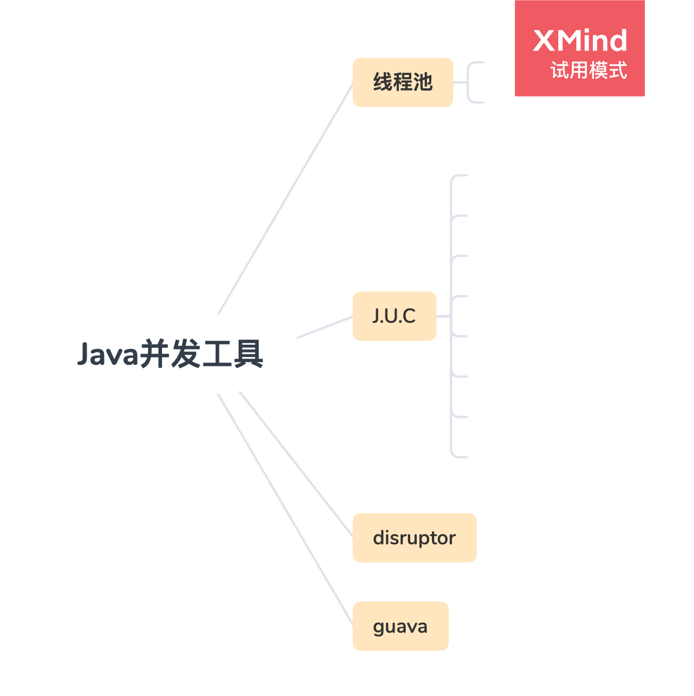
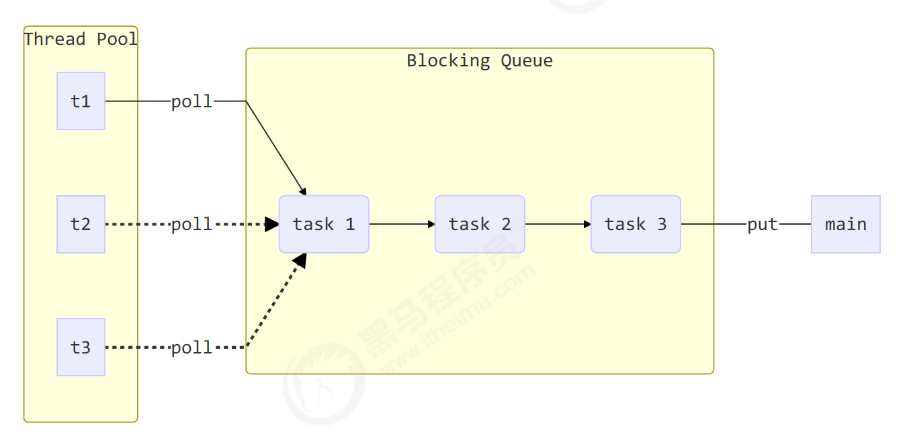
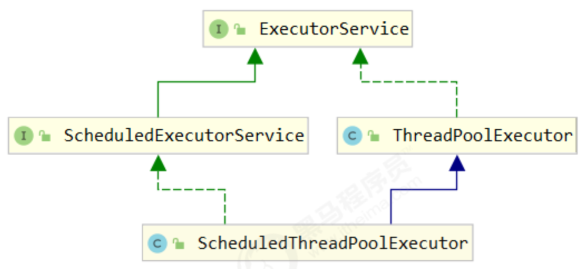
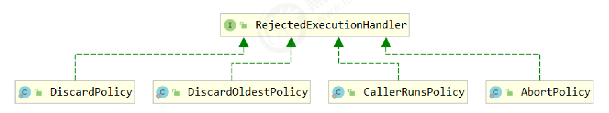
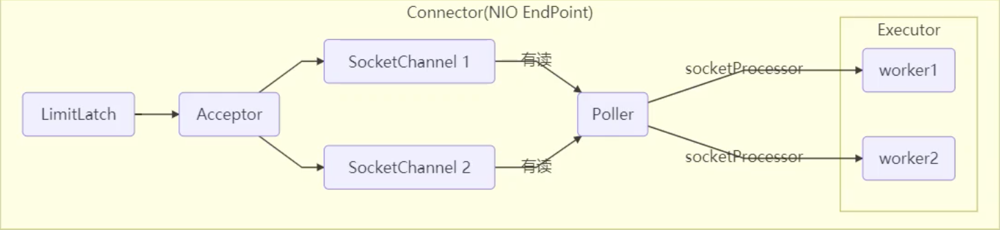
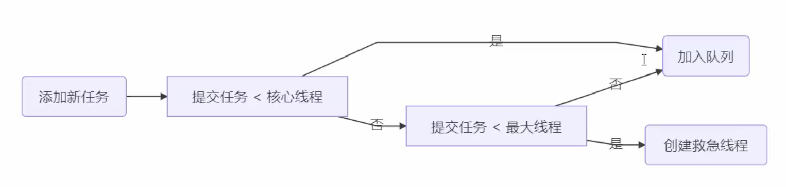
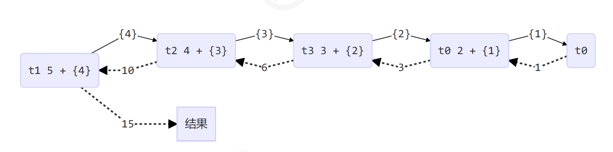
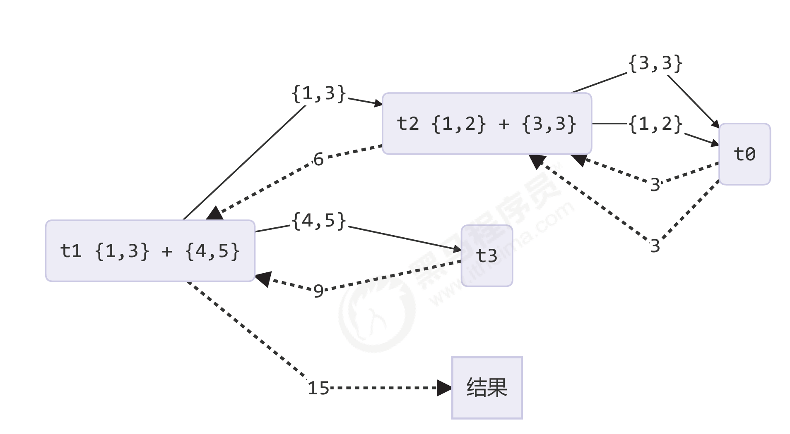

## 8.共享模型之工具



### 8.1 线程池

为什么需要线程池？

- 创建线程要花费昂贵的资源和时间，如果任务来了才创建线程那么响应时间会变长，而且一个进程能创建的线程数有限。
- 为了避免这些问题，在程序启动的时候就创建若干线程来响应处理，它们被称为线程池，里面的线程叫工作线程。
- 从JDK1.5开始，Java API提供了Executor框架让你可以创建不同的线程池。比如单线程池，每次处理一个任务；数目固定的线程池或者是缓存线程池（一个适合很多生存期短的任务的程序的可扩展线程池）

#### 8.1.1 自定义线程池（重看）



线程池（Thread Pool）获取任务（task），执行任务，相当于消费者

生产者消费者的速度可能不同，所以需要一个阻塞队列，平衡速度差异，如生产请求过多，则阻塞

阻塞队列（Block Queue）是平衡消费者线程和生产者线程的速度差异的一个组件（桥梁），非常重要


##### 案例：手写线程池

> 在理解的基础上，手写此代码

步骤1：自定义拒绝策略接口

```java
@FunctionalInterface // 拒绝策略
interface RejectPolicy<T> {
  void reject(BlockingQueue<T> queue, T task);
}
```

步骤2：自定义任务队列

```java
class BlockingQueue<T> {
  // 1. 任务队列
  private Deque<T> queue = new ArrayDeque<>();
  // 2. 锁
  // 每个线程都要在阻塞队列头部获取任务，因此需要加锁保护头部元素
  private ReentrantLock lock = new ReentrantLock();
  // 条件变量是共享变量，相当于PV操作的竞争标识
  // 3. 生产者条件变量
  private Condition fullWaitSet = lock.newCondition();
  // 4. 消费者条件变量
  private Condition emptyWaitSet = lock.newCondition();
  // 5. 容量（阻塞队列的容量上限）
  private int capcity;
  // 指定容量上限的的阻塞队列
  public BlockingQueue(int capcity) {
    this.capcity = capcity;
  }
  
  /* 阻塞获取：从队列尾部添加元素的方法 */
  
  // 带超时阻塞获取（take()的改进）
  public T poll(long timeout, TimeUnit unit) {
    lock.lock();
    try {
      // 将 timeout 统一转换为 纳秒
      long nanos = unit.toNanos(timeout);
      while (queue.isEmpty()) {
        try {
          // 返回值是剩余时间
          if (nanos <= 0) {//也就是说 经过时间 过长，超时了
            return null;
          }
          // 这里有个地方不懂，没等够就唤醒
          // 返回值 ：等待时间减去经过时间 => 剩余时间
          nanos = emptyWaitSet.awaitNanos(nanos); 
        } catch (InterruptedException e) {
          e.printStackTrace();
        }
      }
      T t = queue.removeFirst(); // 获取队列头元素
      fullWaitSet.signal();
      return t;
    } finally {
      lock.unlock();
    }
  }
  
  // 阻塞获取
  public T take() {
    lock.lock(); //获取任务要加锁
    try {
      //队列中没有元素，就需要等待
      while (queue.isEmpty()) {
        try {
          emptyWaitSet.await(); //消费者P操作
        } catch (InterruptedException e) {
          e.printStackTrace();
        }
      }
      T t = queue.removeFirst();// 获取队列头部元素：从队列头部移除
      fullWaitSet.signal(); // 生产者V操作
      return t;
    } finally {
      lock.unlock();
    }
  }
  
  // 阻塞添加
  /* 如果使用阻塞添加的话，当任务数过多超过阻塞队列的大小时，会一直等待，对main线程很不友好*/
  public void put(T task) {
    lock.lock();
    try {
      // 判断队列是否满了，忙则等待，一直循环
      while (queue.size() == capcity) {
        try {
          log.debug("等待加入任务队列 {} ...", task);
          fullWaitSet.await(); //生产者P
        } catch (InterruptedException e) {
          e.printStackTrace();
        }
      }
      log.debug("加入任务队列 {}", task);
      queue.addLast(task);
      emptyWaitSet.signal(); //消费者V
    } finally {
      lock.unlock();
    }
  }
  
  // 带超时时间阻塞添加
  public boolean offer(T task, long timeout, TimeUnit timeUnit) {
    lock.lock();
    try {
      long nanos = timeUnit.toNanos(timeout);
      while (queue.size() == capcity) {
        try {
          if(nanos <= 0) { //说明超时
            return false;
          }
          log.debug("等待加入任务队列 {} ...", task);
          nanos = fullWaitSet.awaitNanos(nanos);
        } catch (InterruptedException e) {
          e.printStackTrace();
        }
      }
      log.debug("加入任务队列 {}", task);
      queue.addLast(task);
      emptyWaitSet.signal();
      return true;
    } finally {
      lock.unlock();
    }
  }
  
  // 获取大小
  public int size() {
    lock.lock();
    try {
      return queue.size();
    } finally {
      lock.unlock();
    }
  }
  
  public void tryPut(RejectPolicy<T> rejectPolicy, T task) {
    lock.lock();
    try {
      // 判断队列是否满
      if(queue.size() == capcity) {
        // 拒绝权利下放给rejectPolicy对象完成 
        rejectPolicy.reject(this, task);
      } else { // 有空闲
        log.debug("加入任务队列 {}", task);
        queue.addLast(task);// 加入队列尾部
        emptyWaitSet.signal();
      }
    } finally {
      lock.unlock();
    }
  }
}
```

步骤3：自定义线程池

```java
class ThreadPool {
  // 任务队列
  private BlockingQueue<Runnable> taskQueue;
  // 线程集合，这里泛型要是Thread，则包含的，东西有限，所以把线程包装成worker类
  private HashSet<Worker> workers = new HashSet<>();
  // 核心线程数
  private int coreSize;
  // 获取任务时的超时时间
  private long timeout;
  // 时间单位
  private TimeUnit timeUnit;
  // 拒绝策略应构造线程池的时候就创建好，所以做成线程池的一个属性
  private RejectPolicy<Runnable> rejectPolicy;
  // 执行任务
  public void execute(Runnable task) {
    // 当任务数没有超过 coreSize 时，直接交给 worker 对象执行
    // 如果任务数超过 coreSize 时，加入任务队列暂存
    synchronized (workers) { 
      if(workers.size() < coreSize) {
        Worker worker = new Worker(task);
        log.debug("新增 worker{}, {}", worker, task);
        workers.add(worker);
        worker.start();
      } else {
        /* 队列满了，解决方法：写到线程池中就是写死了，没有扩展性，不如下放到调用者自定义，这就涉及到策略模式的设计模式，把拒绝的策略抽象成接口，具体是调用者实现 */
        // taskQueue.put(task);
        // 1) 死等
        // 2) 带超时等待
        // 3) 让调用者放弃任务执行
        // 4) 让调用者抛出异常
        // 5) 让调用者自己执行任务
        taskQueue.tryPut(rejectPolicy, task);
      }
    }
  }
  public ThreadPool(int coreSize, long timeout, TimeUnit timeUnit, int queueCapcity,
                    RejectPolicy<Runnable> rejectPolicy) {
    this.coreSize = coreSize;
    this.timeout = timeout;
    this.timeUnit = timeUnit;
    this.taskQueue = new BlockingQueue<>(queueCapcity);
    this.rejectPolicy = rejectPolicy;
  }
  // Worker类包装了一些Thread类的一些信息
  class Worker extends Thread{
    private Runnable task;
    public Worker(Runnable task) {
      this.task = task;
    }
    @Override
    public void run() {
      // 执行任务
      // 1) 当 task 不为空，执行任务
      // 2) 当 task 执行完毕，再接着从任务队列获取任务并执行
      // while(task != null || (task = taskQueue.take()) != null) {
      // 后面这一步||是说,finally后 task = null , 直接进行while循环会退出来，所以需要判断下任务队列是否为空
      while(task != null || (task = taskQueue.poll(timeout, timeUnit)) != null) {
        try {
          log.debug("正在执行...{}", task);
          task.run();
        } catch (Exception e) {
          e.printStackTrace();
        } finally {
          task = null;
        }
      }
      // 退出了循环，
      synchronized (workers) {
        log.debug("worker 被移除{}", this);
        workers.remove(this);
      }
    }
  }
}
```

步骤4：测试

```java
public static void main(String[] args) {
  ThreadPool threadPool = new ThreadPool(1,//rejectPolicy:(queue,task)->{}，函数式编程
                                         1000, TimeUnit.MILLISECONDS, 1, (queue, task)->{
                                      // 1. 死等
                                      // queue.put(task);
                                      // 2) 带超时等待
                                      // queue.offer(task, 1500, TimeUnit.MILLISECONDS);
                                      // 3) 让调用者放弃任务执行(什么都不写)
                                      // log.debug("放弃{}", task);
                                      // 4) 让调用者抛出异常
                                      // throw new RuntimeException("任务执行失败 " + task);
                                      // 5) 让调用者自己执行任务
                                           task.run();
                                      });
  for (int i = 0; i < 4; i++) {
    int j = i;
    threadPool.execute(() -> {
      try {
        Thread.sleep(1000L);
      } catch (InterruptedException e) {
        e.printStackTrace();
      }
      log.debug("{}", j);
    });
  }
}
```

#### 8.1.2 ThreadPoolExecutor



##### 1) 线程池状态

ThreadPoolExecutor 使用 int 的高 3 位来表示线程池状态，低 29 位表示线程数量

| 状态名     | 高三位 | 接受新任务 | 处理阻塞队列任务 | 说明                                      |
| ---------- | ------ | ---------- | ---------------- | ----------------------------------------- |
| RUNNING    | 111    | Y          | Y                |                                           |
| SHUTDOWN   | 000    | N          | Y                | 不会接收新任务，但会处理阻塞队列剩余任务  |
| STOP       | 001    | N          | N                | 会中断正在执行的任务，并抛弃阻塞队列任务  |
| TIDYING    | 010    | -          | -                | 任务全执行完毕，活动线程为 0 即将进入终结 |
| TERMINATED | 011    | -          | -                | 终结状态                                  |

从数字上比较，`TERMINATED > TIDYING > STOP > SHUTDOWN > RUNNING`

这些信息存储在一个原子变量 ctl 中，目的是将线程池状态与线程个数合二为一，这样就可以用一次 cas 原子操作进行赋值

```java
// c 为旧值， ctlOf 返回结果为新值
ctl.compareAndSet(c, ctlOf(targetState, workerCountOf(c))));

// rs 为高 3 位代表线程池状态， wc 为低 29 位代表线程个数，ctl 是合并它们
private static int ctlOf(int rs, int wc) { return rs | wc; }
```

##### 2) 构造方法

```java
public ThreadPoolExecutor(int corePoolSize,
                          int maximumPoolSize,
                          long keepAliveTime,
                          TimeUnit unit,
                          BlockingQueue<Runnable> workQueue,
                          ThreadFactory threadFactory,
                          RejectedExecutionHandler handler)
```

- corePoolSize 核心线程数目 (最多保留的线程数)
- maximumPoolSize 最大线程数目
- keepAliveTime 生存时间 - 针对救急线程
- unit 时间单位 - 针对救急线程
- workQueue 阻塞队列
- threadFactory 线程工厂 - 可以为线程创建时起个好名字
- handler 拒绝策略

工作方式：

> - 核心、救急线程是懒惰创建的
> - 救急线程数 = 最大线程数 - 核心线程数
> - 救急线程是临时工，懒加载，有生命周期，任务x执行完，过一段时间没有任务就会死亡

```mermaid
graph LR
subgraph 阻塞队列
size=2
t1(任务1)
t2(任务2)
t3(任务3)
end

subgraph 銭程池c=2 , m=3
ct1(核心銭程1)
ct2(核心銭程2)
mt1(救急銭程1)
ct1 --> t1(任务1)
ct2 --> t2(任务2)
end 

style ct1 fi11:#ccf,stroke:#f66, stroke -width:2px
style ct2 fill:#ccf,stroke: #f66, stroke-width:2px
style mt1 fill:#ccf,stroke: #f66 , stroke-width: 2px, stroke-dasharray: 5,5
```

- 线程池中刚开始没有线程，当一个任务提交给线程池后，线程池会创建一个新线程来执行任务。
- 当线程数达到 corePoolSize 并没有线程空闲，这时再加入任务，新加的任务会被加入workQueue 队列排队，直到有空闲的线程。
- 如果队列选择了有界队列，那么任务超过了队列大小时，会创建 maximumPoolSize - corePoolSize 数目的线程来救急。
- 如果线程到达 maximumPoolSize 仍然有新任务这时会执行拒绝策略。拒绝策略 jdk 提供了 4 种实现，其它著名框架也提供了实现
  - AbortPolicy 让调用者抛出 RejectedExecutionException 异常，这是默认策略
  - CallerRunsPolicy 让调用者运行任务
  - DiscardPolicy 放弃本次任务
  - DiscardOldestPolicy 放弃队列中最早的任务，本任务取而代之
  - Dubbo 的实现，在抛出 RejectedExecutionException 异常之前会记录日志，并 dump 线程栈信息，方便定位问题
  - Netty 的实现，是创建一个新线程来执行任务
  - ActiveMQ 的实现，带超时等待（60s）尝试放入队列，类似我们之前自定义的拒绝策略
  - PinPoint 的实现，它使用了一个拒绝策略链，会逐一尝试策略链中每种拒绝策略
- 当高峰过去后，超过corePoolSize 的救急线程如果一段时间没有任务做，需要结束节省资源，这个时间由keepAliveTime 和 unit 来控制。



根据这个构造方法，JDK Executors 类中提供了众多工厂方法来创建各种用途的线程池

##### 3) newFixedThreadPool

固定大小的线程池

```java
public static ExecutorService newFixedThreadPool(int nThreads) {
  return new ThreadPoolExecutor(nThreads, nThreads,
                                0L, TimeUnit.MILLISECONDS,
                                new LinkedBlockingQueue<Runnable>());
}
```

特点

- 核心线程数 == 最大线程数（没有救急线程被创建），因此也无需超时时间
- 阻塞队列是无界的，可以放任意数量的任务

>  **评价**：适用于任务量已知，相对耗时的任务

示例

```java
public class TestExecutor{
  public static void main(String args[]){
    //打印的线程名称依赖于之前提到的线程工厂，有默认实现也可以自定义
    ExecutorService pool = Executor.newFixedThreadPool(2);
  	// 自定义
    ExecutorService pool = Executor.newFixedThreadPool(2,new ThreadFactory(){
      private AtomicInteger t = new AtomicInteger( initialValue: 1);
      @0verride
      public Thread newThread(Runnable r) {
        return new Thread(r, name: "mypool_t" + t. getAndIncrement());
      }
    });

    // 执行三个任务
    pool.executor(()->{
      Log.debug("1")
    });

    pool.executor(()->{
      Log.debug("2")
    });
    // 由于设定两个线程大小，故第3个线程进入等待队列
    pool.executor(()->{
      Log.debug("3")
    }); 
    // 由于是固定线程池，只有核心线程，任务结束后，不会主动释放，因此需要正确结束
    // API略
  }
```

输出

```properties
# 打印的线程名称依赖于之前提到的线程工厂，有默认实现也 可以自定义（见newFixedThreadPool - ThreadExecutor - Executors.defaultThreadFactory()源码）
c.TestThreadPoolExecutors [pool-1-thread-1] - 1
c.TestThreadPoolExecutors [pool-1-thread-2] - 2
c.TestThreadPoolExecutors [pool-1-tbread-1] - 3
```

##### 4) newCachedThreadPool

带缓冲的线程池

```java
public static ExecutorService newCachedThreadPool() {
  // 不超过 Integer.MAX_VALUE 的范围，那么创建出来的全是救急线程
  return new ThreadPoolExecutor(0, Integer.MAX_VALUE,
                                60L, TimeUnit.SECONDS,
                                // 使用的队列是同步队列
                                new SynchronousQueue<Runnable>());
}
```

特点

- 核心线程数是 0， 最大线程数是 Integer.MAX_VALUE，救急线程的空闲生存时间是 60s，意味着
  - 全部都是救急线程（60s 后可以回收）
  - 救急线程可以无限创建
- 队列采用了 SynchronousQueue 实现特点是，它没有容量，没有线程来取是放不进去的（一手交钱、一手交货）

```java
SynchronousQueue<Integer> integers = new SynchronousQueue<>();
new Thread(() -> {
  try {
    log.debug("putting {} ", 1);
    integers.put(1);
    log.debug("{} putted...", 1);
    log.debug("putting...{} ", 2);
    integers.put(2);
    log.debug("{} putted...", 2);
  } catch (InterruptedException e) {
    e.printStackTrace();
  }
},"t1").start();
sleep(1);
new Thread(() -> {
  try {
    log.debug("taking {}", 1);
    integers.take();
  } catch (InterruptedException e) {
    e.printStackTrace();
  }
},"t2").start();
sleep(1);
new Thread(() -> {
  try {
    log.debug("taking {}", 2);
    integers.take();
  } catch (InterruptedException e) {
    e.printStackTrace();
  }
},"t3").start();
```

输出

```
11:48:15.500 c.TestSynchronousQueue [t1] - putting 1
11:48:16.500 c.TestSynchronousQueue [t2] - taking 1
11:48:16.500 c.TestSynchronousQueue [t1] - 1 putted...
11:48:16.500 c.TestSynchronousQueue [t1] - putting...2
11:48:17.502 c.TestSynchronousQueue [t3] - taking 2
11:48:17.503 c.TestSynchronousQueue [t1] - 2 putted...
```

> **评价** 整个线程池表现为线程数会根据任务量不断增长，没有上限，当任务执行完毕，空闲 1分钟后释放线程。 适合任务数比较密集，但每个任务执行时间较短的情况

##### 5) newSingleThreadExecutor

```java
public static ExecutorService newSingleThreadExecutor() {
  return new FinalizableDelegatedExecutorService
    (new ThreadPoolExecutor(1, 1,
                            0L, TimeUnit.MILLISECONDS,
                            new LinkedBlockingQueue<Runnable>()));
}
```

使用场景：

- 希望多个任务排队执行。线程数固定为 1，任务数多于 1 时，会放入无界队列排队。任务执行完毕，这唯一的线程也不会被释放。

疑问：

- 单线程池newSingleThreadExecutor和我自己创建一个线程执行、有什么区别呢，一个线程的线程池还有意义么？

区别：

- 自己创建一个单线程串行执行任务，如果任务执行失败而终止那么没有任何补救措施，而线程池还会新建一个线程，保证池的正常工作
- 固定大小线程池是直接把线程对象返回，而newSingleThreadExecutor在最外层又做了个包装
  - Executors.newSingleThreadExecutor() 线程个数始终为1，不能修改
    - FinalizableDelegatedExecutorService 应用的是装饰器模式，只对外暴露了 ExecutorService 接口，因此不能调用 ThreadPoolExecutor 中特有的方法（即setCorePoolSize()设置线程数）
  - Executors.newFixedThreadPool(1) 初始时为1，以后还可以修改
    - 对外暴露的是 ThreadPoolExecutor 对象，可以强转后调用 setCorePoolSize 等方法进行修改

##### 6) 提交任务

```java
// 执行任务
void execute(Runnable command);
// 提交任务 task，用返回值 Future 获得任务执行结果
<T> Future<T> submit(Callable<T> task);
// 提交 tasks 中所有任务
<T> List<Future<T>> invokeAll(Collection<? extends Callable<T>> tasks throws InterruptedException;
// 提交 tasks 中所有任务，带超时时间
<T> List<Future<T>> invokeAll(Collection<? extends Callable<T>> tasks,long timeout, TimeUnit unit)
  throws InterruptedException;
// 提交 tasks 中所有任务，哪个任务先成功执行完毕，返回此任务执行结果，其它任务取消
<T> T invokeAny(Collection<? extends Callable<T>> tasks) throws InterruptedException, ExecutionException;
// 提交 tasks 中所有任务，哪个任务先成功执行完毕，返回此任务执行结果，其它任务取消，带超时时间
<T> T invokeAny(Collection<? extends Callable<T>> tasks, long timeout, TimeUnit unit)
  throws InterruptedException, ExecutionException, TimeoutException;
```

submit()示例

- 略--https://www.bilibili.com/video/BV16J411h7Rd?p=216

invokeAll()

- 略

- 还有上述等api()暂略

##### 7) 关闭线程池

###### shutdown

不会取消正在执行的任务、已经提交到任务队列中的任务，但是调用了`shutdown()`，再执行就不可以了

```java
/*
线程池状态变为 SHUTDOWN
- 不会接收新任务
- 但已提交任务会执行完
- 此方法不会阻塞调用线程的执行
*/
void shutdown();
```

```java
public void shutdown() {
  final ReentrantLock mainLock = this.mainLock;
  mainLock.lock();
  try {
    checkShutdownAccess();
    // 修改线程池状态
    advanceRunState(SHUTDOWN);
    // 仅会打断空闲线程
    interruptIdleWorkers();
    onShutdown(); // 扩展点 ScheduledThreadPoolExecutor
  } finally {
    mainLock.unlock();
  }
  // 尝试终结(没有运行的线程可以立刻终结，如果还有运行的线程也不会等)
  tryTerminate();
}
/*
```

###### shutdownNow

```java
/*
线程池状态变为 STOP
- 不会接收新任务
- 会将队列中的任务返回
- 并用 interrupt 的方式中断正在执行的任务
*/
List<Runnable> shutdownNow();
```

```java
public List<Runnable> shutdownNow() {
  List<Runnable> tasks;
  final ReentrantLock mainLock = this.mainLock;
  mainLock.lock();
  try {
    checkShutdownAccess();
    // 修改线程池状态
    advanceRunState(STOP);
    // 打断所有线程
    interruptWorkers();
    // 获取队列中剩余任务
    tasks = drainQueue();
  } finally {
    mainLock.unlock();
  }
  // 尝试终结
  tryTerminate();
  return tasks;
}
```

###### 其它方法

```java
// 不在 RUNNING 状态的线程池，此方法就返回 true
boolean isShutdown();
// 线程池状态是否是 TERMINATED
boolean isTerminated();
// 调用 shutdown 后，由于调用线程并不会等待所有任务运行结束，因此如果它想在线程池 TERMINATED 后做些事情，可以利用此方法等待
boolean awaitTermination(long timeout, TimeUnit unit) throws InterruptedException;
```

###### **异步模式之工作线程（Worker Thread）**

##### 8) 任务调度线程池

在『任务调度线程池』功能加入之前，可以使用 java.util.Timer 来实现定时功能，Timer 的优点在于简单易用，但由于所有任务都是由同一个线程来调度，因此所有任务都是串行执行的，同一时间只能有一个任务在执行，前一个任务的延迟或异常都将会影响到之后的任务

```java
public static void main(String[] args) {
  Timer timer = new Timer();
  TimerTask task1 = new TimerTask() {
    @Override
    public void run() {
      log.debug("task 1");
      sleep(2);
    }
  };
  TimerTask task2 = new TimerTask() {
    @Override
    public void run() {
      log.debug("task 2");
    }
  };
  // 使用 timer 添加两个任务，希望它们都在 1s 后执行
  // 但由于 timer 内只有一个线程来顺序执行队列中的任务，因此『任务1』的延时，影响了『任务2』的执行
  timer.schedule(task1, 1000);
  timer.schedule(task2, 1000);
}
```

输出

```
20:46:09.444 c.TestTimer [main] - start...
20:46:10.447 c.TestTimer [Timer-0] - task 1
20:46:12.448 c.TestTimer [Timer-0] - task 2
```

使用 ScheduledExecutorService 改写：

```java
ScheduledExecutorService executor = Executors.newScheduledThreadPool(2);
// 添加两个任务，希望它们都在 1s 后执行
executor.schedule(() -> {
  System.out.println("任务1，执行时间：" + new Date());
  try { Thread.sleep(2000); } catch (InterruptedException e) { }
}, 1000, TimeUnit.MILLISECONDS);
executor.schedule(() -> {
  System.out.println("任务2，执行时间：" + new Date());
}, 1000, TimeUnit.MILLISECONDS);
```

输出

```
任务1，执行时间：Thu Jan 03 12:45:17 CST 2019
任务2，执行时间：Thu Jan 03 12:45:17 CST 2019
```

`scheduleAtFixedRate` 例子：

```java
ScheduledExecutorService pool = Executors.newScheduledThreadPool(1);
log.debug("start...");
pool.scheduleAtFixedRate(() -> {
  log.debug("running...");
}, 1, 1, TimeUnit.SECONDS);
```

输出

```
21:45:43.167 c.TestTimer [main] - start...
21:45:44.215 c.TestTimer [pool-1-thread-1] - running...
21:45:45.215 c.TestTimer [pool-1-thread-1] - running...
21:45:46.215 c.TestTimer [pool-1-thread-1] - running...
21:45:47.215 c.TestTimer [pool-1-thread-1] - running...
```

`scheduleAtFixedRate` 例子（任务执行时间超过了间隔时间）：

```java
ScheduledExecutorService pool = Executors.newScheduledThreadPool(1);
log.debug("start...");
pool.scheduleAtFixedRate(() -> {
  log.debug("running...");
  sleep(2);
}, 1, 1, TimeUnit.SECONDS);
```

输出分析：一开始，延时 1s，接下来，由于任务执行时间 > 间隔时间，间隔被『撑』到了 2s

```
21:44:30.311 c.TestTimer [main] - start...
21:44:31.360 c.TestTimer [pool-1-thread-1] - running...
21:44:33.361 c.TestTimer [pool-1-thread-1] - running...
21:44:35.362 c.TestTimer [pool-1-thread-1] - running...
21:44:37.362 c.TestTimer [pool-1-thread-1] - running...
```

scheduleWithFixedDelay 例子：

```
ScheduledExecutorService pool = Executors.newScheduledThreadPool(1);
log.debug("start...");
pool.scheduleWithFixedDelay(()-> {
log.debug("running...");
sleep(2);
}, 1, 1, TimeUnit.SECONDS);
```

输出分析：一开始，延时 1s，scheduleWithFixedDelay 的间隔是 上一个任务结束 <-> 延时 <-> 下一个任务开始所以间隔都是 3s

```
21:40:55.078 c.TestTimer [main] - start...
21:40:56.140 c.TestTimer [pool-1-thread-1] - running...
21:40:59.143 c.TestTimer [pool-1-thread-1] - running...
21:41:02.145 c.TestTimer [pool-1-thread-1] - running...
21:41:05.147 c.TestTimer [pool-1-thread-1] - running...
```

> **评价** 整个线程池表现为：线程数固定，任务数多于线程数时，会放入无界队列排队。任务执行完毕，这些线程也不会被释放。用来执行延迟或反复执行的任务

##### 9) 正确处理执行任务异常

方法1：主动捉异常

```java
ExecutorService pool = Executors.newFixedThreadPool(1);
pool.submit(() -> {
  try {
    log.debug("task1");
    int i = 1 / 0;
  } catch (Exception e) {
    log.error("error:", e);
  }
});
```

输出

```
21:59:04.558 c.TestTimer [pool-1-thread-1] - task1
21:59:04.562 c.TestTimer [pool-1-thread-1] - error:
java.lang.ArithmeticException: / by zero
      at cn.itcast.n8.TestTimer.lambda$main$0(TestTimer.java:28)
      at java.util.concurrent.Executors$RunnableAdapter.call(Executors.java:511)
      at java.util.concurrent.FutureTask.run(FutureTask.java:266)
      at java.util.concurrent.ThreadPoolExecutor.runWorker(ThreadPoolExecutor.java:1149)
      at java.util.concurrent.ThreadPoolExecutor$Worker.run(ThreadPoolExecutor.java:624)
      at java.lang.Thread.run(Thread.java:748)
```

方法2：使用 Future

```java
ExecutorService pool = Executors.newFixedThreadPool(1);
Future<Boolean> f = pool.submit(() -> {
  log.debug("task1");
  int i = 1 / 0;
  return true;
});
log.debug("result:{}", f.get());
```

输出

```
21:54:58.208 c.TestTimer [pool-1-thread-1] - task1
Exception in thread "main" java.util.concurrent.ExecutionException:
java.lang.ArithmeticException: / by zero
      at java.util.concurrent.FutureTask.report(FutureTask.java:122)
      at java.util.concurrent.FutureTask.get(FutureTask.java:192)
      at cn.itcast.n8.TestTimer.main(TestTimer.java:31)
Caused by: java.lang.ArithmeticException: / by zero
      at cn.itcast.n8.TestTimer.lambda$main$0(TestTimer.java:28)
      at java.util.concurrent.FutureTask.run(FutureTask.java:266)
      at java.util.concurrent.ThreadPoolExecutor.runWorker(ThreadPoolExecutor.java:1149)
      at java.util.concurrent.ThreadPoolExecutor$Worker.run(ThreadPoolExecutor.java:624)
      at java.lang.Thread.run(Thread.java:748)
```

###### **应用之定时任务**

##### 10) Tomcat 线程池



- LimitLatch 用来限流，可以控制最大连接个数，类似 J.U.C 中的 Semaphore 后面再讲
- Acceptor 只负责【接收新的 socket 连接】
- Poller 只负责监听 socket channel 是否有【可读的 I/O 事件】
- 一旦可读，封装一个任务对象（socketProcessor），提交给 Executor 线程池处理
- Executor 线程池中的工作线程最终负责【处理请求】

Tomcat 线程池扩展了 ThreadPoolExecutor，行为稍有不同

- 如果总线程数达到 maximumPoolSize
  - 这时不会立刻抛 RejectedExecutionException 异常
  - 而是再次尝试将任务放入队列，如果还失败，才抛出 RejectedExecutionException 异常

源码 tomcat-7.0.42

```java
// execute()覆盖了父类的ThreadPoolExecutor execute()中的方法
public void execute(Runnable command, long timeout, TimeUnit unit) {
  submittedCount.incrementAndGet();
  try {
    super.execute(command);
    //原来的逻辑：如果执行过程中超过最大线程数（核心线程在忙、队列满了），父类就会抛出拒绝执行异常
    //现在的逻辑：捕捉到这个异常，然后进行下一步处理
  } catch (RejectedExecutionException rx) {
    if (super.getQueue() instanceof TaskQueue) {
      //queue对应线程池中的阻塞队列，这里扩展成TaskQueue
      final TaskQueue queue = (TaskQueue)super.getQueue();
      try {
        //拿到阻塞队列后，再次将任务尝试加入阻塞队列（有无空位），如果还失败抛异常
        if (!queue.force(command, timeout, unit)) {
          submittedCount.decrementAndGet();
          throw new RejectedExecutionException("Queue capacity is full.");
        }
      } catch (InterruptedException x) {
        submittedCount.decrementAndGet();
        Thread.interrupted();
        throw new RejectedExecutionException(x);
      }
    } else {
      submittedCount.decrementAndGet();
      throw rx;
    }
  }
}
```

TaskQueue.java

```java
public boolean force(Runnable o, long timeout, TimeUnit unit) throws InterruptedException {
  if ( parent.isShutdown() )
    throw new RejectedExecutionException(
    "Executor not running, can't force a command into the queue"
  );
  return super.offer(o,timeout,unit); //forces the item onto the queue, to be used if the task
  is rejected
}
```

Connector 配置

| 配置项              | 默认值 | 说明                                   |
| ------------------- | ------ | -------------------------------------- |
| acceptorThreadCount | 1      | acceptor 线程数量                      |
| pollerThreadCount   | 1      | poller 线程数量                        |
| minSpareThreads     | 10     | 核心线程数，即 corePoolSize            |
| maxThreads          | 200    | 最大线程数，即 maximumPoolSize         |
| executor            | -      | Executor 名称，用来引用下面的 Executor |

Executor 线程配置

| 配置项                  | 默认值              | 说明                                      |
| ----------------------- | ------------------- | ----------------------------------------- |
| threadPriority          | 5                   | 线程优先级                                |
| daemon                  | true                | 是否守护线程                              |
| minSpareThreads         | 25                  | 核心线程数，即 corePoolSize               |
| maxThreads              | 200                 | 最大线程数，即 maximumPoolSize            |
| maxIdleTime             | 60000               | 线程生存时间，单位是毫秒，默认值即 1 分钟 |
| maxQueueSize            | `Integer.MAX_VALUE` | 队列长度                                  |
| prestartminSpareThreads | false               | 核心线程是否在服务器启动时启动            |

> 对应server.xml的对应名称的两个标签，executor默认被注释



#### 8.1.3 Fork/Join

##### 1) 概念

- Fork/Join 是 JDK 1.7 加入的新的线程池实现，它体现的是一种分治思想，适用于能够进行任务拆分的 cpu 密集型运算
- 所谓的任务拆分，是将一个大任务拆分为算法上相同的小任务，直至不能拆分可以直接求解。跟递归相关的一些计算，如归并排序、斐波那契数列、都可以用分治思想进行求解
- Fork/Join 在分治的基础上加入了多线程，可以把每个任务的分解和合并交给不同的线程来完成，进一步提升了运算效率
- Fork/Join 默认会创建与 cpu 核心数大小相同的线程池

##### 2) 使用

提交给 Fork/Join 线程池的任务需要继承 RecursiveTask（有返回值）或 RecursiveAction（没有返回值），例如下面定义了一个对 1~n 之间的整数求和的任务

```java
//Recursive递归
@Slf4j(topic = "c.AddTask")
class AddTask1 extends RecursiveTask<Integer> {
  int n;
  public AddTask1(int n) {
    this.n = n;
  }
  @Override
  public String toString() {
    return "{" + n + '}';
  }
  @Override
  protected Integer compute() {
    // 如果 n 已经为 1，可以求得结果了（类似于递归出口）
    if (n == 1) {
      log.debug("join() {}", n);
      return n;
    }
    // 将任务进行拆分(fork)
    AddTask1 t1 = new AddTask1(n - 1);
    t1.fork(); // 让一个线程执行此任务
    log.debug("fork() {} + {}", n, t1);
    // 合并(join)结果
    int result = n + t1.join(); // 获取任务结束
    log.debug("join() {} + {} = {}", n, t1, result);
    return result;
  }
}
```

然后提交给 ForkJoinPool 来执行

```java
public static void main(String[] args) {
  ForkJoinPool pool = new ForkJoinPool(4);
  System.out.println(pool.invoke(new AddTask1(5)));
}
```

结果

```
[ForkJoinPool-1-worker-0] - fork() 2 + {1}
[ForkJoinPool-1-worker-1] - fork() 5 + {4}
[ForkJoinPool-1-worker-0] - join() 1
[ForkJoinPool-1-worker-0] - join() 2 + {1} = 3
[ForkJoinPool-1-worker-2] - fork() 4 + {3}
[ForkJoinPool-1-worker-3] - fork() 3 + {2}
[ForkJoinPool-1-worker-3] - join() 3 + {2} = 6
[ForkJoinPool-1-worker-2] - join() 4 + {3} = 10
[ForkJoinPool-1-worker-1] - join() 5 + {4} = 15
15
```

用图来表示



改进：

- 如上图所示，拆分任务之间是依赖的(t1 5依赖4的返回结果，如果不返回就会一直等，以此类推)
- 如何拆分是关键（难点）

```java
class AddTask3 extends RecursiveTask<Integer> {
  int begin;
  int end;
  public AddTask3(int begin, int end) {
    this.begin = begin;
    this.end = end;
  }
  @Override
  public String toString() {
    return "{" + begin + "," + end + '}';
  }
  @Override
  protected Integer compute() {
    // 5, 5
    if (begin == end) {
      log.debug("join() {}", begin);
      return begin;
    }
    // 4, 5
    if (end - begin == 1) {
      log.debug("join() {} + {} = {}", begin, end, end + begin);
      return end + begin;
    }
    // 1 5
    int mid = (end + begin) / 2; // 3
    AddTask3 t1 = new AddTask3(begin, mid); // 1,3
    t1.fork();
    AddTask3 t2 = new AddTask3(mid + 1, end); // 4,5
    t2.fork();
    log.debug("fork() {} + {} = ?", t1, t2);
    int result = t1.join() + t2.join();
    log.debug("join() {} + {} = {}", t1, t2, result);
    return result;
  }
}
```

然后提交给 ForkJoinPool 来执行

```java
public static void main(String[] args) {
  ForkJoinPool pool = new ForkJoinPool(4);
  System.out.println(pool.invoke(new AddTask3(1, 10)));
}
```

结果

```
[ForkJoinPool-1-worker-0] - join() 1 + 2 = 3
[ForkJoinPool-1-worker-3] - join() 4 + 5 = 9
[ForkJoinPool-1-worker-0] - join() 3
[ForkJoinPool-1-worker-1] - fork() {1,3} + {4,5} = ?
[ForkJoinPool-1-worker-2] - fork() {1,2} + {3,3} = ?
[ForkJoinPool-1-worker-2] - join() {1,2} + {3,3} = 6
[ForkJoinPool-1-worker-1] - join() {1,3} + {4,5} = 15
15
```

用图来表示



### 8.2 J.U.C（面试高频）

#### 8.2.1 AQS原理(不太明白)

# 再看一遍

- 后续可以看博客+B站+pdf上的综合整理
- 源码阅读：AbstractQueuedSynchronizer.java

#### 8.2.2 ReentrantLock原理

​	后续可以看博客+B站+pdf上的综合整理

#### 8.2.3 读写锁

##### (1) ReentrantReadWriteLock读写锁

当读操作远远高于写操作时，这时候使用 读写锁 让 读-读 可以并发，提高性能。 类似于数据库中的 `select ...from ... lock in share mode`

###### ReentrantReadWriteLock使用

提供一个 数据容器类 内部分别使用读锁保护数据的 `read()` 方法，写锁保护数据的 `write()` 方法

```java
class DataContainer {
  private Object data;
  private ReentrantReadWriteLock rw = new ReentrantReadWriteLock();
  private ReentrantReadWriteLock.ReadLock r = rw.readLock();
  private ReentrantReadWriteLock.WriteLock w = rw.writeLock();
  public Object read() {
    log.debug("获取读锁...");
    r.lock();
    try {
      log.debug("读取");
      sleep(1);
      return data;
    } finally {
      log.debug("释放读锁...");
      r.unlock();
    }
  }
  public void write() {
    log.debug("获取写锁...");
    w.lock();
    try {
      log.debug("写入");
      sleep(1);
    } finally {
      log.debug("释放写锁...");
      w.unlock();
    }
  }
}
```

测试 `读锁-读锁` 可以并发

```java
DataContainer dataContainer = new DataContainer();
new Thread(() -> {
  dataContainer.read();
}, "t1").start();
new Thread(() -> {
  dataContainer.read();
}, "t2").start();
```

输出结果，从这里可以看到 Thread-0 锁定期间，Thread-1 的读操作不受影响

```
14:05:14.341 c.DataContainer [t2] - 获取读锁...
14:05:14.341 c.DataContainer [t1] - 获取读锁...
14:05:14.345 c.DataContainer [t1] - 读取
14:05:14.345 c.DataContainer [t2] - 读取
14:05:15.365 c.DataContainer [t2] - 释放读锁...
14:05:15.386 c.DataContainer [t1] - 释放读锁...
```

测试 `读锁-写锁` 相互阻塞

```java
DataContainer dataContainer = new DataContainer();
new Thread(() -> {
  dataContainer.read();
}, "t1").start();
Thread.sleep(100);
new Thread(() -> {
  dataContainer.write();
}, "t2").start();
```

输出结果

```
14:04:21.838 c.DataContainer [t1] - 获取读锁...
14:04:21.838 c.DataContainer [t2] - 获取写锁...
14:04:21.841 c.DataContainer [t2] - 写入
14:04:22.843 c.DataContainer [t2] - 释放写锁...
14:04:22.843 c.DataContainer [t1] - 读取
14:04:23.843 c.DataContainer [t1] - 释放读锁...
```

`写锁-写锁` 也是相互阻塞的，这里就不测试了

###### ReentrantReadWriteLock 注意事项

- 读锁不支持条件变量(Collection)
- 重入时升级不支持：即持有读锁的情况下去获取写锁，会导致获取写锁永久等待
  - 虽然`ReentrantLock`支持可重入，但是读写锁有限制

```java
r.lock();
try {
  // ...
  w.lock();
  try {
    // ...
  } finally{
    w.unlock();
  }
} finally{
  r.unlock();
}
```

- 重入时降级支持：即持有写锁的情况下去获取读锁

```java
//源码
class CachedData {
  Object data; //缓存的数据
  // 是否有效，如果失效，需要重新计算 data
  volatile boolean cacheValid;
  final ReentrantReadWriteLock rwl = new ReentrantReadWriteLock();
  void processCachedData() {
    rwl.readLock().lock();
    if (!cacheValid) { //如果失效
      // 获取写锁前必须释放读锁
      rwl.readLock().unlock();
      rwl.writeLock().lock();
      try {
        // 判断是否有其它线程已经获取了写锁、更新了缓存, 避免重复更新
        if (!cacheValid) {
          data = ...
            cacheValid = true;
        }
        // 降级为读锁, 释放写锁, 这样能够让其它线程读取缓存
        rwl.readLock().lock();
      } finally {
        rwl.writeLock().unlock();
      }
    }
    // 自己用完数据, 释放读锁
    try {
      use(data);
    } finally {
      rwl.readLock().unlock();
    }
  }
}
```

##### (2) 应用之缓存

见应用篇

###### 不加锁的缓存示例

```java
public class GenericDaoCached extends GenericDao{
  private GenericDao dao = new GenericDao() ;
	private Map<SqlPair, Object> map = new HashMap<>();
  @Override
  public <T> T queryOne(Class<T> beanClass, String sql, Object... args) {
    //先从缓存中找，找到直接返回
    SqlPair key = new SqlPair(sql, args);//缓存数据结构对象
    T value = (T)map.get(key); // 查询缓存
    if(value != null) { // 缓存不为空返回
      return value;
    }
    //缓存中没有，查询数据库
    value = dao.queryOne(beanClass, sql, args);
    map. put(key,value);
    return value;
  }
  public void update(String sql, Object... args){
    map.clear(); // 清空缓存
    dao.update(sql,args) //更新数据库
  }
  class Sqlpair{
    private String sql;
    private Object[] args; //sql查询返回的结果
    public SqlPair(String sql, Object[ ] args){
      this.sql = sql;
      this.args = args;
    }
  }
}
```

会出现的问题：

- HashMap非线程安全

- 首次缓存中没有数据时，多个线程会同时查询数据库，即还是会有多次query的情况

- `update()`中，**清空缓存和更新数据可能造成数据库与缓存不一致的情况(双写不一致)**

  > 对于双写不一致，见应用篇缓存更新策略

###### 缓存更新策略

- 见应用篇

##### (3) ReentrantReadWriteLock读写锁原理

# 结合课程再看一遍

- 源码阅读：ReentrantReadWriteLock.java

笔记：见原理篇

##### (4) StampedLock读写锁

该类自 JDK 8 加入，是为了进一步优化读性能，它的特点是在使用读锁、写锁时都必须配合【戳】使用

加解读锁

```java
long stamp = lock.readLock();
lock.unlockRead(stamp);
```

加解写锁

```java
long stamp = lock.writeLock();
lock.unlockWrite(stamp);
```

乐观读，StampedLock 支持 `tryOptimisticRead()` 方法（乐观读），读取完毕后需要做一次 **戳校验** 如果校验通过，表示这期间确实没有写操作，数据可以安全使用，如果校验没通过，需要重新获取读锁，保证数据安全。

```java
long stamp = lock.tryOptimisticRead();
// 验戳
if(!lock.validate(stamp)){
  // 锁升级
}
```

提供一个 数据容器类 内部分别使用读锁保护数据的 `read()` 方法，写锁保护数据的 `write()` 方法

```java
class DataContainerStamped {
  private int data;
  private final StampedLock lock = new StampedLock();
  public DataContainerStamped(int data) {
    this.data = data;
  }
  public int read(int readTime) {
    long stamp = lock.tryOptimisticRead();
    log.debug("optimistic read locking...{}", stamp);
    sleep(readTime);
    if (lock.validate(stamp)) {
      log.debug("read finish...{}, data:{}", stamp, data);
      return data;
    }
    // 锁升级 - 读锁
    log.debug("updating to read lock... {}", stamp);
    try {
      stamp = lock.readLock();
      log.debug("read lock {}", stamp);
      sleep(readTime);
      log.debug("read finish...{}, data:{}", stamp, data);
      return data;
    } finally {
      log.debug("read unlock {}", stamp);
      lock.unlockRead(stamp);
    }
  }
  public void write(int newData) {
    long stamp = lock.writeLock();
    log.debug("write lock {}", stamp);
    try {
      sleep(2);
      this.data = newData;
    } finally {
      log.debug("write unlock {}", stamp);
      lock.unlockWrite(stamp);
    }
  }
}
```

测试 **读-读** 可以优化

```java
public static void main(String[] args) {
  DataContainerStamped dataContainer = new DataContainerStamped(1);
  new Thread(() -> {
    dataContainer.read(1);
  }, "t1").start();
  sleep(0.5);
  new Thread(() -> {
    dataContainer.read(0);
  }, "t2").start();
}
```

输出结果，可以看到实际没有加读锁

```
15:58:50.217 c.DataContainerStamped [t1] - optimistic read locking...256
15:58:50.717 c.DataContainerStamped [t2] - optimistic read locking...256
15:58:50.717 c.DataContainerStamped [t2] - read finish...256, data:1
15:58:51.220 c.DataContainerStamped [t1] - read finish...256, data:1
```

测试 **读-写** 时优化读补加读锁

```java
public static void main(String[] args) {
  DataContainerStamped dataContainer = new DataContainerStamped(1);
  new Thread(() -> {
    dataContainer.read(1);
  }, "t1").start();
  sleep(0.5);
  new Thread(() -> {
    dataContainer.write(100);
  }, "t2").start();
}
```

输出结果

```
15:57:00.219 c.DataContainerStamped [t1] - optimistic read locking...256
15:57:00.717 c.DataContainerStamped [t2] - write lock 384
15:57:01.225 c.DataContainerStamped [t1] - updating to read lock... 256
15:57:02.719 c.DataContainerStamped [t2] - write unlock 384
15:57:02.719 c.DataContainerStamped [t1] - read lock 513
15:57:03.719 c.DataContainerStamped [t1] - read finish...513, data:1000
15:57:03.719 c.DataContainerStamped [t1] - read unlock 513
```

> 注意
>
> - StampedLock 不支持条件变量
> - StampedLock 不支持可重入

#### 8.2.4 Semaphore

[ˈsɛməˌfɔr] 信号量，用来限制能同时访问共享资源的线程上限

##### (1) 基本使用

```java
public static void main(String[] args) {
  // 1. 创建 semaphore 对象
  Semaphore semaphore = new Semaphore(3);
  // 2. 10个线程同时运行
  for (int i = 0; i < 10; i++) {
    new Thread(() -> {
      // 3. 获取许可
      try {
        semaphore.acquire();
      } catch (InterruptedException e) {
        e.printStackTrace();
      }
      try {
        log.debug("running...");
        sleep(1);
        log.debug("end...");
      } finally {
        // 4. 释放许可
        semaphore.release();
      }
    }).start();
  }
}
```

输出

```
07:35:15.485 c.TestSemaphore [Thread-2] - running...
07:35:15.485 c.TestSemaphore [Thread-1] - running...
07:35:15.485 c.TestSemaphore [Thread-0] - running...
07:35:16.490 c.TestSemaphore [Thread-2] - end...
07:35:16.490 c.TestSemaphore [Thread-0] - end...
07:35:16.490 c.TestSemaphore [Thread-1] - end...
07:35:16.490 c.TestSemaphore [Thread-3] - running...
07:35:16.490 c.TestSemaphore [Thread-5] - running...
07:35:16.490 c.TestSemaphore [Thread-4] - running...
07:35:17.490 c.TestSemaphore [Thread-5] - end...
07:35:17.490 c.TestSemaphore [Thread-4] - end...
07:35:17.490 c.TestSemaphore [Thread-3] - end...
07:35:17.490 c.TestSemaphore [Thread-6] - running...
07:35:17.490 c.TestSemaphore [Thread-7] - running...
07:35:17.490 c.TestSemaphore [Thread-9] - running...
07:35:18.491 c.TestSemaphore [Thread-6] - end...
07:35:18.491 c.TestSemaphore [Thread-7] - end...
07:35:18.491 c.TestSemaphore [Thread-9] - end...
07:35:18.491 c.TestSemaphore [Thread-8] - running...
07:35:19.492 c.TestSemaphore [Thread-8] - end...
```

##### (2) Semaphore 应用

见应用篇

##### (3) Semaphore 原理

见原理篇

#### 8.2.5 CountdownLatch

##### (1) 介绍

- 用来进行线程同步协作，等待所有线程完成倒计时
- 其中构造参数用来初始化等待计数值，await() 用来等待计数归零，countDown() 用来让计数减一

##### (2) 与join对比

- join属于比较底层api，使用繁琐，countDownLatch属于封装比较高级的API，适用于多个场景

##### (3) 基本使用

```java
public static void main(String[] args) throws InterruptedException {
  CountDownLatch latch = new CountDownLatch(3);
  new Thread(() -> {
    log.debug("begin...");
    sleep(1);
    latch.countDown();
    log.debug("end...{}", latch.getCount());
  }).start();
  new Thread(() -> {
    log.debug("begin...");
    sleep(2);
    latch.countDown();
    log.debug("end...{}", latch.getCount());
  }).start();
  new Thread(() -> {
    log.debug("begin...");
    sleep(1.5);
    latch.countDown();
    log.debug("end...{}", latch.getCount());
  }).start();
  log.debug("waiting...");
  latch.await();
  log.debug("wait end...");
}
```

输出

```
18:44:00.778 c.TestCountDownLatch [main] - waiting...
18:44:00.778 c.TestCountDownLatch [Thread-2] - begin...
18:44:00.778 c.TestCountDownLatch [Thread-0] - begin...
18:44:00.778 c.TestCountDownLatch [Thread-1] - begin...
18:44:01.782 c.TestCountDownLatch [Thread-0] - end...2
18:44:02.283 c.TestCountDownLatch [Thread-2] - end...1
18:44:02.782 c.TestCountDownLatch [Thread-1] - end...0
18:44:02.782 c.TestCountDownLatch [main] - wait end...
```

可以配合线程池使用，改进如下

```java
public static void main(String[] args) throws InterruptedException {
  CountDownLatch latch = new CountDownLatch(3);
  ExecutorService service = Executors.newFixedThreadPool(4);
  service.submit(() -> {
    log.debug("begin...");
    sleep(1);
    latch.countDown();
    log.debug("end...{}", latch.getCount());
  });
  service.submit(() -> {
    log.debug("begin...");
    sleep(1.5);
    latch.countDown();
    log.debug("end...{}", latch.getCount());
  });
  service.submit(() -> {
    log.debug("begin...");
    sleep(2);
    latch.countDown();
    log.debug("end...{}", latch.getCount());
  });
  service.submit(()->{
    try {
      log.debug("waiting...");
      latch.await();
      log.debug("wait end...");
    } catch (InterruptedException e) {
      e.printStackTrace();
    }
  });
}
```

输出

```
18:52:25.831 c.TestCountDownLatch [pool-1-thread-3] - begin...
18:52:25.831 c.TestCountDownLatch [pool-1-thread-1] - begin...
18:52:25.831 c.TestCountDownLatch [pool-1-thread-2] - begin...
18:52:25.831 c.TestCountDownLatch [pool-1-thread-4] - waiting...
18:52:26.835 c.TestCountDownLatch [pool-1-thread-1] - end...2
18:52:27.335 c.TestCountDownLatch [pool-1-thread-2] - end...1
18:52:27.835 c.TestCountDownLatch [pool-1-thread-3] - end...0
18:52:27.835 c.TestCountDownLatch [pool-1-thread-4] - wait end...
```

##### (4) 应用：同步等待多线程准备完毕

###### 代码1（可以理解为LOL游戏加载）

```java
AtomicInteger num = new AtomicInteger(0);
ExecutorService service = Executors.newFixedThreadPool(10, (r) -> {
  return new Thread(r, "t" + num.getAndIncrement());
});
CountDownLatch latch = new CountDownLatch(10);
String[] all = new String[10];
Random r = new Random();
for (int j = 0; j < 10; j++) {
  int x = j;
  service.submit(() -> {
    for (int i = 0; i <= 100; i++) {
      try {
        Thread.sleep(r.nextInt(100));
      } catch (InterruptedException e) {
      }
      all[x] = Thread.currentThread().getName() + "(" + (i + "%") + ")";
      System.out.print("\r" + Arrays.toString(all));
    }
    latch.countDown();
  });
}
latch.await();
System.out.println("\n游戏开始...");
service.shutdown();
```

###### 代码2（可以理解为LOL游戏加载）

```java
public class CountDownLatchDemo {
    public static void main(String[] args) throws InterruptedException {
        ExecutorService service = Executors.newFixedThreadPool(10);
        Random r = new Random();
        CountDownLatch latch = new CountDownLatch(10);
        String[] all = new String[10];
        for (int j = 0; j < all.length; j++) {
            int k = j; //因为lambda表达式只能引用局部的常量，所以定义k
            service.submit(()->{
                for (int i = 0; i <= 100; i++) {
                    try {
                        Thread.sleep(r.nextInt(100));
                    } catch (InterruptedException e) {
                        e.printStackTrace();
                    }
                    // all[j] = i+"%"; //报错因为lambda表达式只能引用局部的常量而不是变量
                     all[k] = i+"%";
                    // print不换行，"\r"，后面值覆盖前面，起到进度条效果
                    System.out.print("\r"+ Arrays.toString(all));
                }
                latch.countDown();//计数器减一
            });
        }
        latch.await();//主线程等待线程执行完成
        System.out.println("\n全军出击！");
        service.shutdown();
    }
}
```

中间输出（游戏加载中）

```
[t0(52%), t1(47%), t2(51%), t3(40%), t4(49%), t5(44%), t6(49%), t7(52%), t8(46%), t9(46%)]
```

最后输出

```
[t0(100%), t1(100%), t2(100%), t3(100%), t4(100%), t5(100%), t6(100%), t7(100%), t8(100%),
t9(100%)]
游戏开始...
```

##### (5) 应用：同步等待多个远程调用结束

如果不使用CountDownLatch，则会串行结束，运行体验极差

基于SpringBoot RestTemplate的Resultful API实现

```java
@RestController
public class TestCountDownlatchController {
  @GetMapping("/order/{id}")
  public Map<String, Object> order(@PathVariable int id) {
    HashMap<String, Object> map = new HashMap<>();
    map.put("id", id);
    map.put("total", "2300.00");
    sleep(2000);
    return map;
  }
  @GetMapping("/product/{id}")
  public Map<String, Object> product(@PathVariable int id) {
    HashMap<String, Object> map = new HashMap<>();
    if (id == 1) {
      map.put("name", "小爱音箱");
      map.put("price", 300);
    } else if (id == 2) {
      map.put("name", "小米手机");
      map.put("price", 2000);
    }
    map.put("id", id);
    sleep(1000);
    return map;
  }
  @GetMapping("/logistics/{id}")
  public Map<String, Object> logistics(@PathVariable int id) {
    HashMap<String, Object> map = new HashMap<>();
    map.put("id", id);
    map.put("name", "中通快递");
    sleep(2500);
    return map;
  }
  private void sleep(int millis) {
    try {
      Thread.sleep(millis);
    } catch (InterruptedException e) {
      e.printStackTrace();
    }
  }
}
```

rest 远程调用

```java
RestTemplate restTemplate = new RestTemplate();
log.debug("begin");
ExecutorService service = Executors.newCachedThreadPool();
CountDownLatch latch = new CountDownLatch(4);
Future<Map<String,Object>> f1 = service.submit(() -> {
  Map<String, Object> r =
    restTemplate.getForObject("http://localhost:8080/order/{1}", Map.class, 1);
  return r;
});
Future<Map<String, Object>> f2 = service.submit(() -> {
  Map<String, Object> r =
    restTemplate.getForObject("http://localhost:8080/product/{1}", Map.class, 1);
  return r;
});
Future<Map<String, Object>> f3 = service.submit(() -> {
  Map<String, Object> r =
    restTemplate.getForObject("http://localhost:8080/product/{1}", Map.class, 2);
  return r;
});
Future<Map<String, Object>> f4 = service.submit(() -> {
  Map<String, Object> r =
    restTemplate.getForObject("http://localhost:8080/logistics/{1}", Map.class, 1);
  return r;
});
System.out.println(f1.get());
System.out.println(f2.get());
System.out.println(f3.get());
System.out.println(f4.get());
log.debug("执行完毕");
service.shutdown();
```

执行结果

```
19:51:39.711 c.TestCountDownLatch [main] - begin
{total=2300.00, id=1}
{price=300, name=小爱音箱, id=1}
{price=2000, name=小米手机, id=2}
{name=中通快递, id=1}
19:51:42.407 c.TestCountDownLatch [main] - 执行完毕
```

#### 8.2.6 CyclicBarrier

看一个代码示例，我们希望task1... task2...反复运行3次

```java
// log.debug 可用 sout代替
public class CyclicBarrierDemo {
    public static void main(String[] args) throws InterruptedException {
        ExecutorService executorService = Executors.newFixedThreadPool(5);
        for (int i = 0; i < 3; i++) {
          	//每次循环都要创建，不可以重用，原因是latch不可以 setCount()，只能get
						CountDownLatch latch = new CountDownLatch(2); 
            executorService.submit(() -> {
                System.out.println("task1...start");
                latch.countDown();
                try {
                    Thread.sleep(1000);
                } catch (InterruptedException e) {
                    e.printStackTrace();
                }
            });

            executorService.submit(() -> {
                System.out.println("task2...start");
                latch.countDown();
                try {
                    Thread.sleep(2000);
                } catch (InterruptedException e) {
                    e.printStackTrace();
                }
            });

            latch.await(); //唤醒
            System.out.println("task1...task2...end");
        }
        executorService.shutdown();
    }
}
```

new countdownlatch(2)不可修改count值，所以引出了CyclicBarrier

- 比起上面的，可以重复调用
- 任务数最好与线程数保持一致才能发挥最大效果
  - 循环3次，循环体内有任务task1、task2，意味着提交6个任务；
  - 有3个线程意味着一开始有3个线程同时执行submit() ；
  - 那么执行顺序为 循环1：task1,task2，循环2：task1，而每个任务的消耗时间不同，task1=1，task2=2
  - 造成的后果是，两次task1，先把barrier计数器减为0，那么与预期的task1，task2顺序消耗为0不一致

```java
// log.debug 可用 sout代替
public class CyclicBarrierDemo2{
    public static void main(String[] args) throws InterruptedException {
        ExecutorService executorService = Executors.newFixedThreadPool(2);
        for (int i = 0; i < 3; i++) {
						CyclicBarrier barrier = new CyclicBarrier(2,()->{
              Log.debug("task1,task2 finish"); //一轮任务结束后执行，如下循环了3次，输出三轮(写死)
            });
            executorService.submit(() -> {
                System.out.println("task1...start");
                try {
                    Thread.sleep(1000);
                  	barrier.await(); // 2-1
                } catch (InterruptedException e|BrokenBarrierExecption e) {
                    e.printStackTrace();
                }
            });

            executorService.submit(() -> {
                System.out.println("task1...start");
                try {
                    Thread.sleep(2000);
                  	barrier.await; // 2-1
                } catch (InterruptedException e|BrokenBarrierExecption e) {
                    e.printStackTrace();
                }
            });
        }
        executorService.shutdown();
    }
}
```

#### 8.2.7 线程集合安全类(面试高频)

##### (1) concurrentHashMap

通过一个练习，引出 concurrentHashMap的使用

###### 单词计数

生成测试数据

```java
static final String ALPHA = "abcedfghijklmnopqrstuvwxyz";
public static void main(String[] args) {
  int length = ALPHA.length();
  int count = 200;
  List<String> list = new ArrayList<>(length * count);
  for (int i = 0; i < length; i++) {
    char ch = ALPHA.charAt(i);
    for (int j = 0; j < count; j++) {
      list.add(String.valueOf(ch));
    }
  }
  Collections.shuffle(list);
  for (int i = 0; i < 26; i++) {
    try (PrintWriter out = new PrintWriter(
      new OutputStreamWriter(
        new FileOutputStream("tmp/" + (i+1) + ".txt")))) {
      String collect = list.subList(i * count, (i + 1) * count).stream()
        .collect(Collectors.joining("\n"));
      out.print(collect);
    } catch (IOException e) {
    }
  }
}
```

模版代码，模版代码中封装了多线程读取文件的代码

```java
private static <V> void demo(Supplier<Map<String,V>> supplier,
                             BiConsumer<Map<String,V>,List<String>> consumer) {
  Map<String, V> counterMap = supplier.get();
  List<Thread> ts = new ArrayList<>();
  for (int i = 1; i <= 26; i++) {
    int idx = i;
    Thread thread = new Thread(() -> {
      List<String> words = readFromFile(idx);
      consumer.accept(counterMap, words);
    });
    ts.add(thread);
  }
  ts.forEach(t->t.start());
  ts.forEach(t-> {
    try {
      t.join();
    } catch (InterruptedException e) {
      e.printStackTrace();
    }
  });
  System.out.println(counterMap);
}
public static List<String> readFromFile(int i) {
  ArrayList<String> words = new ArrayList<>();
  try (BufferedReader in = new BufferedReader(new InputStreamReader(new FileInputStream("tmp/" + i +".txt")))) {
    while(true) {
      String word = in.readLine();
      if(word == null) {
        break;
      }
      words.add(word);
    }
    return words;
  } catch (IOException e) {
    throw new RuntimeException(e);
  }
}
```

要做的是实现两个参数

- 是提供一个 map 集合，用来存放每个单词的计数结果，key 为单词，value 为计数

- 是提供一组操作，保证计数的安全性，会传递 map 集合以及 单词 List

正确结果输出应该是每个单词出现 200 次

```
{a=200, b=200, c=200, d=200, e=200, f=200, g=200, h=200, i=200, j=200, k=200, l=200, m=200,
n=200, o=200, p=200, q=200, r=200, s=200, t=200, u=200, v=200, w=200, x=200, y=200, z=200}
```

下面的实现为：

```java
demo(
  // 1.创建 map 集合
  // 2。创建 ConcurrentHashMap 对不对？不对，关键是没有用对(get、put组合问题)
  // () -> new HashMap<String, Integer>(), // 普通HashMap有线程安全问题
  () -> new ConcurrentHashMap<String, Integer>(),
  // 进行计数
  (map, words) -> {
    for (String word : words) {
      // get、put分别是原子操作，但是结合起来就不是原子操作(之前有讲)
      /*逻辑：检查是否有key，没有则put到map中，有则执行累加，再put*/
      Integer counter = map.get(word);
      int newValue = counter == null ? 1 : counter + 1;
      map.put(word, newValue);
      /*改进逻辑, 使用juc包下提供的方法执行上述逻辑的一串操作（原子操作），保证线程安全*/
      // 问题: value累加再去put的操作，不是原子性的 -> 保证累加操作也是原子性的 -> 原子累加器
      int value = map.computeIfAbsent(word, (key) -> value + 1)
      // 如下改进代码
    }
  }
);
```

有没有问题？请改进

解答1

```java
demo(
  () -> new ConcurrentHashMap<String, LongAdder>(),
  (map, words) -> {
    for (String word : words) {
      // 注意不能使用 putIfAbsent，此方法返回的是上一次的 value，首次调用返回 null
      map.computeIfAbsent(word, (key) -> new LongAdder()).increment();
      // 等同于下
      // LongAdder value  =  map.computeIfAbsent(word, (key) -> new LongAdder());
      // value.increment(); //累加
    }
  }
);
```

解答2

```java
demo(
  () -> new ConcurrentHashMap<String, Integer>(),
  (map, words) -> {
    for (String word : words) {
      // 函数式编程，无需原子变量
      map.merge(word, 1, Integer::sum);
    }
  }
);
```

##### (2) concurrentHashMap 原理(面试超高频)

###### JDK 7 HashMap 并发死链

并发死链：https://www.bilibili.com/video/BV16J411h7Rd?p=279，建议重看 279-280

> - 要在 JDK 7 下运行，否则扩容机制和 hash 的计算方法都变了
> - 以下测试代码是精心准备的，不要随便改动

测试代码

```java
public static void main(String[] args) {
  // 测试 java 7 中哪些数字的 hash 结果相等
  System.out.println("长度为16时，桶下标为1的key");
  for (int i = 0; i < 64; i++) {
    if (hash(i) % 16 == 1) {
      System.out.println(i);
    }
  }
  System.out.println("长度为32时，桶下标为1的key");
  for (int i = 0; i < 64; i++) {
    if (hash(i) % 32 == 1) {
      System.out.println(i);
    }
  }
  // 1, 35, 16, 50 当大小为16时，它们在一个桶内
  final HashMap<Integer, Integer> map = new HashMap<Integer, Integer>();
  // 放 12 个元素
  map.put(2, null);
  map.put(3, null);
  map.put(4, null);
  map.put(5, null);
  map.put(6, null);
  map.put(7, null);
  map.put(8, null);
  map.put(9, null);
  map.put(10, null);
  map.put(16, null);
  map.put(35, null);
  map.put(1, null);
  System.out.println("扩容前大小[main]:"+map.size());
  new Thread() {
    @Override
    public void run() {
      // 放第 13 个元素, 发生扩容
      map.put(50, null);
      System.out.println("扩容后大小[Thread-0]:"+map.size());
    }
  }.start();
  new Thread() {
    @Override
    public void run() {
      // 放第 13 个元素, 发生扩容
      map.put(50, null);
      System.out.println("扩容后大小[Thread-1]:"+map.size());
    }
  }.start();
}
final static int hash(Object k) {
  int h = 0;
  if (0 != h && k instanceof String) {
    return sun.misc.Hashing.stringHash32((String) k);
  }
  h ^= k.hashCode();
  h ^= (h >>> 20) ^ (h >>> 12);
  return h ^ (h >>> 7) ^ (h >>> 4);
}
```

死链复现

> - 调试工具使用 idea
> - 在 HashMap 源码 590 行加断点

```java
int newCapacity = newTable.length;
```

断点的条件如下，目的是让 HashMap 在扩容为 32 时，并且线程为 Thread-0 或 Thread-1 时停下来

```java
newTable.length==32 &&
(
  Thread.currentThread().getName().equals("Thread-0")||
  Thread.currentThread().getName().equals("Thread-1")
)
```

- 断点暂停方式选择 Thread，否则在调试 Thread-0 时，Thread-1 无法恢复运行
- 运行代码，程序在预料的断点位置停了下来，输出

```
长度为16时，桶下标为1的key
1
16
35
50
长度为32时，桶下标为1的key
1
35
扩容前大小[main]:12
```

- 接下来进入扩容流程调试
- 在 HashMap 源码 594 行加断点

```java
Entry<K,V> next = e.next; // 593
if (rehash) // 594
// ...
```

- 这是为了观察 e 节点和 next 节点的状态，Thread-0 单步执行到 594 行，再 594 处再添加一个断点（条件Thread.currentThread().getName().equals("Thread-0")）
- 这时可以在 Variables 面板观察到 e 和 next 变量，使用 view as -> Object 查看节点状态

```
e (1)->(35)->(16)->null
next (35)->(16)->null
```

在 Threads 面板选中 Thread-1 恢复运行，可以看到控制台输出新的内容如下，Thread-1 扩容已完成

```
newTable[1] (35)->(1)->null
```

```
扩容后大小:13
```

这时 Thread-0 还停在 594 处， Variables 面板变量的状态已经变化为

```
e (1)->null
next (35)->(1)->null
```

为什么呢，因为 Thread-1 扩容时链表也是后加入的元素放入链表头，因此链表就倒过来了，但 Thread-1 虽然结果正确，但它结束后 Thread-0 还要继续运行

接下来就可以单步调试（F8）观察死链的产生了

下一轮循环到 594，将 e 搬迁到 newTable 链表头

```
newTable[1] (1)->null
e (35)->(1)->null
next (1)->null
```

下一轮循环到 594，将 e 搬迁到 newTable 链表头

```
newTable[1] (35)->(1)->null
e (1)->null
next null
```

再看看源码

```java
e.next = newTable[1];
// 这时 e (1,35)
// 而 newTable[1] (35,1)->(1,35) 因为是同一个对象
newTable[1] = e;
// 再尝试将 e 作为链表头, 死链已成
e = next;
// 虽然 next 是 null, 会进入下一个链表的复制, 但死链已经形成了
```

# 还有一点点小尾巴...第二遍再补充