# Redis集群

集群介绍：https://blog.csdn.net/miss1181248983/article/details/90056960

## 集群环境搭建

1.单机版伪分布式环境搭建：https://blog.csdn.net/weberhuangxingbo/article/details/89488281

2.虚拟机：https://blog.51cto.com/14449521/2457827?source=dra

## 十、主从复制

### 10.1 主从复制的简介

#### 10.1.1 互联网三高架构

高并发

高性能

##### 高可用

 **高可用的状态：服务器宕机时间极小**


#### 10.1.2 单机redis的风险与问题

- 问题1：机器故障 现象:硬盘故障、系统崩溃 本质:数据丢失，很可能对业务造成灾难性打击 结论:基本上会放弃使用redis.
- 问题2：容量瓶颈 现象:内存不足，从16G升级到64G，从64G升级到128G，无限升级内存 本质:穷，硬件条件跟不上 结论:放弃使用redis
- 结论:
  - 为了避免单点Redis服务器故障，准备多台服务器，互相连通。
  - 将数据复制多个副本保存在不同的服务器上，连接在一起，并保证数据是同步的。
  - 即使有其中一台服务器宕机，其他服务器依然可以继续提供服务，实现Redis的高可用，同时实现数据冗余备份。

#### 10.1.3 主从复制概念

##### 1.多台服务器连接方案

- 提供数据方: master 主服务器，主节点，主库，主客户端
- 接收数据方: slave 从服务器，从节点，从库，从客户端 需要解决的问题:数据同步
- 核心工作：master的数据复制到slave中

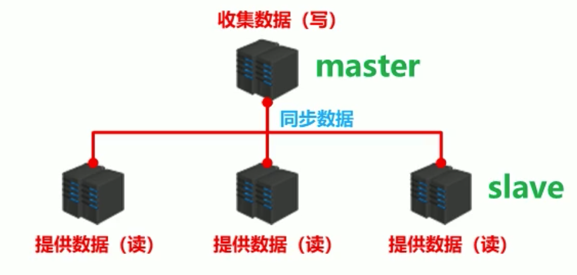

##### 2.主从复制

 即将master中的数据即时、有效的复制到slave中，一个master可以拥有多个slave，一个slave只对应一个master

- master:
  - 写数据，执行写操作时，将出现变化的数据自动同步到slave
  - 读数据(可忽略)
- slave:
  - 读数据
  - 写数据(禁止)

##### 3.高可用集群

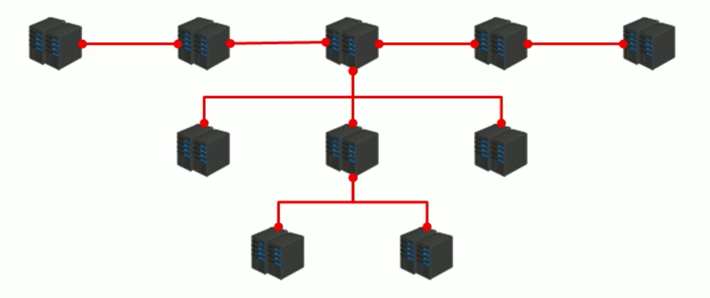

#### 10.1.4 主从复制的作用

- 读写分离：master写、 slave读，提高服务器的读写负载能力
- 负载均衡：基于主从结构，配合读写分离，由slave分担master负载， 并根据需求的变化，改变slave的数量，通过
- 多个从节点分担数据读取负载，大大提高Redis服务器并发量与数据吞吐量
- 故障恢复：当master出现问题时，由slave提供服务，实现快速的故障恢复
- 数据冗余：实现数据热备份，是持久化之外的一种数据冗余方式
- 高可用基石：基于主从复制，构建哨兵模式与集群，实现Redis的高可用方案

### 10.2 主从复制的工作流程

#### 10.2.1 主从连接的准备工作

##### 1.搭建环境

- 单机上，新加`yourport.conf`文件 => 修改port => 指定文件启动。
- 连接虚拟机上，模拟服务器(环境ubuntu18.04)

##### 2.建立远程连接 =>修改`.conf`文件

```
/* 主从redis都建立远程连接*/
bind 127.0.0.1    //本地ip注掉
protected-mode no //受保护模式关掉
```

#### 10.2.2 工作流程总述

主从复制过程大体可以分为3个阶段：

1. 建立连接阶段(即准备阶段)
2. 数据同步阶段
3. 命令传播阶段

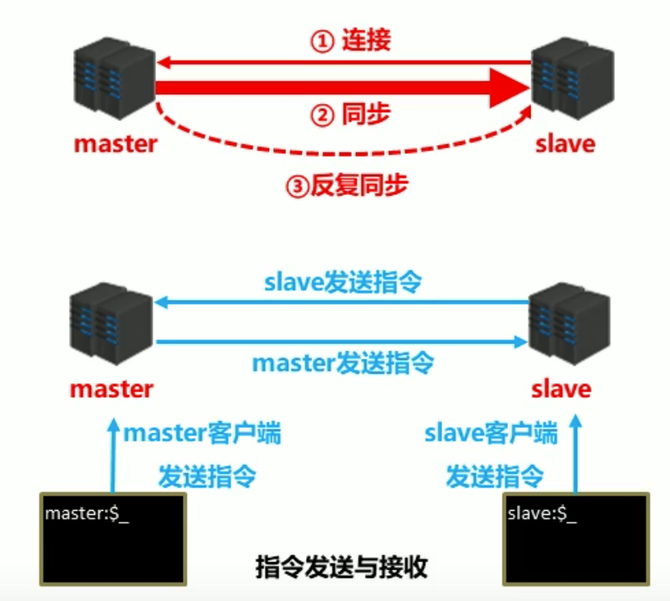

#### 10.2.3 连接阶段的工作流程


### 10.3 主从连接—slave连接master

- 方式一:客户端发送命令 `slaveof  `
- 方式二:启动服务器参数 `redis-server -slaveof  `
- 方式三:服务器配置 `slaveof `

slave系统信息、master系统信息

```
master_ link_ down_ since_ seconds
slave_ listening_ port(多个)
masterhost
masterport
```

- 断开与master的连接 `slaveof no one`

#### 10.3.1 授权访问 

- master配置文件设置密码 

   `requirepass` 

- slave客户端发送命令设置密码 

  `	auth master`

- 客户端发送命令设置密码

  `config set requirepass masterauth`

-  slave配置文件设置密码  

  `config get requirepass` 

- 启动客户端设置密码 

  `redis-cli -a`

### 10.4 数据同步阶段

- 在slave初次连接master后，复制maste r中的所有数据到slave 
- 将slave的数据库状态更新成master当前的数据库状态

数据同步阶段的工作流程

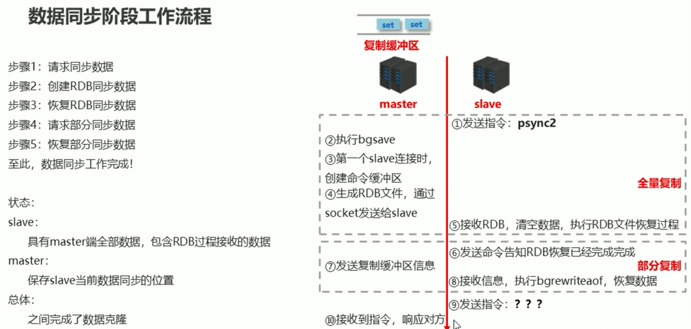

#### 10.4.1 数据同步阶段master说明 

- 如果master数据量巨大，数据同步阶段应避开流量高峰期，避免造成master阻塞，影响业务正常执行 

- 复制缓冲区大小设定不合理，会导致数据溢出。如进行全量复制周期太长，进行部分复制时发现数据

- 经存在丢失的情况，必须进行第二次全量复制， 致使slave陷入死循环状态。 

  `rep -back1og- size 1mb` 

- master单机内存占用主机内存的比例不应过大，建议使用50%-70%的内存，留下30%-50%的内存用于执行`bgsave`命令和创建复制缓冲区

- 为避免slave进行全量复制、部分复制时服务器响应阻塞或数据不同步，建议关闭此期间的对外服务 

  `slave -serve-stale -data yes|no` 

- 数据同步阶段， master发送给slave信息可以理解master是slave的一个客户端，主动向slave发送命令 

- 多个slave同时对ma ster请求数据同步， master发送的RDB文件增多，会对带宽造成巨大冲击，如果 master带宽不足，因此数据同步需要根据业务需求，适量错峰

- slave过多时，建议调整拓扑结构，由1主多从结构变为树状结构，中间的节点既是master，也是 slave。

- 注意使用树状结构时，由于层级深度，导致深度越高的slave与最顶层ma ster间数据同步延迟 较大，数据一致性变差， 应谨慎选择

### 10.5 命令传播阶段

- 当master数据库状态被修改后，导致主从服务器数据库状态不一致， 此时需要让主从数据同步到一致的状态，同步的动作称为命令传播
- master将接收到的数据变更命令发送给slave， slave接收命令后执行命令

#### 10.5.1 命令传播阶段的部分复制

##### 命令传播阶段出现了断网现象

- 网络闪断闪连 => 忽略
- 短时间网络中断 => 部分复制
- 长时间网络中断 => 全量复制

##### 部分复制的三个核心要素

- 服务器的运行id (run id)
- 主服务器的复制积压缓冲区
- 主从服务器的复制偏移量

####  10.5.2 服务器运行ID (runid)

- 概念:服务器运行ID是每一 台服务器每次运行的身份识别码， 一台服务器 多次运行可以生成多个运行id

- 组成:运行id由40位字符组成，是一个随机的十六进制字符

  例如: `fdc9ff13b9bbaab28db42b3d50f852bb5e3fcdce`

- 作用:运行id被用于在服务器间进行传输，识别身份

  如果想两次操作均对同一台服务器进行，必须每次操作携带对应的运行id，用于对方识别

- 实现方式:运行id在每台服务器启动时自动生成的， master在首次连接slave时，会将自己的运行ID发送给slave， slave保存此ID，通过info Server命令，可以查看节点的runid

####  10.5.3 复制缓冲区

**概念:**

- 复制缓冲区，又名复制积压缓冲区，是一个先进先出(FIFO) 的队列，用于存储服务器执行过的命令
- 每次传播命令， master都会将传播的命令记录下来，并存储在复制缓冲区，复制缓冲区默认数据存储空间大小是1M
- 由于存储空间大小是固定的，当入队元素的数量大于队列长度时，最先入队的元素会被弹出，而新元素会被放入队列

**由来:**

- 每台服务器启动时，如果开启有AOF或被连接成为master节点，即创建复制缓冲区

**作用:**

- 用于保存master收到的所有指令(仅影响数据变更的指令，例如set， select)

**数据来源:**

- 当master接收到主客户端的指令时， 除了将指令执行，会将该指令存储到缓冲区中

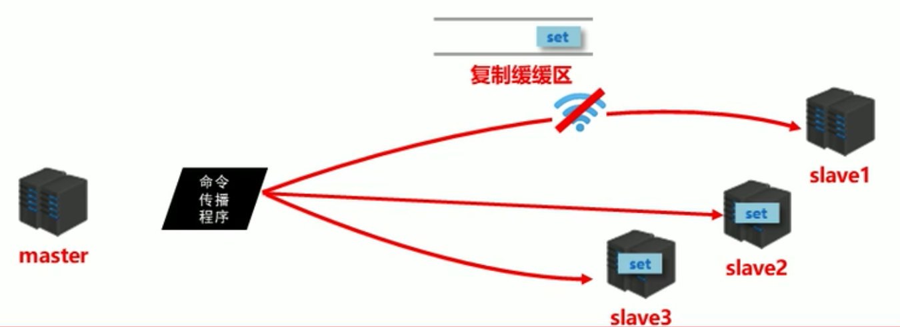

##### 复制缓冲区内部工作原理

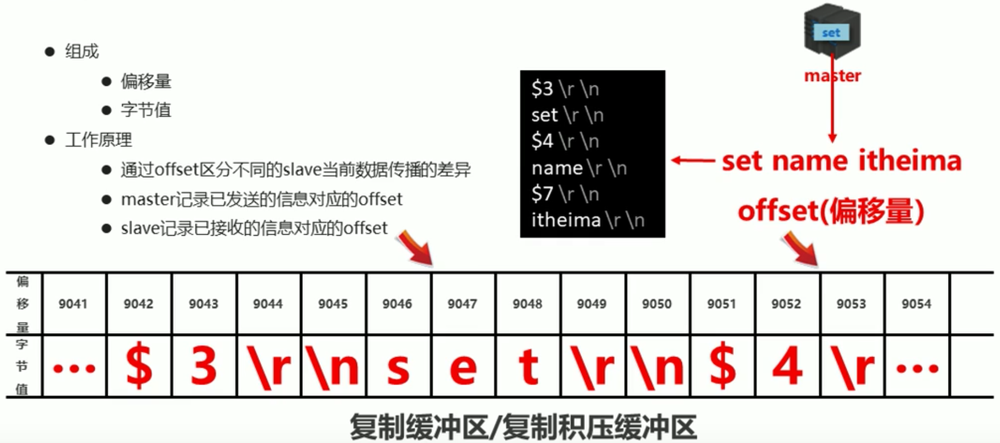


#### 10.5.4 主从服务器复制偏移量(offset)

- 概念：一个数字，描述复制缓冲区中的指令字节位置
- 分类:
  master复制偏移量:记录发送给所有slave的指令字节对应的位置(多个)
  slave复制偏移量:记录slave接收master发送过来的指令字节对应的位置(一 个)
- 数据来源:
  master端:发送一-次记录-次
  slave端:接收-次记录- -次
- 作用:
  同步信息，比对master与slave的差异，当slave断线后，恢复数据使用

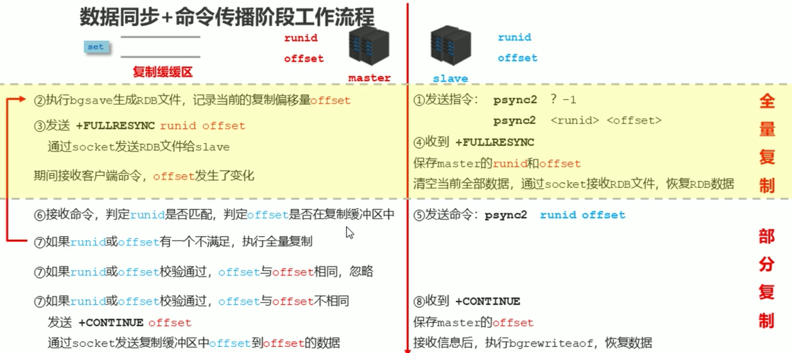


#### 10.5.5 心跳机制

进入命令传播阶段， master与slave间需要进行信息交换，使用心跳机制进行维护，实现双方连接保持在线

##### master心跳: 

- 指令: PING
- 周期:由`repl-ping-slave- period`决定，默认10秒
- 作用:判断slave是否在线
- 查询: `INFO replication`
  	获取slave最后一次连接时间间隔， lag项维持在0或1视为正常

##### slave心跳任务

- 指令: `REPLCONF ACK {offset}`
- 周期: 1秒
- 作用1:汇报slave自己的复制偏移量，获取最新的数据变更指令
- 作用2:判断master是否在线

##### 心跳阶段注意事项

- 当slave多数掉线， 或延迟过高时，master为保障数据稳定性，将拒绝所有信息同步操作
  `min -slaves to-write 2`
  `min -slaves -max- lag 8`
  slave数量少于2个，或者所有slave的延迟都大于等于10秒时，强制关闭master写功能，停止数据同步
- slave数量由slave发送REPLCONF ACK命令做确认
- slave延迟由slave发送R EPLCONF ACK命令做确认

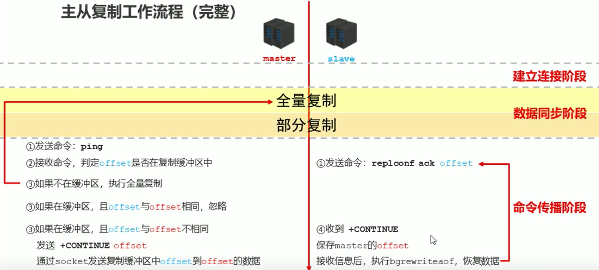

### 10.6 主从复制常见问题

#### 10.6.1 频繁的全量复制(1)

​	伴随着系统的运行，`master`的数据量会越来越大，一旦`master`重启，`runid`将发生变化，会导致全部`slave`的全量复制操作

##### 内部优化调整方案:

1. `master`内部创建`master_replid`变量， 使用runid相同的策略生成，长度41位，并发送给所有slave
2. 在`master`关闭时执行命令`shutdown save`，进行RDB持久化，将`runid`与`offset`保存到RDB文件中
    `repl- id、repl-offset`通过redis-check-rdb命令可以查看该信息
3. master重启后加载RDB文件，恢复数据
    重启后，将RDB文件中保存的`repl-id`与`repl -off set`加载到内存中
    `master_ repl_ id = repl`、`master_repl_∂offset = repl-offset`  => 可通过info命令可以查看该信息
4. 作用:本机保存上次runid，重启后恢复该值，使所有slave认为还是之前的master

#### 10.6.2 频繁的全量复制(2)

- 问题现象：
  网络环境不佳，出现网络中断，slave不提供服务
- 问题原因：
  复制缓冲区过小，断网后slave的offset越界，触发全量复制
- 最终结果：
  slave反复进行全量复制
- 解决方案：
  修改复制缓冲区大 => `repl-backlog- size`
- 建议设置如下:
  - 测算从master到slave的重连平均时长`second`
  - 获取master平均每秒产生写命令数据总量`write_ size_ per_ second`
  - 最优复制缓冲区空间= `2 * second * write_ size_per_second`


#### 10.6.3 频繁的网络中断(1)

- 问题现象
  - master的CPU占用过高或slave频繁断开连接
- 问题原因
  - slave每1秒发送REPLCONE ACK命令到master
  - 当slave接到了慢查询时(keys*，hgetall等)，会大量占用cPu性能
  - master每1秒调用复制定时函数repl icationCron ()，比对slave发现长时间没有进行响应
- 最终结果
  - master各种资源(输出缓冲区、带宽、连接等)被严重占用
- 解决方案:
  - 通过设置合理的超时时间，确认是否释放slave => `repl-timeout`
  - 该参数定义了超时时间的阈值(默认60秒)，超过该值，释放slave

#### 10.6.4 频繁的网络中断(2)

- 问题现象
  - `slave`与`master`连接断开
- 问题原因
  - `master`发送`ping`指令频度较低
  - `master`设定超时时间较短
  - `ping`指令在网络中存在丢包
- 解决方案
  - 提高ping指令发送的频度 => `repl-ping-slaveperiod`
  - 超时时间`repl-time`的时间至少是ping指令频度的5到10倍，否则`slave`很容易判定超时

#### 10.6.5 数据不一致

- 问题现象
  - 多个slave获取相同数据不同步
- 问题原因
  - 网络信息不同步，数据发送有延迟
- 解决方案
  - 优化主从间的网络环境，通常放置在同-一个机房部署，如使用阿里云等云服务器时要注意此现象
  - 监控主从节点延迟(通过offset) 判断，如果slave延迟过大，暂时屏蔽程序对该slave的数据访问
     => `slave -serve-stale -data yes I no`，开启后仅响应info、slaveof等少数命令(慎用， 除非对数据一致性要求很高)


## 十一、哨兵(主从切换)

### 11.1 哨兵简介

#### 11.1.1 master宕机了怎么办？

1. 将宕机的master 下线
2. 找一个slave作为master
3. 
   通知所有的slave连接新的master

4. 启动新的master与slave
5. 全量复制*N +部分复制*N

#### 11.1.2 哨兵的引出

1. 谁来确认master宕机了
2. 找一个主?怎么找法?
3. 修改配置后，原始的主恢复了怎么办?

#### 11.1.3 哨兵

##### 概念：		

​	哨兵(sentinel)是一个分布式系统，用于对主从结构中的每台服务器进行监控，当出现故障时通过投票机制选择新的master并将所有slave连接到新的master

##### 哨兵的工作 => 主从切换

哨兵在进行主从切换过程中经历三个阶段

- 监控

  - 不断的检查master和slave是否正常运行。
  - master存活检测、master与slave运行情况检测

- 通知(提醒)

  - 当被监控的服务器出现问题时，向其他(哨兵间，客户端)发送通知。

- 自动故障转移

  - 断开master与slave连接，选取一个slave作为master， 将其他slave连接到新的master，并告知客户端新的服务器地址

  > 注意:哨兵也是一台redis服务器，只是不提供数据服务，通常哨兵配置数量为**单数**


### 11.2 哨兵结构搭建

**学到的Linux命令**

```shell
# 过滤带注释'#'的
cat sentinel.conf |grep -v "#" | grep -v "^$"
# 过滤带注释'#'的 => 并将过滤后的结果复制为一份.conf文件
cat sentinel.conf |grep -v "#" | grep -v "^$" > ./conf/sentinel-26379.conf
# 复制xxx.conf文件，将文件中的内容xxx替换为xxx2
sed 's/26379/26381/g' sentinel-26379.conf > sentinel-26381.conf
```

#### 11.2.1 配置哨兵配置文件

1.将 `/redis.x.x.x`目录下的`sentinel.conf` 复制到 => `redis.x.x.x/conf/` (自己建立) 

```properties
# 端口号，哨兵通常前面加2
port 26379
daemonize no
pidfile "/var/run/redis-sentinel-26379.pid"
logfile "sentinel-26379.log"
dir "/usr/local/redis-5.0.7/data"
# 两台哨兵认为master挂了就真挂了
sentinel myid 383f810f632b52988eb774163ae7175e54937803
# 30s连接不上master则认为挂
sentinel deny-scripts-reconfig yes
#当master宕机时，这里端口号将由master的端口号 => 新上位的master的端口号
sentinel monitor mymaster 127.0.0.1 6379 2
# slave 有3分钟时间充当master
sentinel config-epoch mymaster 1
sentinel leader-epoch mymaster 1
# Generated by CONFIG REWRITE
protected-mode no
```

2.复制多份`sentinel-端口号.conf`，并修改

#### 11.2.2 模拟master宕机 => slave上位 **

1. 启动master => slave => 哨兵 

   `redis-sentinel sentinel-端口号.conf`

2. 杀死master进程，模拟master宕机

   `kill -9 pid`

3. slave上位

4. 查看sentinel配置文件 => 端口号已修改

   `sentinel monitor mymaster 127.0.0.1 6380 2`

5. 查看sentinel日志文件 => 查看slave上位流程

   ```properties
   # 监控到master已经宕机
   1948:X 13 Mar 2020 10:26:19.760 # +sdown master mymaster 127.0.0.1 6379
   # 投票计数
   1948:X 13 Mar 2020 10:26:19.866 # +new-epoch 1
   # 投票选举 进程号为xxxx的上位
   1948:X 13 Mar 2020 10:26:19.867 # +vote-for-leader 2d6333f04c42040d406d57546a9ea65e90d6bf7b1
   1948:X 13 Mar 2020 10:26:20.216 # +config-update-from sentinel 2d6333f04c42040d406d57546a9ea65e90d6bf7b 127.0.0.1 26382 @ mymaster 127.0.0.1 6379
   # 转换master => 6380为新上位的master
   1948:X 13 Mar 2020 10:26:20.216 # +switch-master mymaster 127.0.0.1 6379 127.0.0.1 6380
   # 其他slave重新从属新的master
   1948:X 13 Mar 2020 10:26:20.217 * +slave slave 127.0.0.1:6381 127.0.0.1 6381 @ mymaster 127.0.0.1 6380
   1948:X 13 Mar 2020 10:26:20.217 * +slave slave 127.0.0.1:6382 127.0.0.1 6382 @ mymaster 127.0.0.1 6380
   # 6379 从属新的master
   1948:X 13 Mar 2020 10:26:20.217 * +slave slave 127.0.0.1:6379 127.0.0.1 6379 @ mymaster 127.0.0.1 6380
   # 6379 宕机了，无法slave
   1948:X 13 Mar 2020 10:26:50.256 # +sdown slave 127.0.0.1:6379 127.0.0.1 6379 @ mymaster 127.0.0.1 6380
   ```

6. 重新启动6379 => 6379变成slave了

   ```properties
   # Replication
   role:slave
   master_host:127.0.0.1
   master_port:6380
   ```

7.  查看启动的.conf文件

   ```properties
   # 连接的master，端口号、slaveof     自动修改了
   replicaof 127.0.0.1 6380
   ```

   

### 11.3 哨兵工作原理

#### 11.3.1 监控阶段

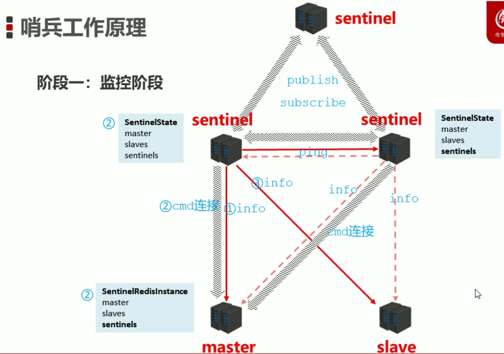

- 用于同步各个节点的状态信息
  - 获取各个sentinel的状态(是否在线)
  - 获取master的状态
    - master属性
      - runid
      - role: master
    - 各个slave的详细信息
  - 获取所有slave的状态(根据master中的slave信息)
  - slave属性
    - runid
    - role: slave
    - master host、master port
    - offset

#### 11.3.2 通知阶段

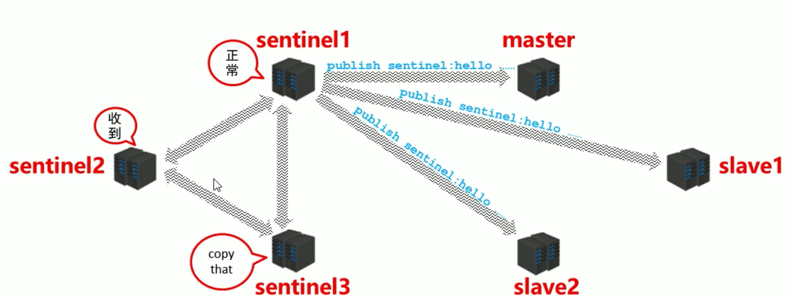

#### 11.3.3 故障转移阶段

##### 1.大体原理：


##### 2.挑选sentinel头头：

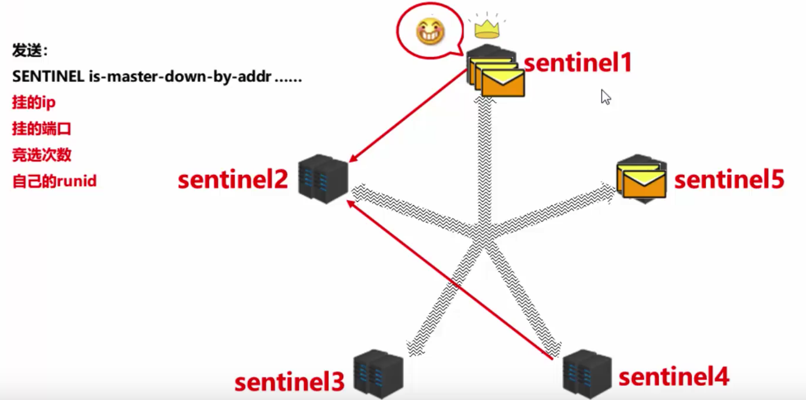

##### 3.挑选备选master：

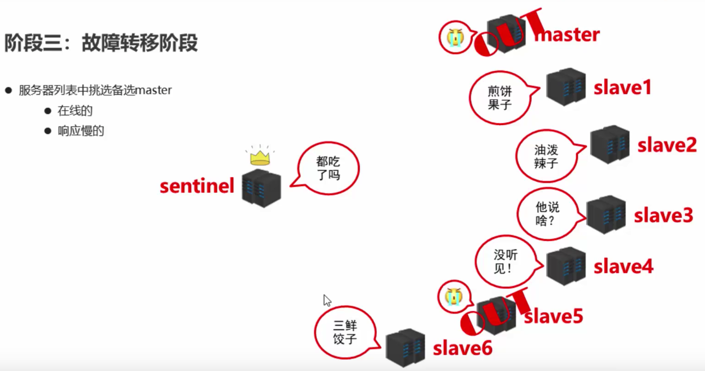

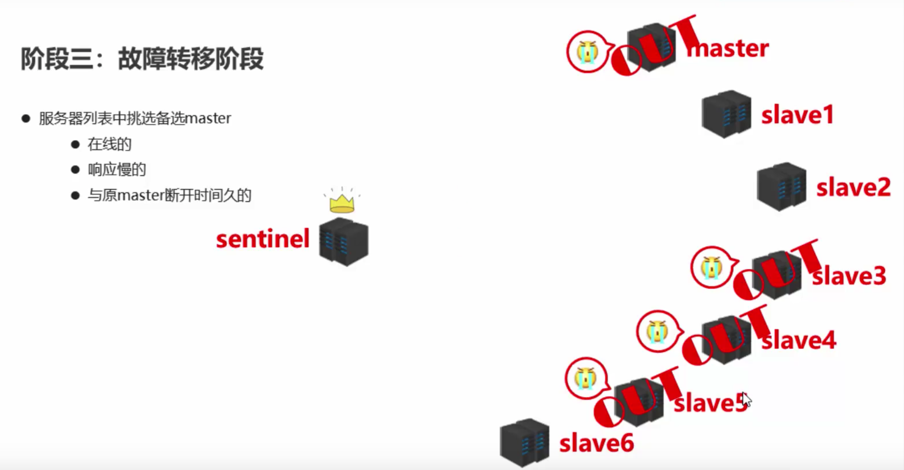

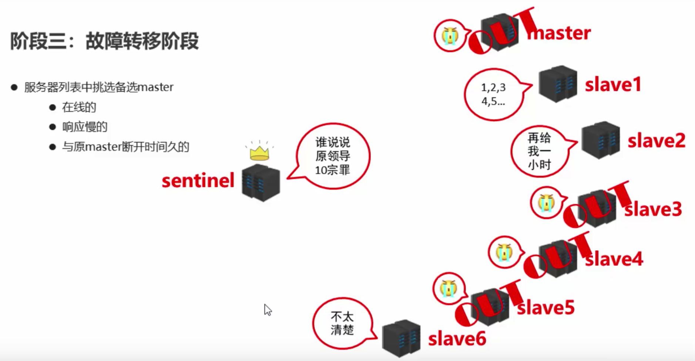

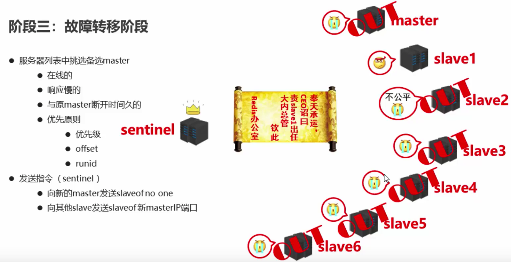

大体流程

- 监控
  - 同步信息
- 通知
  - 保持联通
- 故障转移
  - 发现问题
  - 竞选负责人
  - 优选新master
  - 新master上任，其他slave切换master，原master作为slave故障回复后连接


## 十二、集群

###  12.1 集群简介

#### 12.1.1 为什么需要集群

**业务发展过程中遇到的峰值瓶颈**

- redis提供的服务OPS可以达到10万/秒，当前业务OPS已经达到20万/秒
- 内存单机容量达到256G，当前业务需求内存容量1T
- 使用集群的方式可以快速解决上述问题

#### 12.1.2 集群架构

集群就是使用网络将若干台计算机联通起来，并提供统一的管理方式，使其对外呈现单机的服务效果

#### 12.1.3 集群作用

- 分散单台服务器的访问压力，实现负载均衡
- 分散单台服务器的存储压力，实现可扩展性
- 降低单台服务器宕机带来的业务灾难

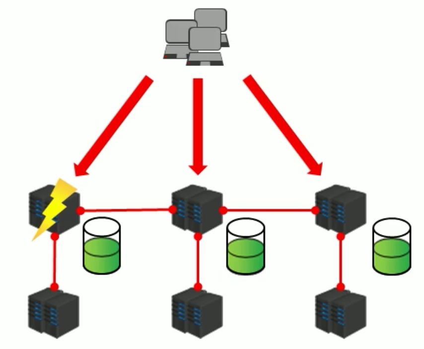

### 12.2 搭建集群

https://blog.csdn.net/gfk3009/article/details/102558445

1.在`redis.x.x.x/cluster/`  配置`xxx.conf`

```properties
# 其他同xxx.conf
# 单机测试一定要有绑定本地ip，否则会出现 Waiting for the cluster to join 无限循环
bind 127.0.0.1
# 集群相关配置
cluster-enabled yes
cluster-config-file nodes-6379.conf
cluster-node-timeout 10000
```

2.输入命令 => 连接集群：

- Redis 5之前的命令：
  - `➜  src ./redis-trib.rb create --replica 1 127.0.0.1:6379 127.0.0.1:6380 127.0.0.1:6381 127.0.0.1:6382`

```properties
WARNING: redis-trib.rb is not longer available!
You should use redis-cli instead.

All commands and features belonging to redis-trib.rb have been moved
to redis-cli.
In order to use them you should call redis-cli with the --cluster
option followed by the subcommand name， arguments and options.

Use the following syntax:
redis-cli --cluster SUBCOMMAND [ARGUMENTS] [OPTIONS]

Example:
redis-cli --cluster create 1 127.0.0.1:6379 127.0.0.1:6380 127.0.0.1:6381 127.0.0.1:6382

To get help about all subcommands， type:
redis-cli --cluster help
```

这里的1是指的 1个master连接一个slave

- Redis 5连接集群的命令()

  - ➜  ~ redis-cli --cluster create 127.0.0.1:6379 127.0.0.1:6380 127.0.0.1:6381 127.0.0.1:6382 127.0.0.1:6383 127.0.0.1:6384 --cluster-replicas 1

    ```properties
    ➜  src redis-cli --cluster create 127.0.0.1:6379 127.0.0.1:6380 127.0.0.1:6381 127.0.0.1:6382 127.0.0.1:6383 127.0.0.1:6384 --cluster-replicas 1
    >>> Performing hash slots allocation on 6 nodes...
    Master[0] -> Slots 0 - 5460
    Master[1] -> Slots 5461 - 10922
    Master[2] -> Slots 10923 - 16383
    Adding replica 127.0.0.1:6383 to 127.0.0.1:6379
    Adding replica 127.0.0.1:6384 to 127.0.0.1:6380
    Adding replica 127.0.0.1:6382 to 127.0.0.1:6381
    >>> Trying to optimize slaves allocation for anti-affinity
    [WARNING] Some slaves are in the same host as their master
    M: 0697a520a848c056f55a0a6f1d221e3894ea64ad 127.0.0.1:6379
       slots:[0-5460]，[12706] (5461 slots) master
    M: fa25857ccd5b869c93f4c5e726fed6fb9da28790 127.0.0.1:6380
       slots:[5461-10922] (5462 slots) master
    M: 5b4d84abc7805f107bf375e8c3feaaacd9bd4c44 127.0.0.1:6381
       slots:[9189]，[10923-16383] (5461 slots) master
    S: b6ee9a0a70469bf89f651b62b2c67b0b167341c1 127.0.0.1:6382
       replicates 0697a520a848c056f55a0a6f1d221e3894ea64ad
    S: 09766ffca233d7d5733f74883a44a00af0498568 127.0.0.1:6383
       replicates fa25857ccd5b869c93f4c5e726fed6fb9da28790
    S: 2fc840164524b309caaa05fff302b8a11b09e7a7 127.0.0.1:6384
       replicates 5b4d84abc7805f107bf375e8c3feaaacd9bd4c44
    Can I set the above configuration? (type 'yes' to accept):
    ```

- 出现的bug

```properties
# 连接至少6个节点 => 否则报错
*** ERROR: Invalid configuration for cluster creation.
*** Redis Cluster requires at least 3 master nodes.
*** This is not possible with 4 nodes and 1 replicas per node.
*** At least 6 nodes are required.
```

```properties
# .conf配置文件中不可以有slave从属信息，否则报错
*** FATAL CONFIG FILE ERROR ***
Reading the configuration file， at line 9
>>> 'slaveof 127.0.0.1 6379'
>>> replicaof directive not allowed in cluster mode
```

```properties
# 未连接的cluster的日志文件 node.xxx.conf
0697a520a848c056f55a0a6f1d221e3894ea64ad :6379@16379 myself，master - 0 0 1 connected 0-5460 12706
vars currentEpoch 1 lastVoteEpoch 0
```

```properties
# 集群节点不能为单数，否则出现如下错误
>>> Nodes configuration updated
>>> Assign a different config epoch to each node
>>> Sending CLUSTER MEET messages to join the cluster
Failed to send CLUSTER MEET command.
```

```properties
# 集群中key不为空、log文件、rdb、aof等文件存在时报错
[ERR] Node is not empty. Either the node already knows other nodes ...
解决方法：
1)、将需要新增的节点下aof、rdb等本地备份文件删除；
2)、同时将新Node的集群配置文件删除，即：删除你redis.conf里面cluster-config-file所在的文件；
3)、再次添加新节点如果还是报错，则登录新Node，./redis-cli–h x –p对数据库进行清除：
172.168.63.201:7001>  flushdb      #清空当前数据库
```

- 连接成功的完整信息

```properties
➜  ~ redis-cli --cluster create 127.0.0.1:6379 127.0.0.1:6380 127.0.0.1:6381 127.0.0.1:6382 127.0.0.1:6383 127.0.0.1:6384 --cluster-replicas 1
>>> Performing hash slots allocation on 6 nodes...
Master[0] -> Slots 0 - 5460
Master[1] -> Slots 5461 - 10922
Master[2] -> Slots 10923 - 16383
Adding replica 127.0.0.1:6383 to 127.0.0.1:6379
Adding replica 127.0.0.1:6384 to 127.0.0.1:6380
Adding replica 127.0.0.1:6382 to 127.0.0.1:6381
>>> Trying to optimize slaves allocation for anti-affinity
[WARNING] Some slaves are in the same host as their master
M: 35f07e4051c91bc154b26290b7c7bad9e66cedfd 127.0.0.1:6379
   slots:[0-5460] (5461 slots) master
M: 2c5e5c790a790bfe85b0b7736618f3bd0533c59d 127.0.0.1:6380
   slots:[5461-10922] (5462 slots) master
M: 89526b8663925d27471456b9efd73c7d4865dd7f 127.0.0.1:6381
   slots:[10923-16383] (5461 slots) master
S: fae0b8421f41dfa50d4a0b1ce6f42a1121f56c1a 127.0.0.1:6382
   replicates 89526b8663925d27471456b9efd73c7d4865dd7f
S: cc74469ff209e4161971b908ef5a8474e5947e6c 127.0.0.1:6383
   replicates 35f07e4051c91bc154b26290b7c7bad9e66cedfd
S: e2d3b83bd0d309a1ba745bab82ce2846990ae1dd 127.0.0.1:6384
   replicates 2c5e5c790a790bfe85b0b7736618f3bd0533c59d
Can I set the above configuration? (type 'yes' to accept): yes
>>> Nodes configuration updated
>>> Assign a different config epoch to each node
>>> Sending CLUSTER MEET messages to join the cluster
Waiting for the cluster to join
....
>>> Performing Cluster Check (using node 127.0.0.1:6379)
M: 35f07e4051c91bc154b26290b7c7bad9e66cedfd 127.0.0.1:6379
   slots:[0-5460] (5461 slots) master
   1 additional replica(s)
M: 89526b8663925d27471456b9efd73c7d4865dd7f 127.0.0.1:6381
   slots:[10923-16383] (5461 slots) master
   1 additional replica(s)
S: cc74469ff209e4161971b908ef5a8474e5947e6c 127.0.0.1:6383
   slots: (0 slots) slave
   replicates 35f07e4051c91bc154b26290b7c7bad9e66cedfd
M: 2c5e5c790a790bfe85b0b7736618f3bd0533c59d 127.0.0.1:6380
   slots:[5461-10922] (5462 slots) master
   1 additional replica(s)
S: e2d3b83bd0d309a1ba745bab82ce2846990ae1dd 127.0.0.1:6384
   slots: (0 slots) slave
   replicates 2c5e5c790a790bfe85b0b7736618f3bd0533c59d
S: fae0b8421f41dfa50d4a0b1ce6f42a1121f56c1a 127.0.0.1:6382
   slots: (0 slots) slave
   replicates 89526b8663925d27471456b9efd73c7d4865dd7f
[OK] All nodes agree about slots configuration.
>>> Check for open slots...
>>> Check slots coverage...
[OK] All 16384 slots covered.
```

- 观察node.xxx.conf => 发现集群连接信息

```properties
89526b8663925d27471456b9efd73c7d4865dd7f 127.0.0.1:6381@16381 master - 0 1584104495023 3 connected 10923-16383
cc74469ff209e4161971b908ef5a8474e5947e6c 127.0.0.1:6383@16383 slave 35f07e4051c91bc154b26290b7c7bad9e66cedfd 0 1584104498115 5 connected
2c5e5c790a790bfe85b0b7736618f3bd0533c59d 127.0.0.1:6380@16380 master - 0 1584104497081 2 connected 5461-10922
e2d3b83bd0d309a1ba745bab82ce2846990ae1dd 127.0.0.1:6384@16384 slave 2c5e5c790a790bfe85b0b7736618f3bd0533c59d 0 1584104496057 6 connected
fae0b8421f41dfa50d4a0b1ce6f42a1121f56c1a 127.0.0.1:6382@16382 slave 89526b8663925d27471456b9efd73c7d4865dd7f 0 1584104495000 4 connected
35f07e4051c91bc154b26290b7c7bad9e66cedfd 127.0.0.1:6379@16379 myself，master - 0 1584104496000 1 connected 0-5460
vars currentEpoch 6 lastVoteEpoch 0
```

- 数据相关操作

  `redis-cli -c -p xxxx` <!-- 集群操作要加 -c --> 

### 12.3 主从下线与主从切换

Course 106

1.从slave下线 => 主标记其小弟下线，slave小弟上线即恢复

2.主master下线 =>   从slave尝试连接master => 过了超时时间，翻身农奴自己做master

3.原来的主master上线 => 成为原来小弟的小弟了

### 12.4 相关配置及操作

#### 12.4.1 cluster 配置

- 设置加入cluster， 成为其中的节点
  `cluster -enabled yes|no`
- cluster配置文件名，该文件属于自动生成，仅用于快速查找文件并查询文件内容
  `cluster -config- file <filename>`
- 节点服务响应超时时间，用于判定该节点是否下线或切换为从节点
  `cluster-node- timeout <milli seconds>`
- master连接的slave最小数量
  `cluster -migration . -barrier < count>`

#### 12.4.2 Cluster节点的操作命令

- 查看集群节点信息
  `cluster nodes`
- 进入一个从节点redis， 切换其主节点
  `cluster replicate <master-id>`
- 发现一个新节点，新增主节点
  `cluster meet ip :port`
- 忽略一个没有solt的节点
  `cluster forget <id>`
- 手动故障转移
  `cluster`
  `failover`

