# Redis高级

## 六、持久化

### 6.1 持久化简介

1.什么是持久化

​	利用永久性存储介质将数据进行保存,在特定的时间将保存的数据进行恢复的工作机制称为持久化。

2.为什么要进行持久化
	防止数据的意外丢失，确保数据安全性

3.持久化过程保存什么

- 将当前数据状态进行保存，快照形式，存储数据结果，存储格式简单,关注点在数据
- 将数据的操作过程进行保存,日志形式，存储操作过程,存储格式复杂，关注点在数据的操作过程

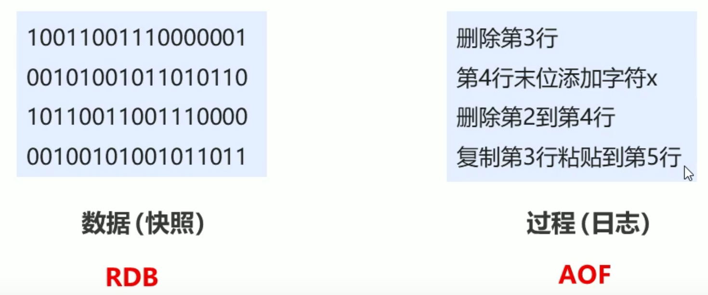

### 6.2 RDB

#### 6.2.1 RDB启动方式一save指令

```java
127.0.0.1:6379>save //保存到了usr/local/redis-5.0.7/ 以及 messi433/
```

#### 6.2.2 RDB启动方式一save指令相关配置

~ redis.conf/redis-6379.conf 下修改即可

- `dbfilename dump.rdb`
  说明:设置本地数据库文件名，默认值为dump.rdb
  经验:通常设置为dump-端口号.rdb
- `dir`
  说明:设置存储.rdb文件的路径
  经验:通常设置成存储空间较大的目录中，目录名称data
- `rdbcompressionyes`
  说明:设置存储至本地数据库时是否压缩数据,默认为yes,采用LZF压缩
  经验:通常默认为开启状态,如果设置为no,可以节省CPU运行时间，但会使存储的文件变大(巨大)
- `rdbchecksum yes`
  说明:设置是否进行RDB文件格式校验,该校验过程在写文件和读文件过程均进行
  经验:通常默认为开启状态，如果设置为no,可以节约读写性过程约10%时间消耗，但是存储一定的数据损坏风险
- `stop-writes-on-bgsave- erroryes`
  说明:后台存储过程中如果出现错误现象，是否停止保存操作
  经验:通常默认为开启状态

#### 6.2.3 save指令工作原理

1.单线程工作原理 => save指令的弊端

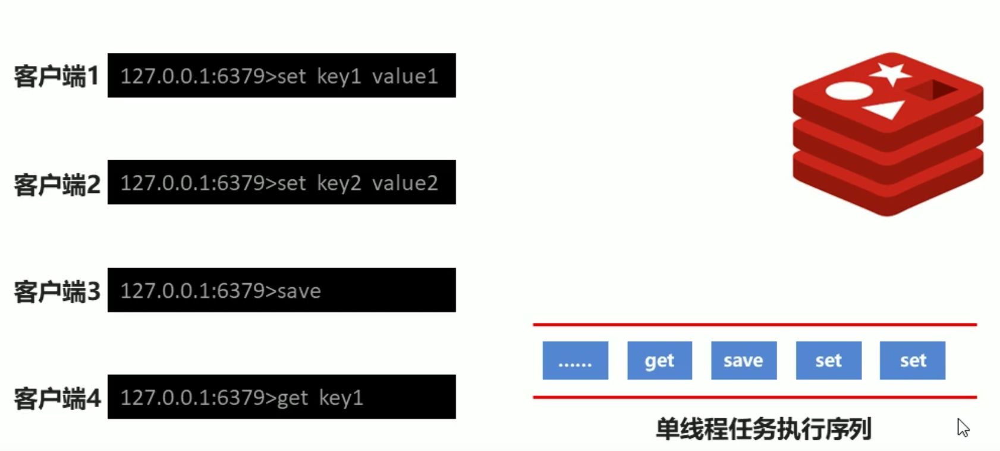

> 注意: save指令的执行会阻塞当前Redis服务器，直到当前RDB过程完成为止,有可能会造成长时间阻塞，**线上环境不建议使用**

2.数据量过大，单线程执行方式造成效率过低如何处理?

- bgsave指令 =>后台执行

  ```java
  127.0.0.1:6379>bgsave //保存到了usr/local/redis-5.0.7/ 以及 messi433/ 
  Background saving started
  ```

#### 6.2.4 bgsave执行工作原理

原理图：

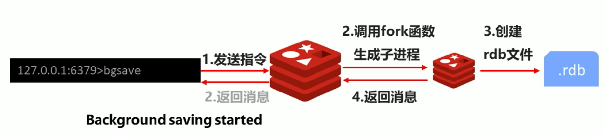


日志文件：

​	mac下未找到日志文件

#### 6.2.5 save配置

1.**反复执行保存指令，忘记了怎么办?不知道数据产生了多少变化，何时保存?**

- 配置：`save second changes`

- 作用：满足限定时间范围内key的变化数量达到指定数量即进行持久化

- 参数：
  `second: 监控时间范围`
  `changes:监控key的变化量`

- 位置：在conf文件中进行配置

- 范例：

  ```c
  save 900 1
  save 300 10
  save 60 10000 //通常为前大后小
  ```

2.**配置原理：**

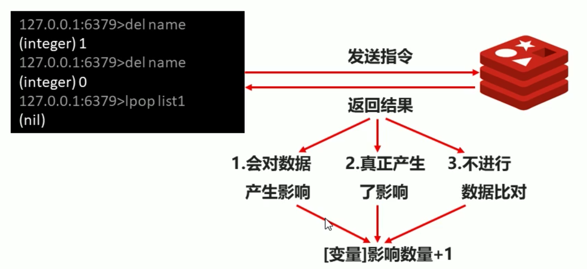

> 1.save配置要根据实际业务情况进行设置,频度过高或过低都会出现性能问题,结果可能是灾难性的
> 2.save配置中对于second与changes设置通常具有互补对应关系，尽量不要设置成包含性关系
> 3.save配置启动后执行的是bgsave操作

#### 6.2.6 RDB三种启动方式对比

| 方式           | save指令 | bgsave指令 |
| -------------- | -------- | ---------- |
| 读写           | 同步     | 异步       |
| 阻塞客户端指令 | 是       | 否         |
| 额外内存消耗   | 否       | 是         |
| 启动新进程     | 否       | 是         |

#### **6.2.7** RDB特殊启动方式

- 全量复制
  	在主从复制中详细讲解
- 服务器运行过程中重启
  	debug reload
- 关闭服务器时指定保存数据
  	shutdown save

#### 6.2.8 RBD优缺点

##### 1.RDB优点

- RDB是一个紧凑压缩的二进制文件，存储效率较高
- RDB内部存储的是redis在某个时间点的数据快照，非常适合用于数据备份,全量复制等场景
- RDB恢复数据的速度要比AOF快很多
- 应用:服务器中每X小时执行bgsave备份,并将RDB文件拷贝到远程机器中，用于灾难恢复。

##### 2.RDB缺点

- RDB方式无论是执行指令还是利用配置，无法做到实时持久化，具有较大的可能性丢失数据
- bgsave指令每次运行要执行fork操作创建子进程,要牺牲掉一 些性能
- Redis的众多版本中未进行RDB文件格式的版本统一， 有可能出现各版本服务之间数据格式无法兼容现象

### 6.3 AOF

#### 6.3.1 AOF的引出

##### RDB存储的弊端

- 存储数据量较大，效率较低
  	基于快照思想，每次读写都是全部数据，当数据量巨大时,效率非常低
- 大数据量下的IO性能较低
- 基于fork创建子进程，内存产生额外消耗
- 宕机带来的数据丢失风险

##### AOF的引出

- 不写全数据，仅记录部分数据
- 改记录数据为记录操作过程
- 对所有操作均进行记录，排除丢失数据的风险

##### AOF的概念

- AOF(append only file)持久化:以独立日志的方式记录每次写命令,重启时再重新执行AOF文件中命令达到恢复数据的目的
- 与RDB相比可以简单描述为**改记录数据为记录数据产生的过程**
- AOF的主要作用是解决了数据持久化的实时性，目前已经是Redis持久化的主流方式

#### 6.3.2 AOF写数据过程

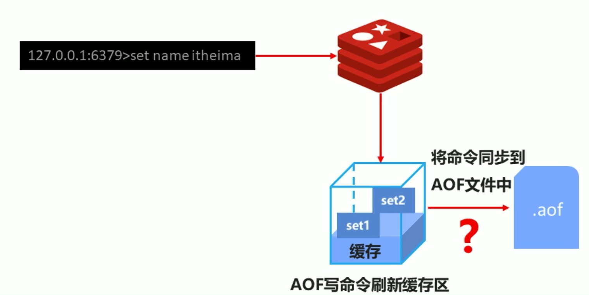

##### AOF写数据三种策略(appendfsync)

- always(每次)
  每次写入操作均同步到AOF文件中，数据零误差，性能较低，不建议使用。
- everysec (每秒)
  每秒将缓冲区中的指令同步到AOF文件中，数据准确性较高,性能较高，建议使用，也是默认配置，在系统突然宕机的情况下丢失1秒内的数据
- no (系统控制)
  由操作系统控制每次同步到AOF文件的周期，整体过程不可控

##### AOF功能开启

- 配置1：appendonly yes| no
  作用：是否开启AOF持久化功能，默认为开启状态
- 配置2：appendfsync a lways| everysec I no
  作用：AOF写数据策略
- 配置3：appendfilename fi lename
  作用：AOF持久化文件名,默认文件名未appendonly.aof, 建议配置为appendonly 端口号.aof
- 配置4：dir
  作用：AOF持久化文件保存路径，与RDB持久化文件保持一致即可


#### 6.3.3 AOF写数据遇到的问题

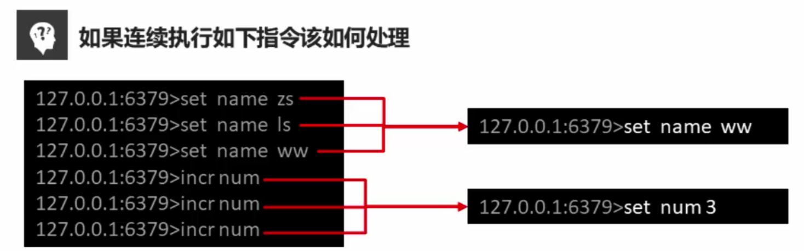

##### AOF重写

1. 随着命令不断写入AOF,文件会越来越大，为了解决这个问题，Redis引入 了AOF重写机制压缩文件体积。
2. AOF文件重写是将Redis进程内的数据转化为写命令同步到新AOF文件的过程。
3. 简单说就是将对同一个数据的若干个条命令执行结果转化成最终结果数据对应的指令进行记录。

##### AOF重写作用

1. 降低磁盘占用量,提高磁盘利用率
2. 提高持久化效率,降低持久化写时间，提高IO性能
3. 降低数据恢复用时,提高数据恢复效率

##### AOF重写规则

1. 进程内已超时的数据不再写入文件
2. 忽略无效指令,重写时使用进程内数据直接生成，这样新的AOF文件只保留最终数据的写入命令
   如`del key1、hdel key2、srem key3、set key4111、set key 4222`等
3. 对同一数据的多条写命令合并为一条命令
   如`Ipush list1 a、lpush list1 b、Ipush list1 c` 可以转化为: `Ipush list1a b c`
4. 为防止数据量过大造成客户端缓冲区溢出，对`list、 set、hash、zset`等类型,每条指令最多写入64个元素

##### AOF重写方式：

1. 手动重写：`bgrewriteaof`
2. 自动重写
   `auto-aof rewrite min -size size` 
   `auto-aof- rewrite-percentage percentage`

##### AOF手动重写一一 bgrewriteaof指令工作原理

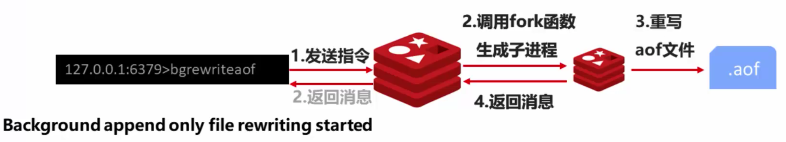


##### AOF自动重写方式

- 自动重写触发条件设置

  ```java
  auto-aof-rewrite min-size size
  auto-aof-rewrite percentage percent
  ```

- 自动重写触发比对参数(运行指令info Persistence获取具体信息)

  ```
  aof_ current_size 
  aof_ base_ size 
  ```

- 自动重写触发条件
  


#### 6.3.4 AOF工作原理&重写流程

##### 1.工作原理：

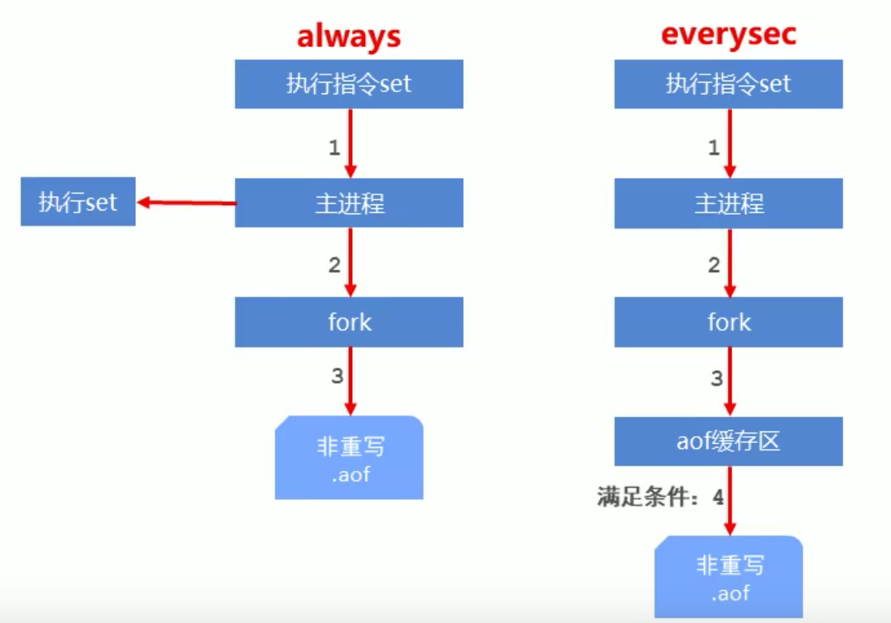

##### 2.重写流程：

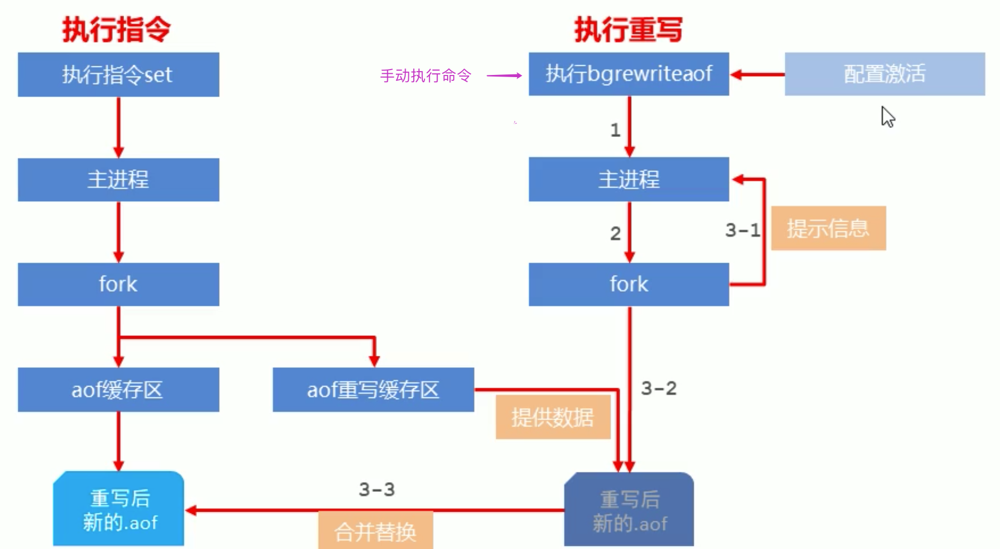


### 6.4 RDB与AOF的区别

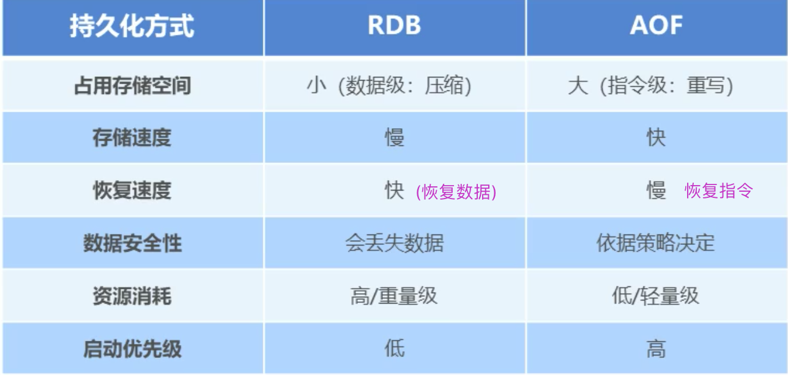

#### RDB与AOF的选择之惑

- 对数据非常敏感，建议使用默认的AOF持久化方案
- AOF持久化策略使用everysecond,每秒钟fsync 1次。 该策略redis仍可以保持很好的处理性能，当出现问题时，最多丢失0-1秒内的数据。
- 注意:由于AOF文件存储体积较大，且恢复速度较慢
- 数据呈现阶段有效性,建议使用RDB持久化方案
- 数据可以良好的做到阶段内无丢失(该阶段是开发者或运维人员手工维护的)，且恢复速度较快,阶段点数据恢复通常采用RDB方案
- 注意:利用RDB实现紧凑的数据持久化会使Redis降的很低
- RDB与AOF的选择实际上是在做一种权衡，每种都有利有弊
- 如不能承受数分钟以内的数据丢失，对业务数据非常敏感，选用AOF
- 如能承受数分钟以内的数据失，且追求大数据集的恢复速度,选用RDB
- 灾难恢复选用RDB 
- 双保险策略,同时开启RDB和AOF,重启后，Redis优先使用AOF来恢复数据，降低丢失数据的量

### 6.5 持久化应用场景

​		重要数据就持久化，否则没必要

- ~~Tips1: redis用于控制数据库表主键i,为数据库表主键提供生成策略，保障数据库表的主键睢一性~~
- ~~Tips3: redis应用于名种结构型和非结构型高热度数据访~~
- ~~Tips4: redis 应用于购物车数据存储设计~~
- Tips5: redis 应用于抢购，限购类、限量跋放优惠卷、激活码等业务的数据存储设计
- Tips 6: redis 应用于具有操作先后顺序的数据控制
- Tips7: redis 应用于最新消息展示
- ~~Tips9: redis 应用于同类信息的关联搜索，三度关联搜索，深度关联搜索~~
- Tips12: redis 应用于基于黑名单与白名单设定的服务控制
- Tips13: redis应用于计数器组合排序功能对应的排名
- ~~Tips15: redis应用于即时任务/消息队列执行管理**（通常使用RabbitMQ等框架）**~~
- ~~Tips16: redis 应用于按次结算的服务控制~~

## 七、Redis事务

### 7.1 Redis事务简介

#### 7.1.1 Redis事务的引出

​	Redis执行指令过程中，多条连续执行的指令被干扰，打断，插队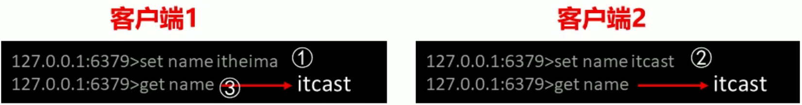

#### 7.1.2 Redis事务概念

- Redis事务就是一个命令执行的队列，将一系列预定义命令包装成一个整体(一个队列)。
- 当执行时，一次性按照添加顺序依次执行，中间不会被打断或者干扰。
- 一个队列中，一次性、顺序性、排他性的执行一列命令

### 7.2事务的基本操作

#### 7.2.1 基本命令

开启事务：`multi`
作用：设定事务的开启位置，此指令执行后，后续的所有指令均加入到事务中

执行事务：`exec`
作用：设定事务的结束位置，同时执行事务。与multi成对出现， 成对使用

> 注意:加入事务的命令暂时进入到任务队列中，并没有立即执行，只有执行exec命令才开始执行

#### 7.2.2 事务定义过程中发现出了问题，怎么办?

取消事务：`discard`
作用：终止当前事务的定义，发生在multi之后，exec之前

#### 7.2.3 事务的注意事项

定义事务的过程中，**命令格式输入错误**怎么办?

语法错误：指命令书写格式有误
处理结果：如果定义的事务中所包含的命令存在语法错误，整体事务中所有命令均不会执行，包括那些语法正确的命令。

```
127.0.0.1:6379> multi
ok
127.0.0.1 :6379> set name itheima
QUEUED
127.0.0.1:6379> get name
QUEUED
127.0.0.1:6379>tes name itcast
(error)ERR unknown command tes
127.0.0.1 :6379>exec
(error)EXECABORT Transaction discarded because of previous errors 
```

定义事务的过程中，**命令执行出现错误**怎么办?
运行错误：指命令格式正确，但无法正确的执行。例如对list进行incr操作
处理结果：能够正确运行的命令会执行，运行错误的命令不会被执行

```java
127.0.0.1:6379> multi
оК
127.0.0.1:6379> set name itheima
QUEUED
127.0.0.1:6379> get name
QUEUED
127.0.0.1:6379> set name itcast
QUEUED
127.0.0.1:6379> get name
QUEUED
127.0.0.1:6379> 1push name a b c
QUEUED
127.0.0.1:6379> get name
QUEUED
127.0.0.1:6379> exec
ok
"itheima"
ok
"itcast"
(error)WRONGTYPE Operation against a key holding the wrong kind of value
itcast
```

> 注意:已经执行完毕的命令对应的数据不会会自动回滚，需要程序员自己在代码中实现回滚。

#### 7.2.4 手动进行事务回滚(鸡肋)

记录操作过程中被影响的数据之前的状态

单数据: string 
多数据: hash、list、 set、zset
设置指令恢复所有的被修改的项

单数据:直接set (注意周边属性,例如时效)
多数据:修改对应值或整体克隆复制

### 7.3 事务-锁

#### 7.3.1 基于特定条件的事务执行——锁

**1.业务场景：**

​	天猫双11热卖过程中，对已经售罄的货物追加补货，4个业务员都有权限进行补货。补货的操作可能是一系
列的操作，牵扯到多个连续操作，如何保障不会重复操作?

**2.业务分析：**

​	多个客户端有可能同时操作同一组数据, 并且该数据一旦被操作修改后， 将不适用于继续操作
在操作之前锁定要操作的数据，一发生变化，终止当前操作

**3.解决方案：**
	对key添加监视锁，在执行exec前如果watch的key发生了变化，终止事务执行，必须要在事务之前开启watch
`watch key1 [key.....]`

**4.取消对所有key的监视：**
`unwatch`

> Tips 18：redis应用基于状态控制的批量任务执行

#### 7.3.2 基于特定条件的事务执行——分布式锁

**1.业务场景**

- 天猫双11热卖过程中，对已经售罄的货物追加补货,且补货完成。
- 客户购买热情高涨，3秒内将所有商品购买完毕。
- 本次补货已经将库存全部清空,如何避免最后一件商品不被多人同时购买? [ 超卖问题]

**2.业务分析**

​	使用watch监控一 个key有没有改变已经不能解决问题， 此处要监控的是具体数据
虽然redis是单线程的，但是多个客户端对同一数据同时进行操作时,如何避免不被同时修改?

**3.解决方案**

- 使用setnx设置一个公共锁：`setnx lock-key value`
- 利用setnx命令的返回值特征，有值则返回设置失败,无值则返回设置成功
- 对于返回设置成功的，拥有控制权，进行下一步的具体业务操作
- 对于返回设置失败的， 不具有控制权，排队或等待
- 操作完毕通过del操作释放锁

> 注意: 上述解决方案是一种设计概念，依赖规范保障，具有风险性

> Tips 19:redis 应用基于分布式锁对应的场景控制

#### 7.3.3 基于特定条件的事务执行——分布式锁改良

**1.业务场景：**

​	依赖分布式锁的机制,某个用户操作时对应客户端宕机，且此时已经获取到锁，如何解决?

​	某个用户获取到锁，但是他忘记了释放锁，怎么办？

**2.业务分析：**

​	由于锁操作由用户控制加锁解锁，必定会存在加锁后未解锁的风险

​	需要解锁操作不能仅依赖用户控制，系统级别要给出对应的保底处理方案

**3.解决方案：**

使用expire为锁key添加时间限定，到时不释放，放弃锁

```
expire lock-key second
pexpire lock-key milliseconds
```

- 由于操作通常都是微秒或毫秒级，因此该锁定时间不宜设置过大，具体时间需要业务测试后确认
- 例如:持有锁的操作最长执行时间127ms,最短执行时间7ms。
- 测试百万次最长执行时间对应命令的最大耗时，测试百万次网络延迟平均耗时
- 锁时间设定推荐:最大耗时*120%+平均网络延迟*110%
- 如果业务最大耗时< <网络平均延迟，通常为2个数量级,取其中单个耗时较长即可


## 八、Redis删除策略

### 8.1 过期数据的概念

#### 8.1.1 Redis中的数据特征

​	Redis是一 种内存级数据库,所有数据均存放在内存中，内存中的数据可以通过TTL指令获取其状态

- XX:具有时效性的数据
- -1 :永久有效的数据
- -2 :已经过期的数据 或被删除的数据或未定义的数据

**过期的数据真的删除了吗?**


### 8.2 过期数据

#### 8.2.1 时效性数据的存储结构

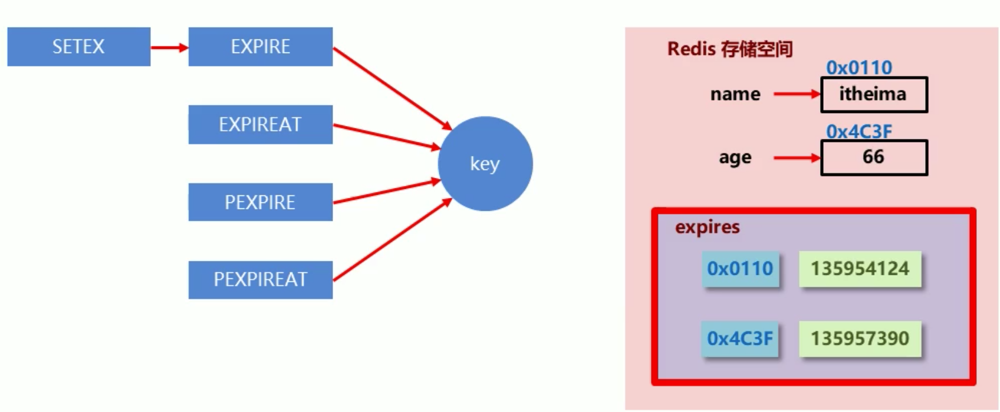

#### 8.2.2 数据删除策略

**数据删除策略的目标**
	在内存占用与CPU占用之间寻找一种平衡，顾此失彼都会造成整体redis性能的下降，甚至引|发服务器宕机或
内存泄露

##### 1.定时删除

- ​	创建一个定时器，当key设置有过期时间，且过期时间到达时，由定时器任务立即执行对键的删除操作
- ​	**优点:**节约内存，到时就删除，快速释放掉不必要的内存占用
- ​	**缺点:** CPU压力很大，无论CPU此时负载量多高，均占用CPU， 会影响redis服务器响应时间和指令吞吐量
- ​	总结:处理器性能换取存储空间(拿时间换空间)

##### 2.惰性删除

- 数据到达过期时间，不做处理，等下次访问该数据时：
  - 如果未过期，返回数据
  - 发现已过期，删除，返回不存在
- 优点:节约CPU性能，发现必须删除的时候才删除
- 缺点:内存压力很大，出现长期占用内存的数据
- 总结:用存储空间换取处理器性能(拿时间换空间)

##### 3.定期删除

- 周期性轮询redis库中的时效性数据,采用随机抽取的策略,利用过期数据占比的方式控制删除频度
- 特点1: CPU性能占用设置有峰值，检测频度可自定义设置
- 特点2:内存压力不是很大，长期占用内存的冷数据会被持续清理
- 总结:周期性抽查存储空间(随机抽查,重点抽查)

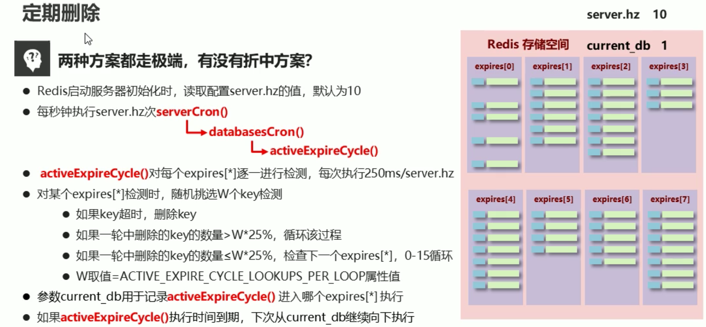


##### 4.删除策略比对

| 删除策略 | 内存占用         | CPU占用                       | 性能               |
| -------- | ---------------- | ----------------------------- | ------------------ |
| 定时删除 | 节约内存，无占用 | 不分时段占用CPU资源， 频度高  | 拿时间换空间       |
| 惰性删除 | 内存占用严重     | 延时执行，CPU利用率高         | 拿空间换时间       |
| 定期删除 | 内存定期随机清理 | 每秒花费固定的CPU资源维护内存 | 随机抽查，重点抽查 |

### 8.3 逐出算法

#### 8.3.1 数据逐出概念

问题1：假设数据不是时效性的，全部都是长期存在的 ，那么数据如何清理？

问题2：当新数据进入redis时，如果内存不足怎么办?

- Redis使用内存存储数据，在执行每一 个命令前，会调用freeMemorylfNeeded()检测内存是否充足。
- 如果内存不满足新加入数据的最低存储要求，redis要临时删除一些数据为当前指令清理存储空间。
- 清理数据的策略称为逐出算法。

> 注意:逐出数据的过程不是100%能够清理出足够的可使用的内存空间，如果不成功则反复执行。
> 当对所有数据尝试完毕后，如果不能达到内存清理的要求，将出现错误信息。
> `(error) OOM command not allowed when used memory > maxmemory`


#### 8.3.2 影响数据逐出的相关配置

- 最大可使用内存：`maxmemory`
  占用物理内存的比例，默认值为0，不设置则不限制。生产环境中根据需求设定,通常设置在50%以上。
- 每次选取待删除数据的个数：`maxmemory-samples`
  选取数据时并不会全库扫描，导致严重的性能消耗，降低读写性能。因此采用随机获取数据的方式作为待检测删除
- 数据删除策略：`maxmemory -policy`
  达到最大内存后的，对被挑选出来的数据进行删除的策略
- 检测易失数据(可能会过期的数据集server.db[i].expires )
  ①`volatile-lru`: 挑选最近最少使用的数据淘汰
  ②`volatile-lfu`: 挑选最近使用次数最少的数据淘汰
  ③`volatile-ttl`: 挑选将要过期的数据淘汰
  ④`volatile- random`:任意选择数据淘汰
- 检测全库数据(所有数据集server.db[j].dict)
  ⑤`allkeys-lru`: 挑选最近最少使用的数据淘汰
  ⑥`allkeys-lfu`: 挑选最近使用次数最少的数据淘汰
  ⑦`allkeys-random`: 任意选择数据淘汰
- 放弃数据驱逐
  ⑧`no-enviction` (驱逐) :禁止驱逐数据(redis4.0中默认策略)， 引发错误OOM (OutOf Memory)
  `maxmemory -policy volatile-lru`


## 九、Redis高级数据类型

通常用来解决单一的数据业务

### 9.1 Bitmaps类型 (状态统计)

#### 9.1.1 Bitmap基本使用

- 获取指定key对应偏移量上的bit值：`getbit key offset`
- 设置指定key对应偏移量上的bit值，value只能是1或0：`setbit key offset value`

#### 9.1.2 Bitmap扩展

##### 业务场景

- 统计每天某一部电影是否被点播
- 统计每天有多少部电影被点播
- 统计每周/月/年有多少部电影被点播
- 统计年度哪部电影没有被点播


- 对指定key按位进行交、并、非、异或操作，并将结果保存到destKey中

  ```java
  bitop op destKey key1 [key2 . ..]   //and: 交  or: 并 not: 非 xor: 异或
  ```

- 统计指定key中1的数量

  `bitcount key [start end]`

> Tips21：redis应用信息状态统计

### 9.2 HyperLogLog (基数统计)

#### 9.2.1 应用场景及基数

**场景：统计独立UV**

- 原始方案: set
- 存储每个用户的id (字符串)
- 改进方案: Bitmaps ,
- 存储每个用户状态(bit)
- 全新的方案: Hyperloglog

**基数**：

- 基数是数据集去重后元素个数
- HyperLogLog 是用来做基数统计的,运用了LogLog的算法

**基数示例：**

- {1,3,5,7,5,7,8}
  基数集: {1,3,5,7,8}
  基数(个数): 5
- {1,1,1,1,1,7, 1}
  基数集:{1,7}
  基数: 2

#### 9.2.2 HyperLogLog类型的基本操作

- 添加数据：pfadd key element [element .. .]
- 统计数据：pfcount key [key .. .]
- 合并数据：pfmerge des tkey sourcekey [sourcekey. .. ]

> Tips 22：redis应用于独立信息统计

#### 9.2.3 HyperLogLog相关说明

- 用于进行基数统计,不是集合,不保存数据，只记录数量而不是具体数据
- 核心是基数估算算法,最终数值存在一定误差
- 误差范围:基数估计的结果是一个带有0.81%标准错误的近似值
- 耗空间极小，每个hyperloglog key占用了12K的内存用于标记基数
- pfadd命令不是一次性分配12K内存使用, 会随着基数的增加内存逐渐增大
- Pfmerge命令合并后占用的存储空间为12K,无论合并之前数据够少

### 9.3 GEO

#### 9.3.1 GEO的引出

场景：火热的生活服务类软件

- 微信/陌陌
- 美团/饿了么
- 携程/马蜂窝
- 高德/百度


#### 9.3.2 GEO类型的基本操作

- 添加坐标点：
  `geoadd key longitude latitude member [longi tude latitude member . . . ]`

- 获取坐标点：
  `geopos key member [member ... ]`

- 计算坐标点距离：
  `geodist key member1 member2 [unit]`

- 根据坐标求范围内的数据：
  `georadius key longitude latitude radiusm| km|ft|mi [wi thcoord] [wi thdist] [withhash] [count count]`
- 根据点求范围内数据：
  `georadiusbymember key member radius m| km|ft|mi [wi thcoord] [wi thdist] [withhash] [count count]`
- 获取指定点对应的坐标hash值：
  `geohash key member [member . . . ]`

> Tips 23：redis应用于地理位置计算