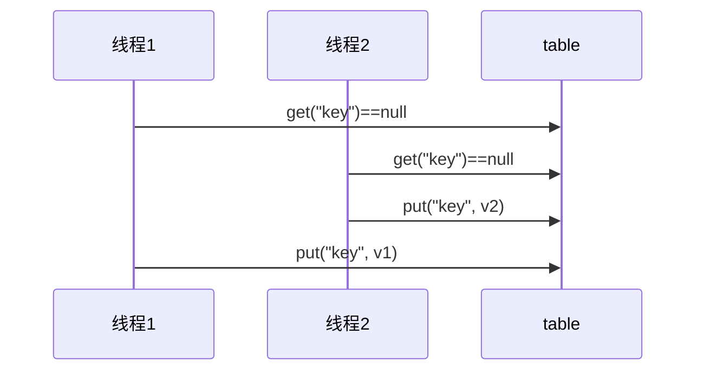

#   Java并发编程

## 1. 概览

### 1.1 这门课讲什么

这门课中的【并发】一词涵盖了在 Java 平台上的

- 进程
- 线程
- 并发
- 并行

以及 Java 并发工具、并发问题以及解决方案，同时我也会讲解一些其它领域的并发

### 1.2 为什么学这么课

- 我工作中用不到并发啊？  
  - 如果只是CURD，那用不到
  - 如果需要深层次理解，为之后阅读框架源码、拔高等打下基础，那用得到。

### 1.3 课程特色

- 本门课程以并发、并行为主线，穿插讲解
  - 应用 - 结合实际
  - 原理 - 了然于胸
  - 模式 - 正确姿势  


### 1.4 预备知识

- 希望你不是一个初学者
- 线程安全问题，需要你接触过 Java Web 开发、Jdbc 开发、Web 服务器、分布式框架时才会遇到
- 基于 JDK 8，最好对函数式编程、lambda 有一定了解
- 采用了 slf4j 打印日志，这是好的实践
- 采用了 lombok 简化 java bean 编写
- 给每个线程好名字，这也是一项好的实践  

### 1.5 相关配置文件

pom.xml

```xml
<properties>
    <maven.compiler.source>1.8</maven.compiler.source>
    <maven.compiler.target>1.8</maven.compiler.target>
</properties>
<dependencies>
    <dependency>
        <groupId>org.projectlombok</groupId>
        <artifactId>lombok</artifactId>
        <version>1.18.10</version>
    </dependency>
    <dependency>
        <groupId>ch.qos.logback</groupId>
        <artifactId>logback-classic</artifactId>
        <version>1.2.3</version>
    </dependency>
</dependencies>
```

logback.xml

```xml
<?xml version="1.0" encoding="UTF-8"?>
<configuration xmlns="http://ch.qos.logback/xml/ns/logback"
               xmlns:xsi="http://www.w3.org/2001/XMLSchema-instance"
               xsi:schemaLocation="http://ch.qos.logback/xml/ns/logback logback.xsd">
    <appender name="STDOUT" class="ch.qos.logback.core.ConsoleAppender">
        <encoder>
            <pattern>%date{HH:mm:ss} [%t] %logger - %m%n</pattern>
        </encoder>
    </appender>
    <logger name="c" level="debug" additivity="false">
        <appender-ref ref="STDOUT"/>
    </logger>
    <root level="ERROR">
        <appender-ref ref="STDOUT"/>
    </root>
</configuration>
```

## 2.进程与线程

- [ ] 进程和线程的概念
- [ ] 并行和并发的概念
- [ ] 线程基本应用  

### 2.1 进程与线程

**进程**

- 程序由指令和数据组成，但这些指令要运行，数据要读写，就必须将指令加载至 CPU，数据加载至内存。在
  指令运行过程中还需要用到磁盘、网络等设备。进程就是用来加载指令、管理内存、管理 IO 的
- 当一个程序被运行，从磁盘加载这个程序的代码至内存，这时就开启了一个进程。
- 进程就可以视为程序的一个实例。大部分程序可以同时运行多个实例进程（例如记事本、画图、浏览器
  等），也有的程序只能启动一个实例进程（例如网易云音乐、360 安全卫士等）

**线程**

- 一个进程之内可以分为一到多个线程。
- 一个线程就是一个指令流，将指令流中的一条条指令以一定的顺序交给 CPU 执行
- Java 中，线程作为最小调度单位，进程作为资源分配的最小单位。 在 windows 中进程是不活动的，只是作
  为线程的容器  

**二者对比**

- 进程基本上相互独立的，而线程存在于进程内，是进程的一个子集

- 进程拥有共享的资源，如内存空间等，供其内部的线程共享

- 进程间通信较为复杂

  - 同一台计算机的进程通信称为 IPC（Inter-process communication）
  - 不同计算机之间的进程通信，需要通过网络，并遵守共同的协议，例如 HTTP

- 线程通信相对简单，因为它们共享进程内的内存，一个例子是多个线程可以访问同一个共享变量

- 线程更轻量，线程上下文切换成本一般上要比进程上下文切换低

  > 上下文切换：指的是内核在CPU上对进程或者线程进行切换；内存总是有限的，当资源紧张时，优先切换给需要资源的进程或者线程

- 引入线程前，进程是资源调度和分配的基本单位，引入线程后，进程是操作系统资源分配的基本单位，而线程是任务调度和执行的基本单位

### 2.2 并行与并发  

单核 cpu 下，线程实际还是**串行执行** 。操作系统中有一个组件叫做任务调度器，将 cpu 的时间片（windows
下时间片最小约为 15 毫秒）分给不同的程序使用，只是由于 cpu 在线程间（时间片很短）的切换非常快，人类感
觉是 同时运行的 。总结为一句话就是**微观串行，宏观并行** ，

一般会将这种 线程轮流使用 CPU 的做法称为**并发**（**concurrent**）

1.单核cpu调度

| CPU  | 时间片 1 | 时间片 2 | 时间片 3 | 时间片 4 |
| ---- | -------- | -------- | -------- | -------- |
| core | 线程 1   | 线程 2   | 线程 3   | 线程 4   |


2.多核cpu调度

多核 cpu下，每个 核（core） 都可以调度运行线程，这时候线程可以是并行的  

| CPU    | 时间片 1 | 时间片 2 | 时间片 3 | 时间片 4 |
| ------ | -------- | -------- | -------- | -------- |
| core 1 | 线程 1   | 线程 1   | 线程 3   | 线程 3   |
| core 2 | 线程 2   | 线程 4   | 线程 2   | 线程 4   |


引用 Rob Pike 的一段描述：

- 并发（concurrent）是同一时间应对（dealing with）多件事情的能力

- 并行（parallel）是同一时间动手做（doing）多件事情的能力

例子

- 家庭主妇做饭、打扫卫生、给孩子喂奶，她一个人轮流交替做这多件事，这时就是并发
- 家庭主妇雇了个保姆，她们一起这些事，这时既有并发，也有并行（这时会产生竞争，例如锅只有一口，一个人用锅时，另一个人就得等待） 
- 雇了3个保姆，一个专做饭、一个专打扫卫生、一个专喂奶，互不干扰，这时是并行   

### 2.3  应用

#### 应用之异步调用（案例1）

以调用方角度来讲，如果：

- 需要等待结果返回，才能继续运行就是同步
- 不需要等待结果返回，就能继续运行就是异步

（1）设计

多线程可以让方法执行变为异步的（即不要巴巴干等着）比如说读取磁盘文件时，假设读取操作花费了 5 秒钟，如果没有线程调度机制，这 5 秒 cpu 什么都做不了，其它代码都得暂停...

（2）结论

- 比如在项目中，视频文件需要转换格式等操作比较费时，这时开一个新线程处理视频转换，避免阻塞主线程
- tomcat 的异步 servlet 也是类似的目的，让用户线程处理耗时较长的操作，避免阻塞 tomcat 的工作线程
- ui 程序中，开线程进行其他操作，避免阻塞 ui 线程  

#### 应用之提高效率（案例1）

充分利用多核 cpu 的优势，提高运行效率。想象下面的场景，执行 3 个计算，最后将计算结果汇总  

```
计算 1 花费 10 ms
计算 2 花费 11 ms
计算 3 花费 9 ms
汇总需要 1 ms
```

- 如果是串行执行，那么总共花费的时间是 `10 + 11 + 9 + 1 = 31ms`
- 但如果是四核 cpu，各个核心分别使用线程 1 执行计算 1，线程 2 执行计算 2，线程 3 执行计算 3，那么 3 个线程是并行的，花费时间只取决于最长的那个线程运行的时间，即 `11ms` 最后加上汇总时间只会花费 `12ms`  

> 需要在多核 cpu 才能提高效率，单核仍然时是轮流执行  

（1）设计

> 代码见【应用之效率-案例1】

（2）结论

- 单核 cpu 下，多线程不能实际提高程序运行效率，只是为了能够在不同的任务之间切换，不同线程轮流使用cpu ，不至于一个线程总占用 cpu，别的线程没法干活
- 多核 cpu 可以并行跑多个线程，但能否提高程序运行效率还是要分情况的
  - 有些任务，经过精心设计，将任务拆分，并行执行，当然可以提高程序的运行效率。但不是所有计算任务都能拆分（参考后文的【阿姆达尔定律】）
  - 也不是所有任务都需要拆分，任务的目的如果不同，谈拆分和效率没啥意义
- IO 操作不占用 cpu，只是我们一般拷贝文件使用的是【阻塞 IO】，这时相当于线程虽然不用 cpu，但需要一
  直等待 IO 结束，没能充分利用线程。所以才有后面的【非阻塞 IO】和【异步 IO】优化  

## 3.Java线程

- 创建和运行线程
- 查看线程
- 线程 API
- 线程状态  

### 3.1 创建和运行线程

#### 方法一，直接使用 Thread  

```java
// 创建线程对象
Thread t = new Thread() {
    public void run() {
        // 要执行的任务
    }
};
// 启动线程
t.start();
```

例如：  

```java
// 构造方法的参数是给线程指定名字，推荐
Thread t1 = new Thread("t1") {
    @Override
    // run 方法内实现了要执行的任务
    public void run() {
        log.debug("hello");
    }
};
t1.start();
```

输出 

`19:19:00 [t1] c.ThreadStarter - hello  ` 

#### 方法二，使用 Runnable 配合 Thread

把【线程】和【任务】（要执行的代码）分开

- Thread 代表线程
- Runnable 可运行的任务（线程要执行的代码）

```java
Runnable runnable = new Runnable() {
    public void run(){
        // 要执行的任务
    }
};
// 创建线程对象
Thread t = new Thread( runnable );
// 启动线程
t.start();
```

例如：  

```java
// 创建任务对象
Runnable task2 = new Runnable() {
    @Override
    public void run() {
        log.debug("hello");
    }
};
// 参数1 是任务对象; 参数2 是线程名字，推荐
Thread t2 = new Thread(task2, "t2");
t2.start();
```

输出：

`19:19:00 [t2] c.ThreadStarter - hello`

##### Java 8 以后可以使用 lambda 精简代码

```java
// 创建任务对象
Runnable task2 = () -> log.debug("hello");
// 参数1 是任务对象; 参数2 是线程名字，推荐
Thread t2 = new Thread(task2, "t2");
t2.start();
```

Runable接口源码

```java
@FunctionalInterface
public interface Runnable {
    /**
     * When an object implementing interface <code>Runnable</code> is used
     * to create a thread, starting the thread causes the object's
     * <code>run</code> method to be called in that separately executing
     * thread.
     * <p>
     * The general contract of the method <code>run</code> is that it may
     * take any action whatsoever.
     *
     * @see java.lang.Thread#run()
     */
    public abstract void run();
}
```

> 只有一个抽象方法的接口，会有`@FunctionalInterface`注解，`lambda`表达式只能简化这种注解的接口

```java
@Slf4j(topic = "test1")
public class Demo2 {
    public static void main(String[] args) {
        /*Runnable r = new Runnable() {//idea alter+enter 提示
            @Override
            public void run() {
                System.out.println("run1");
            }
        };*/

        //lambda表达式简化
        Runnable r = () ->{
            //里面的抽象方法run也省略了(因为只有一个run)
            System.out.println("lambda run");
        };
        Thread t = new Thread(r,"t1");
        t.start();
    }
}
```

#### *原理之 Thread 与 Runnable 的关系

分析 Thread 的源码，理清它与 Runnable 的关系

- 方法1 是把线程和任务合并在了一起，方法2 是把线程和任务分开了
- 用 Runnable 更容易与线程池等高级 API 配合
- 用 Runnable 让任务类脱离了 Thread 继承体系，更灵活  

#### 方法三，FutureTask 配合 Thread

FutureTask 能够接收 Callable 类型的参数，用来处理有返回结果的情况

```java
public class Demo3 {
    public static void main(String[] args) {
        FutureTask<Integer> task = new FutureTask<>(new Callable<Integer>() {
            @Override
            public Integer call() throws Exception {
                System.out.println("thread running");
                Thread.sleep(2000);//休眠2s
                return 100;
            }
        });
        //FutureTask实现了runnable接口，自然可以作为参数传入
        Thread t1 = new Thread(task,"t1");
        t1.start();
        try {
            System.out.println(task.get());//获得task返回值，在休眠两秒后获得
        } catch (InterruptedException e) {
            e.printStackTrace();
        } catch (ExecutionException e) {
            e.printStackTrace();
        }
    }
}
```

```java
/*lambda简化*/
public static void main(String[] args) {
    // 创建任务对象
    FutureTask<Integer> task3 = new FutureTask<>(() -> {
        log.debug("hello");
        return 100;
    });
    // 参数1 是任务对象; 参数2 是线程名字，推荐
    new Thread(task3, "t3").start();
    // 主线程阻塞，同步等待 task 执行完毕的结果
    Integer result = task3.get();
    log.debug("结果是:{}", result);
}
```

输出  

`19:22:27 [t3] c.ThreadStarter - hello`
`19:22:27 [main] c.ThreadStarter - 结果是:100  `

### 3.2 多个线程同时运行  

主要是理解

- 交替执行
- 谁先谁后，不由我们控制  

### 3.3 查看进程线程的方法  

#### windows

- 任务管理器可以查看进程和线程数，也可以用来杀死进程
- `tasklist` 查看进程
- `taskkill` 杀死进程    

#### linux  

- `ps -fe` 查看所有进程
- `ps -fT -p <PID>` 查看某个进程（PID）的所有线程
- `kill` 杀死进程
- `top` 按大写 H 切换是否显示线程
- `top -H -p <PID>` 查看某个进程（PID）的所有线程  

#### Java  

- `jps` 命令查看所有 Java 进程
- `jstack <PID>` 查看某个 Java 进程（PID）的所有线程状态
- `jconsole` 来查看某个 Java 进程中线程的运行情况（图形界面）  

**jconsole 远程监控配置**  

- 需要以如下方式运行你的 java 类  

```
java -Djava.rmi.server.hostname=`ip地址` -Dcom.sun.management.jmxremote -
Dcom.sun.management.jmxremote.port=`连接端口` -Dcom.sun.management.jmxremote.ssl=是否安全连接 -
Dcom.sun.management.jmxremote.authenticate=是否认证 java类
```

- 修改 /etc/hosts 文件将 127.0.0.1 映射至主机名  

如果要认证访问，还需要做如下步骤

- 复制 jmxremote.password 文件
- 修改 jmxremote.password 和 jmxremote.access 文件的权限为 600 即文件所有者可读写
- 连接时填入 controlRole（用户名），R&D（密码）  


### 3.4 原理之线程运行 

#### 栈与栈帧   

Java Virtual Machine Stacks （Java 虚拟机栈）

我们都知道 JVM 中由堆、栈、方法区所组成，其中栈内存是给谁用的呢？其实就是线程，每个线程启动后，虚拟
机就会为其分配一块栈内存。

- 每个栈由多个栈帧（Frame）组成，对应着每次方法调用时所占用的内存
- 每个线程只能有一个活动栈帧，对应着当前正在执行的那个方法  

**栈帧Demo**

```java
public class Demo5 {
    public static void main(String[] args) {
        method1(10);
    }

    public static void method1(int x) {
        int y = x + 1;
        Object m = method2();
        System.out.println(m);
    }
    public static Object method2(){
        Object n = new Object();
        return n;
    }
}
```

**栈帧图解**

 

#### 线程上下文切换（Thread Context Switch）  

因为以下一些原因导致 cpu 不再执行当前的线程，转而执行另一个线程的代码

- 线程的 cpu 时间片用完
- 垃圾回收
- 有更高优先级的线程需要运行
- 线程自己调用了 sleep、yield、wait、join、park、synchronized、lock 等方法

当 Context Switch 发生时，需要由操作系统保存当前线程的状态，并恢复另一个线程的状态，Java 中对应的概念
就是程序计数器（Program Counter Register），它的作用是记住下一条 jvm 指令的执行地址，是线程私有的

- 状态包括程序计数器、虚拟机栈中每个栈帧的信息，如局部变量、操作数栈、返回地址等
- Context Switch 频繁发生会影响性能  

### 3.5 线程常见方法


### 3.6 start 与 run（面试**）  

不调用`start()`而是`run()`会发生啥

```java
public static void main(String[] args) {
    Thread t1 = new Thread("t1") {
        @Override
        public void run() {
            System.out.println(Thread.currentThread().getName());
        }
    };
    t1.run();//main线程执行run代码，而t1线程不执行，非异步状态
}
```

- 直接调用 run 是在主线程中执行了 run，没有启动新的线程
- 使用 start 是启动新的线程，通过新的线程间接执行 run 中的代码

### 3.7 sleep 与 yield  

#### 3.7.1 sleep

- 调用 sleep 会让当前线程从 *Running* 进入 *Timed Waiting* 状态（阻塞）
- 其它线程可以使用 interrupt 方法打断正在睡眠的线程，这时 sleep 方法会抛出 `InterruptedException`
- 睡眠结束后的线程未必会立刻得到执行
  - 没有进入运行态，而是进入了就绪态
- 建议用 TimeUnit 的 sleep 代替 Thread 的 sleep 来获得更好的可读性
  - `TimeUnit.SECONDS.sleep(1);`//休眠一秒

#### 3.7.2 yield

- 字面上理解，yield是让出之意

- 调用 yield 会让当前线程从 *Running* 进入 *Runnable* 就绪状态，然后调度执行其它线程
- 具体的实现依赖于操作系统的任务调度器

#### 3.7.3 线程优先级

- 线程优先级会提示（hint）调度器优先调度该线程，但它仅仅是一个提示，调度器可以忽略它
- 如果 cpu 比较忙，那么优先级高的线程会获得更多的时间片，但 cpu 闲时，优先级几乎没作用  

```java
//Thread类源代码
//设置线程优先级
public final void setPriority(int newPriority) {
    ThreadGroup g;
    checkAccess();
    if (newPriority > MAX_PRIORITY || newPriority < MIN_PRIORITY) {
        throw new IllegalArgumentException();
    }
    if((g = getThreadGroup()) != null) {
        if (newPriority > g.getMaxPriority()) {
            newPriority = g.getMaxPriority();
        }
        setPriority0(priority = newPriority);
    }
}
```

##### 优先级案例

```java
Runnable task1 = () -> {
    int count = 0;
    for (;;) {
        System.out.println("---->1 " + count++);
    }
};
Runnable task2 = () -> {
    int count = 0;
    for (;;) {
        // Thread.yield();
        System.out.println(" ---->2 " + count++);
    }
};
Thread t1 = new Thread(task1, "t1");
Thread t2 = new Thread(task2, "t2");
// t1.setPriority(Thread.MIN_PRIORITY);
// t2.setPriority(Thread.MAX_PRIORITY);
t1.start();
t2.start();
```

### 3.8 join 方法详解(**)  

#### 3.8.1 为什么需要 join？

下面的代码执行，打印 r 是什么？  

```java
static int r = 0;
public static void main(String[] args) throws InterruptedException {
    test1();
}
private static void test1() throws InterruptedException {
    log.debug("开始");
    Thread t1 = new Thread(() -> {
        log.debug("开始");
        sleep(1);//休眠1秒
        log.debug("结束");
        r = 10;
    });
    t1.start();
    
    t1.join();//main等待t1运行结束后继续执行
    
    log.debug("结果为:{}", r);
    log.debug("结束");
}
```

分析

- 因为主线程和线程 t1 是并行执行的，t1 线程需要 1 秒之后才能算出 r=10
- 而主线程一开始就要打印 r 的结果，所以只能打印出 r=0

解决方法

- 用 `sleep` 行不行？为什么？
  - 可以，但是不推荐。
  - 因为不知道t1线程从开始到结束花费了多长时间，也许是1s，也许是100s，那么主线程要等待多久？
- 用 join，加在 `t1.start()` 之后即可（如上代码）  
- 体现了同步思想

#### 3.8.2 <font color=#0072bc>多线程应用之同步（案例1）   </font>

以调用方角度来讲，如果  

- 需要等待结果返回，才能继续运行就是同步
- 不需要等待结果返回，就能继续运行就是异步  


##### 等待多个结果demo  

问，下面代码 cost 大约多少秒？  

```java
static int r1 = 0;
static int r2 = 0;
public static void main(String[] args) throws InterruptedException {
    test2();
}
private static void test2() throws InterruptedException {
    Thread t1 = new Thread(() -> {
        sleep(1);
        r1 = 10;
    });
    Thread t2 = new Thread(() -> {
        sleep(2);
        r2 = 20;
    });
    long start = System.currentTimeMillis();
    t1.start();
    t2.start();
    t1.join();
    t2.join();
    long end = System.currentTimeMillis();
    log.debug("r1: {} r2: {} cost: {}", r1, r2, end - start);
}
```

分析如下

- 第一个 join：等待 t1 时, t2 并没有停止, 而在运行
- 第二个 join：1s 后, 执行到此, t2 也运行了 1s, 因此也只需再等待 1s

如果颠倒两个 join 呢？

最终都是输出：`0:45:43.239 [main] c.TestJoin - r1: 10 r2: 20 cost: 2005  `  

##### 有时效的 join

**1.案例：等够时间**

```java
static int r1 = 0;
static int r2 = 0;
public static void main(String[] args) throws InterruptedException {
    test3();
}
public static void test3() throws InterruptedException {
    Thread t1 = new Thread(() -> {
        sleep(1);
        r1 = 10;
    });
    long start = System.currentTimeMillis();
    t1.start();
    // 线程执行结束会导致 join 结束
    t1.join(1500);//等待线程结束，最多15s
    long end = System.currentTimeMillis();
    log.debug("r1: {} r2: {} cost: {}", r1, r2, end - start);
}
```

输出：`20:48:01.320 [main] c.TestJoin - r1: 10 r2: 0 cost: 1010  `  

**2.案例：没等够时间**  

```java
static int r1 = 0;
static int r2 = 0;
public static void main(String[] args) throws InterruptedException {
    test3();
}
public static void test3() throws InterruptedException {
    Thread t1 = new Thread(() -> {
        sleep(2);
        r1 = 10;
    });
    long start = System.currentTimeMillis();
    t1.start();
    //达到join最大等待时间
    t1.join(1500);
    long end = System.currentTimeMillis();
    log.debug("r1: {} r2: {} cost: {}", r1, r2, end - start);
}
```

输出：`20:52:15.623 [main] c.TestJoin - r1: 0 r2: 0 cost: 1502  `  

### 3.9 interrupt 方法详解(**)

作用：打断线程

#### 3.9.1 打断  sleep，wait，join 的线程

- 这几个方法都会让线程进入阻塞状态

打断 sleep 的线程, 会清空打断状态（false），以 sleep 为例  

```java
//睡眠状态中，执行线程interrupt会返回false，抛出异常，之后会设置打断标记
private static void test1() throws InterruptedException {
    Thread t1 = new Thread(()->{
        sleep(1);
    }, "t1");
    t1.start();
    sleep(0.5);
    t1.interrupt();
    log.debug(" 打断状态: {}", t1.isInterrupted());
}
```

输出

```
java.lang.InterruptedException: sleep interrupted
    at java.lang.Thread.sleep(Native Method)
    at java.lang.Thread.sleep(Thread.java:340)
    at java.util.concurrent.TimeUnit.sleep(TimeUnit.java:386)
    at cn.itcast.n2.util.Sleeper.sleep(Sleeper.java:8)
    at cn.itcast.n4.TestInterrupt.lambda$test1$3(TestInterrupt.java:59)
    at java.lang.Thread.run(Thread.java:745)
21:18:10.374 [main] c.TestInterrupt - 打断状态: false
```

#### 3.9.2 打断正常运行的线程

打断正常运行的线程, 不会清空打断状态

```java
private static void test2() throws InterruptedException {
    Thread t2 = new Thread(()->{
        while(true) {
            Thread current = Thread.currentThread();
            boolean interrupted = current.isInterrupted();
            //被打断了，终止循环
            if(interrupted) {
                log.debug(" 打断状态: {}", interrupted);
                break;
            }
        }
    }, "t2");
    t2.start();
    sleep(0.5);
    t2.interrupt();
}
```

输出 `20:57:37.964 [t2] c.TestInterrupt - 打断状态: true
  `  

#### 3.9.3 <font color=#0072bc>多线程设计模式：两阶段终止  </font>

在一个线程T1中如何“优雅终止线程T2？这里的**优雅**指的是给T2一个料理后事的机会

错误思路

- 使用线程对象的stop()方法停止线程
  - stop方法会真正杀死线程，如果这时线程锁住了共享资源，那么当它被杀死后就再也没有机会释放锁，其它线程将永远无法获取锁
- 使用System.exit(int)方法停止线程
  - 目的仅是停止一个线程,但这种做法会让整个程序都停止


```java
public class Demo7 {
    private Thread monitor;

    //启动监控线程
    public void start() {
        monitor = new Thread(() -> {
            while (true) {
                Thread current = Thread.currentThread();
                //是否被打断
                if (current.isInterrupted()) {
                    Log.debug("料理后事");
                    break;
                }
                try {
                    Thread.sleep(1000); //情况1
                    log.debug("执行监控记录"); //情况2
                } catch (InterruptedException e) {
                    e.printStackTrace();
                    //重新设置打断标记(因为sleep状态下打断会重置标记状态)
                    current.interrupt();
                }
            }
        });
        monitor.start();
    }
    //停止监控线程
    public void stop(){
        monitor.interrupt();
    }
}
```

#### 3.9.4 打断 park 线程

打断 park 线程, 不会清空打断状态  

```java
private static void test3() throws InterruptedException {
    Thread t1 = new Thread(() -> {
        log.debug("park...");
        LockSupport.park();
        log.debug("unpark...");
        log.debug("打断状态：{}", Thread.currentThread().isInterrupted());
    }, "t1");
    t1.start();
    sleep(0.5);
    t1.interrupt();
}
```

输出

```
21:11:52.795 [t1] c.TestInterrupt - park...
21:11:53.295 [t1] c.TestInterrupt - unpark...
21:11:53.295 [t1] c.TestInterrupt - 打断状态：true
```

如果打断标记已经是 true, 则 park 会失效  

```java
private static void test4() {
    Thread t1 = new Thread(() -> {
        for (int i = 0; i < 5; i++) {
            log.debug("park...");
            LockSupport.park();
            log.debug("打断状态：{}", Thread.currentThread().isInterrupted());
        }
    });
    t1.start();
    sleep(1);
    t1.interrupt();
}
```

输出

```
21:13:48.783 [Thread-0] c.TestInterrupt - park...
21:13:49.809 [Thread-0] c.TestInterrupt - 打断状态：true
21:13:49.812 [Thread-0] c.TestInterrupt - park...
21:13:49.813 [Thread-0] c.TestInterrupt - 打断状态：true
21:13:49.813 [Thread-0] c.TestInterrupt - park...
21:13:49.813 [Thread-0] c.TestInterrupt - 打断状态：true
21:13:49.813 [Thread-0] c.TestInterrupt - park...
21:13:49.813 [Thread-0] c.TestInterrupt - 打断状态：true
21:13:49.813 [Thread-0] c.TestInterrupt - park...
21:13:49.813 [Thread-0] c.TestInterrupt - 打断状态：true
```

> 可以使用 `Thread.interrupted()` 清除打断状态  

### 3.10 不推荐的方法  

还有一些不推荐使用的方法，这些方法已过时，**容易破坏同步代码块，造成线程死锁**  

| 方法名    | static | 功能说明             |
| --------- | ------ | -------------------- |
| stop()    |        | 停止线程运行         |
| suspend() |        | 挂起（暂停）线程运行 |
| resume()  |        | 恢复线程运行         |

### 3.11 主线程与守护线程(**)

为什么需要守护线程？如下死循环只有得到true的打断标记时，才可终止线程

```java
public class Demo8 {
    public static void main(String[] args) throws InterruptedException {
        Thread t1 = new Thread(()->{
            while (true){
                //当打断标记true时，才会break
                if (Thread.currentThread().isInterrupted()){
                    break;
                }
                //代码逻辑
                System.out.println("t1结束");
            }
        },"t1");
        t1.start();

        Thread.sleep(1000);
        System.out.println("程序结束");
    }
}
```

默认情况下，Java 进程需要等待所有线程都运行结束，才会结束。

有一种特殊的线程叫做守护线程，只要**其它非守护线程运行结束了，即使守护线程的代码没有执行完，也会强制结束**  

例子：

```java
log.debug("开始运行...");
Thread t1 = new Thread(() -> {
    log.debug("开始运行...");
    sleep(2);
    log.debug("运行结束...");
}, "daemon");
// 设置该线程为守护线程
t1.setDaemon(true);
t1.start();
sleep(1);
log.debug("运行结束...");
```

输出  

```
08:26:38.123 [main] c.TestDaemon - 开始运行...
08:26:38.213 [daemon] c.TestDaemon - 开始运行...
08:26:39.215 [main] c.TestDaemon - 运行结束...
```

> 垃圾回收器线程就是一种守护线程
> Tomcat 中的 Acceptor 和 Poller 线程都是守护线程，所以 Tomcat 接收到 shutdown 命令后，不会等
> 待它们处理完当前请求  

### 3.12 五种状态  

这是从**操作系统**层面来描述的  


- 【初始状态】仅是在语言层面创建了线程对象，还未与操作系统线程关联
- 【可运行状态】（就绪状态）指该线程已经被创建（与操作系统线程关联），可以由 CPU 调度执行
- 【运行状态】指获取了 CPU 时间片运行中的状态
  - 当 CPU 时间片用完，会从【运行状态】转换至【可运行状态】，会导致线程的上下文切换
- 【阻塞状态】
  - 如果调用了阻塞 API，如 BIO 读写文件，这时该线程实际不会用到 CPU，会导致线程上下文切换，进入
    【阻塞状态】
  - 等 BIO 操作完毕，会由操作系统唤醒阻塞的线程，转换至【可运行状态】
  - 与【可运行状态】的区别是，对【阻塞状态】的线程来说只要它们一直不唤醒，调度器就一直不会考虑
    调度它们
- 【终止状态】表示线程已经执行完毕，生命周期已经结束，不会再转换为其它状态  

### 3.13 六种状态  

https://www.bilibili.com/video/BV16J411h7Rd?p=46

这是从 **Java API** 层面来描述的
根据 `Thread.State` 枚举，分为六种状态  


- `NEW` 线程刚被创建，但是还没有调用 start() 方法
- `RUNNABLE` 当调用了 `start()` 方法之后，注意，**Java API** 层面的 `RUNNABLE` 状态涵盖了 **操作系统** 层面的
  【可运行状态】、【运行状态】和【阻塞状态】（由于 BIO 导致的线程阻塞，在 Java 里无法区分，仍然认为
  是可运行）
- `BLOCKED ， WAITING ， TIMED_WAITING` 都是 **Java API** 层面对【阻塞状态】的细分，后面会在状态转换一节详述
- `TERMINATED` 当线程代码运行结束  

### 3.14 习题

阅读华罗庚《统筹方法》，给出烧水泡茶的多线程解决方案，提示

- 参考图二，用两个线程（两个人协作）模拟烧水泡茶过程
  - 文中办法乙、丙都相当于任务串行
- 而图一相当于启动了 4 个线程，有点浪费
- 用 sleep(n) 模拟洗茶壶、洗水壶等耗费的时间

附：华罗庚《统筹方法》  

> 统筹方法，是一种安排工作进程的数学方法。它的实用范围极广泛，在企业管理和基本建设中，以及关系复
> 杂的科研项目的组织与管理中，都可以应用。
>
> 怎样应用呢？主要是把工序安排好  
>
> 比如，想泡壶茶喝。当时的情况是：开水没有；水壶要洗，茶壶、茶杯要洗；火已生了，茶叶也有了。怎么
> 办？  
>
> - 办法甲：洗好水壶，灌上凉水，放在火上；在等待水开的时间里，洗茶壶、洗茶杯、拿茶叶；等水开
>   了，泡茶喝。
> - 办法乙：先做好一些准备工作，洗水壶，洗茶壶茶杯，拿茶叶；一切就绪，灌水烧水；坐待水开了，泡
>   茶喝。
> - 办法丙：洗净水壶，灌上凉水，放在火上，坐待水开；水开了之后，急急忙忙找茶叶，洗茶壶茶杯，泡
>   茶喝。
>
> 哪一种办法省时间？我们能一眼看出，第一种办法好，后两种办法都窝了工。
>
> 这是小事，但这是引子，可以引出生产管理等方面有用的方法来。
>
> 水壶不洗，不能烧开水，因而洗水壶是烧开水的前提。没开水、没茶叶、不洗茶壶茶杯，就不能泡茶，因而这些又是泡茶的前提。它们的相互关系，可以用下边的箭头图来表示：  
>
> 
>
> 从这个图上可以一眼看出，办法甲总共要16分钟（而办法乙、丙需要20分钟）。如果要缩短工时、提高工作
> 效率，应当主要抓烧开水这个环节，而不是抓拿茶叶等环节。同时，洗茶壶茶杯、拿茶叶总共不过4分钟，大
> 可利用“等水开”的时间来做。
>
> 是的，这好像是废话，卑之无甚高论。有如走路要用两条腿走，吃饭要一口一口吃，这些道理谁都懂得。但
> 稍有变化，临事而迷的情况，常常是存在的。在近代工业的错综复杂的工艺过程中，往往就不是像泡茶喝这
> 么简单了。任务多了，几百几千，甚至有好几万个任务。关系多了，错综复杂，千头万绪，往往出现“万事俱
> 备，只欠东风”的情况。由于一两个零件没完成，耽误了一台复杂机器的出厂时间。或往往因为抓的不是关
> 键，连夜三班，急急忙忙，完成这一环节之后，还得等待旁的环节才能装配。
>
> 洗茶壶，洗茶杯，拿茶叶，或先或后，关系不大，而且同是一个人的活儿，因而可以合并成为：  
>
> 
>
> 看来这是“小题大做”，但在工作环节太多的时候，这样做就非常必要了。
>
> 这里讲的主要是时间方面的事，但在具体生产实践中，还有其他方面的许多事。这种方法虽然不一定能直接
> 解决所有问题，但是，我们利用这种方法来考虑问题，也是不无裨益的  

```java
public class Demo9 {
    public static void main(String[] args) {
        Thread t1 = new Thread(()->{
            System.out.println("洗水壶");
            //调用sleep(1)，模拟洗水壶1分钟

            /*-------穿行操作---------*/

            System.out.println("烧水");
            //调用sleep(15)，模拟烧水15分钟
        },"t1");
        Thread t2 = new Thread(()->{
            System.out.println("洗茶壶、洗茶杯、拿茶叶 4分钟");
            //调用sleep(4)，模拟洗茶壶、洗茶杯、拿茶叶 4分钟
            try {
                t1.join();//t2先执行完，所以等待t1完事，再继续执行
            } catch (InterruptedException e) {
                e.printStackTrace();
            }
        },"t2");
    }
}
```

- 上面模拟的是小王等老王的水烧开了，小王泡茶，如果反过来要实现老王等小王的茶叶拿来了，老王泡茶
  呢？代码最好能适应两种情况
- 上面的两个线程其实是各执行各的，如果要模拟老王把水壶交给小王泡茶，或模拟小王把茶叶交给老王泡
  茶呢

### 3.15 本章小结

本章的重点在于掌握

- 线程创建
- 线程重要 api，如 `start，run，sleep，join，interrupt` 等
- 线程状态
- 应用方面
  - 异步调用：主线程执行期间，其它线程异步执行耗时操作
  - 提高效率：并行计算，缩短运算时间
  - 同步等待：`join`
  - 统筹规划：合理使用线程，得到最优效果

- 原理方面
  - 线程运行流程：栈、栈帧、上下文切换、程序计数器
  - Thread 两种创建方式 的源码

- 模式方面
  - 终止模式之两阶段终止  

## 4.共享模型之管程(monitor)

- 共享问题
- synchronized
- 线程安全分析
- Monitor
- wait/notify
- 线程状态转换
- 活跃性
- Lock  

### 4.1 前言

#### 4.1.1 小故事

老王（操作系统）有一个功能强大的算盘（CPU），现在想把它租出去，赚一点外快  


小南、小女（线程）来使用这个算盘来进行一些计算，并按照时间给老王支付费用

但小南不能一天24小时使用算盘，他经常要小憩一会（sleep），又或是去吃饭上厕所（阻塞 io 操作），有
时还需要一根烟，没烟时思路全无（wait）这些情况统称为（阻塞）  


在这些时候，算盘没利用起来（不能收钱了），老王觉得有点不划算

另外，小女也想用用算盘，如果总是小南占着算盘，让小女觉得不公平

于是，老王灵机一动，想了个办法 [ 让他们每人用一会，轮流使用算盘 ]

这样，当小南阻塞的时候，算盘可以分给小女使用，不会浪费，反之亦然

最近执行的计算比较复杂，需要存储一些中间结果，而学生们的脑容量（工作内存）不够，所以老王申请了
一个笔记本（主存），把一些中间结果先记在本上

计算流程是这样的  


但是由于分时系统，有一天还是发生了事故

小南刚读取了初始值 0 做了个 +1 运算，还没来得及写回结果

老王说 [ 小南，你的时间到了，该别人了，记住结果走吧 ]，于是小南念叨着 [ 结果是1，结果是1...] 不甘心地
到一边待着去了（上下文切换）

老王说 [ 小女，该你了 ]，小女看到了笔记本上还写着 0 做了一个 -1 运算，将结果 -1 写入笔记本

这时小女的时间也用完了，老王又叫醒了小南：[小南，把你上次的题目算完吧]，小南将他脑海中的结果 1 写
入了笔记本

  

小南和小女都觉得自己没做错，但笔记本里的结果是 1 而不是 0  

#### 4.1.2 Java 的体现

两个线程对初始值为 0 的静态变量一个做自增，一个做自减，各做 5000 次，结果是 0 吗？  

```java
static int counter = 0;

public static void main(String[] args) throws InterruptedException {
    Thread t1 = new Thread(() -> {
        for (int i = 0; i < 5000; i++) {
            counter++;
        }
    }, "t1");
    
    Thread t2 = new Thread(() -> {
        for (int i = 0; i < 5000; i++) {
            counter--;
        }
    }, "t2");
    
    t1.start();
    t2.start();
    t1.join();
    t2.join();
    log.debug("{}",counter);
}
```

问题分析

以上的结果可能是正数、负数、零。为什么呢？因为 Java 中对静态变量的自增，自减并不是原子操作，要彻底理
解，必须从字节码来进行分析

例如对于 `i++` 而言（i 为静态变量），实际会产生如下的 JVM 字节码指令  

```java
getstatic i //获取静态变量i的值
iconst_1 //准备常量1
iadd //自增
putstatic i //将修改后的值存入静态变量i
```

而对应 `i--` 也是类似  

```java
getstatic i //获取静态变量i的值
iconst_1 //java准备常量1
isub //自减
putstatic i //将修改后的值存入静态变量i
```

而 Java 的内存模型如下，完成静态变量的自增，自减需要在主存和工作内存中进行数据交换  


如果是单线程以上 8 行代码是顺序执行（不会交错）没有问题：  


但多线程下这 8 行代码可能交错运行：

出现负数的情况：  


出现正数的情况：  


#### 4.1.3 临界区 Critical Section  

- 一个程序运行多个线程本身是没有问题的
- 问题出在多个线程访问**共享资源**
  - 多个线程读**共享资源**其实也没有问题
  - 在多个线程对**共享资源**读写操作时发生指令交错，就会出现问题
- 一段代码块内如果存在对**共享资源**的多线程读写操作，称这段代码块为**临界区**  

例如，下面代码中的临界区  

```java
static int counter = 0;
static void increment()
//临界区
{
    counter++;
}
static void decrement()
//临界区
{
    counter--;
}
```

#### 4.1.4 竞态条件 Race Condition

多个线程在临界区内执行，由于代码的**执行序列不同**而导致结果无法预测，称之为发生了**竞态条件**  

### 4.2 synchronized 解决方案  

为了避免临界区的竞态条件发生，有多种手段可以达到目的。

- 阻塞式的解决方案：`synchronized`，`Lock`
- 非阻塞式的解决方案：原子变量

本次课使用阻塞式的解决方案：synchronized，来解决上述问题，即俗称的【对象锁】，它采用互斥的方式让同一时刻至多只有一个线程能持有【对象锁】，其它线程再想获取这个【对象锁】时就会阻塞住。这样就能保证拥有锁的线程可以安全的执行临界区内的代码，不用担心线程上下文切换  

> 虽然 java中互斥和同步都可以采用 synchronized 关键字来完成，但它们还是有区别的：
>
> - 互斥是保证临界区的竞态条件发生，同一时刻只能有一个线程执行临界区代码
> - 同步是由于线程执行的先后、顺序不同、需要一个线程等待其它线程运行到某个点  

#### 4.2.1 synchronized

##### 语法

```java
synchronized(对象) // 线程1， 线程2(blocked)
{
    //临界区
}
```

##### 案例


- `synchronized(对象)` 中的对象，可以想象为一个房间（room），有唯一入口（门）房间只能一次进入一人
  进行计算，线程 t1，t2 想象成两个人
- 当线程 t1 执行到 `synchronized(room)` 时就好比 t1 进入了这个房间，并锁住了门拿走了钥匙，在门内执行
  `count++` 代码
- 这时候如果 t2 也运行到了 `synchronized(room)` 时，它发现门被锁住了，只能在门外等待，发生了上下文切
  换，阻塞住了
- 这中间即使 t1 的 cpu 时间片不幸用完，被踢出了门外（不要错误理解为锁住了对象就能一直执行下去哦），
  这时门还是锁住的，t1 仍拿着钥匙，t2 线程还在阻塞状态进不来，只有下次轮到 t1 自己再次获得时间片时才
  能开门进入
- 当 t1 执行完 `synchronized{}` 块内的代码，这时候才会从 obj 房间出来并解开门上的锁，唤醒 t2 线程把钥
  匙给他。t2 线程这时才可以进入 obj 房间，锁住了门拿上钥匙，执行它的 `count--` 代码  

```java
static int counter = 0;
static final Object room = new Object();
public static void main(String[] args) throws InterruptedException {
    Thread t1 = new Thread(() -> {
        for (int i = 0; i < 5000; i++) {
            synchronized (room) {
                counter++;
            }
        }
    }, "t1");
    Thread t2 = new Thread(() -> {
        for (int i = 0; i < 5000; i++) {
            synchronized (room) {
                counter--;
            }
        }
    }, "t2");
    t1.start();
    t2.start();
    t1.join();
    t2.join();
    log.debug("{}",counter);
}
```

##### 时序图


##### 思考

synchronized 实际是用**对象锁**保证了**临界区内代码的原子性**，临界区内的代码对外是不可分割的，不会被线程切
换所打断  

为了加深理解，请思考下面的问题  

- 如果把 `synchronized(obj)` 放在 for 循环的外面，如何理解？-- 原子性
  - 整个for循环体作为整个原子体
- 如果 t1 `synchronized(obj1)` 而 t2 `synchronized(obj2)` 会怎样运作？-- 锁对象
  - 不会保护临界区代码，因为拿的不是同一个锁对象
  - 保护共享资源，多个线程要保证锁住的是同一个对象
- 如果 t1 `synchronized(obj)` 而 t2 没有加会怎么样？如何理解？-- 锁对象  

##### 面向对象改进

把需要保护的共享变量放入一个类  

```Java
class Room {
    int value = 0;
    public void increment() {
        synchronized (this) {
            value++;
        }
    }
    public void decrement() {
        synchronized (this) {
            value--;
        }
    }
    public int get() {
        synchronized (this) {
            return value;
        }
    }
}

@Slf4j
public class Test1 {
    public static void main(String[] args) throws InterruptedException {
        Room room = new Room();
        Thread t1 = new Thread(() -> {
            for (int j = 0; j < 5000; j++) {
                room.increment();
            }
        }, "t1");
        Thread t2 = new Thread(() -> {
            for (int j = 0; j < 5000; j++) {
                room.decrement();
            }
        }, "t2");
        t1.start();
        t2.start();
        t1.join();
        t2.join();
        log.debug("count: {}" , room.get());
    }
}
```

#### 4.2.2 方法上的 synchronized (**) 

synchronized不能锁方法，本质上是锁的对象

1.加在成员方法上，锁的是this对象

```java
class Test{
    public synchronized void test() {
    }
}
//等价于
class Test{
    public void test() {
        synchronized(this) {
        }
    }
}
```

2.加在静态方法上，锁的是类对象

```java
class Test{
    public synchronized static void test() {
    }
}
//等价于
class Test{
    public static void test() {
        synchronized(Test.class) {
        }
    }
}
```

不加 synchronized 的方法

不加 synchronzied 的方法就好比不遵守规则的人，不去老实排队（好比翻窗户进去的）  

##### 线程八锁(**)

其实就是考察 synchronized 锁住的是哪个对象  

> 注意：sleep()会释放cpu资源，但是不会释放锁；wait()会释放锁

情况1：**1->2** or **2->1**

```java
//a()、b()都加锁了，因为在同一个类下，所以都是给this加的锁
@Slf4j(topic = "c.Number")
class Number{
    public synchronized void a() {
        log.debug("1");
    }
    public synchronized void b() {
        log.debug("2");
    }
}
public static void main(String[] args) {
    Number n1 = new Number();
    new Thread(()->{ n1.a(); }).start();
    new Thread(()->{ n1.b(); }).start();
}
```

情况2：**1s后1->2** or **2->1s后1**

```java
@Slf4j(topic = "c.Number")
class Number{
    public synchronized void a() {
        sleep(1);
        log.debug("1");
    }
    public synchronized void b() {
        log.debug("2");
    }
}
public static void main(String[] args) {
    Number n1 = new Number();
    new Thread(()->{ n1.a(); }).start();
    new Thread(()->{ n1.b(); }).start();
}
```

情况3：**3 -> 1s后1->2** or **2->3 -> 1s后1** or **3->2 -> 1s后1** 

`c()`未加锁，与`a()、b()`不会有互斥的效果，并行执行；而`a()、b()`会有互斥效果

```java
@Slf4j(topic = "c.Number")
class Number{
    public synchronized void a() {
        sleep(1);
        log.debug("1");
    }
    public synchronized void b() {
        log.debug("2");
    }
    public void c() {
        log.debug("3");
    }
}
public static void main(String[] args) {
    Number n1 = new Number();
    new Thread(()->{ n1.a(); }).start();
    new Thread(()->{ n1.b(); }).start();
    new Thread(()->{ n1.c(); }).start();
}
```

情况4：**2 -> 1s 后 1**  

因为锁的不是同一对象，因此两者不互斥，加上t1休眠1s

```java
@Slf4j(topic = "c.Number")
class Number{
    public synchronized void a() {
        sleep(1);
        log.debug("1");
    }
    public synchronized void b() {
        log.debug("2");
    }
}
public static void main(String[] args) {
    //两个锁对象
    Number n1 = new Number();
    Number n2 = new Number();
    new Thread(()->{ n1.a(); }).start();
    new Thread(()->{ n2.b(); }).start();
}
```

情况5：**2 -> 1s 后 1**  

```java
@Slf4j(topic = "c.Number")
class Number{
    public static synchronized void a() {
        sleep(1);
        log.debug("1");
    }
    public synchronized void b() {
        log.debug("2");
    }
}
public static void main(String[] args) {
    Number n1 = new Number();
    new Thread(()->{ n1.a(); }).start();
    new Thread(()->{ n1.b(); }).start();
}
```

情况6：**1s后1 -> 2** or **2 -> 1s后1**  

`a()`、`b()` 都是静态，锁住的是Number类对象，因此`n1.a()`且`n1.b()`是互斥的

```java
@Slf4j(topic = "c.Number")
class Number{
    public static synchronized void a() {
        sleep(1);
        log.debug("1");
    }
    public static synchronized void b() {
        log.debug("2");
    }
}
public static void main(String[] args) {
    Number n1 = new Number();
    new Thread(()->{ n1.a(); }).start();
    new Thread(()->{ n1.b(); }).start();
}
```

情况7：**2 -> 1s后1** 

```java
@Slf4j(topic = "c.Number")
class Number{
    public static synchronized void a() {
        sleep(1);
        log.debug("1");
    }
    public synchronized void b() {
        log.debug("2");
    }
}
public static void main(String[] args) {
    Number n1 = new Number();
    Number n2 = new Number();
    new Thread(()->{ n1.a(); }).start();
    new Thread(()->{ n2.b(); }).start();
}
```

情况8：**1s后1 -> 2** or **2 -> 1s后1**  

`a()`、`b()` 都是静态，锁住的是Number类对象，因此`n1.a()`且`n2.b()`是互斥的，虽然是不同对象，但是是一个类的

```java
@Slf4j(topic = "c.Number")
class Number{
    public static synchronized void a() {
        sleep(1);
        log.debug("1");
    }
    public static synchronized void b() {
        log.debug("2");
    }
}
public static void main(String[] args) {
    Number n1 = new Number();
    Number n2 = new Number();
    new Thread(()->{ n1.a(); }).start();
    new Thread(()->{ n2.b(); }).start();
}
```

### 4.3 变量的线程安全分析

#### 4.3.1 成员变量和静态变量是否线程安全？

- 如果它们没有共享，则线程安全
- 如果它们被共享了，根据它们的状态是否能够改变，又分两种情况
  - 如果只有读操作，则线程安全
  - 如果有读写操作，则这段代码是临界区，需要考虑线程安全

#### 4.3.2 局部变量是否线程安全？

- 局部变量是线程安全的
- 但局部变量引用的对象则未必
  - 如果该对象没有逃离方法的作用访问，它是线程安全的
  - 如果该对象逃离方法的作用范围，需要考虑线程安全

#### 4.3.3 局部变量线程安全分析  

```java
public static void test1() {
    int i = 10;
    i++;
}
```

每个线程调用 `test1()` 方法时局部变量 i，**会在每个线程的栈帧内存中被创建多份**，因此不存在共享  

```java
public static void test1();
	descriptor: ()V
	flags: ACC_PUBLIC, ACC_STATIC
	Code:
		stack=1, locals=1, args_size=0
			0: bipush 10
			2: istore_0
			3: iinc 0, 1
			6: return
		LineNumberTable:
			line 10: 0
			line 11: 3
			line 12: 6
		LocalVariableTable:
			Start Length Slot Name Signature
			  3     4     0    i     I
```

如图，局部变量的引用稍有不同  


局部变量的引用稍有不同  

##### 成员变量的例子  

```java
class ThreadUnsafe {
    ArrayList<String> list = new ArrayList<>();
    public void method1(int loopNumber) {
        for (int i = 0; i < loopNumber; i++) {
            // { 临界区, 会产生竞态条件
            method2();
            method3();
            // } 临界区
        }
    }
    private void method2() {
        list.add("1");
    }
    private void method3() {
        list.remove(0);
    }
}
```

执行

```java
static final int THREAD_NUMBER = 2;
static final int LOOP_NUMBER = 200;
public static void main(String[] args) {
    ThreadUnsafe test = new ThreadUnsafe();
    for (int i = 0; i < THREAD_NUMBER; i++) {
        new Thread(() -> {
            test.method1(LOOP_NUMBER);
        }, "Thread" + i).start();
    }
}
```

因为是临界区，会产生竞态条件，所以出现一种情况：线程2 还未 add，线程1 remove 就会报错  

```
Exception in thread "Thread1" java.lang.IndexOutOfBoundsException: Index: 0, Size: 0
    at java.util.ArrayList.rangeCheck(ArrayList.java:657)
    at java.util.ArrayList.remove(ArrayList.java:496)
    at cn.itcast.n6.ThreadUnsafe.method3(TestThreadSafe.java:35)
    at cn.itcast.n6.ThreadUnsafe.method1(TestThreadSafe.java:26)
    at cn.itcast.n6.TestThreadSafe.lambda$main$0(TestThreadSafe.java:14)
    at java.lang.Thread.run(Thread.java:748)
```

分析：

- 无论哪个线程中的 method2 ，引用的都是同一个对象中的 list 成员变量
- method3 与 method2 分析相同  


##### list 修改为局部变量  

```java
class ThreadSafe {
    public final void method1(int loopNumber) {
        ArrayList<String> list = new ArrayList<>();
        for (int i = 0; i < loopNumber; i++) {
            method2(list);
            method3(list);
        }
    }
    private void method2(ArrayList<String> list) {
        list.add("1");
    }
    private void method3(ArrayList<String> list) {
        list.remove(0);
    }
}
```

那么就不会有上述问题了  

分析：

- list 是局部变量，每个线程调用时会创建其不同实例，没有共享
- 而 method2 的参数是从 method1 中传递过来的，与 method1 中引用同一个对象
- method3 的参数分析与 method2 相同  


方法访问修饰符带来的思考，如果把 method2 和 method3 的方法修改为 public 会不会代理线程安全问题？

- 情况1：有其它线程调用 method2 和 method3
  - 其他线程直接调用method2 和 method3传过来的 list 与method1传进去的不是同一个，因此不会有问题
- 情况2：在 情况1 的基础上，为 ThreadSafe 类添加子类，子类覆盖 method2 或 method3 方法，即  

```java
class ThreadSafe {
    public final void method1(int loopNumber) {
        ArrayList<String> list = new ArrayList<>();
        for (int i = 0; i < loopNumber; i++) {
            method2(list);
            method3(list);
        }
    }
    private void method2(ArrayList<String> list) {
        list.add("1");
    }
    private void method3(ArrayList<String> list) {
        list.remove(0);
    }
}
class ThreadSafeSubClass extends ThreadSafe{
    @Override
    public void method3(ArrayList<String> list) {
        new Thread(() -> {
            list.remove(0);
        }).start();
    }
}
```

`ThreadSafeSubClass extends ThreadSafe`，重写了父类method3，开辟了新线程，共享list，即出现了子类与父类共享资源，因此出现问题。

> 从这个例子可以看出 private 或 final 提供【安全】的意义所在，请体会开闭原则中的【闭】  
>
> 访问修饰符在一定程度上，保护了线程安全

#### 4.3.3 常见线程安全类(**)  

- String
- Integer
- StringBuffer
- Random
- Vector
- Hashtable
- java.util.concurrent 包下的类  

这里说它们是线程安全的是指，多个线程调用它们同一个实例的某个方法时，是线程安全的。也可以理解为  

```java
Hashtable table = new Hashtable();

new Thread(()->{
    table.put("key", "value1");
}).start();

new Thread(()->{
    table.put("key", "value2");
}).start();
```

时序图

线程1的`put`覆盖了 线程2的`put`



- 它们的每个方法是原子的
- 但**注意**它们多个方法的组合不是原子的，见后面分析  

##### 不可变类线程安全性

`String、Integer` 等都是不可变类（final类），因为其内部的状态不可以改变，因此它们的方法都是线程安全的

有同学或许有疑问，`String` 有 `replace`，`substring` 等方法可以改变值啊，那么这些方法又是如何保证线程安
全的呢？  

###### 1.`subString()`源码

```java
public String substring(int beginIndex) {
    if (beginIndex < 0) {
        throw new StringIndexOutOfBoundsException(beginIndex);
    }
    int subLen = value.length - beginIndex;//截取长度 = 总长度 - 索引下标
    if (subLen < 0) {
        throw new StringIndexOutOfBoundsException(subLen);
    }
    //若索引为0？返回本身：创建新的字符串对象
    return (beginIndex == 0) ? this : new String(value, beginIndex, subLen);
}
```

###### 2.`String`构造器源码

```java
//value为char数组
public String(char value[], int offset, int count) {
    if (offset < 0) {
        throw new StringIndexOutOfBoundsException(offset);
    }
    if (count <= 0) {
        if (count < 0) {
            throw new StringIndexOutOfBoundsException(count);
        }
        if (offset <= value.length) {
            this.value = "".value;
            return;
        }
    }
    // Note: offset or count might be near -1>>>1.
    if (offset > value.length - count) {
        throw new StringIndexOutOfBoundsException(offset + count);
    }
    //创建value字符串时，在原有字符串的基础上进行复制，赋值给新字符串（没有改动原有对象属性，直接创建新的）
    this.value = Arrays.copyOfRange(value, offset, offset+count);
}
```

```java
public class Immutable{
    private int value = 0;
    public Immutable(int value){
        this.value = value;
    }
    public int getValue(){
        return this.value;
    }
}
```

如果想增加一个增加的方法呢？  

```java
public class Immutable{
    private int value = 0;
    public Immutable(int value){
        this.value = value;
    }
    public int getValue(){
        return this.value;
    }
    public Immutable add(int v){
        return new Immutable(this.value + v);
    }
}
```

#### 4.3.4 线程安全实例分析(**)

例1

> Servlet运行在tomcat环境下，只有一个实例，可以被多个线程共享使用

```java
public class MyServlet extends HttpServlet {
    // 是否安全？否
    Map<String,Object> map = new HashMap<>();
    // 是否安全？是（final）
    String S1 = "...";
    // 是否安全？是
    final String S2 = "...";
    // 是否安全？否（Date类不是）
    Date D1 = new Date();
    // 是否安全？否（日期对象D2引用值是final，但是new Date()可变，即引用属性是可变的，因此不安全）
    final Date D2 = new Date();
    public void doGet(HttpServletRequest request, HttpServletResponse response) {
        // 使用上述变量
    }
}
```

例2

```java
public class MyServlet extends HttpServlet {
    // 是否安全？否（userService成员变量在Servlet是唯一的，多个线程共享）
    private UserService userService = new UserServiceImpl();
    public void doGet(HttpServletRequest request, HttpServletResponse response) {
        userService.update(...);
    }
}
public class UserServiceImpl implements UserService {
    // 记录调用次数
    private int count = 0;
    public void update() {
        // ...
        count++;
    }
}
```

例3

> Spring没有加@Scope(...)说明多例，则会默认为单例，即默认被共享，其成员变量默认被共享

```java
@Aspect
@Component
public class MyAspect {
    // 是否安全？否（成员变量，默认被共享）
    private long start = 0L;
    @Before("execution(* *(..))")
    public void before() {
        start = System.nanoTime();
    }
    @After("execution(* *(..))")
    public void after() {
        long end = System.nanoTime();
        System.out.println("cost time:" + (end-start));
    }
}
//解决方案：做成环绕通知，将原有成员变量内嵌为局部变量
```

例4

三层结构的典型调用

```java
/*----------自顶向下分析-----------*/
public class MyServlet extends HttpServlet {
    // 是否安全 是（userDao私有，而且自身也是安全的，如下分析）
    private UserService userService = new UserServiceImpl();
    public void doGet(HttpServletRequest request, HttpServletResponse response) {
        userService.update(...);
    }
}
public class UserServiceImpl implements UserService {
    // 是否安全 是(虽然userdao是成员变量，但是内部无成员变量，如下分析)
    private UserDao userDao = new UserDaoImpl();
    public void update() {
        userDao.update();
    }
}
public class UserDaoImpl implements UserDao {
    //无成员变量，因此update()线程安全
    public void update() {
        String sql = "update user set password = ? where username = ?";
        // 是否安全 是（conn是方法内的局部变量）
        try (Connection conn = DriverManager.getConnection("","","")){
            // ...
        } catch (Exception e) {
            // ...
        }
    }
}
```

例5

```java
public class MyServlet extends HttpServlet {
    // 是否安全
    private UserService userService = new UserServiceImpl();
    public void doGet(HttpServletRequest request, HttpServletResponse response) {
        userService.update(...);
    }
}
public class UserServiceImpl implements UserService {
    // 是否安全 否（成员变量，且内部方法不安全）
    private UserDao userDao = new UserDaoImpl();
    public void update() {
        userDao.update();
    }
}
public class UserDaoImpl implements UserDao {
    // 是否安全 否(成员变量被共享，对比例4)
    private Connection conn = null;
    public void update() throws SQLException {
        String sql = "update user set password = ? where username = ?";
        conn = DriverManager.getConnection("","","");
        // ...
        conn.close();
    }
}
```

> 例4、例5分析可知，实际编程中，要避免conn定义为成员变量
>
> 如：线程1实例化conn，线程2释放conn，那完犊子了

例6

```java
public class MyServlet extends HttpServlet {
    // 是否安全
    private UserService userService = new UserServiceImpl();
    public void doGet(HttpServletRequest request, HttpServletResponse response) {
        userService.update(...);
    }
}
public class UserServiceImpl implements UserService {
    public void update() {
        //是否安全 是（局部变量）
        UserDao userDao = new UserDaoImpl();
        userDao.update();
    }
}
public class UserDaoImpl implements UserDao {
    //是否安全 是（引用它的是成员变量形式，实例化就创建一次，因此不存在安全问题，如上）
    private Connection = null;
    public void update() throws SQLException {
        String sql = "update user set password = ? where username = ?";
        conn = DriverManager.getConnection("","","");
        // ...
        conn.close();
    }
}
```

例7

```java
public abstract class Test {
    public void bar() {
        // 是否安全 否（虽为局部变量，但是要看是否暴露给其他线程，如下描述）
        SimpleDateFormat sdf = new SimpleDateFormat("yyyy-MM-dd HH:mm:ss");
        foo(sdf);
    }
    public abstract foo(SimpleDateFormat sdf);
    public static void main(String[] args) {
        new Test().bar();
    }
}
```
其中 foo 的行为是不确定的，可能导致不安全的发生，被称之为**外星方法**
```java
public void foo(SimpleDateFormat sdf) {
    String dateStr = "1999-10-11 00:00:00";
    for (int i = 0; i < 20; i++) {
        new Thread(() -> {
            try {
                sdf.parse(dateStr);
            } catch (ParseException e) {
                e.printStackTrace();
            }
        }).start();
    }
}
```

请比较 JDK 中 String 类的实现  

源码如下：

```java
private static Integer i = 0;
public static void main(String[] args) throws InterruptedException {
    List<Thread> list = new ArrayList<>();
    for (int j = 0; j < 2; j++) {
        Thread thread = new Thread(() -> {
            for (int k = 0; k < 5000; k++) {
                synchronized (i) {
                    i++;
                }
            }
        }, "" + j);
        list.add(thread);
    }
    list.stream().forEach(t -> t.start());
    list.stream().forEach(t -> {
        try {
            t.join();
        } catch (InterruptedException e) {
            e.printStackTrace();
        }
    });
    log.debug("{}", i);
}
```

> 如果不设计成final，则继承String类的子类可能会覆盖掉父类的行为，造成线程不安全
>
> String类的设计完美体现了Java的闭合原则

### 4.4  习题（暂时略）

https://www.bilibili.com/video/BV16J411h7Rd?p=71

#### 4.4.1 卖票

测试下面代码是否存在线程安全问题，并尝试改正  

```java
public class ExerciseSell {
    public static void main(String[] args) {
        TicketWindow ticketWindow = new TicketWindow(2000);
        List<Thread> list = new ArrayList<>();
        // 用来存储买出去多少张票
        List<Integer> sellCount = new Vector<>();
        for (int i = 0; i < 2000; i++) {
            Thread t = new Thread(() -> {
                // 分析这里的竞态条件
                int count = ticketWindow.sell(randomAmount());
                sellCount.add(count);
            });
            list.add(t);
            t.start();
        }
        list.forEach((t) -> {
            try {
                t.join();
            } catch (InterruptedException e) {
                e.printStackTrace();
            }
        });
        // 买出去的票求和
        log.debug("selled count:{}",sellCount.stream().mapToInt(c -> c).sum());
        // 剩余票数
        log.debug("remainder count:{}", ticketWindow.getCount());
    }
    // Random 为线程安全
    static Random random = new Random();
    // 随机 1~5
    public static int randomAmount() {
        return random.nextInt(5) + 1;
    }
}
class TicketWindow {
    private int count;
    public TicketWindow(int count) {
        this.count = count;
    }
    public int getCount() {
        return count;
    }
    public int sell(int amount) {
        if (this.count >= amount) {
            this.count -= amount;
            return amount;
        } else {
            return 0;
        }
    }
}
```

另外，用下面的代码行不行，为什么？  

```java
List<Integer> sellCount = new ArrayList<>();
```

测试脚本

```java
for /L %n in (1,1,10) do java -cp ".;C:\Users\manyh\.m2\repository\ch\qos\logback\logbackclassic\1.2.3\logback-classic-1.2.3.jar;C:\Users\manyh\.m2\repository\ch\qos\logback\logbackcore\1.2.3\logback-core-1.2.3.jar;C:\Users\manyh\.m2\repository\org\slf4j\slf4japi\1.7.25\slf4j-api-1.7.25.jar" cn.itcast.n4.exercise.ExerciseSell
```

#### 4.4.2 转账

测试下面代码是否存在线程安全问题，并尝试改正  

```java
public class ExerciseTransfer {
    public static void main(String[] args) throws InterruptedException {
        Account a = new Account(1000);
        Account b = new Account(1000);
        Thread t1 = new Thread(() -> {
            for (int i = 0; i < 1000; i++) {
                a.transfer(b, randomAmount());
            }
        }, "t1");
        Thread t2 = new Thread(() -> {
            for (int i = 0; i < 1000; i++) {
                b.transfer(a, randomAmount());
            }
        }, "t2");
        t1.start();
        t2.start();
        t1.join();
        t2.join();
        // 查看转账2000次后的总金额
        log.debug("total:{}",(a.getMoney() + b.getMoney()));
    }
    // Random 为线程安全
    static Random random = new Random();
    // 随机 1~100
    public static int randomAmount() {
        return random.nextInt(100) +1;
    }
}
class Account {
    private int money;
    public Account(int money) {
        this.money = money;
    }
    public int getMoney() {
        return money;
    }
    public void setMoney(int money) {
        this.money = money;
    }
    public void transfer(Account target, int amount) {
        if (this.money > amount) {
            this.setMoney(this.getMoney() - amount);
            target.setMoney(target.getMoney() + amount);
        }
    }
}
```

这样改正行不行，为什么？

```java
public synchronized void transfer(Account target, int amount) {
    if (this.money > amount) {
        this.setMoney(this.getMoney() - amount);
        target.setMoney(target.getMoney() + amount);
    }
}
```