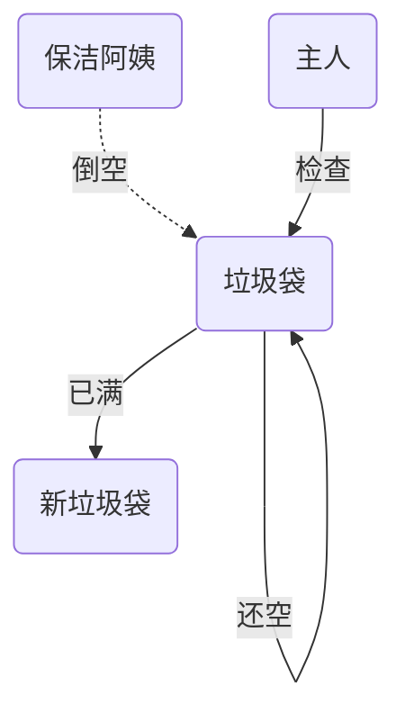

##  5.共享模型之内存  

本章内容

上一章讲解的 Monitor 主要关注的是访问共享变量时，保证临界区代码的原子性  

这一章我们进一步深入学习共享变量在多线程间的【可见性】问题与多条指令执行时的【有序性】问题  

### 5.1 Java 内存模型  

JMM 即 Java Memory Model，它定义了主存、工作内存抽象概念，底层对应着 CPU 寄存器、缓存、硬件内存、CPU 指令优化等  

JMM 体现在以下几个方面  

- 原子性 - 保证指令不会受到线程上下文切换的影响
- 可见性 - 保证指令不会受 cpu 缓存的影响
- 有序性 - 保证指令不会受 cpu 指令并行优化的影响  

### 5.2 可见性

#### 5.2.1 退不出的循环(变量不可见)

先来看一个现象，main 线程对 run 变量的修改对于 t 线程不可见，导致了 t 线程无法停止：  

```java
static boolean run = true;
public static void main(String[] args) throws InterruptedException {
    Thread t = new Thread(()->{
        while(run){
            // ....
        }
    });
    t.start();
    sleep(1);
    run = false; // 线程t不会如预想的停下来
}
```

为什么呢？分析一下：

1.初始状态， t 线程刚开始从主内存读取了 run 的值到工作内存

  

2.因为 t 线程要频繁从主内存中读取 run 的值，JIT 编译器会将 run 的值缓存至自己工作内存中的高速缓存中，减少对主存中 run 的访问，提高效率


3.1 秒之后，main 线程修改了 run 的值，并同步至主存，而 t 是从自己工作内存中的高速缓存中读取这个变量
的值，结果永远是旧值

  

#### 5.2.2 解决方法

##### volatile（易变关键字）

```java
//易变关键字，volatile修饰的变量就不可以去缓存中读取了，只能去主内存读取
volatile static boolean run = true;
```

- 编写Java程序中，JVM为了提高程序的执行效率，会对我们的程序进行优化，把经常需要被访问的变量存储在我们的缓存当中（即存到CPU寄存器中），而避免直接去内存里读，cpu访问内存的数据，需要通过总线发送指令给内存，这个速度远比不让我们的cpu在我们的寄存器里直接读取数据，可以大大的提高我们程序的运行效率，但是当遇到多线程的情况，变量的值可能已经被别的线程改变了，而该缓存却无法察觉内存中的变化，从而造成我们的线程读取的数据跟内存里的数据是不一致的（脏数据）
- 它可以用来修饰成员变量和静态成员变量，他可以避免线程从自己的工作缓存中查找变量的值，必须到主存中获取它的值，线程操作 volatile 变量都是直接操作主存
- 但是volatile并不能保证我们操作的一个原子性，所以，他是不能取代我们的synchronized的，而且会阻止编译器对我们的程序进行优化，除非很有必要，不然就要避免使用volatile这个关键字
- 在多线程操作中，保证变量得可见性，避免多线程操作下读取到脏数据  

##### 同步代码块

```java
static boolean run = true;

final static Object lock = new Object();

public static void main(String[] args) throws InterruptedException {
    Thread t = new Thread(()->{
        while(true){
            // ....
            synchronized(lock){
                if(!run){
                    break;
                }
            }
        }
    });
    t.start();
    sleep(1);
    synchronized(lock){
        run = false; // 线程t不会如预想的停下来
    }
}
```

#### 5.2.3 可见性 vs 原子性  

前面例子体现的实际就是可见性，它保证的是在多个线程之间，一个线程对 volatile 变量的修改对另一个线程可见， 不能保证原子性，仅用在一个写线程，多个读线程的情况： 上例从字节码理解是这样的：  

```java
getstatic run // 线程 t 获取 run true
getstatic run // 线程 t 获取 run true
getstatic run // 线程 t 获取 run true
getstatic run // 线程 t 获取 run true
putstatic run // 线程 main 修改 run 为 false， 仅此一次
getstatic run // 线程 t 获取 run false
```

比较一下之前我们讲线程安全时举的例子(原子性)：两个线程一个 `i++` 一个 `i--` ，只能保证看到最新值，不能解决指令交错，所以volatile只能保证可见性、有序性，原子性就用synchronized、reentrantlock 

```java
// 假设i的初始值为0
getstatic 		i 	// 线程2-获取静态变量i的值 线程内i=0
getstatic 		i 	// 线程1-获取静态变量i的值 线程内i=0
iconst_1 			// 线程1-准备常量1
iadd 				// 线程1-自增 线程内i=1
putstatic 		i 	// 线程1-将修改后的值存入静态变量i 静态变量i=1
iconst_1 			// 线程2-准备常量1
isub 				// 线程2-自减 线程内i=-1
putstatic 		i 	// 线程2-将修改后的值存入静态变量i 静态变量i=-1
```

> synchronized 语句块既可以保证代码块的原子性，也同时保证代码块内变量的可见性。但缺点是synchronized 是属于重量级操作，性能相对更低
>
> 如果在前面示例的死循环中加入 System.out.println() 会发现即使不加 volatile 修饰符，线程 t 也能正确看到
> 对 run 变量的修改了，想一想为什么？  => 查阅 System.out.println()源代码

#### 5.2.4 volatile优化3.9.3案例（多线程设计模式：两阶段终止）

```java
/*
设置了一个共享变量作为，打断标记
因为多个线程操作共享变量，需要明确变量的可见性，所以加volatile
*/
public class Demo7 {
    private Thread monitor; //监控线程
    private volatile boolean stop = false; //停止标记
    
    //启动监控线程
    public void start() {
        monitor = new Thread(() -> {
            while (true) {
                Thread current = Thread.currentThread();
                //是否被打断
                if (stop) {
                    Log.debug("料理后事");
                    break;
                }
                try {
                    Thread.sleep(1000); //情况1
                    log.debug("执行监控记录"); //情况2
                } catch (InterruptedException e) {
                    e.printStackTrace();
                    //重新设置打断标记(因为sleep状态下打断会重置标记状态)
                    current.interrupt();
                }
            }
        });
        monitor.start();
    }
    //停止监控线程
    public void stop(){
        stop = true;
    }
}
```

#### 5.2.5 模式之Balking  

（1）前言：对比上边代码，若一个线程对象，执行了两次start（`t1.start();t1.start();`），那么它执行的流程自然也是双倍且重复的

Balking （犹豫）模式，用在一个线程发现另一个线程或本线程已经做了某一件相同的事，那么本线程就无需再做了，直接结束返回  

（2）案例：实现监控

```java
public class MonitorService {
    private Thread monitorThread;
    // 用来表示是否已经有线程已经在执行启动了
    private volatile boolean starting;
    public void start() {
        log.info("尝试启动监控线程...");
        //syn代码块中，代码越多，上锁时间越长 => 只包括需要保护的变量
        synchronized (this) {
            if (starting) {
                return;
            }
            starting = true;
        }
        // 真正启动监控线程...
        monitorThread = new Thread(()->{...},"monitor");
        monitorThread.start();
        
    }
}
```

当前端页面多次点击按钮调用 start 时  

输出

```
[http-nio-8080-exec-1] cn.itcast.monitor.service.MonitorService - 该监控线程已启动?(false)
[http-nio-8080-exec-1] cn.itcast.monitor.service.MonitorService - 监控线程已启动...
[http-nio-8080-exec-2] cn.itcast.monitor.service.MonitorService - 该监控线程已启动?(true)
[http-nio-8080-exec-3] cn.itcast.monitor.service.MonitorService - 该监控线程已启动?(true)
[http-nio-8080-exec-4] cn.itcast.monitor.service.MonitorService - 该监控线程已启动?(true)
```

案例2：它还经常用来实现线程安全的单例  

```java
public final class Singleton {
    private Singleton() {
    }
    private static Singleton INSTANCE = null;
    public static synchronized Singleton getInstance() {
        if (INSTANCE != null) {
            return INSTANCE;
        }
        INSTANCE = new Singleton();
        return INSTANCE;
    }
}
```

对比一下保护性暂停模式：保护性暂停模式用在一个线程等待另一个线程的执行结果，当条件不满足时线程等待

### 5.3 有序性  

`JVM`会在不影响正确性的前提下，可以调整语句的执行顺序，思考下面一段代码  

```java
static int i;
static int j;
// 在某个线程内执行如下赋值操作
i = ...;
j = ...;
```

可以看到，至于是先执行 i 还是 先执行 j ，对最终的结果不会产生影响。所以，上面代码真正执行时，既可以是  

```
i = ...;
j = ...;
```

也可以是  

```
j = ...;
i = ...;
```

这种特性称之为『指令重排』，多线程下『指令重排』会影响正确性。为什么要有重排指令这项优化呢？从 CPU执行指令的原理来理解一下吧  

#### 5.3.1 指令级并行原理

目的：掌握 指令级并行 是分阶段，分工是提升效率的思想

##### （1）术语

###### Clock Cycle Time  

主频的概念大家接触的比较多，而 CPU 的 Clock Cycle Time（时钟周期时间），等于主频的倒数，意思是 CPU 能够识别的最小时间单位，比如说 4G 主频的 CPU 的 Clock Cycle Time 就是 0.25 ns，作为对比，我们墙上挂钟的 Cycle Time 是 1s

例如，运行一条加法指令一般需要一个时钟周期时间  

###### CPI  

有的指令需要更多的时钟周期时间，所以引出了 CPI （Cycles Per Instruction）指令平均时钟周期数  

###### IPC  

IPC（Instruction Per Clock Cycle） 即 CPI 的倒数，表示每个时钟周期能够运行的指令数  

###### CPU 执行时间  

程序的 CPU 执行时间，即我们前面提到的 user + system 时间，可以用下面的公式来表示  

```
程序 CPU 执行时间 = 指令数 * CPI * Clock Cycle Time  
```

##### （2）鱼罐头的故事

加工一条鱼需要 50 分钟，只能一条鱼、一条鱼顺序加工...  


可以将每个鱼罐头的加工流程细分为 5 个步骤：  

- 去鳞清洗 10分钟
- 蒸煮沥水 10分钟
- 加注汤料 10分钟
- 杀菌出锅 10分钟
- 真空封罐 10分钟  

即使只有一个工人，最理想的情况是：他能够在 10 分钟内同时做好这 5 件事，因为对第一条鱼的真空装罐，不会影响对第二条鱼的杀菌出锅...  

##### （3）指令重排序优化  

事实上，现代处理器会设计为一个时钟周期完成一条执行时间最长的 CPU 指令。为什么这么做呢？可以想到指令还可以再划分成一个个更小的阶段，例如，每条指令都可以分为： `取指令 - 指令译码 - 执行指令 - 内存访问 - 数据写回` 这5个阶段  

> 术语参考：
> instruction fetch (IF)
> instruction decode (ID)
> execute (EX)
> memory access (MEM)
> register write back (WB)  

在不改变程序结果的前提下，这些指令的各个阶段可以通过**重排序**和**组合**来实现**指令级并行**，这一技术在 80's 中叶到 90's 中叶占据了计算架构的重要地位

> 提示：分阶段，分工是提升效率的关键！  

指令重排的前提是，**重排指令不能影响结果**，例如  

```java
// 可以重排的例子
int a = 10; // 指令1
int b = 20; // 指令2
System.out.println( a + b );
// 不能重排的例子
int a = 10; // 指令1
int b = a - 5; // 指令2
```

> 参考： Scoreboarding and the Tomasulo algorithm (which is similar to scoreboarding but makes use of register renaming) are two of the most common techniques for implementing out-of-order execution and instruction-level parallelism  

##### （4）支持流水线的处理器  

现代 CPU 支持**多级指令流水线**，例如支持同时执行 `取指令 - 指令译码 - 执行指令 - 内存访问 - 数据写回` 的处理器，就可以称之为**五级指令流水线**。这时 CPU 可以在一个时钟周期内，同时运行五条指令的不同阶段（相当于一条执行时间最长的复杂指令），IPC = 1，本质上，流水线技术并不能缩短单条指令的执行时间，但它变相地提高了指令地吞吐率  

> 提示：奔腾四（Pentium 4）支持高达 35 级流水线，但由于功耗太高被废弃


##### （5）SuperScalar 处理器  

大多数处理器包含多个执行单元，并不是所有计算功能都集中在一起，可以再细分为整数运算单元、浮点数运算单元等，这样可以把多条指令也可以做到并行获取、译码等，CPU 可以在一个时钟周期内，执行多于一条指令，IPC>1  


#### 5.3.2 指令重排示例

##### （1）诡异的结果  

```java
int num = 0;
boolean ready = false;

// 线程1 执行此方法
public void actor1(I_Result r) {
    if(ready) {
        r.r1 = num + num;
    } else {
        r.r1 = 1;
    }
}

// 线程2 执行此方法
public void actor2(I_Result r) {
    num = 2;
    ready = true;
}
```

`I_Result` 是一个对象，有一个属性 r1 用来保存结果；问，可能的结果有几种？

有同学这么分析

- 情况1：线程1 先执行，这时 ready = false，所以进入 else 分支结果为 1
- 情况2：线程2 先执行 num = 2，但没来得及执行 ready = true，线程1 执行，还是进入 else 分支，结果为1
- 情况3：线程2 执行到 ready = true，线程1 执行，这回进入 if 分支，结果为 4（因为 num 已经执行过了）  

但我告诉你，结果还有可能是 0  

这种情况下是：线程2执行 ready = true，切换到线程1，进入 if 分支，相加为 0，再切回线程2 执行 num = 2  

这种现象叫做指令重排，是 JIT 编译器在运行时的一些优化，这个现象需要通过大量测试才能复现：  

```
mvn archetype:generate -DinteractiveMode=false -DarchetypeGroupId=org.openjdk.jcstress -
DarchetypeArtifactId=jcstress-java-test-archetype -DarchetypeVersion=0.5 -DgroupId=cn.itcast -
DartifactId=ordering -Dversion=1.0
```

##### （2）实操测试

创建 maven 项目，提供如下测试类  

```java
@JCStressTest
@Outcome(id = {"1", "4"}, expect = Expect.ACCEPTABLE, desc = "ok")
@Outcome(id = "0", expect = Expect.ACCEPTABLE_INTERESTING, desc = "!!!!")//感兴趣的输出
@State
public class ConcurrencyTest {
    int num = 0;
    boolean ready = false;
    @Actor
    public void actor1(I_Result r) {
        if(ready) {
            r.r1 = num + num;
        } else {
            r.r1 = 1;
        }
    }
    @Actor
    public void actor2(I_Result r) {
        num = 2;
        ready = true;
    }
}
```

执行

```
mvn clean install
java -jar target/jcstress.jar
```

会输出我们感兴趣的结果，摘录其中一次结果：  

```
*** INTERESTING tests
	Some interesting behaviors observed. This is for the plain curiosity.
	
	2 matching test results.
		[OK] test.ConcurrencyTest
	   (JVM args: [-XX:-TieredCompilation])
	Observed state Occurrences Expectation Interpretation
			0 1,729 ACCEPTABLE_INTERESTING !!!!
			1 42,617,915 ACCEPTABLE ok
			4 5,146,627 ACCEPTABLE ok
		[OK] test.ConcurrencyTest
	   (JVM args: [])
	Observed state Occurrences Expectation Interpretation
			0 1,652 ACCEPTABLE_INTERESTING !!!!
			1 46,460,657 ACCEPTABLE ok
			4 4,571,072 ACCEPTABLE ok
```

可以看到，出现结果为 0 的情况有 638 次，虽然次数相对很少，但毕竟是出现了

##### （3）解决方法

volatile 修饰的变量，可以禁用指令重排  

```java
@JCStressTest
@Outcome(id = {"1", "4"}, expect = Expect.ACCEPTABLE, desc = "ok")
@Outcome(id = "0", expect = Expect.ACCEPTABLE_INTERESTING, desc = "!!!!")//感兴趣的输出
@State
public class ConcurrencyTest {
    int num = 0;
    volatile boolean ready = false;//加上 volatile 防止 ready 之前的代码指令重排
    @Actor
    public void actor1(I_Result r) {
        if(ready) {
            r.r1 = num + num;
        } else {
            r.r1 = 1;
        }
    }
    @Actor
    public void actor2(I_Result r) {
        num = 2;
        ready = true;
    }
}
```

结果为

```
*** INTERESTING tests
	Some interesting behaviors observed. This is for the plain curiosity.
	0 matching test results
```

#### 5.3.2 原理之 volatile  

volatile 的底层实现原理是内存屏障，Memory Barrier（Memory Fence）

- 对 volatile 变量的写指令后会加入写屏障
- 对 volatile 变量的读指令前会加入读屏障  

##### （1）如何保证可见性  

- 写屏障（sfence）保证在该屏障之前的，对共享变量的改动，都同步到主存当中  

```java
public void actor2(I_Result r) {
    num = 2;
    ready = true; // ready 是 volatile 赋值带写屏障（ready及之前都被写屏障了）
    // 写屏障
}
```

- 而读屏障（lfence）保证在该屏障之后，对共享变量的读取，加载的是主存中最新数据  

```java
public void actor1(I_Result r) {
    // 读屏障
    // ready 是 volatile 读取值带读屏障
    if(ready) {
        r.r1 = num + num;
    } else {
        r.r1 = 1;
    }
}
```


##### （2）如何保证有序性  

写屏障会确保指令重排序时，不会将写屏障之前的代码排在写屏障之后  

```java
public void actor2(I_Result r) {
    num = 2;
    ready = true; // ready 是 volatile 赋值带写屏障
    // 写屏障
}
```

读屏障会确保指令重排序时，不会将读屏障之后的代码排在读屏障之前  

```java
public void actor1(I_Result r) {
    // 读屏障
    // ready 是 volatile 读取值带读屏障
    if(ready) {
        r.r1 = num + num;
    } else {
        r.r1 = 1;
    }
}
```


还是那句话，不能解决指令交错：

- 写屏障仅仅是保证之后的读能够读到最新的结果，但不能保证读跑到它前面去
- 而有序性的保证也只是保证了本线程内相关代码不被重排序  


##### （3）double-checked locking 问题  

以著名的 double-checked locking 单例模式为例  

```java
public final class Singleton {
    private Singleton() { }
    private static volatile Singleton INSTANCE = null;
    public static Singleton getInstance() {
        // 实例没创建，才会进入内部的 synchronized代码块
        if (INSTANCE == null) {//INSTANCE没有完全交给syn代码块管理
            synchronized (Singleton.class) { // t2
                // 也许有其它线程已经创建实例，所以再判断一次
                if (INSTANCE == null) { // t1
                    INSTANCE = new Singleton();
                }
            }
        }
        return INSTANCE;
    }
}
```

以上的实现特点是  

- 懒惰实例化
- 首次使用 getInstance() 才使用 synchronized 加锁，后续使用时无需加锁
- 有隐含的，但很关键的一点：第一个 if 使用了 INSTANCE 变量，是在同步块之外  

但在多线程环境下，上面的代码是有问题的，`getInstance` 方法对应的字节码为：  

```properties
0: getstatic #2 // Field INSTANCE:Lcn/itcast/n5/Singleton;
3: ifnonnull 37
6: ldc       #3 // class cn/itcast/n5/Singleton
8: dup
9: astore_0
10: monitorenter
11: getstatic #2 // Field INSTANCE:Lcn/itcast/n5/Singleton;
14: ifnonnull 27
17: new       #3 // class cn/itcast/n5/Singleton
20: dup
21: invokespecial #4 // Method "<init>":()V
24: putstatic     #2 // Field INSTANCE:Lcn/itcast/n5/Singleton;
27: aload_0
28: monitorexit
29: goto 37
32: astore_1
33: aload_0
34: monitorexit
35: aload_1
36: athrow
37: getstatic      #2 // Field INSTANCE:Lcn/itcast/n5/Singleton;
40: areturn
```

其中

- 17 表示创建对象，将对象引用入栈 // new Singleton

- 20 表示复制一份对象引用 // 引用地址

- 21 表示利用一个对象引用，调用构造方法

- 24 表示利用一个对象引用，赋值给 static INSTANCE

也许 jvm 会优化为：先执行 24，再执行 21。如果两个线程 t1，t2 按如下时间序列执行：  


关键在于 0: getstatic 这行代码在 monitor 控制之外，它就像之前举例中不守规则的人，可以越过 monitor 读取
INSTANCE 变量的值

这时 t1 还未完全将构造方法执行完毕，如果在构造方法中要执行很多初始化操作，那么 t2 拿到的是将是一个未初
始化完毕的单例

对 INSTANCE 使用 volatile 修饰即可，可以禁用指令重排，但要注意在 JDK 5 以上的版本的 volatile 才会真正有效

> synchronized关键字可以保证 原子性、可见性、**有序性**，但是前提是共享变量都交给synchronized去管理，不能如上例子将共享变量留在外部，synchronized保证有序性是通过monitor锁机制，而**不是禁用指令重排**

##### （4）double-checked locking 解决  

```java
public final class Singleton {
    private Singleton() { }
    private static volatile Singleton INSTANCE = null;
    public static Singleton getInstance() {
        // 实例没创建，才会进入内部的 synchronized代码块
        if (INSTANCE == null) {
            synchronized (Singleton.class) { // t2
                // 也许有其它线程已经创建实例，所以再判断一次
                if (INSTANCE == null) { // t1
                    INSTANCE = new Singleton();
                }
            }
        }
        return INSTANCE;
    }
}
```

字节码上看不出来 volatile 指令的效果  

```properties
// -------------------------------------> 加入对 INSTANCE 变量的读屏障
0: getstatic              #2           // Field INSTANCE:Lcn/itcast/n5/Singleton;
3: ifnonnull              37
6: ldc                    #3           // class cn/itcast/n5/Singleton
8: dup								   //复制了指针引用放入栈中
9: astore_0
10: monitorenter -----------------------> 保证原子性、可见性
11: getstatic             #2          // Field INSTANCE:Lcn/itcast/n5/Singleton;
14: ifnonnull 27
17: new                   #3          // class cn/itcast/n5/Singleton
20: dup
21: invokespecial         #4          // Method "<init>":()V
24: putstatic             #2          // Field INSTANCE:Lcn/itcast/n5/Singleton;
// -------------------------------------> 加入对 INSTANCE 变量的写屏障
27: aload_0
28: monitorexit ------------------------> 保证原子性、可见性
29: goto 37
32: astore_1
33: aload_0
34: monitorexit
35: aload_1
36: athrow
37: getstatic             #2           // Field INSTANCE:Lcn/itcast/n5/Singleton;
40: areturn
```

如上面的注释内容所示，读写 volatile 变量时会加入内存屏障（Memory Barrier（Memory Fence）），保证下面两点：

- 可见性
  - 写屏障（sfence）保证在该屏障之前的 t1 对共享变量的改动，都同步到主存当中
  - 而读屏障（lfence）保证在该屏障之后 t2 对共享变量的读取，加载的是主存中最新数据
- 有序性
  - 写屏障会确保指令重排序时，不会将写屏障之前的代码排在写屏障之后
  - 读屏障会确保指令重排序时，不会将读屏障之后的代码排在读屏障之前
- 更底层是读写变量时使用 lock 指令来多核 CPU 之间的可见性与有序性  


#### 5.3.3 happens-before  

happens-before 规定了对共享变量的写操作对其它线程的读操作可见，它是可见性与有序性的一套规则总结，抛开以下 happens-before 规则，JMM 并不能保证一个线程对共享变量的写，对于其它线程对该共享变量的读可见

# 习题（course 153-156暂略）

### 5.4 本章小结

本章重点讲解了 JMM 中的

- 可见性 - 由 JVM 缓存优化引起
- 有序性 - 由 JVM 指令重排序优化引起
- happens-before 规则
- **原理方面**
  - CPU 指令并行
  - volatile
- **模式方面**
  - 两阶段终止模式的 volatile 改进
  - 同步模式之 balking  


## 6.共享模型之无锁(无锁并发)

- [ ] CAS 与 volatile
- [ ] 原子整数
- [ ] 原子引用
- [ ] 原子累加器
- [ ] Unsafe  

### 6.1 问题提出

有如下需求，保证 `account.withdraw` 取款方法的线程安全  

```java
package cn.itcast;
import java.util.ArrayList;
import java.util.List;
interface Account {
    // 获取余额
    Integer getBalance();
    // 取款
    void withdraw(Integer amount);
    /**
	 * 方法内会启动 1000 个线程，每个线程做-10元的操作
	 * 如果初始余额为 10000 那么正确的结果应当是0
	 */
    static void demo(Account account) {
        List<Thread> ts = new ArrayList<>();
        long start = System.nanoTime();
        for (int i = 0; i < 1000; i++) {
            ts.add(new Thread(() -> {
                account.withdraw(10);
            }));
        }
        ts.forEach(Thread::start);
        ts.forEach(t -> {
            try {
                t.join();
            } catch (InterruptedException e) {
                e.printStackTrace();
            }
        });
        long end = System.nanoTime();
        System.out.println(account.getBalance() + " cost: " + (end-start)/1000_000 + " ms");
    }
}
```

原有实现并不是线程安全的  

```java
class AccountUnsafe implements Account {
    private Integer balance;
    public AccountUnsafe(Integer balance) {
        this.balance = balance;
    }
    @Override
    public Integer getBalance() {
        return balance;
    }
    @Override
    public void withdraw(Integer amount) {
        balance -= amount;
    }
}
```

执行测试代码  

```java
public static void main(String[] args) {
    Account.demo(new AccountUnsafe(10000));
}
```

某次的执行结果

```
330 cost: 306 ms
```

#### 6.1.1 为什么不安全

看 `withdraw()` 方法  

```java
public void withdraw(Integer amount) {
    balance -= amount;
}  
```

对应的字节码

```java
ALOAD 0 															// <- this
ALOAD 0
GETFIELD cn/itcast/AccountUnsafe.balance : Ljava/lang/Integer; 		// <- this.balance
INVOKEVIRTUAL java/lang/Integer.intValue ()I 						// 拆箱
ALOAD 1 															// <- amount
INVOKEVIRTUAL java/lang/Integer.intValue ()I 						// 拆箱
ISUB 																// 减法
INVOKESTATIC java/lang/Integer.valueOf (I)Ljava/lang/Integer; 		// 结果装箱
PUTFIELD cn/itcast/AccountUnsafe.balance : Ljava/lang/Integer; 		// -> this.balance
```

多线程执行流程  

```java
ISUB 										// thread-0 减法
INVOKESTATIC java/lang/Integer.valueOf 		// thread-0 结果装箱
PUTFIELD cn/itcast/AccountUnsafe.balance 	// thread-0 -> this.balance
ALOAD 0 									// thread-1 <- this
ALOAD 0
GETFIELD cn/itcast/AccountUnsafe.balance 	// thread-1 <- this.balance
INVOKEVIRTUAL java/lang/Integer.intValue 	// thread-1 拆箱
ALOAD 1 									// thread-1 <- amount
INVOKEVIRTUAL java/lang/Integer.intValue 	// thread-1 拆箱
ISUB 										// thread-1 减法
INVOKESTATIC java/lang/Integer.valueOf 		// thread-1 结果装箱
PUTFIELD cn/itcast/AccountUnsafe.balance 	// thread-1 -> this.balance
```

- 单核的指令交错
- 多核的指令交错  

#### 6.1.2 解决思路-锁  

首先想到的是给 Account 对象加锁

```java
class AccountUnsafe implements Account {
    private Integer balance;
    public AccountUnsafe(Integer balance) {
        this.balance = balance;
    }
    @Override
    public synchronized Integer getBalance() {
        return balance;
    }
    @Override
    public synchronized void withdraw(Integer amount) {
        balance -= amount;
    }
}
```

结果为

```
0 cost: 399 ms
```

#### 6.1.3 解决思路-无锁  

```java
class AccountSafe implements Account {
    private AtomicInteger balance;
    public AccountSafe(Integer balance) {
        this.balance = new AtomicInteger(balance);
    }
    @Override
    public Integer getBalance() {
        return balance.get();
    }
    @Override
    public void withdraw(Integer amount) {
        while (true) {
   			//局部变量放到工作内存中，并没有同步到主存中         
            int prev = balance.get(); //获取余额的最新值
            int next = prev - amount; //要修改的余额
            //真正修改的逻辑：如果修改成功，退出循环
            if (balance.compareAndSet(prev, next)) {
                break;
            }
        }
        // 可以简化为下面的方法
        // balance.addAndGet(-1 * amount);
    }
}
```

执行测试代码 

```java
public static void main(String[] args) {
    Account.demo(new AccountSafe(10000));
}
```

某次的执行结果

```
0 cost: 302 ms
```

### 6.2 CAS 与 volatile

#### 6.2.1 CAS执行过程

前面看到的 `AtomicInteger` 的解决方法，内部并没有用锁来保护共享变量的线程安全。那么它是如何实现的呢？  

```java
public void withdraw(Integer amount) {
    while(true) {
        // 需要不断尝试，直到成功为止
        while (true) {
            // 比如拿到了旧值 1000
            int prev = balance.get();
            // 在这个基础上 1000-10 = 990
            int next = prev - amount;
            
            /*
                compareAndSet 正是做这个检查，在 set 前，先比较 prev 与当前值
                - 不一致了，next 作废，返回 false 表示失败
                	比如，别的线程已经做了减法，当前值已经被减成了 990
                	那么本线程的这次 990 就作废了，进入 while 下次循环重试
                - 一致，以 next 设置为新值，返回 true 表示成功
            */
            
            //比较并设置值
            if (balance.compareAndSet(prev, next)) {
                break;
            }
        }
    }
}
```

其中的关键是 compareAndSet，它的简称就是 CAS （也有 Compare And Swap 的说法），它必须是原子操作。  


CAS思想是不断尝试，直至成功

>**注意**
>
>- 其实 CAS 的底层是 lock cmpxchg 指令（X86 架构），在单核 CPU 和多核 CPU 下都能够保证【比较-交换】的原子性  
>- 在多核状态下，某个核执行到带 lock 的指令时，CPU 会让总线锁住，当这个核把此指令执行完毕，再开启总线。这个过程中不会被线程的调度机制所打断，保证了多个线程对内存操作的准确性，是原子的。  

#### 6.2.2 慢动作分析

> p162，有一个debug技巧

```java
@Slf4j
public class SlowMotion {
    public static void main(String[] args) {
        AtomicInteger balance = new AtomicInteger(10000);
        int mainPrev = balance.get();
        log.debug("try get {}", mainPrev);
        new Thread(() -> {
            sleep(1000);
            int prev = balance.get();
            balance.compareAndSet(prev, 9000);
            log.debug(balance.toString());
        }, "t1").start();
        sleep(2000);
        log.debug("try set 8000...");
        boolean isSuccess = balance.compareAndSet(mainPrev, 8000);
        log.debug("is success ? {}", isSuccess);
        if(!isSuccess){
            mainPrev = balance.get();
            log.debug("try set 8000...");
            isSuccess = balance.compareAndSet(mainPrev, 8000);
            log.debug("is success ? {}", isSuccess);
        }
    }
    private static void sleep(int millis) {
        try {
            Thread.sleep(millis);
        } catch (InterruptedException e) {
            e.printStackTrace();
        }
    }
}
```

输出结果

```
2019-10-13 11:28:37.134 [main] try get 10000
2019-10-13 11:28:38.154 [t1] 9000
2019-10-13 11:28:39.154 [main] try set 8000...
2019-10-13 11:28:39.154 [main] is success ? false
2019-10-13 11:28:39.154 [main] try set 8000...
2019-10-13 11:28:39.154 [main] is success ? true
```

#### 6.2.3 volatile

##### （1）前言

前面我们说到了，当共享变量 banlance 被另一个线程改变时，CAS操作会失败，因为 prev 不是期待的那个 banlance 值，而是另一个线程改变的，这就涉及到变量可见性的问题，需要借助 volatile 关键字

##### （2）描述

获取共享变量时，为了保证该变量的可见性，需要使用 volatile 修饰。

它可以用来修饰成员变量和静态成员变量，他可以避免线程从自己的工作缓存中查找变量的值，必须到主存中获取它的值，线程操作 volatile 变量都是直接操作主存。即一个线程对 volatile 变量的修改，对另一个线程可见。

> volatile 仅仅保证了共享变量的可见性，让其它线程能够看到最新值，但不能解决指令交错问题（不能保证原子性）

分析上述案例用到的 AtomicInteger 类源码

```java
public class AtomicInteger extends Number implements java.io.Serializable {
    private static final long serialVersionUID = 6214790243416807050L;

    // setup to use Unsafe.compareAndSwapInt for updates
    private static final Unsafe unsafe = Unsafe.getUnsafe();
    private static final long valueOffset;

    static {
        try {
            valueOffset = unsafe.objectFieldOffset
                (AtomicInteger.class.getDeclaredField("value"));
        } catch (Exception ex) { throw new Error(ex); }
    }
	
    // AtomicInteger返回值value，用volatile关键字修饰，保证该变量可见性，AtomicInteger类的变量保证了可见性
    private volatile int value;

    public AtomicInteger(int initialValue) {
        value = initialValue;
    }

    public AtomicInteger() {
    }

    public final int get() {
        return value;
    }

    public final void set(int newValue) {
        value = newValue;
    }
    //...
}
```

**所以 CAS 必须借助 volatile 才能读取到共享变量的最新值来实现【比较并交换】的效果**  

#### 6.2.4 为什么无锁效率高  

- 无锁情况下，即使重试失败，线程始终在高速运行，没有停歇，而 synchronized 会让线程在没有获得锁的时候，发生上下文切换，进入阻塞。
- 线程就好像高速跑道上的赛车，高速运行时，速度超快，一旦发生上下文切换，就好比赛车要减速、熄火，等被唤醒又得重新打火、启动、加速... 恢复到高速运行，代价比较大（**发动机预热**）
- 但无锁情况下，因为线程要保持运行，需要额外 CPU 的支持，CPU 在这里就好比高速跑道，没有额外的跑道，线程想高速运行也无从谈起，虽然不会进入阻塞，但由于没有分到时间片，仍然会进入可运行状态，还是会导致上下文切换。  

> **发动机预热**：如前几节的课堂案例，第一次案例明明没有加锁，反而比第二次加锁的案例花费的时间长，这是因为存在**线程预热**
>
> 线程数 < CPU核心数的时候，用CAS比较合适，否则会有线程得不到核心，会使上下文切换


#### 6.2.5 CAS 的特点  

结合 CAS 和 volatile 可以实现无锁并发，适用于线程数少、多核 CPU 的场景下

- CAS 是基于乐观锁的思想：最乐观的估计，不怕别的线程来修改共享变量，就算改了也没关系，我吃亏点再重试呗。

- synchronized 是基于悲观锁的思想：最悲观的估计，得防着其它线程来修改共享变量，我上了锁你们都别想改，我改完了解开锁，你们才有机会。
- CAS 体现的是无锁并发、无阻塞并发，请仔细体会这两句话的意思
  - 因为没有使用 synchronized，所以线程不会陷入阻塞，这是效率提升的因素之一
  - 但如果竞争激烈，可以想到重试必然频繁发生，反而效率会受影响  

### 6.3 原子整数  

J.U.C 并发包提供了：

- AtomicBoolean
- AtomicInteger
- AtomicLong  

以 AtomicInteger 为例  

```java
AtomicInteger i = new AtomicInteger(0);
// 获取并自增（i = 0, 结果 i = 1, 返回 0），类似于 i++
System.out.println(i.getAndIncrement());
// 自增并获取（i = 1, 结果 i = 2, 返回 2），类似于 ++i
System.out.println(i.incrementAndGet());
// 自减并获取（i = 2, 结果 i = 1, 返回 1），类似于 --i
System.out.println(i.decrementAndGet());
// 获取并自减（i = 1, 结果 i = 0, 返回 1），类似于 i--
System.out.println(i.getAndDecrement());
// 获取并加值（i = 0, 结果 i = 5, 返回 0）
System.out.println(i.getAndAdd(5));
// 加值并获取（i = 5, 结果 i = 0, 返回 0）
System.out.println(i.addAndGet(-5));
// 获取并更新（i = 0, p 为 i 的当前值, 结果 i = -2, 返回 0）
// 其中函数中的操作能保证原子，但函数需要无副作用
System.out.println(i.getAndUpdate(p -> p - 2));
// 更新并获取（i = -2, p 为 i 的当前值, 结果 i = 0, 返回 0）
// 其中函数中的操作能保证原子，但函数需要无副作用
System.out.println(i.updateAndGet(p -> p + 2));
// 获取并计算（i = 0, p 为 i 的当前值, x 为参数1, 结果 i = 10, 返回 0）
// 其中函数中的操作能保证原子，但函数需要无副作用
// getAndUpdate 如果在 lambda 中引用了外部的局部变量，要保证该局部变量是 final 的
// getAndAccumulate 可以通过 参数1 来引用外部的局部变量，但因为其不在 lambda 中因此不必是 final
System.out.println(i.getAndAccumulate(10, (p, x) -> p + x));
// 计算并获取（i = 10, p 为 i 的当前值, x 为参数1, 结果 i = 0, 返回 0）
// 其中函数中的操作能保证原子，但函数需要无副作用
System.out.println(i.accumulateAndGet(-10, (p, x) -> p + x));
```


```java
AtomicInteger i = new AtomicInteger(5);

//i.updateAndGet(value -> value*10);

updateAndGet(i,p->p/2); //p->p/2 不会被打断，改变，是原子操作，因为实现了函数式编程 
    
//模拟updateAndGet()
public static void updateAndGet(AtomaticInteger i,IntUnaryOperator operator){//第二个参数：接收一个一元整数，原子性操作
    while(true){
        int prev = i.get();
        //int next = prev * 10; 不能写死，故引出了接口的思想
        int next = operator.applyAsInt(prev); //将prev传入并返回
        //如果没有线程改变i，则next是预期效果值，退出循环
        if(i.compareAndSet(prev,next)){
            break;
        }
    }
}
```

IntUnaryOperator 源代码

```java
@FunctionalInterface
public interface IntUnaryOperator {
    int applyAsInt(int operand);//接收一个整数并返回，原子操作
    //...
}
```

模拟完`updateAndGet()`之后，我们再来看模拟`updateAndGet()`的源码

```java
//和如上模拟的方法逻辑相同
public final int updateAndGet(IntUnaryOperator updateFunction) {
    int prev, next;
    do {
        prev = get();
        next = updateFunction.applyAsInt(prev); 
    } while (!compareAndSet(prev, next));//如果没有线程改变i，则next是预期效果值，退出循环
    return next;
}
```

### 6.4 原子引用

为什么需要原子引用类型？

我们要保护的共享数据并不一定都是**基本数据类型**，如小数类型，所以需要原子引用类型保证线程安全

- AtomicReference
- AtomicMarkableReference
- AtomicStampedReference  

#### 6.4.1 CAS下的转账案例

```java
class DecimalAccountCas implements DecimalAccount {
    private AtomicReference<BigDecimal> balance;

    public DecimalAccountCas(BigDecimal banlance) {
        this.balance = new AtomicReference<>(banlance);
    }

    @Override
    public BigDecimal getBalance() {
        return balance.get();
    }

    @Override
    public void withdraw(BigDecimal amount) {
        while(true){
            BigDecimal prev = balance.get(); //获得原始余额
            BigDecimal next = prev.subtract(amount); //获得转账后的余额
            if (balance.compareAndSet(prev,next)){ //cas成功，退出循环
                break;
            }
        }
    }
}
```

```java
public interface DecimalAccount {
    // 获取余额
    BigDecimal getBalance();
    // 取款
    void withdraw(BigDecimal amount);
    /**
     * 方法内会启动 4 个线程(CAS下开启的线程数 <= cpu核数)，每个线程做 -10 元 的操作
     * 如果初始余额为 40 那么正确的结果应当是 0
     */
    static void demo(DecimalAccount account) {
        List<Thread> ts = new ArrayList<>();
        for (int i = 0; i < 4; i++) {
            ts.add(new Thread(() -> {
                account.withdraw(BigDecimal.TEN);
            }));
        }
        ts.forEach(Thread::start);
        ts.forEach(t -> {
            try {
                t.join();
            } catch (InterruptedException e) {
                e.printStackTrace();
            }
        });		
        System.out.println(account.getBalance());
    }
}
```


#### 6.4.2 ABA 问题及解决

##### （1）ABA 问题 

Q：原子引用 or 原子整数，判断的依据是**某个线程获得的值是否和共享变量的最新值是否一致**，那么可否判断共享变量的值是否被其他线程修改过？

A1：可以啊，因为**线程获得的值与共享变量的最新值保持一致** => 错误

ABA问题是指在CAS操作中带来的潜在问题，如果CAS操作是基于CPU内核的原子操作，那基本是不会出现 ABA 问题的，但是如果CAS本身操作不满足原子性，则会带来ABA问题

```properties
比如两个线程

- 线程1 查询A的值为a，与旧值a比较，
- 线程2 查询A的值为a，与旧值a比较，相等，更新为b值
- 线程2 查询A的值为b，与旧值b比较，相等，更新为a值
- 线程1 相等，更新B的值为c

可以看到这样的情况下，线程1 可以正常 进行CAS操作，将值从a变为c 但是在这之间，实际A值已经发了a->b b->a的转换

通俗的说：线程1需要将 a->c，CAS操作时需要共享变量的值是a，而线程2在线程1执行到CAS那行代码之前，共享变量发生了a->b->a的值的变化，虽然可以cas，但是此a非彼a
```
如下示例：
```java
public class DemoX{
    static AtomicReference<String> ref = new AtomicReference<>("A");
    public static void main(String[] args) throws InterruptedException {
        log.debug("main start...");
        // 获取值 A
        // 这个共享变量被它线程修改过？
        String prev = ref.get();
        other();
        sleep(1);
        // 尝试改为 C
        log.debug("change A->C {}", ref.compareAndSet(prev, "C"));
    }
    private static void other() {
        new Thread(() -> {
            log.debug("change A->B {}", ref.compareAndSet(ref.get(), "B"));
        }, "t1").start();
        sleep(0.5)
            new Thread(() -> {
                log.debug("change B->A {}", ref.compareAndSet(ref.get(), "A"));
            }, "t2").start();
    }
}
```

输出

```
11:29:52.325 c.Test36 [main] - main start...
11:29:52.379 c.Test36 [t1] - change A->B true
11:29:52.879 c.Test36 [t2] - change B->A true
11:29:53.880 c.Test36 [main] - change A->C true
```

**结论**

主线程仅能判断出共享变量的值与最初值 A 是否相同，不能感知到这种 `从A改为B又改回A` 的情况，如果主线程希望：只要有其它线程【动过了】共享变量，那么自己的 `cas` 就算失败，这时，仅比较值是不够的，需要再加一个版本号  

##### （2）AtomicStampedReference  

```java
static AtomicStampedReference<String> ref = new AtomicStampedReference<>("A", 0);
public static void main(String[] args) throws InterruptedException {
    log.debug("main start...");
    // 获取值 A
    String prev = ref.getReference();
    // 获取版本号
    int stamp = ref.getStamp();
    log.debug("版本 {}", stamp);
    // 如果中间有其它线程干扰，发生了 ABA 现象
    other();
    sleep(1);
    // 尝试改为 C，后两个参数：版本号,(修改时)版本号+1
    log.debug("change A->C {}", ref.compareAndSet(prev, "C", stamp, stamp + 1));
}
private static void other() {
    new Thread(() -> {
        log.debug("change A->B {}", ref.compareAndSet(ref.getReference(), "B",
                                                      ref.getStamp(), ref.getStamp() + 1));
        log.debug("更新版本为 {}", ref.getStamp());
    }, "t1").start();
    sleep(0.5);
    new Thread(() -> {
        log.debug("change B->A {}", ref.compareAndSet(ref.getReference(), "A",
                                                      ref.getStamp(), ref.getStamp() + 1));
        log.debug("更新版本为 {}", ref.getStamp());
    }, "t2").start();
}
```

输出为  

```
15:41:34.891 c.Test36 [main] - main start...
15:41:34.894 c.Test36 [main] - 版本 0
15:41:34.956 c.Test36 [t1] - change A->B true
15:41:34.956 c.Test36 [t1] - 更新版本为 1
15:41:35.457 c.Test36 [t2] - change B->A true
15:41:35.457 c.Test36 [t2] - 更新版本为 2
15:41:36.457 c.Test36 [main] - change A->C false
```

##### （3）AtomicMarkableReference  

`AtomicStampedReference` 可以给原子引用加上版本号，追踪原子引用整个的变化过程，如： `A -> B -> A ->C` ，通过`AtomicStampedReference`，我们可以知道，引用变量中途被更改了几次。

但是有时候，并不关心引用变量更改了几次，只是单纯的关心**是否更改过**，所以就有了`AtomicMarkableReference`  




时序图示例代码：

```java
class GarbageBag {
    String desc;
    public GarbageBag(String desc) {
        this.desc = desc;
    }
    public void setDesc(String desc) {
        this.desc = desc;
    }
    @Override
    public String toString() {
        return super.toString() + " " + desc;
    }
}
```

```java
@Slf4j
public class TestABAAtomicMarkableReference {
    public static void main(String[] args) throws InterruptedException {
        GarbageBag bag = new GarbageBag("装满了垃圾");
        // 参数2 mark 可以看作一个标记，表示垃圾袋满了
        AtomicMarkableReference<GarbageBag> ref = new AtomicMarkableReference<>(bag, true);
        log.debug("主线程 start...");
        GarbageBag prev = ref.getReference();
        log.debug(prev.toString());
        new Thread(() -> {
            log.debug("打扫卫生的线程 start...");
            bag.setDesc("空垃圾袋");
            while (!ref.compareAndSet(bag, bag, true, false)) {}
            log.debug(bag.toString());
        }).start();
        Thread.sleep(1000);
        log.debug("主线程想换一只新垃圾袋？");
        boolean success = ref.compareAndSet(prev, new GarbageBag("空垃圾袋"), true, false);
        log.debug("换了么？" + success);
        log.debug(ref.getReference().toString());
    }
}
```

输出

```
2019-10-13 15:30:09.264 [main] 主线程 start...
2019-10-13 15:30:09.270 [main] cn.itcast.GarbageBag@5f0fd5a0 装满了垃圾
2019-10-13 15:30:09.293 [Thread-1] 打扫卫生的线程 start...
2019-10-13 15:30:09.294 [Thread-1] cn.itcast.GarbageBag@5f0fd5a0 空垃圾袋
2019-10-13 15:30:10.294 [main] 主线程想换一只新垃圾袋？
2019-10-13 15:30:10.294 [main] 换了么？false
2019-10-13 15:30:10.294 [main] cn.itcast.GarbageBag@5f0fd5a0 空垃圾袋
```

可以注释掉打扫卫生线程代码，再观察输出  

### 6.5  原子数组

有时我们修改的不是引用本身，而是引用里面的对象

例：多线程下，可能不是修改数组的地址，而是修改数组内的元素，但是数组内的元素也是需要保护的

原子数组常用：

- AtomicIntegerArray
- AtomicLongArray
- AtomicReferenceArray
  - 元素是引用类型的  

**通用测试类(函数式编程)**

```java
/**
    参数1，提供数组、可以是线程不安全数组或线程安全数组
    参数2，获取数组长度的方法
    参数3，自增方法，回传 array, index
    参数4，打印数组的方法
*/
// 函数式接口
// supplier 提供者 无中生有 ()->结果
// function 函数 一个参数一个结果 (参数)->结果 , BiFunction (参数1,参数2)->结果
// consumer 消费者 一个参数没结果 (参数)->void, BiConsumer (参数1,参数2)->
private static <T> void demo(
    Supplier<T> arraySupplier,
    Function<T, Integer> lengthFun,
    BiConsumer<T, Integer> putConsumer,
    Consumer<T> printConsumer  {
    List<Thread> ts = new ArrayList<>();
    T array = arraySupplier.get();
    int length = lengthFun.apply(array);
    for (int i = 0; i < length; i++) {
        // 每个线程对数组作 10000 次操作
        ts.add(new Thread(() -> {
            for (int j = 0; j < 10000; j++) {
                putConsumer.accept(array, j%length);
            }
        }));
    }
    ts.forEach(t -> t.start()); // 启动所有线程
    ts.forEach(t -> {
        try {
            t.join();
        } catch (InterruptedException e) {
            e.printStackTrace();
        }
    }); // 等所有线程结束
    printConsumer.accept(array);
}
    
```

#### 6.5.1 不安全的数组  

```java
pubilc static void main(String args[]){
    demo(
        ()->int[10],
        (array)->array.length,
        (array,index)->array[index]++,
        array->...
    )
}    
```

#### 6.5.2 安全的数组  

```java
pubilc static void main(String args[]){
    demo(
        ()-> new AtomicIntegerArray(10),
        (array) -> array.length(),
        (array, index) -> array.getAndIncrement(index),
        array -> System.out.println(array)
    );
}    
```

结果

```
[10000, 10000, 10000, 10000, 10000, 10000, 10000, 10000, 10000, 10000]
```

### 6.6  字段更新器

# 不太明白

- AtomicReferenceFieldUpdater // 域 字段
- AtomicIntegerFieldUpdater
- AtomicLongFieldUpdater     

利用字段更新器，可以针对对象的某个域（Field）进行原子操作，只能配合 volatile 修饰的字段使用，否则会出现异常  

```properties
Exception in thread "main" java.lang.IllegalArgumentException: Must be volatile type  
```

```java
public class Test5 {
    private volatile int field;
    public static void main(String[] args) {
        AtomicIntegerFieldUpdater fieldUpdater = AtomicIntegerFieldUpdater.newUpdater(Test5.class, "field");
        Test5 test5 = new Test5();
        fieldUpdater.compareAndSet(test5, 0, 10);
        // 修改成功 field = 10
        System.out.println(test5.field);
        // 修改成功 field = 20
        fieldUpdater.compareAndSet(test5, 10, 20);
        System.out.println(test5.field);
        // 修改失败 field = 20
        fieldUpdater.compareAndSet(test5, 10, 30);
        System.out.println(test5.field);
    }
}
```

输出  

```
10
20
20
```

### 6.7 原子累加器

#### 6.7.1 累加器性能比较  

```java
//简单测试
public static void main(String args[]){
    demo(
        ()->new AtomicLong(0); //累加器对象
        (adder) -> adder.getAndIncrement()
    );
}
/*
	()-> result : 提供累加器对象
	(param) ->  : 执行累加操作
*/
private static <T> void demo(Supplier<T> adderSupplier, Consumer<T> action) {
    T adder = adderSupplier.get();
    long start = System.nanoTime();
    List<Thread> ts = new ArrayList<>();
    // 4 个线程，每人累加 50 万
    for (int i = 0; i < 40; i++) {
        ts.add(new Thread(() -> {
            for (int j = 0; j < 500000; j++) {
                action.accept(adder);
            }
        }));
    }
    ts.forEach(t -> t.start());
    ts.forEach(t -> {
        try {
            t.join();
        } catch (InterruptedException e) {
            e.printStackTrace();
        }
    });
    long end = System.nanoTime();
    System.out.println(adder + " cost:" + (end - start)/1000_000);//打印累加次数，耗费时间
}
```

比较 AtomicLong 与 LongAdder  

```java
//累加器1
for (int i = 0; i < 5; i++) {
    demo(() -> new LongAdder(), adder -> adder.increment());
}
//累加器2
for (int i = 0; i < 5; i++) {
    demo(() -> new AtomicLong(), adder -> adder.getAndIncrement());
}
```

输出  

```properties
# LongAdder()
1000000 cost:43
1000000 cost:9
1000000 cost:7
1000000 cost:7
1000000 cost:7
# AtomicLong()
1000000 cost:31
1000000 cost:27
1000000 cost:28
1000000 cost:24
1000000 cost:22
```

结论

`LongAdder()`性能提升的原因很简单，就是在有竞争时，设置多个累加单元（不会超过CPU核心数），`Therad-0` 累加 `Cell[0]`，而 Thread-1 累加 `Cell[1]...` 最后将结果汇总。这样它们在累加时操作的不同的 `Cell` 变量，因此减少了 `CAS` 重试失败的次数，从而提高性能。  

`AtomicLong()`仅仅是在一个共享变量上进行累加操作，当竞争过于激烈，在有竞争的时候CAS使用`while(true)`循环，不断尝试直到成功，这就会导致CAS失败概率增加

# 不太明白 177-183 

#### 6.7.2 源码之LongAdder  

LongAdder 是并发大师 @author Doug Lea （大哥李）的作品，设计的非常精巧

LongAdder 类有几个关键域  

```java
// 累加单元数组, 懒惰初始化
transient volatile Cell[] cells;

// 基础值, 如果没有竞争, 则用 cas 累加这个域
transient volatile long base;

// 在 cells 创建或扩容时, 置为 1, 表示加锁
transient volatile int cellsBusy;
```

##### （1）cas 锁的实现的代码逻辑  

```java
// 不要用于实践！！！一般偏底层，所以自身不要去是实现
public class LockCas {
  // 标识一个加锁状态：0未加锁，1加锁
  private AtomicInteger state = new AtomicInteger(0);
	// 初始state为0，t1 CAS 将state改为1，这时候如果有另一个线程参与竞争，此时它获得的state是之前的0，再CAS导致失败，然后不断循环，没有获得阻塞缺获得了加锁效果，直到t1释放锁（将state改为1）才可
  public void lock() {
    while (true) {
      if (state.compareAndSet(0, 1)) {
        break;
      }
    }
  }
  public void unlock() {
    log.debug("unlock...");
    state.set(0);
  }
}
```

测试

```java
public static void main(String args[]){
    LockCas lock = new LockCas();

    new Thread(() -> {
        log.debug("begin...");
        lock.lock();
        try {
            log.debug("lock...");
            sleep(1);
        } finally {
            lock.unlock();
        }
    }).start();

    new Thread(() -> {
        log.debug("begin...");
        lock.lock();
        try {
            log.debug("lock...");
        } finally {
            lock.unlock();
        }
    }).start();
}
```

输出

```
18:27:07.198 c.Test42 [Thread-0] - begin...
18:27:07.202 c.Test42 [Thread-0] - lock...
18:27:07.198 c.Test42 [Thread-1] - begin...
18:27:08.204 c.Test42 [Thread-0] - unlock...
18:27:08.204 c.Test42 [Thread-1] - lock...
18:27:08.204 c.Test42 [Thread-1] - unlock...
```

##### （2）原理之伪共享  

其中 Cell 即为累加单元  

```java
// 防止缓存行伪共享
@sun.misc.Contended // contended竞争
    static final class Cell {
        volatile long value;
        Cell(long x) { value = x; }
        // 最重要的方法, 用来 cas 方式进行累加, prev 表示旧值, next 表示新值
        final boolean cas(long prev, long next) {
            return UNSAFE.compareAndSwapLong(this, valueOffset, prev, next);
        }
        // 省略不重要代码
    }
```

得从缓存说起

缓存与内存的速度比较 

 

| 从 cpu 到 | 大约需要的时钟周期               |
| --------- | -------------------------------- |
| 寄存器    | 1 cycle (4GHz 的 CPU 约为0.25ns) |
| L1        | 3~4 cycle                        |
| L2        | 10~20 cycle                      |
| L3        | 40~45 cycle                      |
| 内存      | 120~240 cycle                    |

- 因为 CPU 与 内存的速度差异很大，需要靠预读数据至缓存来提升效率。

- 而缓存以缓存行为单位，每个缓存行对应着一块内存，一般是 64 byte（8 个 long）

- 缓存的加入会造成数据副本的产生，即同一份数据会缓存在不同核心的缓存行中

- CPU 要保证数据的一致性，如果某个 CPU 核心更改了数据，其它 CPU 核心对应的整个缓存行必须失效  

如下图，举个例：

​		Core1改变Cell[0]的值，此时Core2缓存与内存中的值不一致，所以让其整个缓存行失效


因为 Cell 是数组形式，在内存中是连续存储的，一个 Cell 为 24 字节（16 字节的对象头和 8 字节的 value），因此缓存行可以存下 2 个的 Cell 对象。这样问题来了：  

- Core-0 要修改 Cell[0]
- Core-1 要修改 Cell[1]  

无论谁修改成功，都会导致对方 Core 的缓存行失效，比如 Core-0 中 `Cell[0]=6000, Cell[1]=8000` 要累加 `Cell[0]=6001, Cell[1]=8000` ，这时会让 Core-1 的缓存行失效  

`@sun.misc.Contended` 用来解决这个问题，它的原理是在使用此注解的对象或字段的前后各增加 128 字节大小的
padding，从而让 CPU 将对象预读至缓存时占用不同的缓存行，这样，不会造成对方缓存行的失效  ，如下图所示

测试入口

```java
for(int i=0;i<5;i++){
  demo(
  	() -> new LongAdder();
    adder -> adder.increment();
  );
}
```

```java
public void increment() {
   add(1L);
}
```
###### 累加主要调用下面的方法(add源代码)

```java
// cells累加单元数组
public void add(long x) {
    // as 为累加单元数组
    // b 为基础值
    // x 为累加值
    Cell[] as; long b, v; int m; Cell a;
    // 进入 if 的两个条件
    // 1. as 有值, 表示已经发生过竞争, 进入 if
    // 2. cas 给 base 累加时失败了, 表示 base 发生了竞争, 进入 if
    if ((as = cells) != null || !casBase(b = base, b + x)) {//利用cas操作
        // uncontended 表示 cell 没有竞争
        boolean uncontended = true;
        if (
            // as 还没有创建
            as == null || (m = as.length - 1) < 0 ||
            // 当前线程对应的 cell 还没有
            (a = as[getProbe() & m]) == null ||
            // cas 给当前线程的 cell 累加失败 uncontended=false ( a 为当前线程的 cell )
            !(uncontended = a.cas(v = a.value, v + x))
        ) {
            // 进入 cell 数组创建、cell 创建的流程
            longAccumulate(x, null, uncontended);
        }
    }
}
```

add 流程图  


###### longAccumulate源码

```java
final void longAccumulate(long x , LongBinaryOperator fn , boolean wasUncontended) {
  int h;
  // 当前线程还没有对应的 cell, 需要随机生成一个 h 值用来将当前线程绑定到 cell
  if ((h = getProbe()) == 0) {
    // 初始化 probe
    ThreadLocalRandom.current();
    // h 对应新的 probe 值, 用来对应 cell
    h = getProbe();
    wasUncontended = true;
  }
  // collide 为 true 表示需要扩容
  boolean collide = false;
  for (;;) {
    //仅初始化，用到时才赋值
    Cell[] as; // 累加单元数组
    Cell a; // 累加单元
    int n; // 累加单元数组长度
    long v;//
    // 已经有了 cells（累加单元数组不为空&&长度>0）
    if ((as = cells) != null && (n = as.length) > 0) {
      // 获取当前线程，看是否有 a 这个累加单元，为null，表示还没有为这个线程创建累加单元
      if ((a = as[(n - 1) & h]) == null) {// 若累加单元为空
        if (cellsBusy == 0) {       // Try to attach new Cell
          Cell r = new Cell(x);   // Optimistically create
          // casCellsBusy()：为 cellsBusy 加锁, 创建 cell, cell 的初始累加值为 x
          if (cellsBusy == 0 && casCellsBusy()) {
            try {               // Recheck under lock
              Cell[] rs; int m, j;
              if ((rs = cells) != null &&
                  (m = rs.length) > 0 && // 老生常谈，再次验证
                  rs[j = (m - 1) & h] == null)//数组中空的槽位是否为null，是的话，这个数组对象没有人创建
              {
                rs[j] = r;
                break done;// 成功则 break, 否则继续 continue 循环
              }
            } finally {
              cellsBusy = 0;
            }
            continue;           // Slot is now non-empty
          }
        }
        collide = false;  
      }
      // 有竞争, 改变线程对应的 cell 来重试 cas
      else if (!wasUncontended)
        wasUncontended = true;
      // cas 尝试累加, fn 配合 LongAccumulator 不为 null, 配合 LongAdder 为 null
      else if (a.cas(v = a.value, ((fn == null) ? v + x : fn.applyAsLong(v, x))))
        break;
      // 如果 cells 长度已经超过了最大长度, 或者已经扩容, 改变线程对应的 cell 来重试 cas
      // n > cpu核数 || 
      else if (n >= NCPU || cells != as)
        collide = false;
      // 确保 collide 为 false 进入此分支, 就不会进入下面的 else if 进行扩容了
      else if (!collide)
        collide = true;
      // 加锁
      else if (cellsBusy == 0 && casCellsBusy()) {
        // 加锁成功, 扩容
        try {
          if (cells == cs)        // Expand table unless stale
            cells = Arrays.copyOf(cs, n << 1);//扩容机制不同于1.8
          /*	1.8
          if(cells == cs){
            Cell[] rs = new Cell[n << 1];
						for(int i=0;i<n;++i)
							rs[i] = as[i];
						cells = rs;
          }*/
        } finally {
          cellsBusy = 0;
        }
        collide = false;
        continue;                   // Retry with expanded table（扩容成功进入循环入口）
      }
      // 改变线程对应的 cell
      h = advanceProbe(h);
    }
    // 还没有 cells, 尝试给 cellsBusy 加锁
    // cellBusy:0未加锁、1加锁；因为cells数组是唯一的，不能多线程创建；
    // cells == as: 还没有其他线程改变cells这个数组，也许有其他线程尝试创建cells，若创建成功，则会赋值新的cells变量，as是最初读到的数组的引用，cells有可能其他线程创建的数组引用，若相等则没有其他线程创建cells引用，则当前线程可以创建了
    // casCellsBusy()：用cas方法将cellsBusy状态位改为1，改为1，则加锁成功
    else if (cellsBusy == 0 && cells == as && casCellsBusy()) {
      // 加锁成功, 初始化 cells, 最开始长度为 2, 并填充一个 cell
      try { 
        if (cells == cs) {//再次验证cells数组是否由其他线程创建
          Cell[] rs = new Cell[2];//创建大小为2的累加单元数组
          rs[h & 1] = new Cell(x);//创建新的累加单元（精巧：懒创建）
          cells = rs;
          break done;
        }
      } finally {
        cellsBusy = 0;
      }
      // 成功则 break;
    }
    // 上两种情况失败, 尝试给 base 累加
    else if (casBase(v = base, ((fn == null) ? v + x : fn.applyAsLong(v, x))))
      break;
  }
}
```

longAccumulate 流程图  


每个线程刚进入 longAccumulate 时，会尝试对应一个 cell 对象（找到一个坑位）  


获取最终结果通过 sum 方法

```java
//把累加单元值取出，累加
public long sum() {
    Cell[] as = cells; Cell a;
    long sum = base;
    if (as != null) {
        for (int i = 0; i < as.length; ++i) {
            if ((a = as[i]) != null)
                sum += a.value;//累加操作
        }
    }
    return sum;
}
```

### 6.8 Unsafe  

Unsafe 对象提供了非常底层的，**操作内存、线程的方法(所以平常不要随便调用，不安全)**，Unsafe 对象不能直接调用，只能通过反射获得

源码见`Unsafe.java`

```java
public class UnsafeAccessor {
  static Unsafe unsafe;
  static {
    try {
      Field theUnsafe = Unsafe.class.getDeclaredField("theUnsafe");
      theUnsafe.setAccessible(true);
      unsafe = (Unsafe) theUnsafe.get(null);
    } catch (NoSuchFieldException | IllegalAccessException e) {
      throw new Error(e);
    }
  }
  static Unsafe getUnsafe() {
    return unsafe;
  }
}
```

#### 6.8.1 Unsafe CAS 操作

（1）案例

```java
@Data
class Student {
  volatile int id;
  volatile String name;
}
```

```java
/*
为什么要获取域的偏移地址？
当获取到对象之后，域和对象的偏移地址是固定的，然后就可以了解域中偏移的值，然后就可以对值进行CAS的修改
*/
Unsafe unsafe = UnsafeAccessor.getUnsafe();
Field id = Student.class.getDeclaredField("id");
Field name = Student.class.getDeclaredField("name");
// 获得成员变量的偏移量
long idOffset = UnsafeAccessor.unsafe.objectFieldOffset(id);
long nameOffset = UnsafeAccessor.unsafe.objectFieldOffset(name);
Student student = new Student();
// 使用 cas 方法替换成员变量的值
UnsafeAccessor.unsafe.compareAndSwapInt(student, idOffset, 0, 20); // 返回 true
UnsafeAccessor.unsafe.compareAndSwapObject(student, nameOffset, null, "张三"); // 返回 true
System.out.println(student);
```

输出

```
Student(id=20, name=张三)
```

（2）使用自定义的 AtomicData 实现之前线程安全的原子整数 Account 实现

```java
class AtomicData {
  private volatile int data;
  static final Unsafe unsafe;
  static final long DATA_OFFSET;
  static {
    unsafe = UnsafeAccessor.getUnsafe();
    try {
      // data 属性在 DataContainer 对象中的偏移量，用于 Unsafe 直接访问该属性
      DATA_OFFSET = unsafe.objectFieldOffset(AtomicData.class.getDeclaredField("data"));
    } catch (NoSuchFieldException e) {
      throw new Error(e);
    }
  }
  public AtomicData(int data) {
    this.data = data;
  }
  public void decrease(int amount) {
    int oldValue;
    while(true) {
      // 获取共享变量旧值，可以在这一行加入断点，修改 data 调试来加深理解
      oldValue = data;
      // cas 尝试修改 data 为 旧值 + amount，如果期间旧值被别的线程改了，返回 false
      if (unsafe.compareAndSwapInt(this, DATA_OFFSET, oldValue, oldValue - amount)) {
        return;
      }
    }
  }
  public int getData() {
    return data;
  }
}
```

Account 实现

```java
Account.demo(new Account() {
  AtomicData atomicData = new AtomicData(10000);
  @Override
  public Integer getBalance() {
    return atomicData.getData();
  }
  @Override
  public void withdraw(Integer amount) {
    atomicData.decrease(amount);
  }
});
```

### 本章小结

- CAS 与 volatile
- API
  - 原子整数
  - 原子引用
  - 原子数组
  - 字段更新器
  - 原子累加器
- Unsafe
- \* 原理方面
  - LongAdder 源码
  - 伪共享

## 7 共享模型之不可变

- [ ] 不可变类的使用
- [ ] 不可变类设计
- [ ] 无状态类设计

### 7.1 日期转换的问题

问题提出

下面的代码在运行时，由于 SimpleDateFormat 不是线程安全的

```java
SimpleDateFormat sdf = new SimpleDateFormat("yyyy-MM-dd");
for (int i = 0; i < 10; i++) {
  new Thread(() -> {
    try {
      log.debug("{}", sdf.parse("1951-04-21"));
    } catch (Exception e) {
      log.error("{}", e);
    }
  }).start();
}
```

有很大几率出现 java.lang.NumberFormatException 或者出现不正确的日期解析结果，例如：

```properties
19:10:40.859 [Thread-2] c.TestDateParse - {}
java.lang.NumberFormatException: For input string: ""
at java.lang.NumberFormatException.forInputString(NumberFormatException.java:65)
at java.lang.Long.parseLong(Long.java:601)
at java.lang.Long.parseLong(Long.java:631)
at java.text.DigitList.getLong(DigitList.java:195)
at java.text.DecimalFormat.parse(DecimalFormat.java:2084)
at java.text.SimpleDateFormat.subParse(SimpleDateFormat.java:2162)
at java.text.SimpleDateFormat.parse(SimpleDateFormat.java:1514)
at java.text.DateFormat.parse(DateFormat.java:364)
at cn.itcast.n7.TestDateParse.lambda$test1$0(TestDateParse.java:18)
at java.lang.Thread.run(Thread.java:748)
19:10:40.859 [Thread-1] c.TestDateParse - {}
java.lang.NumberFormatException: empty String
at sun.misc.FloatingDecimal.readJavaFormatString(FloatingDecimal.java:1842)
at sun.misc.FloatingDecimal.parseDouble(FloatingDecimal.java:110)
at java.lang.Double.parseDouble(Double.java:538)
at java.text.DigitList.getDouble(DigitList.java:169)
at java.text.DecimalFormat.parse(DecimalFormat.java:2089)
at java.text.SimpleDateFormat.subParse(SimpleDateFormat.java:2162)
at java.text.SimpleDateFormat.parse(SimpleDateFormat.java:1514)
at java.text.DateFormat.parse(DateFormat.java:364)
at cn.itcast.n7.TestDateParse.lambda$test1$0(TestDateParse.java:18)
at java.lang.Thread.run(Thread.java:748)
19:10:40.857 [Thread-8] c.TestDateParse - Sat Apr 21 00:00:00 CST 1951
19:10:40.857 [Thread-9] c.TestDateParse - Sat Apr 21 00:00:00 CST 1951
19:10:40.857 [Thread-6] c.TestDateParse - Sat Apr 21 00:00:00 CST 1951
19:10:40.857 [Thread-4] c.TestDateParse - Sat Apr 21 00:00:00 CST 1951
19:10:40.857 [Thread-5] c.TestDateParse - Mon Apr 21 00:00:00 CST 178960645
19:10:40.857 [Thread-0] c.TestDateParse - Sat Apr 21 00:00:00 CST 1951
19:10:40.857 [Thread-7] c.TestDateParse - Sat Apr 21 00:00:00 CST 1951
19:10:40.857 [Thread-3] c.TestDateParse - Sat Apr 21 00:00:00 CST 1951
```

#### 7.1.1 思路 - 同步锁

这样虽能解决问题，但带来的是性能上的损失，并不算很好：

```java
SimpleDateFormat sdf = new SimpleDateFormat("yyyy-MM-dd");
 
for (int i = 0; i < 10; i++) {
  new Thread(() -> {
    try {
      log.debug("{}", sdf.parse("1951-04-21"));
    } catch (Exception e) {
      log.error("{}", e);
    }
  }).start();
}
```

#### 7.1.2 思路 - 不可变

如果一个对象在不能够修改其内部状态（属性），那么它就是线程安全的，因为不存在并发修改啊！这样的对象在

Java 中有很多，例如在 Java 8 后，提供了一个新的日期格式化类：

```java
DateTimeFormatter dtf = DateTimeFormatter.ofPattern("yyyy-MM-dd");
for (int i = 0; i < 10; i++) {
  new Thread(() -> {
    LocalDate date = dtf.parse("2018-10-01", LocalDate::from);
    log.debug("{}", date);
  }).start();
}
```

可以看 DateTimeFormatter 的文档：

```
@implSpec
This class is immutable and thread-safe.
```

不可变对象，实际是另一种避免竞争的方式

### 7.2 不可变设计

另一个大家更为熟悉的 String 类也是不可变的，以它为例，说明一下不可变设计的要素

```
public final class String
implements java.io.Serializable, Comparable<String>, CharSequence {
/** The value is used for character storage. */
private final char value[];
/** Cache the hash code for the string */
private int hash; // Default to 0
// ...
}
```

#### 7.2.1 final 的使用

发现该类、类中所有属性都是 final 的

- 属性用 final 修饰保证了该属性是只读的，不能修改
- 类用 final 修饰保证了该类中的方法不能被覆盖，防止子类无意间破坏不可变性

#### 7.2.2 保护性拷贝

但有同学会说，使用字符串时，也有一些跟修改相关的方法啊，比如 substring 等，那么下面就看一看这些方法是如何实现的，就以 substring 为例：

```java
public String substring(int beginIndex) {
  if (beginIndex < 0) {
    throw new StringIndexOutOfBoundsException(beginIndex);
  }
  int subLen = value.length - beginIndex;
  if (subLen < 0) {
    throw new StringIndexOutOfBoundsException(subLen);
  }
  return (beginIndex == 0) ? this : new String(value, beginIndex, subLen);
}
```

发现其内部是调用 String 的构造方法创建了一个新字符串，再进入这个构造看看，是否对 final char[] value 做出了修改：

```java
public String(char value[], int offset, int count) {
  if (offset < 0) {
    throw new StringIndexOutOfBoundsException(offset);
  }
  if (count <= 0) {
    if (count < 0) {
      throw new StringIndexOutOfBoundsException(count);
    }
    if (offset <= value.length) {
      this.value = "".value;
      return;
    }
  }
  if (offset > value.length - count) {
    throw new StringIndexOutOfBoundsException(offset + count);
  }
  this.value = Arrays.copyOfRange(value, offset, offset+count);
}
```

结果发现也没有，构造新字符串对象时，会生成新的 char[] value，对内容进行复制 。这种通过创建副本对象来避免共享的手段称之为【保护性拷贝（defensive copy）】

#### 7.2.3 享元模式

##### （1）定义

**英文名称**：Flyweight pattern. 当需要重用数量有限的同一类对象时

> wikipedia： A flyweight is an object that minimizes memory usage by sharing as much data as possible with other similar objects

**出自** "Gang of Four" design patterns

**归类** Structual patterns

##### （2）应用场景

> 以下均为不可变类

###### 包装类

在JDK中 Boolean，Byte，Short，Integer，Long，Character 等包装类提供了 valueOf 方法，例如 Long 的valueOf 会缓存 -128~127 之间的 Long 对象，在这个范围之间会重用对象，大于这个范围，才会新建 Long 对象

```java
public static Long valueOf(long l) {
  final int offset = 128;
  if (l >= -128 && l <= 127) { // will cache
    return LongCache.cache[(int)l + offset];
  }
  return new Long(l);
}
```

> 注意：
>
> - Byte, Short, Long 缓存的范围都是 -128~127
> - Character 缓存的范围是 0~127
> - Integer的默认范围是 -128~127
>   - 最小值不能变
>   - 但最大值可以通过调整虚拟机参数 
>   - `Djava.lang.Integer.IntegerCache.high` 来改变
> - Boolean 缓存了 TRUE 和 FALSE

###### String 串池


###### BigDecimal BigInteger

```java
public BigDecimal add(BigDecimal augend, MathContext mc) {
  if (mc.precision == 0)
    return add(augend);
  BigDecimal lhs = this;

  // If either number is zero then the other number, rounded and
  // scaled if necessary, is used as the result.
  {
    boolean lhsIsZero = lhs.signum() == 0;
    boolean augendIsZero = augend.signum() == 0;

    if (lhsIsZero || augendIsZero) {
      int preferredScale = Math.max(lhs.scale(), augend.scale());
      BigDecimal result;

      if (lhsIsZero && augendIsZero)
        return zeroValueOf(preferredScale);
      result = lhsIsZero ? doRound(augend, mc) : doRound(lhs, mc);

      if (result.scale() == preferredScale)
        return result;
      else if (result.scale() > preferredScale) {
        return stripZerosToMatchScale(result.intVal, result.intCompact, result.scale, preferredScale);
      } else { // result.scale < preferredScale
        int precisionDiff = mc.precision - result.precision();
        int scaleDiff     = preferredScale - result.scale();

        if (precisionDiff >= scaleDiff)
          return result.setScale(preferredScale); // can achieve target scale
        else
          return result.setScale(result.scale() + precisionDiff);
      }
    }
  }

  long padding = (long) lhs.scale - augend.scale;
  if (padding != 0) { // scales differ; alignment needed
    BigDecimal arg[] = preAlign(lhs, augend, padding, mc);
    matchScale(arg);
    lhs = arg[0];
    augend = arg[1];
  }
  return doRound(lhs.inflated().add(augend.inflated()), lhs.scale, mc);
}
```

###### （3）享元模式示例

一个线上商城应用，QPS 达到数千，如果每次都重新创建和关闭数据库连接，性能会受到极大影响。 这时预先创建好一批连接，放入连接池。一次请求到达后，从连接池获取连接，使用完毕后再还回连接池，这样既节约了连接的创建和关闭时间，也实现了连接的重用，不至于让庞大的连接数压垮数据库。

```java
class Pool {
  // 1. 连接池大小
  private final int poolSize;
  // 2. 连接对象数组
  private Connection[] connections;
  // 3. 连接状态数组 0 表示空闲， 1 表示繁忙
  private AtomicIntegerArray states;
  // 4. 构造方法初始化
  public Pool(int poolSize) {
    this.poolSize = poolSize;
    this.connections = new Connection[poolSize];
    this.states = new AtomicIntegerArray(new int[poolSize]);
    for (int i = 0; i < poolSize; i++) {
      connections[i] = new MockConnection("连接" + (i+1));
    }
  }
  // 5. 借连接
  public Connection borrow() {
    while(true) {
      for (int i = 0; i < poolSize; i++) {
        // 获取空闲连接
        if(states.get(i) == 0) {
          if (states.compareAndSet(i, 0, 1)) {
            log.debug("borrow {}", connections[i]);
            return connections[i];
          }
        }
      }
      // 为什么存在cas，线程安全的情况下，还加锁呢？空闲等待需要消耗cpu资源，而如果在一定的poolSize下还没有获取连接，说明竞争大，所以加锁，其实可以理解为一个双重保险
      
      // 如果没有空闲连接，当前线程进入等待
      synchronized (this) {
        try {
          log.debug("wait...");
          this.wait();
        } catch (InterruptedException e) {
          e.printStackTrace();
        }
      }
    }
  }
  // 6. 归还连接
  public void free(Connection conn) {
    for (int i = 0; i < poolSize; i++) {
      if (connections[i] == conn) {
        states.set(i, 0);
        synchronized (this) {
          log.debug("free {}", conn);
          this.notifyAll();
        }
        break;
      }
    }
  }
}
class MockConnection implements Connection {
  // 实现略
}
```

使用连接池：

```java
Pool pool = new Pool(2);
for (int i = 0; i < 5; i++) {
  new Thread(() -> {
    Connection conn = pool.borrow();
    try {
      Thread.sleep(new Random().nextInt(1000));
    } catch (InterruptedException e) {
      e.printStackTrace();
    }
    pool.free(conn);
  }).start();
}
```

以上实现没有考虑：

- 连接的动态增长与收缩
- 连接保活（可用性检测）
- 等待超时处理
- 分布式 hash

对于关系型数据库，有比较成熟的连接池实现，例如 c3p0, druid 等 对于更通用的对象池，可以考虑使用apache commons pool，例如redis连接池可以参考jedis中关于连接池的实现

#### 7.2.4 原理之 final

##### (1) 设置 final 变量的原理

理解了 volatile 原理，再对比 final 的实现就比较简单了

```java
public class TestFinal {
  final int a = 20;
}
```

字节码

```properties
0: aload_0
1: invokespecial #1 // Method java/lang/Object."<init>":()V
4: aload_0
5: bipush 20
7: putfield #2 // Field a:I （赋值语句）
<-- 写屏障
10: return
```

发现 final 变量的赋值也会通过 putfield 指令来完成，同样在这条指令之后也会加入写屏障，保证在其它线程读到它的值时不会出现为 0 的情况

##### (2) 获取 final 变量的原理

源代码

```java
public class TestFinal {
    static final int A = 10; //在栈内存中（数字小）
    static final int B = Short.MAX_VALUE; //在常量池中（数字超过最大值），若不加final，则在堆中取值（更慢）

    final int a = 20;
    final int b = Integer.MAX_VALUE;
}
class UseFinal{
    public void test(){
        System.out.println(TestFinal.A); //没有去TestFinal类中读取A变量，相当于将TestFinal类A变量值复制一份（因为值较小），放到自己类的栈中
        System.out.println(TestFinal.B);
        System.out.println(new TestFinal().a);
        System.out.println(new TestFinal().b);
    }
}
```

字节码

```java
public test()V
   L0
    LINENUMBER 12 L0
    GETSTATIC java/lang/System.out : Ljava/io/PrintStream;
    BIPUSH 10	//test() line2:没有去TestFinal类中读取A变量，相当于将TestFinal类A变量值复制一份，放到自己类的栈中
    INVOKEVIRTUAL java/io/PrintStream.println (I)V
   L1
    LINENUMBER 13 L1
    GETSTATIC java/lang/System.out : Ljava/io/PrintStream;
    SIPUSH 32767
    INVOKEVIRTUAL java/io/PrintStream.println (I)V
   L2
    LINENUMBER 14 L2
    GETSTATIC java/lang/System.out : Ljava/io/PrintStream;
    NEW demo/TestFinal
    DUP
    INVOKESPECIAL demo/TestFinal.<init> ()V
    INVOKESTATIC java/util/Objects.requireNonNull (Ljava/lang/Object;)Ljava/lang/Object;
    POP
    BIPUSH 20
    INVOKEVIRTUAL java/io/PrintStream.println (I)V
   L3
    LINENUMBER 15 L3
    GETSTATIC java/lang/System.out : Ljava/io/PrintStream;
    NEW demo/TestFinal
    DUP
    INVOKESPECIAL demo/TestFinal.<init> ()V
    INVOKESTATIC java/util/Objects.requireNonNull (Ljava/lang/Object;)Ljava/lang/Object;
    POP
    LDC 2147483647
    INVOKEVIRTUAL java/io/PrintStream.println (I)V
   L4
    LINENUMBER 16 L4
    RETURN
   L5
    LOCALVARIABLE this Ldemo/UseFinal; L0 L5 0
    MAXSTACK = 3
    MAXLOCALS = 1

```

### 7.3 无状态

在 web 阶段学习时，设计 Servlet 时为了保证其线程安全，都会有这样的建议，不要为 Servlet 设置成员变量，这种没有任何成员变量的类是线程安全的

> 因为成员变量保存的数据也可以称为状态信息，因此没有成员变量就称之为【无状态】

