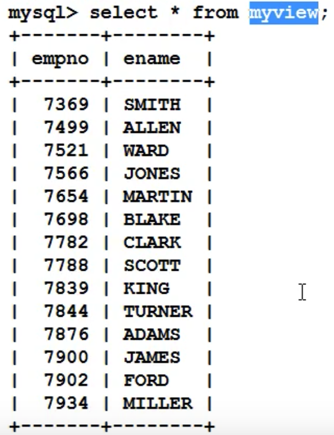
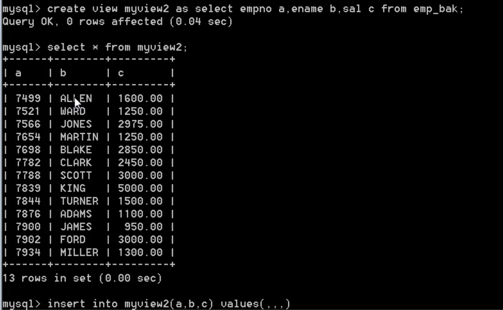
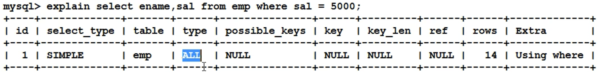
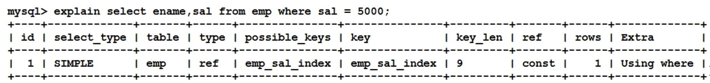

# MySQL基础

## 视图(view)

5.1、什么是视图?
站在不同的角度去看到数据。(同一-张表的数据，通过不同的角度去看待)。
5.2、怎么创建视图?怎么删除视图?

注意:只有DQL语句才能以视图对象的方式创建出来。
5.3、对视图进行增删改查，会影响到原表数据。(通过视图影响原表数据的，不是直接操作的原表)
可以对视图进行CRUD操作。



```sql
create view myview as select empno , ename from emp ;
drop view myview;
```

> 注意:只有DQL语句才能以视图对象的方式创建出来。

5.3：对视图进行增删改查，会影响到原表数据。(通过视图影响原表数据的，不是直接操作的原表)
可以对视图进行CRUD操作。

```sql
create table emp bak as select * from emp;
create view myview1 as select empno , ename,sal from emp bak;
update myview1 set ename: ='hehe' ,sal=1 where empno = 7369; //通过视图修改原表数据。
delete from myview1 where empno = 7369; //通过视图删除原表数据。
```

5.5 视图的应用

视图可以隐藏表的实现细节。保密级别较高的系统，数据库只对外提供相关的视图，java程序员
只对视图对象进行CRUD。

比如公司对于数据库保密性较强，对于数据表的结构、内容不会暴露给外界，**数据的维护**外包给某个公司，但是对于数据的管理不是通过表而是通过视图



如上表我们只知道 myview2 视图，以及别名字段 a、b、c

## 索引(index)

### 4.1、什么是索引?有什么用?

索引就相当于一本书的目录，通过目录可以快速的找到对应的资源。
在数据库方面，查询一-张表的时候有两种检索方式:
第一种方式:全表扫描
第二种方式:根据索引检索(效率很高)

### 4.2 索引为什么可以提高检索效率呢?

其实最根本的原理是缩小了扫描的范围。
索引虽然可以提高检索效率，但是不能随意的添加索引，因为索引也是数据库当中
的对象，也需要数据库不断的维护。是有维护成本的。比如，表中的数据经常被修改
这样就不适合添加索引，因为数据一旦修改，索引需要重新排序，进行维护。

添加索引是给某一个字段，或者说某些字段添加索引。
select ename,sal from emp where ename = 'SMITH' ;
当ename字段上没有添加索引的时候，以上sq1语句会进行全表扫描，扫描ename字 段中所有的值
当ename字段_上添加索引的时候，以上sq1语句会根据索引扫描，快速定位。

### 4.2、怎么创建索引对象?怎么删除索引对象?

```
创建索引对象:
create index 索引名称 on 表名(字段名)
删除索引对象:
drop index 索引名称 on 表名
```


### 4.3、什么时候考虑给字段添加索引? ( 满足什么条件)

数据量庞大 (根据客户的需求，根据线上的环境)
该字段很少的DM操作 (因为字段进行修改操作，索引也需要维护)
该字段经常出现在where子句中 (经常根据哪个字段查询)

> 注意:主键和具有unique约束的字段自动会添加索引。

根据主键查询效率较高。尽量根据主键检索。

### 4.5、查看sq1语句的执行计划:

`mysql> explain select ename,sal from emp where sal = 5000;`



给薪资sal字段添加索引:
`create index emp_ sal index on emp (sal)`



### 索引的底层实现原理