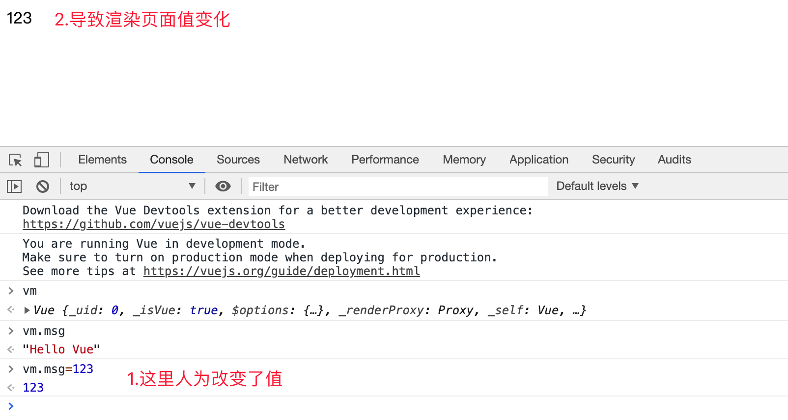

# Vue.js基础

> 配套课程地址：[哔哩哔哩](https://www.bilibili.com/video/av50680998/)

## 学习大纲

- Vue基本语法
- Vue模板语法
- Vue常用特性
- Vue实现案例效果

## 一、Vue基本使用

### 1.1 Vue是什么？

- **Vue (读音 /vjuː/，类似于 **view**) 是一套用于构建用户界面的渐进式框架**
- vue 的核心库只关注视图层，不仅易于上手，还便于与第三方库或既有项目整合
- 易用、灵活、高效
- vue脚手架安装：https://www.jianshu.com/p/1ee1c410dc67 or WebStorm安装

### 1.2 Vue入门案例

#### 1.2.1 Hello World(插值表达式)

```html
<!DOCTYPE html>
<html lang="en">
<head>
    <meta charset="UTF-8">
    <meta name="viewport" content="width=device-width, initial-scale=1.0">
    <title>Hello Vue</title>
    <script src="js/vue.js" type="text/javascript"></script>
</head>
<body>
    <div id="app">
        <div>{{msg}}</div>
        <!--简单计算-->
        <div>{{1+2}}</div>
        <!--字符串拼接-->
        <div>{{msg+'------'+123}}</div>
    </div>
    <script type="text/javascript">
        var vm = new Vue({
            el: '#app',
            data: {
                msg: 'Hello Vue'
            }
        });
    </script>
</body>
</html>
```

#### 1.2.2 Vue.js HelloWorld之细节分析

- 实例参数分析
  - el :元素的挂载位置(值可以是CSS选择器或者DOM元素)
  - data:模型数据(值是一个对象)
- Vue代码运行原理分析
  - 概述编译过程的概念( Vue语法>原生语法)
- 插值表达式用法
  - 将数据填充到HTML标签中
  - 插值表达式支持基本的计算操作

## 二、Vue模板语法

### 2.1 模板语法概述

- 如何理解前端渲染
  - 将数据填充到html标签之中→前端渲染
- 前端渲染的方式
  - 原生js拼接字符串
    - **缺点**:不同开发人员的代码风格差别很大,随着业务的复杂,后期的维护变得逐渐困难起来。
  - 使用前端模板引擎
    - **优点**:大家都遵循同样的规则写代码，代码可读性明显提高了，方便后期的维护。
    - **缺点**:没有专门门提供事件机制。
  - 使用vue特有的模板语法
- Vue模板语法概览
  - 差值表达式
  - 指令
  - 事件绑定(绑定可以理解为处理)
  - 属性绑定
  - 样式绑定
  - 分支循环结构

### 2.2 模板语法-指令

#### 2.2.1 指令概述

- 什么是自定义属性
  - 标准属性：如<a href>中的**href**为自定义属性
  - 自定义属性：如<a abc=123>**abc**即为自定义属性
- 指令的**本质就是自定义属性**
- 指令的格式:以v-开始(比如: v-cloak )

#### 2.2.2 v-cloak指令

- v-cloak指令用法

  - 插值表达式存在的问题: "闪动” 
    - 闪动：值是通过{{msg}}填充到html中，当浏览器很卡的时候，频繁的刷新可能会导致，先显示{{msg}}，再迅速的变为相应值
  - 如何解决该问题:使用v-cloak指令
  - 解决该问题的原理:先用css样式隐藏→替换好值之后再显示最终的值

- 代码演示

  ```html
  <style type="text/css">
    /* 
      1、通过属性选择器 选择到 带有属性 v-cloak的标签  让他隐藏
   */
    [v-cloak]{
      /*元素隐藏*/
      display: none;
    }
    </style>
  <body>
    <div id="app">
      <!-- 2、 让带有插值 语法的   添加 v-cloak 属性 
           在 数据渲染完场之后，v-cloak 属性会被自动去除，
           v-cloak一旦移除也就是没有这个属性了  属性选择器就选择不到该标签
  		 也就是对应的标签会变为可见
      -->
      <div v-cloak>{{msg}}</div>
    </div>
    <script type="text/javascript" src="js/vue.js"></script>
    <script type="text/javascript">
      var vm = new Vue({
        //el指定元素id是app 的元素  
        el: '#app',
        //data里面存储的是数据
        data: {
          msg: 'Hello Vue'
        }
      });
  </script>
  </body>
  </html>
  ```

  

#### 2.2.3 数据绑定指令

- **v-text**填充纯文本
  - 相比插值表达式更加简洁，没有闪动问题**(推荐使用)**
  - v-text指令用于将数据填充到标签中，作用于插值表达式类似
  - 如果数据中有HTML标签会将html标签一并输出
  - **注意**：此处为单向绑定，数据对象上的值改变，插值会发生变化；**但是当插值发生变化并不会影响数据对象的值**
- **v-html**填充HTML片段
  - 存在安全问题
  - 本网站内部数据可以使用,来自第三方的数据不可以用
- **v-pre**填充原始信息
  - 显示原始信息,跳过编译过程(分析编译过程)
- 

#### 2.2.4 v-text指令

```html
 <div id="app">
        <div>{{msg}}</div>
        <!-- 等价于下边的内容-->
        <div v-text="msg"></div>
    </div>
    <script type="text/javascript">
        var vm = new Vue({
            el: '#app',
            data: {
                msg: 'Hello Vue'
            }
        });
    </script>
```

#### 2.2.5 v-html指令

- 用法和v-text 相似  但是他可以将HTML片段填充到标签中

- 可能有安全问题, 一般只在可信任内容上使用 `v-html`，**永不**用在用户提交的内容上

- 它与v-text区别在于v-text输出的是纯文本，浏览器不会对其再进行html解析，但v-html会将其当html标签解析后输出。

  ```html
  <body>
      <div id="app">
          <div>{{msg}}</div>
          <div v-html="msg"></div>
      </div>
      <script type="text/javascript">
          var vm = new Vue({
              el: '#app',
              data: {
                  msg: '<h1>Hello Vue</h1>'
              }
          });
      </script>
  </body>
  ```

#### 2.2.6 v-pre

- 显示原始信息
- 跳过编译过程，跳过这个元素和它的子元素的编译过程
- **一些静态的内容不需要编译加这个指令可以加快渲染**

#### 2.2.7 数据响应式

- 如何理解响应式
  - htmI5中的响应式(屏幕尺寸的变化导致样式的变化)
  - 数据的响应式(数据的变化导致页面内容的变化)
    - 
- 什么是数据绑定
  - 数据绑定:将数据填充到标签中
- v-once 只编译1次
  - 显示内容之后不再具有响应式功能

#### 2.2.8 v-once

执行一次性的插值【当数据改变时，插值处的内容不会继续更新】

```html
 <!--
 	1.即使data里面定义了msg 后期我们修改了 仍然显示的是第一次data里面存储的数据即 Hello Vue.js  
 	2.v-once的应用场景:如果显示的信息后续不需要再修改(vue不再监听)，可以使用v-once，这样可以提高性能。
 -->
     <span v-once>{{ msg}}</span>    
<script>
    new Vue({
        el: '#app',
        data: {
            msg: 'Hello Vue.js'
        }
    });
</script>
```

### 2.3 双向数据绑定

- 当数据发生变化的时候，视图也就发生变化
- 当视图发生变化的时候，数据也会跟着同步变化

#### 2.3.1 v-model

**v-model**是一个指令，限制在 `<input>、<select>、<textarea>、components`中使用

```html
 <div id="app">
      <div>{{msg}}</div>
      <div>
        <!--数据来自data中，当输入框中内容改变的时候，页面上的msg会自动更新-->
        <input type="text" v-model='msg'>
      </div>
  </div>
```

#### 2.3.2 MVVM设计思想


- MVC 是后端的分层开发概念(DJango延伸为MTV) 
- MVVM是前端视图层的概念，主要关注于视图层分离，也就是说：MVVM把前端的视图层，分为了三部分Model, View , View-Modelm   
- M Model  数据层   
  - Vue中的数据层都放在 data 里面
- V  View
  - 视图   Vue中的View， 即我们的HTML页面  
- VM(View-Model) 控制器→将数据和视图层建立联系      
  - vm即  Vue 的实例  就是 vm  

### 2.4 v-on

- 用来绑定事件的
- 形式如：v-on:click  缩写为 @click

##### 1.简单写法(逻辑定义在属性中)：

```html
<div id="app">
  <div>{{num}}</div>
  <div>
    <button v-on:click='num++'>加</button>
    <!-- 等同于下面-->
    <button @click='num++'>加2</button>
  </div>
</div>
<script type="text/javascript">
  var vm = new Vue({
    el: '#app',
    data: {
      num: 0
    }
  });
</script>
```

##### 2.事件函数

- 事件函数的调用方式:

  - 调用函数的名称

  - 调用函数

  - 代码演示1

    ```html
    <button v-on:click='num++'>加</button>
    <!-- 等同于下面-->
    <button @click='num++'>加2</button>
    <!--通过函数调用-->
    <button @click='handle'>加3-函数名调用</button>
    <button @click='handle()'>加4-函数调用</button>
    ```

- 事件函数参数传递

  - 如果事件直接绑定函数名称，那么默认会传递事件对象作为事件函数的第一个参数,(handle1)

  - 如果事件绑定函数调用，那么事件对象必须作为最后一个参数显示传递，并且事件对象的名称必须是$event,(handle2)

  - 代码演示2：

    ```html
    <body>
        <div id="app">
            <div>{{num}}</div>
            <div>
                <button @click='handle1'>加4-函数调用</button>
                <button @click='handle2(124,"123",$event)'>按钮-函数调用传参</button>
            </div>
        </div>
        <script type="text/javascript">
            var vm = new Vue({
                el: '#app',
                data: {
                    num: 0
                },
                methods: {
                     /*
                     1、如果事件直接绑定函数名称，那么默认会传递事件对象作为事件函数的第一个参数,										(handle1)
                     2、如果事件绑定函数调用，那么事件对象必须作为最后一个参数显示传递，并且事件对象的								名称必须是$event,(handle2)
                     */
                    handle1: function (event) {
                        // 获取标签名
                        console.log(event.target.tagName)
                    },
                    handle2: function (p1, p2, event) {
                        //打印参数p1,p2
                        console.log(p1, p2);
                        // 打印标签名
                        console.log(event.target.tagName)
                        // 打印标签内容
                        console.log(event.target.innerHTML)
                    }
                }
            });
        </script>
    </body>
    ```

##### 3.事件修饰符

在事件处理程序中调用 `event.preventDefault()` 或 `event.stopPropagation()` 是常见需求

```html
<body>
    <div id="app">
        <div>{{num}}</div>
        <div v-on:click='handle0'>
            <!-- click行为向上传递(冒泡),触发handle0行为,num++ -->
            <button @click='handle1'>加加</button>
        </div>
    </div>
    <script type="text/javascript">
        var vm = new Vue({
            el: '#app',
            data: {
                num: 0
            },
            methods: {
                handle0: function () {
                    this.num++;
                },
                handle1: function (event) {
                    event.stopPropagation() //阻止冒泡
                },
                handle2: function (event) {
                    event.preventDefault() //阻止默认行为
                }
            }
        });
    </script>
</body>
```

- Vue 不推荐我们操作DOM，为了解决这个问题，Vue.js 为 `v-on` 提供了**事件修饰符**
- 修饰符是由点开头的指令的后缀来表示的

```html
<!-- 阻止单击事件继续传播 -->
<a v-on:click.stop="doThis"></a>
<!-- 提交事件不再重载页面 -->
<form v-on:submit.prevent="onSubmit"></form>
<!-- 修饰符可以串联   即阻止冒泡也阻止默认事件 -->
<a v-on:click.stop.prevent="doThat"></a>
<!-- 只当在 event.target 是当前元素自身时触发处理函数 -->
<!-- 即事件不是从内部元素触发的 -->
<div v-on:click.self="doThat">...</div>
/*修饰符时，顺序很重要；相应的代码会以同样的顺序产生。因此，用 v-on:click.prevent.self 会阻止所有的点击，而 v-on:click.self.prevent 只会阻止对元素自身的点击。*/
```

##### 4.按键修饰符

在做项目中有时会用到键盘事件，在监听键盘事件时，我们经常需要检查详细的按键，Vue 允许为 `v-on` 在监听键盘事件时添加按键修饰符

```html
<div id="app">
       <!--键盘在该文本框回车后触发handleDel()-->
       用户名：<input type="text" v-on:keyup.delete='handleDel' v-model='uname'><br>
       <!--键盘在该文本框回车后触发handleSubmit()-->
       密码：<input type="password" v-on:keyup.enter='handleSubmit' v-model='password'><br>
       <button @click='handleSubmit'>提交</button>
   </div>
   <script type="text/javascript">
       var vm = new Vue({
           el: '#app',
           data: {
               uname: '',
               password: ''
           },
           methods: {
               handleSubmit: function () {
                   //这里只是模拟数据提交的方式，一般是通过AJAX提交到后台
                   console.log(this.uname, this.password);
               },
               handleDel: function () {
                   //按删除键、退格键的时候清空用户名
                   this.uname = ''
               }
           }
       });
   </script>
</body>
常用的按键修饰符
.enter =>    enter键
.tab => tab键
.delete (捕获“删除”和“退格”按键) =>  删除键
.esc => 取消键
.space =>  空格键
.up =>  上
.down =>  下
.left =>  左
.right =>  右
```

##### 5.自定义按键修饰符

- 在Vue中可以通过`config.keyCodes`自定义按键修饰符别名

- 测试键盘码(简写)

  ```html
  <!-- 键盘在该文本框输入时,打印相关键盘码 -->
  <input type="text" v-on:keyup='handle'>
  <script type="text/javascript">
    var vm = new Vue({
      el: '#app',
      methods: {
        handle:function(event){
          //打印键盘码
          console.log(event.keyCode);
        }
      }
    });
  </script>
  ```

- 全局config.KeyCode对象

  ```html
  <input type="text" v-on:keyup.f5='handle'>
  Vue.config.keyCodes.f5 = 116;
  var vm = new Vue({...});
  ```

##### 6.简单案例：计算器

```html
<body>
    <div id="app">
        <h3>简单计算器</h3>
        a:<input type="text" v-model='a'><br>
        b:<input type="text" v-model='b' v-on:keyup.enter='calCulate'><br>
        <button @click='calCulate'>计算</button><br>
        <!-- 计算结果:<span>{{num}}</span> -->
        计算结果:<span v-text='num'></span>
    </div>
    <script type="text/javascript">
        var vm = new Vue({
            el: '#app',
            data: {
                a:'',
                b:'',
                num:''
            },
            methods: {
                calCulate: function () {
                    // 字符串拼接
                    // this.num = this.a+this.b
                    this.num = parseInt(this.a)+parseInt(this.b);
                    console.log(num);
                }
            }
        });
    </script>
</body>
```

### 2.5 v-bind

#### 2.5.1 **属性绑定**

- v-bind 指令被用来响应地更新 HTML 属性

- v-bind:href  可以缩写为:href

  ```html
  <div id="app">
    <!-- 简写:href -->
    <a v-bind:href="url">百度</a>
    <button @click='handle'>跳转</button>
  </div>
  <script type="text/javascript">
    var vm = new Vue({
      el: '#app',
      data: {
        url: 'http://www.baidu.com'
      },
      methods: {
        handle: function () {
          this.url = 'http://www.qq.com'
        }
      }
    });
  </script>
  ```

- 延伸：v-model底层原理分析

  ```html
  <div id="app">
    <span v-text='msg'></span>
    <!-- input中的value绑定msg,当人为改变input值时,通过v-on:input(input改变时)触发		handle，改变msg为input值 -->
  	<input type="text" :value="msg" @input = 'handle'>
    <!--第二种实现方式-->
    <input type="text" :value="msg" @input = 'msg=$event.target.value'>
  </div>
  <script type="text/javascript">
    var vm = new Vue({
      el: '#app',
      data: {
        msg:'test'
      },
      methods: {
        handle: function (event) {
          //输入域中的数值覆盖新的数值
          this.msg = event.target.value;
        }
      }
    });
  </script>
  ```

#### 2.5.2 样式绑定

- 我们可以给 v-bind:class 一个对象，以动态地切换class。
- 注意：v-bind:class指令可以与普通的class特性共存

##### 1.绑定对象

```html
<!--通过true、false控制样式-->
<style>.active{...}</style>
<div id="app">
  <div v-bind:class="{active:isActive}"></div>
  <button @click='handle'>隐藏</button>
</div>
handle: function () {
   this.isActive = !this.isActive;//取反
}
```

##### 2.绑定数组

```html
<!--通过操作值控制样式-->
<div id="app">
  <div v-bind:class="[activeClass,bgcolorClass]"></div>
  <button @click='handle'>隐藏</button>
</div>
<script type="text/javascript">
  var vm = new Vue({
    el: '#app',
    data: {
      activeClass: "active",
      bgcolorClass: "bgcolor"
    },
    methods: {
      handle: function () {
        this.activeClass = '',
        this.bgcolorClass = ''
      }
    }
  });
</script>
```

##### 3.绑定对象和绑定数组的细节

- 对象绑定和数组绑定可以结合使用
  - `<div v-bind:class="[activeClass,bgcolorClass,{test:isTest}]"></div>`
- class绑定的值可以简化操作

```html
<div id="app">
  <!-- 简化数组操作 -->
  <div v-bind:class="arrClasses"></div>
  <!-- 简化对象操作 -->
  <div v-bind:class="objClasses"></div>
  <button @click='handle'>隐藏</button>
</div>
<script type="text/javascript">
  var vm = new Vue({
    el: '#app',
    data: {
      arrClasses: ['active','bgcolor'],
      objClasses: {
        active:true,
        bgcolor:true
      }
    },
    methods: {
      handle: function () {
        // 控制数组
        this.arrClasses = ['','bgcolor']
        // 控制对象
        this.objClasses.bgcolor = false
      }
    }
  });
</script>
```

##### 4.默认的class如何处理?

`<div class="test" v-bind:class="objClasses"></div>` 

- 默认的class会保留，新绑定的class会结合到一起

5.绑定对象的时候，对象的属性，即要渲染的类名，对象的属性值对应的是data中的数据 

6.绑定数组的时候，数组里面存的是data中的数据 

#### 2.5.3 style样式处理

```html
<!--对象方式-->
<div v-bind:style="styleObject">绑定样式对象</div>'
<!-- CSS 属性名可以用驼峰式 (camelCase) 或短横线分隔 (kebab-case，记得用单引号括起来)    -->
<div v-bind:style="{ color: activeColor, fontSize: fontSize,background:'red' }"></div>
<!--数组语法可以将多个样式对象应用到同一个元素 -->
<div v-bind:style="[styleObj1, styleObj2]"></div>
<script>
  new Vue({
    el: '#app',
    data: {
      styleObject: {
        color: 'green',
        fontSize: '30px',
        background:'red'
      }，
      activeColor: 'green',
      fontSize: "30px"
    },
    styleObj1: {
      color: 'red'
    },
    styleObj2: {
      fontSize: '30px'
    }
</script>
```

### 2.6 分支结构

#### 2.6.1 v-if 

1- 多个元素通过条件判断展示或者隐藏某个元素。或者多个元素

2- 进行两个视图之间的切换

3- 实质是控制dom的增加和删除，开销较大

```html
<div v-if="type === 'A'">A</div>
<!-- v-else-if紧跟在v-if或v-else-if之后   表示v-if条件不成立时执行-->
<div v-else-if="type === 'B'">B</div>
<div v-else-if="type === 'C'">C</div>
<!-- v-else紧跟在v-if或v-else-if之后-->
<div v-else>Not A/B/C</div>
<script>
  new Vue({
    el: '#app',
    data: {
      type: 'C'
    }
  })
</script>
```

#### 2.6.2 v-if与v-show的区别

- v-show本质就是标签display设置为none，控制隐藏
  - v-show只编译一次，后面其实就是控制css，而v-if不停的销毁和创建，故v-show性能更好一点。
- v-if是动态的向DOM树内添加或者删除DOM元素
  - v-if切换有一个局部编译/卸载的过程，切换过程中合适地销毁和重建内部的事件监听和子组件


### 2.7 循环结构

#### 2.7.1 v-for

```html
 <div id="app">
        <ul>
            <li v-for='stu in stus'>{{stu}}</li>
            <!--加索引-->
            <li v-for='(stu,index) in stus'>{{stu}} ----- {{index}}</li>
            <!-- 对象数据集合 -->
            <li v-for='objStu in objStus'>
                <span>{{objStu.ename}}</span>:
                <span>{{objStu.cname}}</span>
            </li>
            <!--遍历对象，v,k,i 顺序固定，名称自定义-->
            <li v-for = '(value,key,index) in obj'>{{value +'---'+ key +'---'+ index}}</li>
        </ul>
    </div>
    <script type="text/javascript">
        var vm = new Vue({
            el: '#app',
            data: {
              	//数组
                stus: ['lee', 'liu', 'zhang'],
                //对象数组
              	objStus: [{
                    'ename': 'lee',
                    'cname': '李'
                }, {
                    'ename': 'liu',
                    'cname': '刘'
                }],
              	//对象
                obj: {
                    'ename': 'giao',
                    'cname': '猴子',
                    'age': 18
                }
            }
        });
    </script>
```

#### 2.7.2 key 的作用

- key来给每个节点做一个唯一标识
- key的作用主要是为了高效的更新虚拟DOM
- **原则上写for循环要加key**

#### 2.7.3 v-if与v-for结合使用

标签中加上v-if筛选条件即可

#### 2.7.4 案例-选项卡

```html
<body>
  <div id="app">
    <div class="tab">
      <!--  tab栏  -->
      <ul>
        <!--currentIndex是否等于该li的index，等于则赋值current，否则为空-->
        <li @click = "change(index)":class='currentIndex==index?"current":""' :key='item.id' 
            v-for='(item,index) in list'>{{item.title}}</li>
      </ul>
      <!--  对应显示的图片 -->
      <div @click = "change(index)" class="img" :class='currentIndex==index?"active":""' v-for='(item,index) in list'>
        </div>
    </div>
  </div>
  <script type="text/javascript">
    var vm = new Vue({
      el: '#app',
      data: {
        currentIndex:0, //当前选中tab的index值,默认为0
        list: [{
          id: 1,
          title: 'apple',
          path: 'img/apple.jpeg'
        }, {
          id: 2,
          title: 'orange',
          path: 'img/orange.jpeg'
        }, {
          id: 3,
          title: 'lemon',
          path: 'img/lemon.jpeg'
        }]
      },
      methods: {
        change: function (index) {
          //通过操作index改变类名，从而实现切换选项卡
          this.currentIndex = index;
        }
      }
    });
  </script>
</body>

</html>
```

```css
* li {
    list-style: none;
}
.tab {
    border: 1px solid #000000;
    width: 800px;
    height: 400px;
}
.tab ul li {
    width: 200px;
    float: left;
    margin-left: 20px;
    text-align: center;
}

.tab img {
    width: 200px;
    height: 200px;
}
.img {
    display: none;
}
.active {
    display: block;
}
.current {
    background-color: aquamarine;
}
```

**声明式编程：模板的结构和最终的结果一致**


## 三、Vue常用特性

### 3.1常用特性概览

1. 表单操作
2. 自定义指令
3. 计算属性
4. 过滤器
5. 侦听器
6. 生命周期

### 3.2 表单操作

#### 3.2.1 表单基本操作

```html
五种表单输入域的值的绑定
<div id="app">
  <form action="http://www.baidu.com" method="POST">
    <!-- 文本框 -->
    姓名：<input type="text" v-model="uname">
    <div>
      <!-- 单选框 -->
      <input type="radio" id="male" value="1" v-model='gender'>
      <label for="male">男</label>
      <input type="radio" id="female" value="2" v-model='gender'>
      <label for="female">女</label>
    </div>
    <div>
      <!-- 复选框 -->
      <span>爱好：</span>
      <input type="checkbox" id="ball" value="1" v-model='hobby'>
      <label for="ball">篮球</label>
      <input type="checkbox" id="sing" value="2" v-model='hobby'>
      <label for="sing">唱歌</label>
      <input type="checkbox" id="code" value="3" v-model='hobby'>
      <label for="code">写代码</label>
    </div>
    <div>
      <span>职业：</span>
      <!-- 下拉选项，多选用法，值类型为数组 -->
      <select v-model='occupation' multiple>
        <option value="0">请选择职业...</option>
        <option value="1">教师</option>
        <option value="2">软件工程师</option>
        <option value="3">律师</option>
      </select>
    </div>
    <div>
      <!-- textarea 是 一个双标签   不需要绑定value 属性的  -->
      个人简介：
      <textarea v-model='desc'></textarea><br>
    </div>
    <input type="submit" value="提交" @click.prevent = 'handle'>
  </form>
</div>
<script type="text/javascript">
  var vm = new Vue({
    el: '#app',
    data: {
      uname:'',
      gender:1,
      hobby:[1],
      occupation:[1,2],
      desc: '123'

    },
    methods: {
      handle: function () {
        console.log(this.uname)
        console.log(this.gender)
        console.log(this.hobby)
      }

    }
  });
</script>
```


#### 3.2.2 表单域修饰符

- 示例：`<input type="text" v-model.number="sum">`

- .number  转换为数值**(计算时不需要parseInt()了)**

  - 注意点：	
    - 当开始输入非数字的字符串时，因为Vue无法将字符串转换成数值
    - 所以属性值将实时更新成相同的字符串。即使后面输入数字，也将被视作字符串
- .trim  自动过滤用户输入的首尾空白字符

  - 只能去掉首尾的，不能去除中间的空格
- .lazy   
  - 将input事件切换成change事件
    - input事件：输入文本时，触发事件
    - change事件：失去焦点时，触发事件
  - lazy 修饰符延迟了同步更新属性值的时机。即将原本绑定在 input 事件的同步逻辑转变为绑定在 change 事件上

### 3.3 自定义指令

#### 3.2.1为何需要自定义指令

- 内置指令不能满足我们特殊的需求
- Vue允许我们自定义指令

#### 3.2.2 自定义指令定义语法

```html
<div id="app">
  <input type="text" v-focus>
</div>
<script type="text/javascript">
  //自定义指令
  Vue.directive('focus', {
    //inserted 常用API，固定写法，官方提供.
    inserted: function (el) {
      //el表示指令绑定的元素
      el.focus();
    }
  });
  var vm = new Vue({...});
</script>
```

#### 3.2.3 带参数的自定义指令用法

```html
<div id="app">
  <input type="text" v-color='msg'>
</div>
<script type="text/javascript">
  //自定义指令
  Vue.directive('color', {
    //bind 常用API，固定写法，官方提供;第二个为形参，任意取值
    bind: function (el,param) {
      //el表示指令绑定的元素
      console.log(param)
      el.style.backgroundColor = param.value.color
    }
  });
  var vm = new Vue({
    el: '#app',
    data: {
      msg:{
        color : 'blue'
      }
    },
  });
</script>
```

#### 3.2.4 局部指令

- 局部指令，需要定义在  directives 的选项   用法和全局用法一样 
- 局部指令只能在当前组件里面使用
- 当全局指令和局部指令同名时以局部指令为准

```html
<script type="text/javascript">
  //自定义全局指令
  Vue.directive('color', {
    //bind 常用API，固定写法，官方提供;第二个为形参，任意取值
    bind: function (el, param) {
      //el表示指令绑定的元素
      console.log(param)
      el.style.backgroundColor = param.value.color
    }
  });
  var vm = new Vue({
    el: '#app',
    data: {...},
    //局部指令，定义在组件对象的内部
    directives: {
      //指令1
      color: {
        bind: function (el, param) {
          el.style.backgroundColor = param.value.color
        }
      },
      //指令2
      focus:{
        inserted:function(el){
          el.focus();
        }
      }
    }
  });
</script>
```


### 3.4 计算属性 computed

- 表达式的计算逻辑可能会很复杂，模板中放入太多的逻辑会让模板过重且难以维护 ，使用计算属性可以让模板更加的简洁
- **计算属性是基于它们的响应式依赖(data中的msg)进行缓存的**
- computed比较适合对多个变量或者对象进行处理后返回一个结果值，也就是数多个变量中的某一个值发生了变化则我们监控的这个值也就会发生变化**(如for循环累加结果)**

```html
<div id="app"> 
  <div>{{msg}}</div>
  <!-- 使用表达式实现字符串翻转 -->
  <div>{{msg.split('').reverse().join('')}}</div>
  <!-- 使用计算属性实现字符串翻转 -->
  <div>{{reverseString}}</div>
  <div>{{reverseString}}</div>
  <!-- 使用方法实现字符串翻转(测试计算属性与方法之间的区别)-->
  <div>{{reverseMessage}}</div>
  <div>{{reverseMessage}}</div>
</div>
<script type="text/javascript">
  var vm = new Vue({
    el: '#app',
    data: {
      msg:'hello'
    },
    methods:{
      reverseMessage:function(){
        //调用几次函数执行几次->控制台打印两次
        console.log('computed')
        return this.msg.split('').reverse().join('')
      }
    },
    computed:{
      reverseString:function(){
        //data中的msg不变化(依赖)->从缓存中取值->控制台打印1次
        console.log('methods')
        return this.msg.split('').reverse().join('')
      }
    }
  });
</script>
```

### 3.5 侦听器


- 使用watch来响应数据的变化
- 一般用于异步或者开销较大**(计时器)**的操作
- watch 中的属性 一定是data 中 已经存在的数据 
- **当需要监听一个对象的改变时，普通的watch方法无法监听到对象内部属性的改变，只有data中的数据才能够监听到变化，此时就需要deep属性对对象进行深度监听**

#### 3.5.1 侦听器的简单使用

```html
<div id="app">
  <div>
    <span>名：</span>
    <span><input type="text" v-model='firstName'></span>
  </div>
  <div>
    <span>姓：</span>
    <span><input type="text" v-model='lastName'></span>
  </div>
  <div>{{fullName}}</div>
  <!--用计算属性实现-->
  <div>{{fullNameByComputed}}</div>
</div>
<script type="text/javascript">
  var vm = new Vue({
    el: '#app',
    data: {
      firstName: 'Jim',
      lastName: 'Green',
      fullName: 'Jim Green'
    },
    computed:{
      fullNameByComputed:function(){
        return this.firstName+' '+this.lastName
      }
    },
    watch: {
      //注意：这里firstName对应着data中的firstName 
      //当firstName或lastName值改变的时候会自动触发watch，把其值传到val中
      firstName: function (val) {
        this.fullName = val + ' ' + this.lastName;
      },
      lastName: function (val) {
        this.fullName = this.firstName + ' ' + val;
      }
    }
  });
</script>
```

#### 3.5.2 侦听器的使用场景→Ajax交互

```html
<!--案例-表单验证；使用定时任务模拟Ajax后端交互 -->
<div id="app">
  用户名：<input type="text" v-model.lazy="uname">
  <span>{{msg}}</span>
</div>
<script type="text/javascript">
  var vm = new Vue({
    el: '#app',
    data: {
      uname: '',
      msg: '',
    },
    methods: {
      checkName: function (uname) {
        var that = this;
        //调用接口,使用定时任务的方式模拟后端接口(因为与后端交互需要时间,但时间很小)
        setTimeout(function () {
          //模拟接口调用
          if(uname == 'admin'){
            that.msg = '用户名已存在' 
          }else{
            that.msg = '用户名可以使用' 
          }
        }, 1000); //两秒之后返回
      }
    },
    watch: {
      //监听uname
      uname: function (val) {
        //调用后端接口验证用户名合法性
        this.checkName(val);
        //修改提示信息
        this.msg = '正在验证'
      }
    }
  });
</script>
```


### 3.6 过滤器

- **用于格式化数据**,比如将字符串格式化为首字母大写,将日期格式化为指定的格式等

- Vue.js允许自定义过滤器，可被用于一些常见的文本格式化。
- 过滤器可以用在两个地方：双花括号插值和v-bind表达式(属性绑定)。
- 过滤器应该被添加在JavaScript表达式的尾部，由“管道”符号指示
- 支持级联操作
- 过滤器不改变真正的`data`，而只是改变渲染的结果，并返回过滤后的版本
- 全局注册时是filter，没有s的。而局部过滤器是filters，是有s的

#### 3.6.1 过滤器的基本使用

```html
<div id="app">
  <input type="text" v-model="msg">
  <div>{{msg|upper}}</div>
  <!-- 级联表达式，将msg第一次处理结果的基础上，再处理 -->
  <div>{{msg|upper|lower}}</div>
  <!-- 使用绑定属性调用过滤器 -->
  <div :abc = 'msg|upper'>绑定属性</div>
</div>
<script type="text/javascript">
  Vue.filter('upper',function(val){
    //返回 val.第一个字符.转换为大写字母 + 返回字符串(切割:从第一个字符到最后一个字符)->形成新的字符串
    return val.charAt(0).toUpperCase()+val.slice(1);
  });
  Vue.filter('lower',function(val){
    return val.charAt(0).toLowerCase()+val.slice(1);
  });
  var vm = new Vue({
    el: '#app',
    data: {
      msg: '',
    },
    //局部过滤器
    filters:{
      upper:function(val){
        return val.charAt(0).toUpperCase()+val.slice(1);
      }
    }
  });
</script>
```

#### 3.6.2 带参数的过滤器

```html
<!--格式化时间对象，可以用正则匹配实现-->
<div id="app">
  <div>{{date|format("yyyy-MM-dd")}}</div>
</div>
<script type="text/javascript">
  //第一个参数是处理数据，第二个是方法传递的参数
  Vue.filter('format', function (val, formatStr) {
    if(formatStr = 'yyyy-MM-dd'){
      str = '',
        //时间对象获取年、月(从0开始所以加1)、日-->拼接字符串
        str += val.getFullYear()+ '-' +(val.getMonth()+1)+ '-' +val.getDate();
      return str
    }
    return val
  });
  var vm = new Vue({
    el: '#app',
    data: {
      date: new Date(),
    },
  });
</script>
```

### 3.7 生命周期

- 事物从出生到死亡的过程
- Vue实例从创建到销毁的过程 ，这些过程中会伴随着一些函数的自调用→我们称这些函数为钩子函数
- 生命周期钩子=生命周期事件
  - 创建期间的生命周期函数
  - 运行期间的生命周期函数
  - 修改期间的生命周期函数


```html
<div id="app">
        <div>{{msg}}</div>
        <button @click = 'update'>更新</button>
        <button @click = 'destroy'>销毁</button>
    </div>
    <script type="text/javascript">
        var vm = new Vue({
            el: '#app',
            data: {
                msg:'hello'
            },
            methods:{
                update:function(){
                    this.msg = "hello world"
                },
                destroy:function(){
                    this.$destroy()
                }
            },
            //默认执行前四个方法
            beforeCreate: function(){
                console.log('beforeCreate');
            },
            created: function(){
                console.log('created');
            },
            beforeMount: function(){
                console.log('beforeMount');
            },
            mounted: function(){
                console.log('mounted');
            },
            beforeUpdate: function(){
                console.log('beforeUpdate');
            },
            //updated & beforeUpdate 需手动调用,当值发生改变时调用
            updated: function(){
                console.log('updated');
            },
            //destroyed & beforeDestroy 需手动调用
            beforeDestroy: function(){
                console.log('beforeDestory');
            },
            destroyed: function(){
                console.log('destoryed');
            },
        });
    </script>
```

### 3.8 数组相关方法(补充)

#### 3.8.1 变异方法(影响原始数据)

- 页面具有响应式变化，数据变，页面渲染变

- 在 Vue 中，直接修改对象属性的值无法触发响应式，当你直接修改了对象属性的值，你会发现，只有数据改了，但是页面内容并没有改变
- 变异数组方法即保持数组方法原有功能不变的前提下对其进行功能拓展

| `push()`    | 往数组最后面添加一个元素，成功返回当前数组的长度             |
| ----------- | ------------------------------------------------------------ |
| `pop()`     | 删除数组的最后一个元素，成功返回删除元素的值                 |
| `shift()`   | 删除数组的第一个元素，成功返回删除元素的值                   |
| `unshift()` | 往数组最前面添加一个元素，成功返回当前数组的长度             |
| `splice()`  | 有三个参数，第一个是想要删除的元素的下标（必选），第二个是想要删除的个数（必选），第三个是删除 后想要在原位置替换的值 |
| `sort()`    | sort()  使数组按照字符编码默认从小到大排序,成功返回排序后的数组 |
| `reverse()` | reverse()  将数组倒序，成功返回倒序后的数组                  |

#### 3.8.2 替换数组(形成新的数组 )

- 需要操作数据对象，来使值发生变化
- 不会改变原始数组，但总是返回一个新数组

| ilter  | filter() 方法创建一个新的数组，新数组中的元素是通过检查指定数组中符合条件的所有元素。 |
| ------ | ------------------------------------------------------------ |
| concat | concat() 方法用于连接两个或多个数组。该方法不会改变现有的数组 |
| slice  | slice() 方法可从已有的数组中返回选定的元素。该方法并不会修改数组，而是返回一个子数组 |

```html
<div id="app">
        <input type="text" v-model='element'>
        <span>{{list}}</span>
        <button @click = 'add'>增加</button>
        <button @click = 'del'>删除</button>
        <button @click = 'slice'>截取</button>
    </div>
    <script type="text/javascript">
        var vm = new Vue({
            el: '#app',
            data: {
                element:'',
                list:['a','b','c','d']
            },
            methods:{
                add:function(){
                    //变异数组：数组原有基础上变化，响应式
                    this.list.push(this.element)
                },
                del:function(){
                    //变异数组：数组原有基础上变化，响应式
                    this.list.pop()
                },
                slice:function(){
                    //从第一个开始截取，到第三个之前(第二个)
                    //替换数组：形成新的数组，需要重新赋值
                    this.list = this.list.slice(0,2);
                }
            },
        });
    </script>
```


#### 3.8.3 动态数组响应式数据

通过索引改变的数据不会发生响应式变化→动态数组相应数据

`Vue.set(vm.items, indexOfltem, newValue)`	//改变数组值
`vm.$set(vm.items, indexOfltem, newValue)`

`vm.$set(vm.object, objKey, objVal)`			//添加对象属性

1. 参数一表示要处理的数组名称
2. 参数二表示要处理的数组的索引
3. 参数三表示要处理的数组的值

```javascript
var vm = new Vue({
  el: '#app',
  data: {
    list:['a','b','c','d'],
    people:{
      name:'xiaoming',
      age:18
    }
  },
});
vm.list[0] = 'A'; //直接通过索引改变值，数组发生变化，但页面不会发生变化
//语法不同，功能同
vm.$set(vm.list,0,'A')
Vue.set(vm.list,0,'A')
//操作对象,添加新属性
Vue.set(vm.people,"date",'2020');
```

### 3.9 Demo-图书管理

- 静态列表效果
- 基于数据实现模板效果
- 处理每行的操作按钮

#### 3.9.1 显示数据

##### 1.静态显示：

​		数据存放在vue 中 data 属性中   

##### 2.数据渲染到模板：

​	利用 v-for循环 遍历 books 将每一项数据渲染到对应的数据中

##### 3.添加图书

- 通过双向绑定获取到输入框中的输入内容 
- 给按钮添加点击事件 
- 把输入框中的数据存储到 data 中的 books  里面

##### 4.修改图书-上

- 点击修改按钮的时候 获取到要修改的书籍名单
  - 4.1  给修改按钮添加点击事件，  需要把当前的图书的id 传递过去 这样才知道需要修改的是哪一本书籍
- 把需要修改的书籍名单填充到表单里面
  - 4.2  根据传递过来的id 查出books 中 对应书籍的详细信息
  - 4.3 把获取到的信息填充到表单

##### 5.修改图书-下

- 5.1  定义一个标识符， 主要是控制 编辑状态下当前编辑书籍的id 不能被修改 即 处于编辑状态下 当前控制书籍编号的输入框禁用  
- 5.2  通过属性绑定给书籍编号的 绑定 disabled 的属性  flag 为 true 即为禁用
- 5.3  flag 默认值为false   处于编辑状态 要把 flag 改为true 即当前表单为禁用 
- 5.4  复用添加方法   用户点击提交的时候依然执行 handle 中的逻辑如果 flag为true 即 表单处于不可输入状态 此时执行的用户编辑数据数据

```html
<div id="app">
  <div class="grid">
    <div>
      <h1>图书管理</h1>
      <div class="book">
        <div>
          <label for="id">
            编号：
          </label>
          <!-- 5.2 通过属性绑定 绑定 disabled 的属性  flag 为 true 即为禁用-->
          <input type="text" id="id" v-model='id' :disabled="flag">
          <label for="name">
            名称：
          </label>
          <input type="text" id="name" v-model='name'>
          <button @click='handle'>提交</button>
        </div>
      </div>
    </div>
    <table>
      <thead>
        <tr>
          <th>编号</th>
          <th>名称</th>
          <th>时间</th>
          <th>操作</th>
        </tr>
      </thead>
      <tbody>
        <tr :key='item.id' v-for='item in books'>
          <td>{{item.id}}</td>
          <td>{{item.name}}</td>
          <td>{{item.date}}</td>
          <td>
            <a href="" @click.prevent='toEdit(item.id)'>修改</a>
            <span>|</span>
            <a href="" @click.prevent>删除</a>
          </td>
        </tr>
      </tbody>
    </table>
  </div>
</div>   
<script type="text/javascript">
  /*图书管理-添加图书*/
  var vm = new Vue({
    el: '#app',
    data: {
      // 5.1定义一个标识符， 主要是控制 编辑状态下当前编辑书籍的id 不能被修改 
      // 即处于编辑状态下 当前控制书籍编号的输入框禁用 
      flag: false,
      id: '',
      name: '',
    },
    methods: {
      handle: function() {
        /*5.4	复用添加方法,用户点击提交的时候依然执行 handle 中的逻辑
              如果 flag为true 即 表单处于不可输入状态 此时执行的用户编辑数据数据	*/ 
        if (this.flag) {
          // 编辑图书
          // 5.5根据当前的ID去更新数组中对应的数据  
          this.books.some((item) => {
            if (item.id == this.id) {
              // 箭头函数中 this 指向父级作用域的this 
              item.name = this.name;
              // 完成更新操作之后，需要终止循环
              return true;
            }
          });
          // 5.6 编辑完数据后表单要处以可以输入的状态
          this.flag = false;
          // 5.7 如果 flag为false  表单处于输入状态 此时执行的用户添加数据    
        } else { 
          var book = {};
          book.id = this.id;
          book.name = this.name;
          book.date = '';
          this.books.push(book);
          // 清空表单
          this.id = '';
          this.name = '';
        }
        // 清空表单
        this.id = '';
        this.name = '';
      },
      toEdit: function(id) {
        /*5.3  flag默认值为false处于编辑状态,要把flag改为true 即当前表单为禁用 */ 
        this.flag = true;
        console.log(id)
        var book = this.books.filter(function(item) {
          return item.id == id;
        });
        console.log(book)
        this.id = book[0].id;
        this.name = book[0].name;
      }
    }
  });
</script>
```

##### 6.删除图书

- 6.1 给删除按钮添加事件 把当前需要删除的书籍id 传递过来
- 6.2 根据id从数组中查找元素的索引
- 6.3 根据索引删除数组元素

```html
<tbody>
  <tr :key='item.id' v-for='item in books'>
    <td>{{item.id}}</td>
    <td>{{item.name}}</td>
    <td>{{item.date}}</td>
    <td>
      <a href="" @click.prevent='toEdit(item.id)'>修改</a>
      <span>|</span>
      <!--  6.1 给删除按钮添加事件 把当前需要删除的书籍id 传递过来  --> 
      <a href="" @click.prevent='deleteBook(item.id)'>删除</a>
    </td>
  </tr>
</tbody>
<script type="text/javascript">
  /*
      图书管理-添加图书
    */
  var vm = new Vue({
    methods: {
      deleteBook: function(id){
        // 删除图书
        // 6.2 根据id从数组中查找元素的索引
        // var index = this.books.findIndex(function(item){
        //   return item.id == id;
        // });
        //6.3 根据索引删除数组元素
        //this.books.splice(index, 1);
        //-------------------------
        //方法二：通过filter方法进行删除
        //6.4  根据filter 方法 过滤出来id 不是要删除书籍的id 
        //因为 filter 是替换数组不会修改原始数据 所以需要 把 不是要删除书籍的id  赋值给 books 
        this.books = this.books.filter(function(item){
          return item.id != id;
        });
      }
    }
  });
</script>
```

### 3.10 知识总结-常用特性应用场景

#### 1.过滤器

- Vue.filter  定义一个全局过滤器

```html
<tr :key='item.id' v-for='item in books'>
  <td>{{item.id}}</td>
  <td>{{item.name}}</td>
  <!-- 1.3  调用过滤器 -->
  <td>{{item.date | format('yyyy-MM-dd hh:mm:ss')}}</td>
  <td>
    <a href="" @click.prevent='toEdit(item.id)'>修改</a>
    <span>|</span>
    <a href="" @click.prevent='deleteBook(item.id)'>删除</a>
  </td>
</tr>

<script>
  #1.1  Vue.filter  定义一个全局过滤器
  Vue.filter('format', function(value, arg) {
    function dateFormat(date, format) {
      if (typeof date === "string") {
        var mts = date.match(/(\/Date\((\d+)\)\/)/);
        if (mts && mts.length >= 3) {
          date = parseInt(mts[2]);
        }
      }
      date = new Date(date);
      if (!date || date.toUTCString() == "Invalid Date") {
        return "";
      }
      var map = {
        "M": date.getMonth() + 1, //月份 
        "d": date.getDate(), //日 
        "h": date.getHours(), //小时 
        "m": date.getMinutes(), //分 
        "s": date.getSeconds(), //秒 
        "q": Math.floor((date.getMonth() + 3) / 3), //季度 
        "S": date.getMilliseconds() //毫秒 
      };
      format = format.replace(/([yMdhmsqS])+/g, function(all, t) {
        var v = map[t];
        if (v !== undefined) {
          if (all.length > 1) {
            v = '0' + v;
            v = v.substr(v.length - 2);
          }
          return v;
        } else if (t === 'y') {
          return (date.getFullYear() + '').substr(4 - all.length);
        }
        return all;
      });
      return format;
    }
    return dateFormat(value, arg);
  })
  #1.2  提供的数据 包含一个时间戳   为毫秒数
  [{
    id: 1,
    name: '三国演义',
    date: 2525609975000
  },{
    id: 2,
    name: '水浒传',
    date: 2525609975000
  },{
    id: 3,
    name: '红楼梦',
    date: 2525609975000
  },{
    id: 4,
    name: '西游记',
    date: 2525609975000
  }];
</script>
```

#### 2.自定义指令

- 让表单自动获取焦点
- 通过Vue.directive 自定义指定

```html
<!-- 2.2  通过v-自定义属性名 调用自定义指令 -->
<input type="text" id="id" v-model='id' :disabled="flag" v-focus>

<script>
    # 2.1   通过Vue.directive 自定义指定
	Vue.directive('focus', {
      inserted: function (el) {
        el.focus();
      }
    });
</script>
```

#### 3 计算属性

- 通过计算属性计算图书的总数
  - 图书的总数就是计算数组的长度 

```html
 <div class="total">
        <span>图书总数：</span>
     	<!-- 3.2 在页面上 展示出来 -->
        <span>{{total}}</span>
</div>

  <script type="text/javascript">
    /*
      计算属性与方法的区别:计算属性是基于依赖进行缓存的，而方法不缓存
    */
    var vm = new Vue({
      data: {
        flag: false,
        submitFlag: false,
        id: '',
        name: '',
        books: []
      },
      computed: {
        total: function(){
          // 3.1  计算图书的总数
          return this.books.length;
        }
      },
    });
  </script>

```

####  4.生命周期


